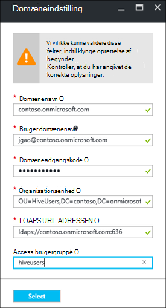

<properties
    pageTitle="Konfigurere medlem af et domæne HDInsight klynger | Microsoft Azure"
    description="Lær, hvordan du konfigurerer og konfigurere medlem af et domæne HDInsight klynger"
    services="hdinsight"
    documentationCenter=""
    authors="saurinsh"
    manager="jhubbard"
    editor="cgronlun"
    tags=""/>

<tags
    ms.service="hdinsight"
    ms.devlang="na"
    ms.topic="article"
    ms.tgt_pltfrm="na"
    ms.workload="big-data"
    ms.date="10/26/2016"
    ms.author="saurinsh"/>

# Konfigurere medlem af et domæne HDInsight klynger (Preview)

Lær, hvordan du konfigurerer en Azure HDInsight klynge med Azure Active Directory (Azure AD) og [Apache Ranger](http://hortonworks.com/apache/ranger/) udnytte stærk godkendelse og politik for omfattende rollebaseret access adgangskontrol (RBAC).  Medlem af et domæne HDInsight kan kun konfigureres på Linux-baserede klynger. Du kan finde yderligere oplysninger finder [medlem af et introducere domæne HDInsight klynger](hdinsight-domain-joined-introduction.md).

I denne artikel er det første selvstudium af en række:

- Oprette en forbindelse til Azure AD (via muligheden for Azure Directory Domain Services) HDInsight-klynge med Apache Ranger aktiveret.
- Oprette og anvende politikker for Hive gennem Apache Ranger og tillade brugere (for eksempel data forskere) til at oprette forbindelse til hive-filen ved hjælp af ODBC-baserede værktøjer, for eksempel Excel, Tableau osv. Microsoft arbejder på at tilføje andre arbejdsbelastninger, som HBase, tænding og Storm, til medlem af et domæne HDInsight snart.

Et eksempel på den endelige topologi ser ud som følger:

Da Azure AD aktuelt understøtter kun klassisk virtuelle netværk (VNets) og Linux-baserede HDInsight klynger kun understøtter Azure ressourcestyring baseret VNets, HDInsight Azure AD-integration kræver to VNets og en peering mellem dem. Sammenligning af oplysninger mellem to installation modellerne finder du [Azure ressourcestyring kontra klassisk installation: forstå installation-modeller og tilstanden for dine ressourcer](../resource-manager-deployment-model.md). De to VNets skal være i samme område som Azure Active Directory-Domænetjenester.

Azure Tjenestenavne skal være globalt entydige. Følgende navne bruges i dette selvstudium. Contoso er et opdigtet navn. Du skal erstatte *contoso* med et andet navn, når du går gennem selvstudiet. 
    
**Navne:**

|Egenskaben|Værdi|
|--------|-----|
| Azure AD-VNet|contosoaadvnet|
| Azure AD Virtual Machine (VM)|contosoaadadmin. Denne VM bruges til at konfigurere organisationsenhed og omvendt DNS zone.|
| Azure AD-mappe|contosoaaddirectory|
| Azure AD-domænenavn|Contoso (contoso.onmicrosoft.com)|
| HDInsight VNet|contosohdivnet|
| HDInsight VNet ressourcegruppe|contosohdirg|
| HDInsight klynge|contosohdicluster|

Dette selvstudium indeholder trinnene til konfiguration af et medlem af et domæne HDInsight klynge. Hver sektion indeholder links til andre artikler med flere baggrundsoplysninger.

## Krav:

- Blive fortrolig med [Azure AD-domænetjenester](https://azure.microsoft.com/services/active-directory-ds/) strukturen [priser](https://azure.microsoft.com/pricing/details/active-directory-ds/) .
- Sørg for, at dit abonnement er whitelisted til denne offentlige preview. Du kan gøre det ved at sende en mail til hdipreview@microsoft.com med dit abonnement-ID.
- Et SSL-certifikat, der er signeret af et signerende nøglecenter for dit domæne. Certifikatet, der er påkrævet ved at konfigurere sikker LDAP. Selvsignerede signaturer kan ikke bruges.

## Procedurer

1. Oprette en Azure klassisk VNet for din Azure AD.  
2. Oprette og konfigurere Azure AD og Azure AD DS.
3. Føje en VM til klassisk VNet til oprettelse af organisationsenhed. 
4. Oprette en organisationsenhed til Azure Active Directory-Domænetjenester.
5. Oprette en HDInsight VNet i tilstanden Azure ressource administration.
6. Konfigurere omvendt DNS zones til Azure Active Directory-Domænetjenester.
6. Peer-to VNets.
7. Oprette en HDInsight klynge.

> [AZURE.NOTE] Dette selvstudium antages det, at du ikke har en Azure AD. Hvis du har en, kan du springe over del i trin 2.
    
## Oprette en Azure klassisk VNet

I dette afsnit, skal oprette du en klassisk VNet ved hjælp af portalen Azure. I næste afsnit, kan du aktivere Azure Active Directory-Domænetjenester for din Azure AD i klassisk VNet. Se [oprette et virtuelt netværk (klassisk) ved hjælp af portalen Azure](../virtual-network/virtual-networks-create-vnet-classic-portal.md)kan finde flere oplysninger om følgende procedure og bruge andre metoder til oprettelse af VNet.

**Oprette en klassisk VNet**

1. Log [Azure-portalen](https://portal.azure.com). 
2. Klik på **nyt** > **netværk** > **virtuelt netværk**.
3. Vælg **Klassisk**i **Vælg en implementeringsmodel**, og klik derefter på **Opret**.
4. Angiv eller Vælg følgende værdier:

    - **Navn**: contosoaadvnet
    - **Adresseområde**: 10.1.0.0/16
    - **Undernet navn**: Subnet1
    - **Undernet adresseområde**: 10.1.0.0/24
    - **Abonnement**: (Vælg et abonnement, der bruges til at oprette denne VNet).
    - **ResourceGroup**:
    - **Placering**: (Vælg et område til din HDInsight klynge).

        > [AZURE.IMPORTANT] Du skal vælge en placering, der understøtter Azure Active Directory-Domænetjenester. Du kan finde yderligere oplysninger finder [produkter, der er tilgængelige efter område](https://azure.microsoft.com/en-us/regions/services/). 
        >
        > Både klassisk VNet og ressource gruppe VNet skal være i samme område som Azure Active Directory-Domænetjenester.

5. Klik på **Opret** for at oprette VNet.

## Oprette og konfigurere Azure Active Directory-Domænetjenester til din Azure AD

I dette afsnit skal du:

1. Oprette en Azure AD.
2. Opret Azure AD-brugere. Disse brugere er domænebrugere. Du kan bruge den første bruger til at konfigurere HDInsight klynge med Azure AD.  De andre to brugere er valgfrit for dette selvstudium. De kan bruges i [konfigurere Hive politikker for medlem af et domæne HDInsight klynger](hdinsight-domain-joined-run-hive.md) , når du konfigurerer Apache Ranger politikker.
3. Oprette AAD DC administratorgruppen og føje Azure AD-brugeren til gruppen. Du kan bruge denne bruger til at oprette afdelingen.
4. Aktivere Azure AD-domænetjenester (Azure AD DS) til Azure AD.
7. Konfigurere LDAPS til Azure AD. Lightweight Directory Access Protocol (LDAP) bruges til at læse fra og skrive til Azure AD.

Hvis du foretrækker at bruge en eksisterende Azure AD, kan du springe trin 1 og 2.

**Oprette en Azure AD**

1. Klik på **Ny**fra [Azure klassisk portal](https://manage.windowsazure.com) > **App Services** > **Active Directory** > **Directory** > **Brugerdefineret oprette**. 
3. Angiv eller Vælg følgende værdier:

    - **Navn**: contosoaaddirectory
    - **Domænenavn**: contoso.  Dette navn skal være globalt entydige.
    - **Land eller område**: Vælg dit land eller område.
4. Klik på **udført**.

**Oprette en Azure AD-bruger**

1. Klik på **Active Directory** [Azure klassisk portal](https://manage.windowsazure.com) -> **contosoaaddirectory**. 
3. Klik på **brugere** fra den øverste menu.
4. Klik på **Tilføj bruger**.
4. Angiv **Brugernavn**, og klik derefter på **Næste**. 
5. Konfigurere brugerprofil; **Rolle**, Vælg **Global administrator**; og klik derefter på **Næste**.  Den globale administratorrolle skal bruges til at oprette afdelinger.
6. Klik på **Opret** for at få en midlertidig adgangskode.
7. Oprette en kopi af adgangskoden, og klik derefter på **udført**. Senere i dette selvstudium skal du bruge denne global administrator bruger til at logge administratoren VM for at oprette en organisationsenhed og konfiguration af modsat DNS.

Følg den samme fremgangsmåde for at oprette to flere brugere med **bruger** rolle, hiveuser1 og hiveuser2. Følgende brugere, der skal bruges i [konfigurere Hive politikker for medlem af et domæne HDInsight klynger](hdinsight-domain-joined-run-hive.md).

**At oprette gruppen AAD DC administratorer og tilføje en Azure AD-bruger**

1. Klik på **Active Directory** [Azure klassisk portal](https://manage.windowsazure.com) > **contosoaaddirectory**. 
3. Klik på **grupper** fra den øverste menu.
4. Klik på **Tilføj en gruppe** eller **Tilføj gruppe**.
5. Angiv eller Vælg følgende værdier:

    - **Navn**: AAD DC administratorer.  Ikke ændre gruppenavn.
    - **Gruppetypen**: sikkerhed.
6. Klik på **udført**.
7. Klik på **AAD DC administratorer** for at åbne gruppen.
8. Klik på **Tilføj medlemmer**.
9. Vælg den første bruger, du oprettede i forrige trin, og klik derefter på **udført**.
10. Gentag de samme trin for at oprette en anden gruppe med navnet **HiveUsers**, og Tilføj de to Hive-brugere til gruppen.

Du kan finde flere oplysninger, se [Azure AD-domænetjenester (Preview) – oprette gruppen ' AAD DC administratorer '](../active-directory-domain-services/active-directory-ds-getting-started.md).

**Aktivere Azure Active Directory-Domænetjenester til din Azure AD**

1. Klik på **Active Directory** [Azure klassisk portal](https://manage.windowsazure.com) > **contosoaaddirectory**. 
3. Klik på **Konfigurer** fra den øverste menu.
4. Rul ned til **Domain Services**, og Angiv følgende værdier:

    - **Aktivér domain services for denne mappe**: Ja.
    - **DNS-domænenavnet på domænetjenester**: Dette viser DNS standardnavnet på mappen Azure. For eksempel contoso.onmicrosoft.com.
    - **Opret forbindelse-domænetjenester til denne virtuelle netværk**: Vælg det klassiske virtuelle netværk, du oprettede tidligere, det vil sige **contosoaadvnet**.
    
6. Klik på **Gem** fra bunden af siden. Du får vist **ventende...** ud for **Aktivér domain services for denne mappe**.  
7. Vent, indtil **ventende...** forsvinder, og **IP-adresse** får udfyldt. To IP-adresser vil få udfyldt. Dette er IP-adresserne over domæne enheder, der er klargjort ved Domain Services. Hver IP-adresse vil være synlige, når tilsvarende domænecontrolleren klargjort og er klar. Notér de to IP-adresser. Du skal bruge dem senere.

Du kan finde yderligere oplysninger finder [Azure AD-domænetjenester (Preview) - aktivere Azure AD-domænetjenester](../active-directory-domain-services/active-directory-ds-getting-started-enableaadds.md).

**Synkronisere adgangskode**

Hvis du bruger dit eget domæne, skal du synkronisere adgangskoden. Se [aktivere synkronisering af adgangskoder til Azure AD-domænetjenester til en skybaseret kun Azure AD directory](../active-directory-domain-services/active-directory-ds-getting-started-password-sync.md).

**Konfigurere LDAPS til Azure AD**

1. Få et SSL-certifikat, der er signeret af et signerende nøglecenter for dit domæne. Selvsignerede signaturer kan ikke bruges. Hvis du ikke kan få et SSL-certifikat, skal du Henvend dig til hdipreview@microsoft.com for en undtagelse.
1. Klik på **Active Directory** [Azure klassisk portal](https://manage.windowsazure.com) > **contosoaaddirectory**. 
3. Klik på **Konfigurer** fra den øverste menu.
4. Rul ned til **domænetjenester**.
5. Klik på **Konfigurer certifikat**.
6. Følg instruktionerne til at angive certifikatfilen og adgangskoden. Du får vist **ventende...** ud for **Aktivér domain services for denne mappe**.  
7. Vent, indtil **ventende...** forsvinder, og har udfyldt **Secure LDAP-certifikat** .  Det kan tage op til 10 minutter eller mere.
 
>[AZURE.NOTE] Hvis der køres opgaver i baggrunden på Azure Active Directory-Domænetjenester, vises der muligvis en fejl under overførsel af certifikat - <i>der er en handling, der udføres for denne lejer. Prøv igen senere</i>.  I tilfælde af, at du får denne fejl, kan du prøve igen efter et stykke tid. Anden domænecontroller IP kan tage op til 3 timer at blive klargjort.

Se [Konfigurere Secure LDAP (LDAPS) for en Azure AD Domain Services managed-domæne](../active-directory-domain-services/active-directory-ds-admin-guide-configure-secure-ldap.md), kan finde flere oplysninger.

## Konfigurere en organisationsenhed og omvendt DNS

I dette afsnit, du føjer en virtuel maskine til Azure AD VNet og installere administration på denne VM, så du kan konfigurere en organisationsenhed og omvendt DNS. DNS-opslag er påkrævet for Kerberos-godkendelse.

**Du opretter en virtuel maskine i det virtuelle netværk**

1. Klik på **Ny**fra [Azure klassisk portal](https://manage.windowsazure.com) > **beregne** > **virtuelt** > **Fra galleriet**.
3. Vælg et billede, og klik derefter på **Næste**.  Hvis du ikke ved, hvilken af skærmene du vil bruge, kan du vælge standard, **Windows Server 2012 R2 Datacenter**.
4. Angiv eller Vælg følgende værdier:

    - Virtuelt navn: **contosoaadadmin**
    - Niveau: **grundlæggende**
    - Nye brugernavn: (Angive et brugernavn)
    - Adgangskode: (Angiv en adgangskode)
    
    Bemærk brugernavnet og adgangskode er den lokale administrator.
    
5. Klik på **Næste**
6. Vælg det nye virtuelle netværk, du oprettede i det sidste trin (contosoaadvnet) i **Område/virtuelle netværk**, og klik derefter på **Næste**.
7. Klik på **udført**.

**Til RDP til VM**

1. Fra [Azure klassisk portal](https://manage.windowsazure.com), skal du klikke på **virtuelle maskiner** > **contosoaadadmin**.
3. Klik på **Dashboard** fra den øverste menu.
4. Klik på **Opret forbindelse** fra bunden af siden.
5. Følg instruktionerne til og bruge lokale administrator brugernavnet og adgangskoden til at oprette forbindelse.

**Deltage i VM til Azure AD-domæne**

1. Klik på **Start**fra RDP-sessionen, og klik derefter på **Server Manager**.
2. Klik på **Lokalserver** fra menuen til venstre.
3. Fra arbejdsgruppe, skal du klikke på **arbejdsgruppe**.
4. Klik på **Skift**.
5. Klik på **domæne**, Angiv **contoso.onmicrosoft.com**, og klik derefter på **OK**.
6. Angiv brugerlegitimationsoplysninger domæne, og klik derefter på **OK**.
7. Klik på **OK**.
8. Klik på **OK** for at acceptere at genstarte computeren.
9. Klik på **Luk**.
10. Klik på **Genstart nu**.

Du kan finde flere oplysninger, kan du se [deltage i en Windows Server virtuel maskine til en administreret domæne](../active-directory-domain-services/active-directory-ds-admin-guide-join-windows-vm.md).

**Installere Active Directory-administrationsværktøjer og DNS-værktøjer**

1. RDP til **contosoaadadmin** ved hjælp af Azure AD-brugerkonto.
2. Klik på **Start**, og klik derefter på **Server Manager**.
3. Klik på **Dashboard** fra menuen til venstre.
4. Klik på **Administrer**, og klik derefter på **Tilføj roller og funktioner**.
5. Klik på **Næste**.
6. Vælg **rollebaseret eller funktion-baserede installation**, og klik derefter på **Næste**.
7. Vælg den aktuelle virtuelle maskine server puljen, og klik på **Næste**.
8. Klik på **Næste** for at springe over roller.
9. Udvid **Værktøjer til fjernadministration Server**, udvide **Rolle administrationsværktøjer**, Vælg **Active Directory-Domænetjenester og AD LDS værktøjer** og **DNS-Server-værktøjer**, og klik derefter på **Næste**. 
10. Klik på **Næste**
10. Klik på **Installer**.

Du kan finde flere oplysninger [installere Active Directory-administration på den virtuelle maskine](../active-directory-domain-services/active-directory-ds-admin-guide-administer-domain.md#task-2---install-active-directory-administration-tools-on-the-virtual-machine).

**Du konfigurerer modsat DNS**

1. RDP til contosoaadadmin ved hjælp af Azure AD-brugerkonto.
2. Klik på **Start**, klik på **Administration**, og klik derefter på **DNS**. 
3. Klik på **Nej** for at springe over tilføje ContosoAADAdmin.
4. Vælg **følgende computer**, Skriv IP-adressen på den første DNS-server, du har konfigureret tidligere, og klik derefter på **OK**.  Du skal du se DC/DNS føjes til ruden til venstre.
3. Udvid DC/DNS-server, skal du højreklikke på **Reverse Lookup Zones**, og klik derefter på **Ny Zone**. Guiden Ny Zone åbnes.
4. Klik på **Næste**.
5. Vælg **primære zone**, og klik derefter på **Næste**.
6. Vælg **at alle DNS-servere, der kører på domænecontrollere på dette domæne**, og klik derefter på **Næste**.
6. Vælg **IPv4 omvendt opslagszone**, og klik derefter på **Næste**.
7. Angive præfikset for HDInsight VNET netværk området i **Netværks-ID**, og klik derefter på **Næste**. Du skal oprette HDInsight VNet i følgende afsnit.
8. Klik på **Næste**.
9. Klik på **Næste**.
10. Klik på **Udfør**.

Den organisationsenhed, du opretter næste bruges, når du opretter HDInsight klyngen. Hadoop-systembrugere og computerkonti placeres i denne afdeling.

**Oprette en organisatoriske enhed (OU) på en Azure AD-domænetjenester administrerede domæne**

1. RDP til **contosoaadadmin** ved hjælp af den domænekonto, som findes i gruppen **AAD DC administratorer** .
2. Klik på **Start**, klik på **Administration**, og klik derefter på **Active Directory administrativ Center**.
5. Klik på domænenavnet i venstre rude. Contoso.
6. Klik på **Ny** under domænenavnet i **opgaveruden** , og klik derefter på **Afdeling**.
7. Skriv et navn, for eksempel **HDInsightOU**, og klik derefter på **OK**. 

Få mere at vide under [oprette en organisatoriske enhed (OU) på en Azure AD Domain Services managed-domæne](../active-directory-domain-services/active-directory-ds-admin-guide-create-ou.md).

## Oprette en ressourcestyring VNet for HDInsight klynge

I dette afsnit, skal oprette du en Azure ressourcestyring VNet, der skal bruges for HDInsight-klyngen. Du kan finde flere oplysninger om oprettelse af Azure VNET ved hjælp af andre metoder, under [oprette et virtuelt netværk](../virtual-network/virtual-networks-create-vnet-arm-pportal.md)

Når du har oprettet VNet, kan du konfigurere ressourcestyring VNet for at bruge de samme DNS-servere som for Azure AD VNet. Hvis du har fulgt trinnene i dette selvstudium til at oprette klassisk VNet og Azure AD, er DNS-servere 10.1.0.4 og 10.1.0.5.

**Oprette en ressourcestyring VNet**

1. Log [Azure-portalen](https://portal.azure.com).
2. Klik på **Ny**, **netværk**og derefter **virtuelle netværk**. 
3. Vælg **Ressourcestyring**i **Vælg en implementeringsmodel**, og klik derefter på **Opret**.
4. Skriv eller Vælg følgende værdier:

    - **Navn**: contosohdivnet
    - **Adresseområde**: 10.2.0.0/16. Kontrollér, at adresseområdet ikke overlapper med IP-adresseområder for klassisk VNet.
    - **Undernet navn**: Subnet1
    - **Undernet adresseområde**: 10.2.0.0/24
    - **Abonnement**: (Vælg abonnementet Azure).
    - **Ressourcegruppe**: contosohdirg
    - **Placering**: (Vælg den samme placering som Azure AD VNet, det vil sige contosoaadvnet).

5. Klik på **Opret**.

**Du konfigurerer DNS til Ressourcestyring VNet**

1. Klik på **flere tjenester**til [Azure-portalen](https://portal.azure.com), -> **virtuelle netværk**. Sørg for ikke at klikke på **virtuelle netværk (klassisk)**.
2. Klik på **contosohdivnet**.
4. Klik på **DNS-servere** fra venstre side af bladet nye.
6. Klik på **brugerdefineret**, og indtast følgende værdier:

    - 10.1.0.4
    - 10.1.0.5

    Disse DNS-server IP-adresser skal svare til DNS-servere i Azure AD VNet (klassisk VNet).
7. Klik på **Gem**.

## Peer-Azure AD-VNet og HDInsight VNet

**Til peer to VNet**

1. Log [Azure-portalen](https://portal.azure.com).
2. Klik på **flere tjenester** fra menuen til venstre.
3. Klik på **virtuelle netværk**. Klik ikke **virtuelle netværk (klassisk)**.
4. Klik på **contosohdivnet**.  Dette er den HDInsight VNet.
5. Klik på **Peerings** i menuen til venstre for bladet.
6. Klik på **Tilføj** fra den øverste menu. Bladet **tilføje peering** åbnes.
7. Angive bladet **tilføje peering** eller Vælg følgende værdier:

    - **Navn**: ContosoAADHDIVNetPeering
    - **Virtuel netværk implementeringsmodel**: klassisk
    - **Abonnement**: Vælg dit abonnementsnavn, der bruges til klassisk (Azure AD) vnet.
    - **Virtuel netværk**: contosoaadvnet.
    - **Tillad virtuelle netværksadgang**: (se)
    - **Tillad videresendt trafik**: (se). Lad andre to afkrydsningsfelterne ikke er markeret.

8. Klik på **OK**.

## Oprette HDInsight klynge

I dette afsnit, skal oprette du en Linux-baserede Hadoop klynge i HDInsight ved hjælp af Azure portal eller [Azure ressourcestyring skabelon](../resource-group-template-deploy.md). Andre metoder til oprettelse af klynge og forstå indstillingerne, under [oprette HDInsight klynger](hdinsight-hadoop-provision-linux-clusters.md). Du kan finde flere oplysninger om brug af Ressourcestyring skabelon til at oprette Hadoop klynger i HDInsight, skal du se [oprette Hadoop klynger i HDInsight ved hjælp af Ressourcestyring skabeloner](hdinsight-hadoop-create-windows-clusters-arm-templates.md)

**Sådan oprettes en medlem af et domæne HDInsight klynge ved hjælp af portalen Azure**

1. Log [Azure-portalen](https://portal.azure.com).
2. Klik på **Ny**, **Intelligence + analyser**og derefter **HDInsight**.
3. Angiv fra bladet **nye HDInsight klynge** , eller Vælg følgende værdier:

    - **Klyngenavn**: Skriv et nyt klynge navn for det domæne, der er joinforbundne HDInsight klynge.
    - **Abonnement**: Vælg en Azure abonnement, der bruges til at oprette denne klynge.
    - **Klynge konfiguration**:

        - **Klynge Type**: Hadoop. Medlem af et domæne HDInsight er i øjeblikket kun understøttes på Hadoop klynger.
        - **Operativsystem**: Linux.  Medlem af et domæne HDInsight understøttes kun på Linux-baserede HDInsight klynger.
        - **Version**: Hadoop 2.7.3 (HDI 3.5). Medlem af et domæne HDInsight understøttes kun på HDInsight klynge version 3.5.
        - **Klynge Type**: PREMIUM

        Klik på **Vælg** for at gemme ændringerne.

    - **Legitimationsoplysninger**: konfigurere legitimationsoplysninger for både klynge brugeren og SSH brugeren.
    - **Datakilde**: oprette en ny firmapost lagerplads eller bruge en eksisterende konto lagerplads som lager standardkontoen for HDInsight-klyngen. Placeringen skal være den samme som to VNets.  Placeringen er også placeringen af HDInsight klyngen.
    - **Priser**: Vælg antallet af knuder arbejder på din klynge.
    - **Avancerede konfigurationer**: 

        - **Deltage i domæne og Vnet/undernet**: 

            - **Domæneindstillinger**: 

                - **Domænenavn**: contoso.onmicrosoft.com
                - **Domænebrugernavn**: Angiv et domænenavn til brugeren. Dette domæne skal have følgende rettigheder: tilslutte computere til domænet og sætte dem i den organisationsenhed, du har konfigureret tidligere. Oprette principper for tjenesten inden for den organisationsenhed, du har konfigureret tidligere. Oprette modsat DNS-poster. Denne domænebruger bliver administratoren af denne medlem af et domæne HDInsight klynge.
                - **Domæneadgangskode**: Skriv domæne brugerens adgangskode.
                - **Organisationsenhed**: Angiv det entydige navn på den OU tht, du har konfigureret tidligere. For eksempel: OU = HDInsightOU, DC = contoso, DC = onmicrosoft, DC = com
                - **LDAPS URL-adresse**: ldaps://contoso.onmicrosoft.com:636
                - **Access brugergruppe**: angive sikkerheden gruppere Hvis brugere, du vil synkronisere til klyngen. For eksempel HiveUsers.

                Klik på **Vælg** for at gemme ændringerne.

                
            - **Virtuelt netværk**: contosohdivnet
            - **Undernet**: Subnet1

            Klik på **Vælg** for at gemme ændringerne.       
        Klik på **Vælg** for at gemme ændringerne.
    - **Ressourcegruppe**: Vælg den ressourcegruppe, der bruges til HDInsight VNet (contosohdirg).

4. Klik på **Opret**.  

En anden mulighed for at oprette medlem af et domæne HDInsight klynge er at bruge Azure ressourcestyring skabelon. Følgende procedure viser dig hvordan:

**Sådan oprettes en medlem af et domæne HDInsight klynge ved hjælp af en ressourcestyring skabelon**

1. Klik på følgende billede for at åbne en ressourcestyring skabelon i portalen Azure. Skabelonen ressourceleder, der er placeret i en offentlig blob objektbeholder. 

    

2. Angiv følgende værdier fra bladet **parametre** :

    - **Abonnement**: (Vælg abonnementet Azure).
    - **Ressourcegruppe**: Klik på **Brug eksisterende**, og Angiv den samme ressourcegruppe, du har brugt.  For eksempel contosohdirg. 
    - **Placering**: Angiv en ressource gruppe placering.
    - **Klyngenavn**: Skriv et navn til den Hadoop-klynge, du vil oprette. For eksempel contosohdicluster.
    - **Klynge Type**: Vælg typen af klynge.  Standardværdien er **hadoop**.
    - **Placering**: Vælg en placering til klyngen.  Lagerplads standardkontoen bruger den samme placering.
    - **Klynge arbejder Node Tæl**: Vælg antallet af knuder, arbejder.
    - **Klynge login-navn og din adgangskode**: login standardnavnet er **administrator**.
    - **SSH brugernavn og din adgangskode**: standard brugernavn er **sshuser**.  Du kan omdøbe den. 
    - **Virtuel netværks-Id**: /subscriptions/&lt;SubscriptionID > /resourceGroups/&lt;ResourceGroupName > /providers/Microsoft.Network/virtualNetworks/&lt;VNetName >
    - **Virtuel netværks-undernet**: /subscriptions/&lt;SubscriptionID > /resourceGroups/&lt;ResourceGroupName > /providers/Microsoft.Network/virtualNetworks/&lt;VNetName >/undernet/Subnet1
    - **Domænenavn**: contoso.onmicrosoft.com
    - **Organisation enhed DN**: OU = HDInsightOU, DC = contoso, DC = onmicrosoft, DC = com
    - **Klynge brugere gruppe D Ns**: "\"CN = HiveUsers, OU = AADDC brugere, DC =<DomainName>, DC = onmicrosoft, DC = com\""
    - **LDAPUrls**: ["ldaps://contoso.onmicrosoft.com:636"]
    - **DomainAdminUserName**: (Angiv brugernavnet domain admin)
    - **Angive**: (Angiv domæne bruger administratoradgangskode)
    - **Jeg accepterer du vilkår og betingelser, der er anført ovenfor**: (se)
    - **Fastgør til dashboard**: (se)

6. Klik på **Køb**. Du får vist et nyt felt med titlen **installation af installation af skabelon**. Det tager om omkring 20 minutter om at oprette en klynge. Når klyngen er oprettet, kan du klikke på bladet klynge i portalen for at åbne den.

Når du har fuldført selvstudiet, kan du vil slette klyngen. Med HDInsight gemmes dine data i Azure-lager, så du kan slette en klynge sikkert, når den ikke er i brug. Du betaler også for en HDInsight klynge, selvom den ikke er i brug. Da gebyrerne for klyngen mange gange mere end gebyrer for lagerplads, giver økonomisk mening at slette klynger, når de ikke er i brug. Du kan finde instruktioner for at slette en klynge, [administrere Hadoop klynger i HDInsight ved hjælp af portalen Azure](hdinsight-administer-use-management-portal.md#delete-clusters).

## Næste trin

- Se [konfigurere Hive politikker for medlem af et domæne HDInsight klynger](hdinsight-domain-joined-run-hive.md)til konfiguration af Hive politikker og køre Hive-forespørgsler.
- Kører Hive forespørgsler ved hjælp af SSH på medlem af et domæne HDInsight klynger, se [Brug SSH med Linux-baserede Hadoop på HDInsight fra Linux, Unix, eller OS X](hdinsight-hadoop-linux-use-ssh-unix.md#connect-to-a-domain-joined-hdinsight-cluster).
