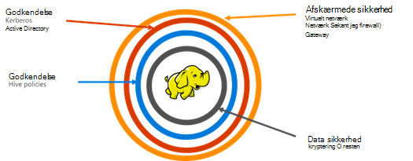

<properties
    pageTitle="Secure HDInsight oversigt | Microsoft Azure"
    description="Få at vide …"
    services="hdinsight"
    documentationCenter=""
    authors="saurinsh"
    manager="jhubbard"
    editor="cgronlun"
    tags="azure-portal"/>

<tags
    ms.service="hdinsight"
    ms.devlang="na"
    ms.topic="hero-article"
    ms.tgt_pltfrm="na"
    ms.workload="big-data"
    ms.date="10/24/2016"
    ms.author="saurinsh"/>

# Introducere medlem af et domæne HDInsight klynger (Preview)

Azure HDInsight indtil dags dato understøttes kun en enkelt bruger lokale administrator. Dette arbejdet velegnet til mindre programmet grupper eller afdelinger. Som Hadoop baseret arbejdsbelastninger erfaringer flere popularitets i enterprise-sektor, blev behovet for enterprise bruge funktioner såsom active directory baseret godkendelse, understøttelse af flere brugere og rolle baseret adgangskontrol stadig vigtigere. Bruger medlem af et domæne HDInsight klynger, kan du oprette en HDInsight klynge, der er knyttet til en Active Directory-domæne, konfigurere en liste over medarbejdere fra virksomheden, der kan godkende via Azure Active Directory til at logge på HDInsight klynge. Alle uden for virksomheden kan ikke logge på eller få adgang til HDInsight klyngen. Enterprise-administrator kan konfigurere rolle baseret adgangskontrol for Hive sikkerhed ved hjælp af [Apache Ranger](http://hortonworks.com/apache/ranger/), og som derfor begrænse adgang til data, der skal kun som nogenlunde samme måde som det er nødvendigt. Til sidst skal kan administratoren overvåge dataadgang af medarbejdere, og de ændringer, der er udført politik for adgangskontrol, således at opnå en høj grad af styring af deres virksomhedsressourcer.

[AZURE.NOTE]> De nye funktioner, der er beskrevet i dette eksempel er kun tilgængelige på Linux-baserede HDInsight klynger for Hive arbejdsbyrde. De andre arbejdsmængder HBase, tænding, Storm og Kafka, vil være aktiveret i fremtidige versioner. 

## Fordele

Enterprise sikkerhed indeholder fire stor søjler – afskærmede sikkerhed, godkendelse, godkendelse og kryptering.

.

### Afskærmede sikkerhed

Kanten og sikkerhed i HDInsight opnås ved hjælp af virtuelle netværk og Gateway-tjenesten. I dag, kan en enterprise-administrator oprette en HDInsight klynge i et virtuelt netværk og bruge netværk sikkerhedsgrupper (indgående eller udgående firewallregler) til at begrænse adgangen til det virtuelle netværk. Kun de IP-adresser, der er defineret i de indgående firewallregler kan kommunikere med HDInsight klynge, således at give kanten og sikkerhed. En anden sikkerhedslag afskærmede opnås ved hjælp af Gateway-tjenesten. Gatewayen er den tjeneste, der fungerer som første linje i forsvarslinjer på en hvilken som helst indgående anmodning HDInsight klynge. Den accepterer anmodningen, validerer den og derefter kun kan anmodningen skal overføres til de andre noder i klynge, således at give afskærmede sikkerhed til andre navne og data noder i klyngen.

### Godkendelse

Med denne offentlige preview kan en administrator i enterprise klargøre en medlem af et domæne HDInsight klynge i et [virtuelt netværk](https://azure.microsoft.com/services/virtual-network/). Noderne i HDInsight klynge skal være knyttet til domænet administreres af virksomheden. Dette opnås ved hjælp af [Azure Active Directory Domain Services](https://technet.microsoft.com/library/cc770946.aspx). Alle noder i klyngen er tilsluttet et domæne, der administrerer virksomheden. Med denne konfiguration kan enterprise medarbejdere logge på klyngenoderne ved hjælp af deres legitimationsoplysninger til domænet. De kan også bruge deres legitimationsoplysninger til domænet til at godkende med andre godkendte slutpunkter som Farvetone, Ambari visninger, ODBC, JDBC, PowerShell og REST API'er til at interagere med klyngen. Administratoren har fuld kontrol over begrænse antallet af brugere, arbejde med klynge via disse slutpunkter.

### Godkendelse

Den bedste fremgangsmåde efterfulgt af de fleste virksomheder er, at ikke alle medarbejdere, der har adgang til alle virksomhedsressourcer. I denne version kan administratoren på samme måde, definere rolle baseret politik for adgangskontrol for klyngeressourcerne. Administratoren kan for eksempel konfigurere [Apache Ranger](http://hortonworks.com/apache/ranger/) til at angive access kontrolelement politikker for Hive. Denne funktionalitet sikrer, at medarbejdere vil kunne få adgang til kun så mange data, de skal være vellykket i deres arbejde. SSH adgang til klyngen er også begrænset kun til administratoren.

### Overvågning

Sammen med beskyttelse HDInsight klyngeressourcer fra uautoriserede brugere, og sikring af dataene, er det nødvendigt at registrere uautoriseret eller utilsigtet adgang for ressourcerne, overvågning af alle adgang til klyngeressourcerne, der og dataene. Administratoren kan se og rapportere al adgang til de HDInsight klyngeressourcer og data med denne preview. Administratoren kan også få vist og rapportere alle ændringer til de politik for adgangskontrol færdig i Apache Ranger understøttes slutpunkter. En medlem af et domæne HDInsight klynge bruger velkendte Apache Ranger Brugergrænsefladen til at søge overvågningslogge. På back-end bruger Ranger [Apache Solr]( http://hortonworks.com/apache/solr/) til at lagre og søge loggene.

### Kryptering

Beskyttelse af data er vigtige for møde organisatoriske sikkerhed og overholdelse af krav, og sammen med begrænsning af adgang til data fra uautoriseret medarbejdere, den skal også være fastgjort ved at kryptere den. Begge data butikkerne til HDInsight klynger, Azure lagerplads Blob og Azure sø datalagring understøtter gennemsigtigt serversiden [kryptering af data](../storage/storage-service-encryption.md) på resten. Sikker HDInsight klynger fungerer problemfrit sammen med denne server side kryptering af data på resten egenskab.

## Næste trin

- Se [konfigurere domæne, der er joinforbundne HDInsight klynger](hdinsight-domain-joined-configure.md)til konfiguration af et medlem af et domæne HDInsight klynge.
- For at administrere se et medlem af et domæne HDInsight klynger [tilsluttet sig Manage Domain HDInsight klynger](hdinsight-domain-joined-manage.md).
- Se [konfigurere Hive politikker for medlem af et domæne HDInsight klynger](hdinsight-domain-joined-run-hive.md)til konfiguration af Hive politikker og køre Hive-forespørgsler.
- Kører Hive forespørgsler ved hjælp af SSH på medlem af et domæne HDInsight klynger, se [Brug SSH med Linux-baserede Hadoop på HDInsight fra Linux, Unix, eller OS X](hdinsight-hadoop-linux-use-ssh-unix.md#connect-to-a-domain-joined-hdinsight-cluster).