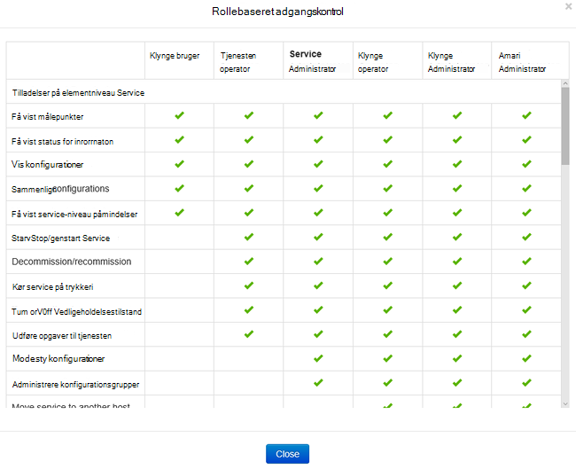
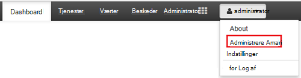
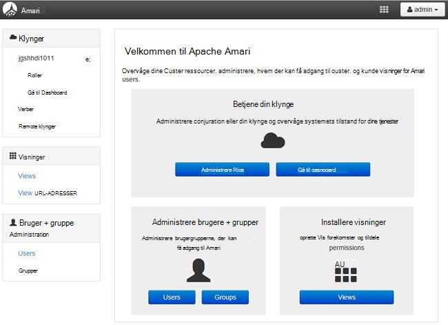
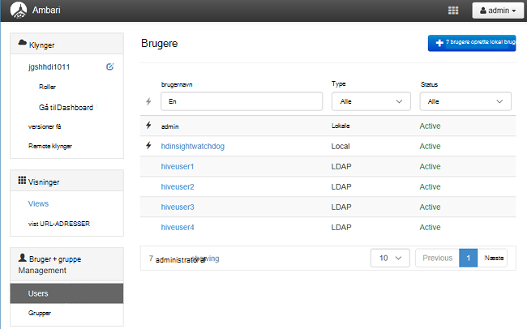
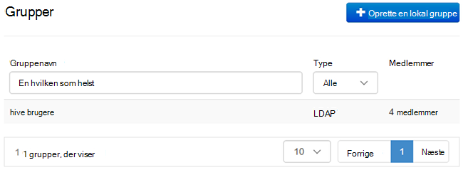
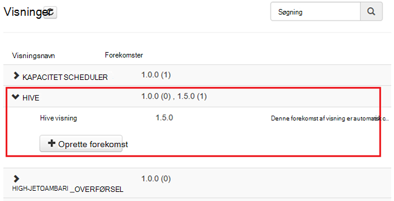
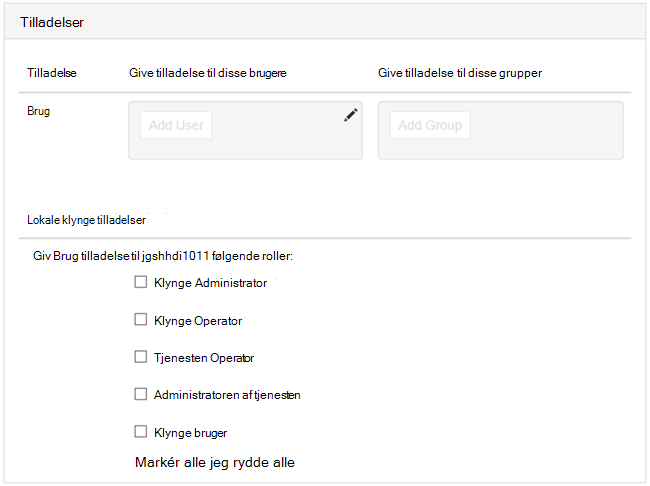

<properties
    pageTitle="Administrere medlem af et domæne HDInsight klynger | Microsoft Azure"
    description="Lær, hvordan du administrerer medlem af et domæne HDInsight klynger"
    services="hdinsight"
    documentationCenter=""
    authors="saurinsh"
    manager="jhubbard"
    editor="cgronlun"
    tags=""/>

<tags
    ms.service="hdinsight"
    ms.devlang="na"
    ms.topic="article"
    ms.tgt_pltfrm="na"
    ms.workload="big-data"
    ms.date="10/25/2016"
    ms.author="saurinsh"/>

# Administrere medlem af et domæne HDInsight klynger (Preview)

Få mere at vide på brugere og roller i HDInsight medlem af et domæne, og hvordan du administrerer medlem af et domæne HDInsight klynger.

## Brugere af medlem af et domæne HDInsight klynger

En HDInsight klynge, ikke er medlem af et domæne har to brugerkonti, der er oprettet under klynge oprettelse:

- **Ambari administration**: denne konto er også kendt som *Hadoop-bruger* eller *http-bruger*. Denne konto kan bruges til at logge på Ambari på https://&lt;clustername >. azurehdinsight.net. Det kan også bruges til at køre forespørgsler på Ambari visninger, udføre opgaver via eksterne værktøjer (det vil sige PowerShell, Templeton, Visual Studio) og godkende med Hive ODBC-driver og BI-værktøjer (det vil sige Excel, PowerBI eller Tableau).

- **SSH bruger**: denne konto kan bruges med SSH og udføre sudo kommandoer. Det har rod rettigheder til at Linux FOS.

En medlem af et domæne HDInsight klynge har tre nye brugere ud over Ambari Admin og SSH bruger.

- **Ranger administration**: denne konto er den lokale administratorkonto Apache Ranger. Det er ikke en active directory-domænebruger. Denne konto kan bruges til at installere politikker og foretage andre brugere administratorer eller delegerede administratorer (så disse brugere kan administrere politikker). Som standard brugernavnet er *administrator* og adgangskoden er den samme som Ambari administratoradgangskode. Adgangskoden kan opdateres fra siden Indstillinger i Ranger.

- **Klynge administrator domænebruger**: denne konto er en active directory domain bruger, der er angivet som Hadoop klynge administratoren herunder Ambari og Ranger. Du skal angive denne brugers legitimationsoplysninger under oprettelse af klynge. Denne bruger har følgende rettigheder:

    - Deltag i maskiner til domænet, og placer dem inden for den OU, som du angiver under oprettelse af klynge.
    - Oprette principper for tjenesten inden for den OU, som du angiver under oprettelse af klynge. 
    - Oprette modsat DNS-poster.

    Bemærk, at andre brugere kan AD også have disse rettigheder. 

    Der er nogle slutpunkter i klynge (for eksempel Templeton), som ikke administreres af Ranger og er derfor ikke sikre. Disse slutpunkter er låst for alle brugere undtagen klynge domæne administrator. 

- **Almindelige**: under oprettelse af klynge, kan du give flere active directory-grupper. Brugere i disse grupper kan synkroniseres til Ranger og Ambari. Disse brugere er domænebrugere og vil have adgang til kun Ranger-administreret slutpunkter (for eksempel Hiveserver2). Alle de RBAC politikker og overvågning skal gælde for disse brugere.

## Roller af medlem af et domæne HDInsight klynger

Medlem af et domæne HDInsight har følgende roller:

- Klynge Administrator
- Klynge Operator
- Administratoren af tjenesten
- Tjenesten Operator
- Klynge bruger

**Se tilladelserne for disse roller**

1. Åbn Ambari Management brugergrænseflade.  Se [åbne Ambari Management brugergrænseflade](#open-the-ambari-management-ui).
2. Klik på **roller**fra menuen til venstre.
3. Klik på det blå spørgsmålstegnet for at se tilladelser:

    

## Åbn Ambari Management brugergrænseflade

1. Log [Azure-portalen](https://portal.azure.com).
2. Åbn din HDInsight klynge i en blade. Se [liste og Vis klynger](hdinsight-administer-use-management-portal.md#list-and-show-clusters).
3. Klik på **Dashboard** fra den øverste menu til at åbne Ambari.
4. Log på Ambari med klynge administratorens domænebrugernavn og adgangskode.
5. Klik på rullemenuen **administrator** fra øverst til højre, og klik derefter på **Administrer Ambari**.

    

    Brugergrænsefladen ser sådan ud:

    

## Liste over de domænebrugere, der er synkroniseret fra din Active Directory

1. Åbn Ambari Management brugergrænseflade.  Se [åbne Ambari Management brugergrænseflade](#open-the-ambari-management-ui).
2. Klik på **brugere**fra menuen til venstre. Du skal se alle de brugere, der er synkroniseret fra din Active Directory til HDInsight klynge.

    

## Liste over domæne grupperne synkroniseres fra din Active Directory

1. Åbn Ambari Management brugergrænseflade.  Se [åbne Ambari Management brugergrænseflade](#open-the-ambari-management-ui).
2. Klik på **grupper**i venstre menu. Du skal du se alle de grupper, der er synkroniseret fra din Active Directory til HDInsight klynge.

    

## Konfigurere Hive visninger tilladelser

1. Åbn Ambari Management brugergrænseflade.  Se [åbne Ambari Management brugergrænseflade](#open-the-ambari-management-ui).
2. Klik på **visninger**fra menuen til venstre.
3. Klik på **HIVE** for at få vist detaljerne.

    

4. Klik på linket **Hive visning** for at konfigurere Hive visninger.
5. Rul ned til sektionen **tilladelser** .

    

6. Klik på **Tilføj bruger** eller **Tilføj gruppe**, og derefter angive de brugere eller grupper, der kan bruge Hive visninger. 

## Konfigurere brugere til rollerne

 For at se en liste over roller og deres tilladelser skal du se [medlem af et roller af domæne HDInsight klynger](#roles-of-domain---joined-hdinsight-clusters).

1. Åbn Ambari Management brugergrænseflade.  Se [åbne Ambari Management brugergrænseflade](#open-the-ambari-management-ui).
2. Klik på **roller**fra menuen til venstre.
3. Klik på **Tilføj bruger** eller **Tilføj gruppe** for at tildele brugere og grupper til forskellige roller.
 
## Næste trin

- Se [konfigurere domæne, der er joinforbundne HDInsight klynger](hdinsight-domain-joined-configure.md)til konfiguration af et medlem af et domæne HDInsight klynge.
- Se [konfigurere Hive politikker for medlem af et domæne HDInsight klynger](hdinsight-domain-joined-run-hive.md)til konfiguration af Hive politikker og køre Hive-forespørgsler.
- Kører Hive forespørgsler ved hjælp af SSH på medlem af et domæne HDInsight klynger, se [Brug SSH med Linux-baserede Hadoop på HDInsight fra Linux, Unix, eller OS X](hdinsight-hadoop-linux-use-ssh-unix.md#connect-to-a-domain-joined-hdinsight-cluster).
