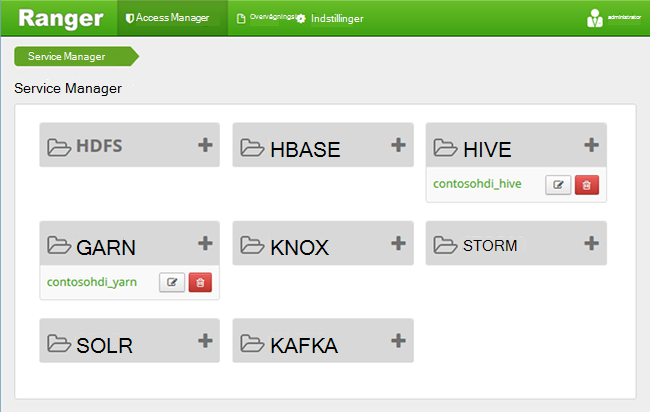
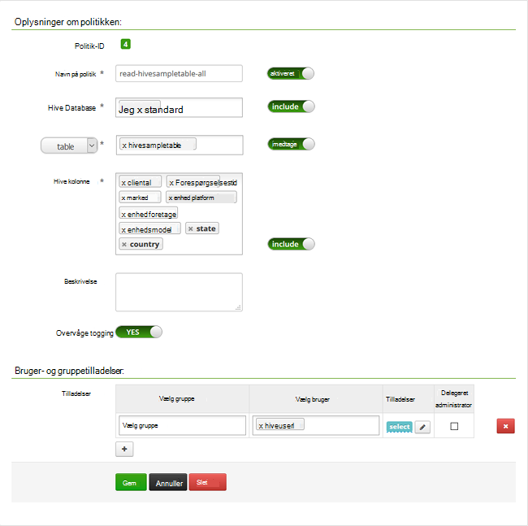

<properties
    pageTitle="Konfigurere politikker for Hive i medlem af et domæne HDInsight | Microsoft Azure"
    description="Få at vide …"
    services="hdinsight"
    documentationCenter=""
    authors="saurinsh"
    manager="jhubbard"
    editor="cgronlun"
    tags="azure-portal"/>

<tags
    ms.service="hdinsight"
    ms.devlang="na"
    ms.topic="hero-article"
    ms.tgt_pltfrm="na"
    ms.workload="big-data"
    ms.date="10/25/2016"
    ms.author="saurinsh"/>

# Konfigurere politikker for Hive i medlem af et domæne HDInsight (Preview)

Lær, hvordan du konfigurerer Apache Ranger politikker til Hive. I denne artikel kan oprette du to Ranger politikker for at begrænse adgangen til hivesampletable. Hivesampletable leveres med HDInsight klynger. Når du har konfigureret politikkerne, kan du bruge Excel og ODBC-driver til at oprette forbindelse til Hive tabeller i HDInsight.

## Forudsætninger

- Et medlem af et domæne HDInsight klynge. Se [konfigurere domæne, der er joinforbundne HDInsight klynger](hdinsight-domain-joined-configure.md).
- En arbejdsstation med Office 2016, Office 2013 Professional Plus, Office 365 Pro Plus, Excel 2013 Standalone eller Office 2010 Professional Plus.

## Oprette forbindelse til Apache Ranger administrator brugergrænseflade

**Oprette forbindelse til Ranger administrator brugergrænseflade**

1. Oprette forbindelse til Ranger administrator Brugergrænsefladen fra en browser. URL-adressen er https://&lt;ClusterName >.azurehdinsight.net/Ranger/. 

    >[AZURE.NOTE] Ranger bruger andre legitimationsoplysninger end Hadoop klynge. For at undgå browsere med cachelagrede Hadoop-legitimationsoplysninger, kan du bruge nyt InPrivate-browservindue at oprette forbindelse til Ranger administrator Brugergrænsefladen.
4. Log på med klynge administratorens domænebrugernavn og adgangskode:

    

    Ranger virker aktuelt kun med garn og Hive.

## Oprette domænebrugere

Du har oprettet hiveruser1 og hiveuser2 i [konfigurere domæne, der er joinforbundne HDInsight klynger](hdinsight-domain-joined-configure.md#create-and-configure-azure-ad-ds-for-your-azure-ad). Du kan bruge to brugerkontoen i dette selvstudium.

## Oprette Ranger politikker

I dette afsnit, skal oprette du to Ranger politikker for at få adgang til hivesampletable. Du kan give tilladelsen select på forskellige sæt kolonner. Begge brugere er oprettet i [konfigurere domæne, der er joinforbundne HDInsight klynger](hdinsight-domain-joined-configure.md#create-and-configure-azure-ad-ds-for-your-azure-ad).  I næste afsnit, vil du teste de to politikker i Excel.

**Til at oprette Ranger politikker**

1. Åbn Ranger administrator brugergrænseflade. Se [oprette forbindelse til Apache Ranger administrator brugergrænseflade](#connect-to-apache-ranager-admin-ui).
2. Klik på ** &lt;ClusterName > _hive**, under **Hive**. Du skal se to foruddefinerede konfigurere politikker for.
3. Klik på **Tilføj ny politik**, og indtast følgende værdier:

    - Navn på politik: Læs-hivesampletable-all
    - Hive Database: standard
    - tabel: hivesampletable
    - Hive kolonne: *
    - Vælg bruger: hiveuser1
    - Tilladelser: Vælg

    .

    >[AZURE.NOTE] Hvis en domænebruger ikke er udfyldt i Vælg bruger, du vente et øjeblik Ranger til at synkronisere med AAD.

4. Klik på **Tilføj** for at gemme politikken.
5. Gentag de sidste to trin for at oprette en anden politik med følgende egenskaber:

    - Navn på politik: Læs-hivesampletable-devicemake
    - Hive Database: standard
    - tabel: hivesampletable
    - Hive kolonne: clientid, devicemake
    - Vælg bruger: hiveuser2
    - Tilladelser: Vælg

## Oprette Hive ODBC-datakilde

Vejledningen kan findes i [oprette Hive ODBC-datakilde](hdinsight-connect-excel-hive-odbc-driver.md).  

    Egenskaben|Beskrivelse
    ---|---
    Datakildenavn|Give et navn til din datakilde
    Host|Angiv &lt;HDInsightClusterName >. azurehdinsight.net. For eksempel myHDICluster.azurehdinsight.net
    Port|Brug <strong>443</strong>. (Denne port er ændret fra 563 til 443).
    Database|Du kan bruge <strong>som standard</strong>.
    Hive servertype|Vælg <strong>Hive Server 2</strong>
    Ordning|Vælg <strong>Tjeneste, Azure HDInsight</strong>
    HTTP-sti|Lad den stå tomt.
    Brugernavn|Angiv hiveuser1@contoso158.onmicrosoft.com. Opdatere navnet på det domæne, hvis det er anderledes.
    Adgangskode|Skriv adgangskoden til hiveuser1.
    </table>

Sørg for at klikke på **Test** før du gemmer datakilden.

##Importere data til Excel fra HDInsight

I det sidste afsnit, har du konfigureret to politikker.  hiveuser1 har tilladelsen select på alle kolonnerne, og hiveuser2 har tilladelsen select på to kolonner. I dette afsnit skal repræsentere du de to brugere for at importere data til Excel.

1. Åbn en ny eller eksisterende projektmappe i Excel.
2. Klik på **Fra andre datakilder**fra fanen **Data** , og klik derefter på **Fra guiden Dataforbindelse** for at starte **Guiden Dataforbindelse**.

    ! [Åbne guiden Dataforbindelse] [img-hdi-simbahiveodbc.excel.dataconnection]

3. Vælg **ODBC DSN** som datakilde, og klik derefter på **Næste**.
4. Vælg navnet på datakilden, du har oprettet i ovenstående trin fra ODBC-datakilder, og klik derefter på **Næste**.
5. Angive adgangskoden for-klyngen i guiden igen, og klik derefter på **OK**. Vente på dialogboksen **Vælg Database og tabel** at åbne. Det kan tage et par sekunder.
8. Vælg **hivesampletable**, og klik derefter på **Næste**. 
8. Klik på **Udfør**.
9. I dialogboksen **Importdata** , kan du ændre eller angive forespørgslen. Hvis du vil gøre det, skal du klikke på **Egenskaber**. Det kan tage et par sekunder. 
10. Klik på fanen **Definition** . Kommandotekst er:

        SELECT * FROM "HIVE"."default"."hivesampletable"

    Ved de Ranger politikker, du har defineret, har hiveuser1 tilladelsen select alle kolonner.  Så denne forespørgsel fungerer med hiveuser1's legitimationsoplysninger, men denne forespørgsel virker ikke ikke med hiveuser2's legitimationsoplysninger.

    ! [Forbindelsesegenskaber] [img-hdi-simbahiveodbc-excel-connectionproperties]

11. Klik på **OK** for at lukke dialogboksen Egenskaber for forbindelse.
12. Klik på **OK** for at lukke dialogboksen **Importdata** .  
13. Skriv adgangskoden til hiveuser1 igen, og klik derefter på **OK**. Det tager et par sekunder, før data bliver importeret til Excel. Når guiden er fuldført, skal du se 11 kolonner med data.

For at teste den anden politik (læse-hivesampletable-devicemake), du oprettede i det sidste afsnit

1. Tilføje et nyt ark i Excel.
2. Den sidste fremgangsmåde for at importere dataene.  Den eneste ændring, du vil gøre er at bruge hiveuser2's legitimationsoplysninger i stedet for hiveuser1's. Dette mislykkes, fordi hiveuser2 kun har tilladelse til at se to kolonner. Du må få vist følgende fejlmeddelelse:

        [Microsoft][HiveODBC] (35) Error from Hive: error code: '40000' error message: 'Error while compiling statement: FAILED: HiveAccessControlException Permission denied: user [hiveuser2] does not have [SELECT] privilege on [default/hivesampletable/clientid,country ...]'.

3. Følg den samme fremgangsmåde for at importere data. Denne gang bruge hiveuser2's legitimationsoplysninger og også redigere select-sætningen fra:

        SELECT * FROM "HIVE"."default"."hivesampletable"

    Hvis du vil:

        SELECT clientid, devicemake FROM "HIVE"."default"."hivesampletable"

    Når guiden er fuldført, skal du se to kolonner med data, der importeres.

## Næste trin

- Se [konfigurere domæne, der er joinforbundne HDInsight klynger](hdinsight-domain-joined-configure.md)til konfiguration af et medlem af et domæne HDInsight klynge.
- For at administrere se et medlem af et domæne HDInsight klynger [tilsluttet sig Manage Domain HDInsight klynger](hdinsight-domain-joined-manage.md).
- Kører Hive forespørgsler ved hjælp af SSH på medlem af et domæne HDInsight klynger, se [Brug SSH med Linux-baserede Hadoop på HDInsight fra Linux, Unix, eller OS X](hdinsight-hadoop-linux-use-ssh-unix.md#connect-to-a-domain-joined-hdinsight-cluster).
- Oprette forbindelse Hive ved hjælp af Hive JDBC, under [oprette forbindelse til Hive på Azure HDInsight bruger Hive JDBC driveren](hdinsight-connect-hive-jdbc-driver.md)
- Forbindelse Excel til Hadoop ved hjælp af Hive ODBC, skal du [Oprette forbindelse til Excel til Hadoop med Microsoft Hive ODBC-drevet](hdinsight-connect-excel-hive-odbc-driver.md)
- Forbindelse Excel til Hadoop ved hjælp af Power-forespørgsel, skal du [Oprette forbindelse til Excel til Hadoop ved hjælp af Power-forespørgsel](hdinsight-connect-excel-power-query.md)