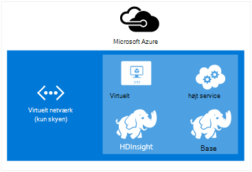
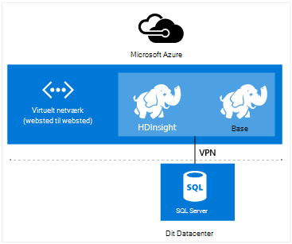

<properties
    pageTitle="Udvide HDInsight med virtuelt netværk | Microsoft Azure"  
    description="Lær at bruge Azure virtuelt netværk til at oprette forbindelse HDInsight til andre skyen ressourcer eller ressourcer i dit datacenter"
    services="hdinsight"
    documentationCenter=""
    authors="Blackmist"
    manager="jhubbard"
    editor="cgronlun"/>

<tags
   ms.service="hdinsight"
   ms.devlang="na"
   ms.topic="article"
   ms.tgt_pltfrm="na"
   ms.workload="big-data"
   ms.date="10/21/2016"
   ms.author="larryfr"/>


#<a name="extend-hdinsight-capabilities-by-using-azure-virtual-network"></a>Udvide HDInsight-funktioner ved hjælp af Azure virtuelt netværk

Azure virtuelt netværk tillader dig at udvide dine Hadoop løsninger at inkorporere lokale ressourcer såsom SQL Server, kan du kombinere flere HDInsight klynge typer eller for at oprette sikker privat netværk mellem ressourcer i skyen.

[AZURE.INCLUDE [upgrade-powershell](../../includes/hdinsight-use-latest-powershell-and-cli.md)]


##<a id="whatis"></a>Hvad er Azure virtuelt netværk?

[Azure virtuelt netværk](https://azure.microsoft.com/documentation/services/virtual-network/) kan du oprette en sikker, fast netværk, der indeholder de ressourcer, du skal bruge til din løsning. Et virtuelt netværk kan du:

* Oprette forbindelse skyen ressourcer sammen i et privat netværk (kun skyen).

    

    Brug af virtuelt netværk til at sammenkæde Azure-tjenester med Azure HDInsight gør det muligt for følgende scenarier:

    * **Aktivering af HDInsight tjenester eller job** fra Azure websteder eller tjenester, der kører på Azure virtuelle computere.

    * **Direkte overførsel af data** mellem HDInsight og Azure SQL-Database, SQL Server eller en anden data lagerpladsløsning, der kører på en virtuel maskine.

    * **Kombinere flere HDInsight servere** i en enkelt løsning. HDInsight klynger kommer i en række forskellige typer, der svarer til det arbejdsbelastningen eller den teknologi, der er tilpasset klyngen til. Der er ingen understøttet metode til at oprette en klynge, der kombinerer flere typer, som Storm og HBase på en klynge. Bruge et virtuelt netværk tillader flere klynger at kommunikere direkte med hinanden.

* Forbinde dine skyen ressourcer til dit lokale datacenter netværk (-websted eller punkt-til-websted) ved hjælp af et virtuelt privat netværk (VPN).

    Konfiguration af websted til websted kan du forbinde flere ressourcer fra dit datacenter til Azure virtuelle netværk ved hjælp af en hardware VPN eller tjenesten Routing og fjernadgang til.

    

    Konfiguration af punkt-til-websted kan du forbinde en bestemt ressource til Azure virtuelle netværk ved hjælp af software VPN.

    

    Brug af virtuelt netværk til at oprette et link i skyen og datacentret giver lignende scenarier til skyen kun konfigurationen. Men i stedet for at være begrænset til at arbejde med ressourcer i skyen, kan du også arbejde med ressourcer i dit datacenter.

    * **Direkte overførsel af data** mellem HDInsight og dit datacenter. Et eksempel bruger Sqoop til at overføre data til eller fra SQL Server eller læse data, der genereres af en line of business (LOB) program.

    * **Aktivering af HDInsight tjenester eller job** fra et LOB-program. Et eksempel bruger HBase Java API'er til at gemme og hente data fra en HDInsight HBase klynge.

Du kan finde flere oplysninger om virtuelt netværk funktioner, fordele og funktioner, [Azure virtuelt netværk oversigt](../virtual-network/virtual-networks-overview.md).

> [AZURE.NOTE] Du skal oprette det virtuelle Azure-netværk før klargøring af en HDInsight klynge. Du kan finde yderligere oplysninger finder [virtuelt netværk konfigurationsopgaver](https://azure.microsoft.com/documentation/services/virtual-network/).

## <a name="virtual-network-requirements"></a>Virtuelt netværkskrav

> [AZURE.IMPORTANT] Oprette en HDInsight klynge i et virtuelt netværk kræver specifikke virtuelt netværk konfigurationer, som er beskrevet i dette afsnit.

###<a name="location-based-virtual-networks"></a>Placering-baserede virtuelle netværk

Azure HDInsight understøtter placering-baserede kun virtuelle netværk og virker ikke i øjeblikket med virtuelle netværk, der er baseret på forbindelsen mellem processorer gruppe.

###<a name="classic-or-v2-virtual-network"></a>Klassisk eller v2 virtuelt netværk

Windows-baserede klynger kræver et klassisk virtuelt netværk, mens Linux-baserede klynger kræver en Azure ressourcestyring virtuelt netværk. Hvis du ikke har den korrekte type netværk, kan den ikke bruges, når du opretter klyngen.

Hvis du har ressourcer i et virtuelt netværk, der ikke kan anvendes af den klynge, du har planer om at oprette, kan du oprette et nyt virtuelt netværk, der kan bruges af klyngen og forbinde den til det inkompatible virtuelle netværk. Derefter kan du oprette klyngen i den netværksversion, der kræves, og den vil kunne få adgang til ressourcer i andet netværket da to er sammenføjet. Du kan finde flere oplysninger om oprettelse af forbindelse klassisk og nye virtuelle netværk, [tilslutning klassisk VNets til nye VNets](../vpn-gateway/vpn-gateway-connect-different-deployment-models-portal.md).

###<a name="custom-dns"></a>Brugerdefinerede DNS

Når du opretter et virtuelt netværk, indeholder Azure standard navneoversættelse til Azure tjenester som HDInsight, der er installeret i netværket. Du kan dog for at bruge dit eget Domain Name System (DNS) til situationer som på tværs af netværk domæne navneoversættelse. For eksempel at kommunikation mellem tjenester, der er placeret i to tilsluttet sig virtuelle netværk. HDInsight understøtter både den standard Azure navneoversættelse samt brugerdefinerede DNS, når den bruges med Azure virtuelt netværk.

Du kan finde flere oplysninger om brug af dine egne DNS-server med Azure virtuelt netværk, i afsnittet __navneoversættelse bruger dine egne DNS-server__ i dokumentets [Navneoversættelse for FOS og rolle forekomster](../virtual-network/virtual-networks-name-resolution-for-vms-and-role-instances.md#name-resolution-using-your-own-dns-server) .

###<a name="secured-virtual-networks"></a>Sikret virtuelle netværk

Tjenesten HDInsight er en administreret tjeneste, og du skal have adgang til internettet under klargøringen og under kørsel. Dette er så pågældende Azure kan overvåge tilstanden for klynge, starte failover klynge ressourcer, ændre antallet af knuder på klynge gennem skalering handlinger samt andre administrationsopgaver.

Hvis du har brug at installere HDInsight til et sikkert virtuelt netværk, skal du tillade indgående adgang via port 443 for følgende IP-adresser, som gør det muligt at administrere HDInsight klynge Azure.

* 168.61.49.99
* 23.99.5.239
* 168.61.48.131
* 138.91.141.162

Tillade indgående adgang fra port 443 for disse mailadresser, så du for at installere HDInsight til et sikkert virtuelt netværk.

> [AZURE.IMPORTANT] HDInsight understøtter ikke begrænse udgående trafik, kun indgående trafik. Når du definerer netværk sikkerhedsgruppe regler for det undernet, som indeholder HDInsight, kun bruge indgående regler.

I følgende eksempler viser, hvordan du opretter en ny netværk sikkerhedsgruppe, der kan nødvendige adresserne, og gælder sikkerhedsgruppen for et undernet inden for netværket virtuel. Disse trin antager, at du allerede har oprettet et virtuelt netværk og undernet, som du vil installere HDInsight til.

__Brug af Azure PowerShell__

    $vnetName = "Replace with your virtual network name"
    $resourceGroupName = "Replace with the resource group the virtual network is in"
    $subnetName = "Replace with the name of the subnet that HDInsight will be installed into"
    # Get the Virtual Network object
    $vnet = Get-AzureRmVirtualNetwork `
        -Name $vnetName `
        -ResourceGroupName $resourceGroupName
    # Get the region the Virtual network is in.
    $location = $vnet.Location
    # Get the subnet object
    $subnet = $vnet.Subnets | Where-Object Name -eq $subnetName
    # Create a new Network Security Group.
    # And add exemptions for the HDInsight health and management services.
    $nsg = New-AzureRmNetworkSecurityGroup `
        -Name "hdisecure" `
        -ResourceGroupName $resourceGroupName `
        -Location $location `
        | Add-AzureRmNetworkSecurityRuleConfig `
            -name "hdirule1" `
            -Description "HDI health and management address 168.61.49.99" `
            -Protocol "*" `
            -SourcePortRange "*" `
            -DestinationPortRange "443" `
            -SourceAddressPrefix "168.61.49.99" `
            -DestinationAddressPrefix "VirtualNetwork" `
            -Access Allow `
            -Priority 300 `
            -Direction Inbound `
        | Add-AzureRmNetworkSecurityRuleConfig `
            -Name "hdirule2" `
            -Description "HDI health and management 23.99.5.239" `
            -Protocol "*" `
            -SourcePortRange "*" `
            -DestinationPortRange "443" `
            -SourceAddressPrefix "23.99.5.239" `
            -DestinationAddressPrefix "VirtualNetwork" `
            -Access Allow `
            -Priority 301 `
            -Direction Inbound `
        | Add-AzureRmNetworkSecurityRuleConfig `
            -Name "hdirule3" `
            -Description "HDI health and management 168.61.48.131" `
            -Protocol "*" `
            -SourcePortRange "*" `
            -DestinationPortRange "443" `
            -SourceAddressPrefix "168.61.48.131" `
            -DestinationAddressPrefix "VirtualNetwork" `
            -Access Allow `
            -Priority 302 `
            -Direction Inbound `
        | Add-AzureRmNetworkSecurityRuleConfig `
            -Name "hdirule4" `
            -Description "HDI health and management 138.91.141.162" `
            -Protocol "*" `
            -SourcePortRange "*" `
            -DestinationPortRange "443" `
            -SourceAddressPrefix "138.91.141.162" `
            -DestinationAddressPrefix "VirtualNetwork" `
            -Access Allow `
            -Priority 303 `
            -Direction Inbound
    # Set the changes to the security group
    Set-AzureRmNetworkSecurityGroup -NetworkSecurityGroup $nsg
    # Apply the NSG to the subnet
    Set-AzureRmVirtualNetworkSubnetConfig `
        -VirtualNetwork $vnet `
        -Name $subnetName `
        -AddressPrefix $subnet.AddressPrefix `
        -NetworkSecurityGroupId $nsg

__Brug af Azure CLI__

1. Brug følgende kommando til at oprette en ny netværk sikkerhedsgruppe med navnet `hdisecure`. Erstat __RESOURCEGROUPNAME__ og en __placering__ med ressourcegruppen, der indeholder det virtuelle Azure-netværk og den placering (område), som gruppen blev oprettet i.

        azure network nsg create RESOURCEGROUPNAME hdisecure LOCATION
    
    Når gruppen er blevet oprettet, får du oplysninger om den nye gruppe. Se efter en linje, der ligner følgende og gemme den `/subscriptions/GUID/resourceGroups/RESOURCEGROUPNAME/providers/Microsoft.Network/networkSecurityGroups/hdisecure` oplysninger. Det bruges på et senere tidspunkt.
    
        data:    Id                              : /subscriptions/GUID/resourceGroups/RESOURCEGROUPNAME/providers/Microsoft.Network/networkSecurityGroups/hdisecure

2. Bruge følgende for at tilføje regler til den nye netværk sikkerhedsgruppe, tillade indgående kommunikation på port 443 fra Azure HDInsight tilstand og administration af tjenesten. Erstat __RESOURCEGROUPNAME__ med navnet på den ressourcegruppe, der indeholder det virtuelle Azure-netværk.

        azure network nsg rule create RESOURCEGROUPNAME hdisecure hdirule1 -p "*" -o "*" -u "443" -f "168.61.49.99" -e "VirtualNetwork" -c "Allow" -y 300 -r "Inbound"
        azure network nsg rule create RESOURCEGROUPNAME hdisecure hdirule2 -p "*" -o "*" -u "443" -f "23.99.5.239" -e "VirtualNetwork" -c "Allow" -y 301 -r "Inbound"
        azure network nsg rule create RESOURCEGROUPNAME hdisecure hdirule3 -p "*" -o "*" -u "443" -f "168.61.48.131" -e "VirtualNetwork" -c "Allow" -y 302 -r "Inbound"
        azure network nsg rule create RESOURCEGROUPNAME hdisecure hdirule4 -p "*" -o "*" -u "443" -f "138.91.141.162" -e "VirtualNetwork" -c "Allow" -y 303 -r "Inbound"

3. Når reglerne er blevet oprettet, kan du bruge følgende til at anvende den nye netværk sikkerhedsgruppe til en undernet. Erstat __RESOURCEGROUPNAME__ med navnet på den ressourcegruppe, der indeholder det virtuelle Azure-netværk. Erstat __VNETNAME__ og __SUBNETNAME__ med navnet på det virtuelle Azure-netværk og det undernet, som du vil bruge, når du installerer HDInsight.

        azure network vnet subnet set RESOURCEGROUPNAME VNETNAME SUBNETNAME -w "/subscriptions/GUID/resourceGroups/RESOURCEGROUPNAME/providers/Microsoft.Network/networkSecurityGroups/hdisecure"
    
    Når denne kommando er fuldført, kan du installere HDInsight til sikret virtuelle netværk på det undernet, der bruges i disse trin.

> [AZURE.IMPORTANT] Brug af ovenstående trin kun åbne adgang til tjenesten HDInsight tilstand og administration på Azure skyen. Dette giver dig mulighed for at installere en HDInsight klynge i undernet, men er blokeret adgang til HDInsight klynge fra uden for det virtuelle netværk som standard. Du er nødt til at tilføje yderligere netværk sikkerhedsgruppe regler, hvis du vil aktivere adgang fra uden for det virtuelle netværk.
>
> For eksempel for at tillade SSH adgang fra internettet, skal du tilføje en regel, der ligner følgende: 
>
> * Azure PowerShell-```Add-AzureRmNetworkSecurityRuleConfig -Name "SSSH" -Description "SSH" -Protocol "*" -SourcePortRange "*" -DestinationPortRange "22" -SourceAddressPrefix "*" -DestinationAddressPrefix "VirtualNetwork" -Access Allow -Priority 304 -Direction Inbound```
> * Azure CLI-```azure network nsg rule create RESOURCEGROUPNAME hdisecure hdirule4 -p "*" -o "*" -u "22" -f "*" -e "VirtualNetwork" -c "Allow" -y 304 -r "Inbound"```

Du kan finde flere oplysninger om netværk sikkerhedsgrupper, [netværk sikkerhedsgrupper oversigt](../virtual-network/virtual-networks-nsg.md). Oplysninger om styre routing i et virtuelt Azure-netværk, du [brugerdefineret omdirigerer og IP-viderestilling af](../virtual-network/virtual-networks-udr-overview.md).

##<a id="tasks"></a>Opgaver og oplysninger

Dette afsnit indeholder oplysninger om almindelige opgaver og oplysninger, du skal bruge, når du bruger HDInsight med et virtuelt netværk.

###<a name="determine-the-fqdn"></a>Finde ud af det fulde Domænenavn

HDInsight klynge tildeles en bestemt fulde domænenavn (fulde Domænenavn) for grænsefladen virtuelt netværk. Dette er den adresse, du skal bruge, når du opretter forbindelse til klyngen fra andre ressourcer på det virtuelle netværk. For at finde ud af det fulde Domænenavn, kan du bruge følgende for at URL-adressen til at forespørge Ambari management-tjenesten:

    https://<clustername>.azurehdinsight.net/ambari/api/v1/clusters/<clustername>.azurehdinsight.net/services/<servicename>/components/<componentname>

> [AZURE.NOTE] Du kan finde flere oplysninger om brug af Ambari med HDInsight, [overvåge Hadoop klynger i HDInsight ved hjælp af Ambari API](hdinsight-monitor-use-ambari-api.md).

Du skal angive klyngenavn og en tjeneste og komponent, der kører på klynge som ressourcestyring GARN.

> [AZURE.NOTE] Data, der returneres er et dokument, JavaScript Object Notation (JSON), der indeholder mange oplysninger om komponenten. Hvis du vil udtrække lige det fulde Domænenavn, skal du bruge en JSON-parseren til at hente den `host_components[0].HostRoles.host_name` værdi.

For eksempel for at returnere det fulde Domænenavn fra en HDInsight Hadoop-klynge, kan du bruge en af følgende metoder til at hente data for ressourcestyring GARN:

* [Azure PowerShell](../powershell-install-configure.md)

        $ClusterDnsName = <clustername>
        $Username = <cluster admin username>
        $Password = <cluster admin password>
        $DnsSuffix = ".azurehdinsight.net"
        $ClusterFQDN = $ClusterDnsName + $DnsSuffix

        $webclient = new-object System.Net.WebClient
        $webclient.Credentials = new-object System.Net.NetworkCredential($Username, $Password)

        $Url = "https://" + $ClusterFQDN + "/ambari/api/v1/clusters/" + $ClusterFQDN + "/services/yarn/     components/resourcemanager"
        $Response = $webclient.DownloadString($Url)
        $JsonObject = $Response | ConvertFrom-Json
        $FQDN = $JsonObject.host_components[0].HostRoles.host_name
        Write-host $FQDN

* [cURL](http://curl.haxx.se/) og [jq](http://stedolan.github.io/jq/)

        curl -G -u <username>:<password> https://<clustername>.azurehdinsight.net/ambari/api/v1/clusters/<clustername>.azurehdinsight.net/services/yarn/components/resourcemanager | jq .host_components[0].HostRoles.host_name

###<a name="connecting-to-hbase"></a>Oprette forbindelse til HBase

Hvis du vil oprette forbindelse til HBase fra en fjernplacering ved hjælp af Java API, skal du bestemme ZooKeeper quorum adresserne for HBase klynge og angive dette i dit program.

For at få ZooKeeper quorum adresse, kan du bruge en af følgende metoder til at forespørge Ambari management-tjenesten:

* [Azure PowerShell](../powershell-install-configure.md)

        $ClusterDnsName = <clustername>
        $Username = <cluster admin username>
        $Password = <cluster admin password>
        $DnsSuffix = ".azurehdinsight.net"
        $ClusterFQDN = $ClusterDnsName + $DnsSuffix

        $webclient = new-object System.Net.WebClient
        $webclient.Credentials = new-object System.Net.NetworkCredential($Username, $Password)

        $Url = "https://" + $ClusterFQDN + "/ambari/api/v1/clusters/" + $ClusterFQDN + "/configurations?type=hbase-site&tag=default&fields=items/properties/hbase.zookeeper.quorum"
        $Response = $webclient.DownloadString($Url)
        $JsonObject = $Response | ConvertFrom-Json
        Write-host $JsonObject.items[0].properties.'hbase.zookeeper.quorum'

* [cURL](http://curl.haxx.se/) og [jq](http://stedolan.github.io/jq/)

        curl -G -u <username>:<password> "https://<clustername>.azurehdinsight.net/ambari/api/v1/clusters/<clustername>.azurehdinsight.net/configurations?type=hbase-site&tag=default&fields=items/properties/hbase.zookeeper.quorum" | jq .items[0].properties[]

> [AZURE.NOTE] Du kan finde flere oplysninger om brug af Ambari med HDInsight, [overvåge Hadoop klynger i HDInsight ved hjælp af Ambari API](hdinsight-monitor-use-ambari-api.md).

Når du har oplysningerne om quorum, kan du bruge den i klientprogrammet.

For eksempel en Java-program, der bruger HBase API, vil du føje en **hbase site.xml** -fil til projektet og angive oplysningerne om quorum i filen på følgende måde:

```
<configuration>
  <property>
    <name>hbase.cluster.distributed</name>
    <value>true</value>
  </property>
  <property>
    <name>hbase.zookeeper.quorum</name>
    <value>zookeeper0.address,zookeeper1.address,zookeeper2.address</value>
  </property>
  <property>
    <name>hbase.zookeeper.property.clientPort</name>
    <value>2181</value>
  </property>
</configuration>
```

###<a name="verify-network-connectivity"></a>Kontrollere netværksforbindelsen

Nogle af tjenesterne, såsom SQL Server, kan begrænse indgående netværksforbindelser. Dette forhindrer HDInsight i korrekt arbejde med disse tjenester.

Hvis du støder på problemer med at få adgang til en tjeneste fra HDInsight, kan du se i dokumentationen til at sikre, at du har aktiveret netværksadgang-tjenesten. Du kan også kontrollere adgang til netværket ved at oprette en Azure virtuelt på det samme virtuelle netværk og bruge klientfunktioner til at bekræfte, at den virtuelle maskine kan oprette forbindelse til tjenesten via det virtuelle netværk.

##<a id="nextsteps"></a>Næste trin

Følgende eksempler viser, hvordan du bruger HDInsight med Azure virtuelt netværk:

* [Analysér føler data med Storm og HBase i HDInsight](hdinsight-storm-sensor-data-analysis.md) - viser, hvordan du konfigurerer en Storm og HBase klynge i et virtuelt netværk, samt hvordan du kan skrive data fra en fjernplacering til HBase fra Storm.

* [Klargøring Hadoop klynger i HDInsight](hdinsight-hadoop-provision-linux-clusters.md) - indeholder oplysninger om klargøring Hadoop klynger, herunder oplysninger om brug af Azure virtuelt netværk.

* [Brug Sqoop med Hadoop i HDInsight](hdinsight-use-sqoop-mac-linux.md) - indeholder oplysninger om at bruge Sqoop til at overføre data med SQL Server via et virtuelt netværk.

Hvis du vil vide mere om Azure virtuelle netværk, se [Oversigt over Azure virtuelt netværk](../virtual-network/virtual-networks-overview.md).
