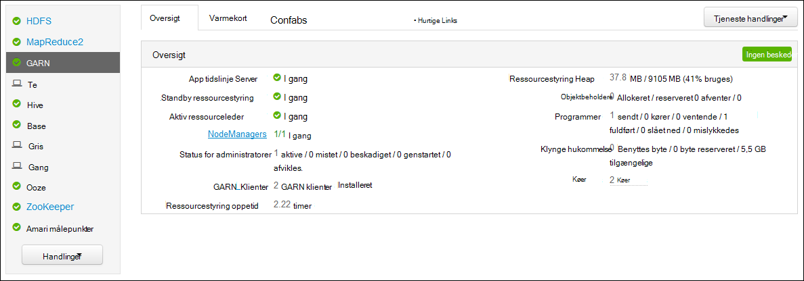

<properties
    pageTitle="Access Hadoop GARN program logger på Linux-baserede HDInsight | Microsoft Azure"
    description="Få mere at vide om at åbne GARN programmet logge på en Linux-baserede HDInsight (Hadoop) klynge ved hjælp af kommandolinjen og en webbrowser."
    services="hdinsight"
    documentationCenter=""
    tags="azure-portal"
    authors="Blackmist" 
    manager="jhubbard"
    editor="cgronlun"/>

<tags
    ms.service="hdinsight"
    ms.workload="big-data"
    ms.tgt_pltfrm="na"
    ms.devlang="na"
    ms.topic="article"
    ms.date="10/21/2016"
    ms.author="larryfr"/>

# Access GARN program logger på Linux-baserede HDInsight 

Dette dokument forklares det, hvordan du kan få adgang til logfiler for GARN (endnu en anden ressource forhandler)-programmer, der er færdige på en Hadoop klynge i Azure HDInsight.

> [AZURE.NOTE] Oplysningerne i dette dokument er specifikke for Linux-baserede HDInsight klynger. Finde oplysninger om Windows-baserede klynger, i [Access GARN programmet logger på Windows-baseret HDInsight](hdinsight-hadoop-access-yarn-app-logs.md)

## Forudsætninger

* En Linux-baserede HDInsight klynge.

* Du skal [oprette en SSH tunnel](hdinsight-linux-ambari-ssh-tunnel.md) , før du kan få adgang til webstedet ressourcestyring logfiler brugergrænseflade.

## GARN tidslinje Server

[GARN tidslinje Server](http://hadoop.apache.org/docs/r2.4.0/hadoop-yarn/hadoop-yarn-site/TimelineServer.html) indeholder generelle oplysninger om færdige programmer samt framework-specifikke programmet oplysninger via to forskellige grænseflader. Mere specifikt:

* Lagring og hentning af generisk programoplysninger på HDInsight klynger er blevet aktiveret med version 3.1.1.374 eller nyere.
* Komponenten programmet på computeren framework-specifikke oplysninger på den Server, tidslinje er ikke tilgængelige på HDInsight klynger.

Generelle oplysninger på programmer omfatter følgende typer data:

* Program-ID, et entydigt id for et program
* Den bruger, der startede programmet
* Oplysninger om skal forsøge at afslutte programmet
* Beholdere ved forsøg på et bestemt program

## Logfiler for programmer GARN og

GARN understøtter flere programming modeller (MapReduce være en af dem) ved afkobling ressourcestyring fra programmet planlægning/overvågning. Dette sker via en global *ressourcestyring* (Ressourcestyring), per-arbejder-node *NodeManagers* (NMs) og -program, *ApplicationMasters* (AMs). Per programmet AM forhandler ressourcer (CPU, hukommelse, disk, netværk) for at køre programmet med ressourcestyring. Ressourcestyring fungerer med NMs give disse ressourcer, som er tildelt som *objektbeholdere*. AM er ansvarlig for sporing af fremskridt af beholdere, der tildeles af Ressourcestyring. Et program kan kræve mange beholdere afhængigt af hvilke af programmet.

Desuden hvert program kan bestå af flere *programmet forsøger* for at afslutte tilstedeværelse af går ned eller på grund af tab af kommunikation mellem AM og en ressourcestyring. Det vil sige, beholdere har fået tildelt en bestemt forsøg af et program. En objektbeholder giver kontekst til grundlæggende enhed for arbejde er udført af en GARN programmet set, og alle arbejde, der er udført i forbindelse med en objektbeholder er udført på noden enkelt arbejder, der er allokeret objektbeholderen. Se [GARN begreber] [ YARN-concepts] til yderligere brug.

Logge af programmet (og loggene tilknyttede objektbeholder) er afgørende i forbindelse med fejlfinding problematisk Hadoop-programmer. GARN indeholder en flot ramme for indsamling, sammenlægning og lagring af programmet logfiler med [Log sammenlægning] [ log-aggregation] funktion. Funktionen Log sammenlægning gør adgang til programmet logfiler mere deterministisk, som samler logge på tværs af alle beholdere på en kollega node og gemmer dem som en samlet logfil per arbejder node i standardfilsystemet, når programmet afsluttes. Programmet kan bruge hundredvis eller tusindvis af objektbeholdere, men logfiler for alle beholdere, der kører på en enkelt arbejder node altid være sammenlagt til en enkelt fil, hvilket resulterer i en logfil per arbejder node, der bruges af dit program. Log sammenlægning er aktiveret som standard HDInsight klynger (version 3.0 og derover), og kan finde aggregeret logfiler i beholderen standard af din klynge på følgende placering:

    wasbs:///app-logs/<user>/logs/<applicationId>

I den valgte placering, *brugeren* er navnet på den bruger, der startede programmet, og *applicationId* er det entydige id for et program, der er tildelt af den GARN ressourcestyring.

Loggene aggregeret er ikke direkte læsbare, som de er skrevet i en [TFile][T-file], [binært format] [ binary-format] indekseret af objektbeholder. Du skal bruge GARN ressourcestyring logfilerne eller CLI værktøjer til at få vist disse logfiler som almindelig tekst for programmer eller beholdere af interesse. 

##GARN CLI værktøjer

Før du kan bruge værktøjerne i GARN CLI, skal du først oprette forbindelse til den HDInsight klynge ved hjælp af SSH. Benyt en af følgende dokumenter oplysninger om brug af SSH med HDInsight:

- [Bruge SSH med Linux-baserede Hadoop på HDInsight fra Linux, Unix eller OS X](hdinsight-hadoop-linux-use-ssh-unix.md)

- [Bruge SSH med Linux-baserede Hadoop på HDInsight fra Windows](hdinsight-hadoop-linux-use-ssh-windows.md)
    
Du kan få vist disse logfiler som almindelig tekst ved at køre en af følgende kommandoer:

    yarn logs -applicationId <applicationId> -appOwner <user-who-started-the-application>
    yarn logs -applicationId <applicationId> -appOwner <user-who-started-the-application> -containerId <containerId> -nodeAddress <worker-node-address>
    
Du skal angive den &lt;applicationId >, &lt;bruger hvem-gang-programmet >, &lt;containerId >, og & ltworker-node-adresse > oplysninger, når du kører disse kommandoer.

##GARN ressourcestyring brugergrænseflade

GARN ressourcestyring Brugergrænsefladen kører på klynge headnode og kan åbnes via internettet Ambari brugergrænseflade; dog skal du [oprette en SSH tunnel](hdinsight-linux-ambari-ssh-tunnel.md) første før du kan få adgang til ResourceManager UI.

Når du har oprettet en SSH tunnel, følge nedenstående trin for at få vist GARN logfiler:

1. I din webbrowser skal du gå til https://CLUSTERNAME.azurehdinsight.net. Erstat CLUSTERNAME med navnet på din HDInsight klynge.

2. Vælg __GARN__på listen over tjenester i venstre side.

    

3. Vælg en af klyngenoderne hoved på rullelisten __Hurtige Links__ , og vælg derefter __Ressourcestyring Log__.

    
    
    Du vil få vist en liste over links til GARN logfiler.

[YARN-timeline-server]:http://hadoop.apache.org/docs/r2.4.0/hadoop-yarn/hadoop-yarn-site/TimelineServer.html
[log-aggregation]:http://hortonworks.com/blog/simplifying-user-logs-management-and-access-in-yarn/
[T-file]:https://issues.apache.org/jira/secure/attachment/12396286/TFile%20Specification%2020081217.pdf
[binary-format]:https://issues.apache.org/jira/browse/HADOOP-3315
[YARN-concepts]:http://hortonworks.com/blog/apache-hadoop-yarn-concepts-and-applications/
