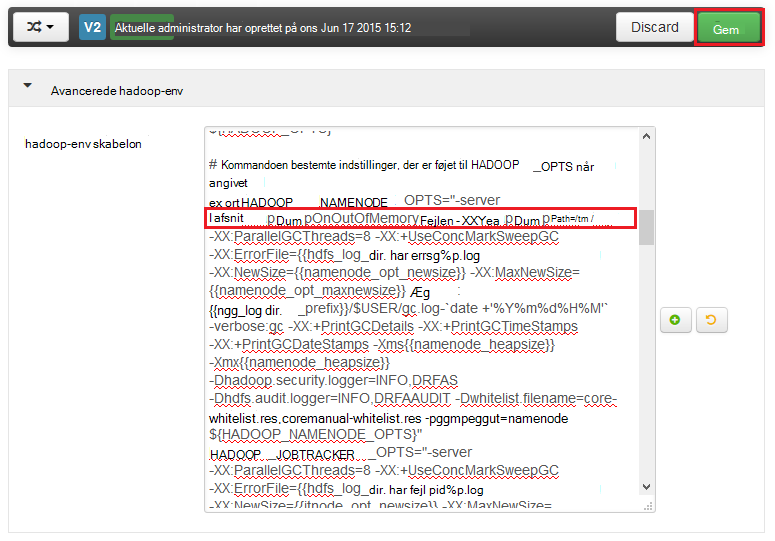

<properties
    pageTitle="Aktivere heap gemmer for Hadoop-tjenester på HDInsight | Microsoft Azure"
    description="Aktivere heap gemmer for Hadoop-tjenester fra Linux-baserede HDInsight klynger til fejlfinding og analyse."
    services="hdinsight"
    documentationCenter=""
    authors="Blackmist"
    manager="jhubbard"
    editor="cgronlun"
    tags="azure-portal"/>

<tags
    ms.service="hdinsight"
    ms.workload="big-data"
    ms.tgt_pltfrm="na"
    ms.devlang="na"
    ms.topic="article"
    ms.date="09/27/2016"
    ms.author="larryfr"/>

#Aktivere heap gemmer for Hadoop-tjenester på Linux-baserede HDInsight (Preview)

[AZURE.INCLUDE [heapdump-selector](../../includes/hdinsight-selector-heap-dump.md)]

Heap gemmer indeholder et øjebliksbillede af programmets hukommelse, herunder værdierne af variabler på det tidspunkt dumpet blev oprettet. Så de er meget nyttig til diagnosticering problemer, der opstår under kørsel.

> [AZURE.NOTE] Oplysninger i denne artikel gælder kun for Linux-baserede HDInsight. Finde oplysninger om Windows-baseret HDInsight, se [aktivere heap gemmer for Hadoop-tjenester på Windows-baseret HDInsight](hdinsight-hadoop-collect-debug-heap-dumps.md)

## Tjenester

Du kan aktivere heap gemmer for følgende tjenester:

*  **hcatalog** - tempelton
*  **hive** - hiveserver2, metastore, derbyserver
*  **mapreduce** - jobhistoryserver
*  **garn** - Ressourcestyring, nodemanager, timelineserver
*  **hdfs** - datanode, secondarynamenode, namenode

Du kan også aktivere heap gemmer til kortet og reducere processer kørte ved HDInsight.

## Forstå konfigurationen af heap

Heap gemmer er aktiveret ved at overføre indstillinger (også kendt som vælger, eller parametre) til JVM, når en tjeneste startes. De fleste Hadoop-tjenester, kan dette gøres ved at ændre shell-script, der bruges til at starte tjenesten.

I hver script, der er en eksport til ** \* \_OPTS**, som indeholder de indstillinger, der overføres til JVM. For eksempel i scriptet **hadoop-env.sh** linjen, der begynder med `export HADOOP_NAMENODE_OPTS=` indeholder indstillingerne for tjenesten NameNode.

Tilknytte og reducere processer er en smule anderledes, som dette er en underordnet proces til MapReduce-tjenesten. Hver Tilknyt eller reducere processen kører i en underordnet objektbeholder, og der er to poster, der indeholder JVM indstillingerne for disse. Begge indeholdt i **mapred site.xml**:

* **mapreduce.Admin.Map.child.Java.opts**
* **mapreduce.Admin.reduce.child.Java.opts**

> [AZURE.NOTE] Vi anbefaler, at du bruger Ambari til at ændre både scripts og indstillinger for mapred site.xml, som Ambari håndterer replikering ændringer på tværs af noder i klyngen. Se afsnittet [Ved hjælp af Ambari](#using-ambari) for bestemte trin.

###Aktivere heap gemmer

Følgende indstilling aktiverer heap gemmer, når der udsendes en OutOfMemoryError:

    -XX:+HeapDumpOnOutOfMemoryError

Den **+** angiver, at denne indstilling er aktiveret. Standard er deaktiveret.

> [AZURE.WARNING] Heap gemmer er ikke aktiveret for Hadoop-tjenester på HDInsight som standard, som de gemte filer kan være store. Hvis du aktiverer dem til fejlfinding, huske at deaktivere dem, når du har gengives problemet og indsamlede lagring af filer.

###Lagring af placering

Standardplaceringen for den gemte fil er den aktuelle arbejdsmappe. Du kan styre, hvor filen er gemt ved hjælp af indstillingen følgende:

    -XX:HeapDumpPath=/path

For eksempel ved hjælp af `-XX:HeapDumpPath=/tmp` medfører gemmer gemmes i mappen /tmp.

###Scripts

Du kan også udløse et script, når der udsendes en **OutOfMemoryError** . For eksempel udløser en besked, så du ved, at fejlen der opstod. Dette styres ved hjælp af indstillingen følgende:

    -XX:OnOutOfMemoryError=/path/to/script

> [AZURE.NOTE] Da Hadoop er et distribueret system, skal være placeret et script, der bruges på alle noder i den-klynge, tjenesten kører på.
>
> Scriptet skal også være på en placering, der er tilgængeligt efter den konto, tjenesten kører som, og skal angive tilladelser til at køre. For eksempel kan du gemme scripts i `/usr/local/bin` og bruge `chmod go+rx /usr/local/bin/filename.sh` til at give læst og tilladelser til at køre.

##Brug af Ambari

Hvis du vil ændre indstillingerne for en tjeneste skal du følge nedenstående trin:

1. Åbn webstedet Ambari brugergrænseflade til din klynge. URL-adressen bliver https://YOURCLUSTERNAME.azurehdinsight.net.

    Når du bliver bedt om det, godkende til det websted, ved hjælp af kontonavnet HTTP (standard: administrator) og adgangskoden til din klynge.

    > [AZURE.NOTE] Du kan blive bedt om endnu en gang ved Ambari for det brugernavn og adgangskode. Hvis det er tilfældet, skal blot angive igen samme kontonavn og din adgangskode

2. Brug listen over i venstre side, markere serviceområdet, du vil ændre. For eksempel, **HDFS**. Vælg fanen **konfigurationer** i området center.

    

3. Angiv ved at bruge posten **filtrere...** **vælger**. Dette kan filtrere listen over elementer til konfiguration af til dem, der indeholder teksten, og er en hurtig måde at finde det shell script eller den **skabelon** , der kan bruges til at angive disse indstillinger.

    

4. Finde den ** \* \_OPTS** -posten for tjenesten, du vil aktivere heap gemmer til, og Tilføj de indstillinger, du vil aktivere. På følgende billede, jeg har tilføjet `-XX:+HeapDumpOnOutOfMemoryError -XX:HeapDumpPath=/tmp/` til den **HADOOP\_NAMENODE\_OPTS** post:

    

    > [AZURE.NOTE] Når aktivering heap gemmer til kortet eller reducere underordnet proces, ser du i stedet for felter hedder **mapreduce.admin.map.child.java.opts** og **mapreduce.admin.reduce.child.java.opts**.

    Bruge knappen **Gem** til at gemme ændringerne. Du kan angive en kort besked, der beskriver ændringerne.

5. Når ændringerne er anvendt, vises ikonet **skal genstartes** ud for en eller flere tjenester.

    

6. Markér hver tjeneste, der kræver en genstart, og brug knappen **Tjeneste handlinger** for at **Slå på Vedligeholdelsestilstand**. Dette forhindrer, at beskeder er dannet ud fra denne tjeneste, når du har genstartet den.

    

7. Når du har aktiveret vedligeholdelsestilstand, skal du bruge knappen **Genstart** for tjenesten skal **Du genstarte alle sted**

    

    > [AZURE.NOTE] posterne til knappen **Genstart** kan være forskellige for andre tjenester.

8. Når tjenesterne, der er blevet genstartet, kan du bruge knappen **Tjeneste handlinger** for at **Aktivere fra Vedligeholdelsestilstand**. Denne Ambari fortsætte med at overvåge for beskeder til tjenesten.
