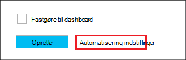

<properties
   pageTitle="Oprette Linux-baserede Hadoop klynger i HDInsight ved hjælp af Azure ressourcestyring skabeloner | Microsoft Azure"
    description="Lær at oprette klynger til Azure HDInsight ved hjælp af Azure Azure ressourcestyring skabeloner."
   services="hdinsight"
   documentationCenter=""
   tags="azure-portal"
   authors="mumian"
   manager="jhubbard"
   editor="cgronlun"/>

<tags
   ms.service="hdinsight"
   ms.devlang="na"
   ms.topic="article"
   ms.tgt_pltfrm="na"
   ms.workload="big-data"
   ms.date="09/02/2016"
   ms.author="jgao"/>

# Oprette Linux-baserede Hadoop klynger i HDInsight ved hjælp af Azure ressourcestyring skabeloner

[AZURE.INCLUDE [selector](../../includes/hdinsight-selector-create-clusters.md)]

Lær at oprette HDInsight klynger ved hjælp af Azure ressource Manager(ARM) skabeloner. Du kan finde yderligere oplysninger finder [Implementer et program med Azure ressourcestyring skabelon](../resource-group-template-deploy.md). Andre klynge oprettelse af værktøjer og funktioner, klik på fanen Vælg øverst på denne side eller se [metoder til oprettelse af klynge](hdinsight-provision-clusters.md#cluster-creation-methods).

##Forudsætninger for:

[AZURE.INCLUDE [delete-cluster-warning](../../includes/hdinsight-delete-cluster-warning.md)]

Før du begynder vejledningen i denne artikel, skal du have følgende:

- [Azure-abonnement](https://azure.microsoft.com/documentation/videos/get-azure-free-trial-for-testing-hadoop-in-hdinsight/).
- Azure PowerShell og/eller Azure CLI

    [AZURE.INCLUDE [use-latest-version](../../includes/hdinsight-use-latest-powershell-and-cli.md)]

### Krav til Access

[AZURE.INCLUDE [access-control](../../includes/hdinsight-access-control-requirements.md)]

## Ressourcestyring skabeloner

Ressourcestyring skabelon gør det nemt at oprette HDInsight klynger, ressourcerne afhængige (såsom lagerplads standardkontoen) og andre ressourcer (såsom Azure SQL-Database du bruger Apache Sqoop) for dit program i en enkelt, koordineret handling. I skabelonen, du definerer de ressourcer, der er behov for programmet og angive installation parametre for at angive værdier for forskellige miljøer. Skabelonen består af JSON og udtryk, som du kan bruge til at oprette værdier til din installation.

Du kan finde en ressourcestyring skabelon til oprettelse af en HDInsight klynge og kontoen afhængige Azure-lager i [Tillæg A](#appx-a-arm-template). Brug på tværs af platforme [VSCode](https://code.visualstudio.com/#alt-downloads) med [ressourcestyring udvidelse](https://marketplace.visualstudio.com/items?itemName=msazurermtools.azurerm-vscode-tools) eller et tekstredigeringsprogram til at gemme skabelonen til en fil på computeren. Du lære, hvordan du ringe til skabelonen på forskellige måder.

Finde flere oplysninger om ressourcestyring skabelon

- [Forfatter Azure ressourcestyring skabeloner](../resource-group-authoring-templates.md)
- [Installere et program med Azure ressourcestyring skabelon](../resource-group-template-deploy.md)

Hvis du vil finde ud af JSON skemaet for visse elementer, kan du følge følgende fremgangsmåde:

1. Åbn [Azure portal](https://porta.azure.com) for at oprette en HDInsight klynge.  Se [oprette Linux-baserede klynger i portalen til Azure HDInsight](hdinsight-hadoop-create-linux-clusters-portal.md).
2. Konfigurere de obligatoriske elementer, og de elementer, du skal bruge JSON skemaet.
3. Før du klikker på **Opret**, skal du klikke på **automatisering indstillinger** , som vist på følgende skærmbillede:

    

    På portalen opretter en ressourcestyring skabelon baseret på dine konfigurationer.
## Installere med PowerShell

Den følgende procedure opretter Linux-baserede HDInsight klynge.

**Installere en klynge ved hjælp af Ressourcestyring skabelon**

1. Gem filen json i [tillæg A](#appx-a-arm-template) til computeren. I PowerShell-script er filnavnet *C:\HDITutorials-ARM\hdinsight-arm-template.json*.
2. Angiv parametre og variabler, hvis det er nødvendigt.
3. Køre skabelonen ved hjælp af følgende PowerShell-script:

        ####################################
        # Set these variables
        ####################################
        #region - used for creating Azure service names
        $nameToken = "<Enter an Alias>" 
        $templateFile = "C:\HDITutorials-ARM\hdinsight-arm-template.json"
        #endregion

        ####################################
        # Service names and varialbes
        ####################################
        #region - service names
        $namePrefix = $nameToken.ToLower() + (Get-Date -Format "MMdd")

        $resourceGroupName = $namePrefix + "rg"
        $hdinsightClusterName = $namePrefix + "hdi"
        $defaultStorageAccountName = $namePrefix + "store"
        $defaultBlobContainerName = $hdinsightClusterName

        $location = "East US 2"

        $armDeploymentName = $namePrefix
        #endregion

        ####################################
        # Connect to Azure
        ####################################
        #region - Connect to Azure subscription
        Write-Host "`nConnecting to your Azure subscription ..." -ForegroundColor Green
        try{Get-AzureRmContext}
        catch{Login-AzureRmAccount}
        #endregion

        # Create a resource group
        New-AzureRmResourceGroup -Name $resourceGroupName -Location $Location

        # Create cluster and the dependent storage accounge
        $parameters = @{clusterName="$hdinsightClusterName"}

        New-AzureRmResourceGroupDeployment `
            -Name $armDeploymentName `
            -ResourceGroupName $resourceGroupName `
            -TemplateFile $templateFile `
            -TemplateParameterObject $parameters

        # List cluster
        Get-AzureRmHDInsightCluster -ResourceGroupName $resourceGroupName -ClusterName $hdinsightClusterName 

    PowerShell-script konfigurerer kun klyngenavnet. Kontonavn lager er hårdt i skabelonen. Du bliver bedt om at angive bruger klynge adgangskode (standard brugernavn er *administrator*); og SSH brugeradgangskode (standard SSH brugernavn er *sshuser*).  
    
Du kan finde yderligere oplysninger finder [Implementer med PowerShell](../resource-group-template-deploy.md#deploy-with-powershell).

## Installere med Azure CLI

I følgende eksempel oprettes en klynge og dens afhængige lagerplads konto og objektbeholder ved at ringe til en ressourcestyring skabelon:

    azure login
    azure config mode arm
    azure group create -n hdi1229rg -l "East US"
    azure group deployment create --resource-group "hdi1229rg" --name "hdi1229" --template-file "C:\HDITutorials-ARM\hdinsight-arm-template.json"
    
Du bliver bedt om at angive klyngenavnet, klynge brugeradgangskode (standard brugernavn er *administrator*) og SSH brugeradgangskode (standard SSH brugernavn er *sshuser*). Angive integrerede parametre:

    azure group deployment create --resource-group "hdi1229rg" --name "hdi1229" --template-file "c:\Tutorials\HDInsightARM\create-linux-based-hadoop-cluster-in-hdinsight.json" --parameters '{\"clusterName\":{\"value\":\"hdi1229\"},\"clusterLoginPassword\":{\"value\":\"Pass@word1\"},\"sshPassword\":{\"value\":\"Pass@word1\"}}'

## Installere med REST API'ER

Se [installere med REST-API](../resource-group-template-deploy.md#deploy-with-the-rest-api).

## Installere med Visual Studio

Med Visual Studio, kan du oprette gruppeprojekt, hvor en ressource og installerer det til Azure via brugergrænsefladen. Du vælger typen ressourcer til at medtage i projektet, og disse ressourcer føjes automatisk til Ressourcestyring skabelon. Projektet indeholder også en PowerShell-script for at installere skabelonen.

Se [oprette og implementere Azure ressourcegrupper via Visual Studio](../vs-azure-tools-resource-groups-deployment-projects-create-deploy.md)for at få en introduktion til brug af Visual Studio med ressourcegrupper.

##Næste trin
Du har lært flere måder at oprette en HDInsight klynge i denne artikel. Hvis du vil vide mere, skal du se følgende artikler:

- Se et eksempel med at udrulle ressourcer via biblioteket .NET klient [Implementer ressourcer ved hjælp af .NET biblioteker og en skabelon](../virtual-machines/virtual-machines-windows-csharp-template.md).
- Finde et detaljeret eksempel med at udrulle et program under [klargøring og installere microservices forudsigeligt i Azure](../app-service-web/app-service-deploy-complex-application-predictably.md).
- Vejledning i installation af din løsning til forskellige miljøer, under [udvikling og testmiljøer i Microsoft Azure](../solution-dev-test-environments.md).
- Se [redigering skabeloner](../resource-group-authoring-templates.md)for at få mere for at vide om sektionerne i skabelonen Azure ressourcestyring.
- Du kan finde en liste over de funktioner, du kan bruge i en skabelon til Azure Ressourcestyring, [skabelon funktioner](../resource-group-template-functions.md).

##Appx A: ressourcestyring skabelon

Følgende Azure Resource Manager skabelon opretter en Linux-baserede Hadoop klynge med kontoen afhængige Azure-lager. 

> [AZURE.NOTE] Eksemplet indeholder konfigurationsoplysninger til Hive metastore og Oozie metastore.  Fjern sektionen, eller konfigurere afsnittet før ved hjælp af skabelonen.

    {
    "$schema": "https://schema.management.azure.com/schemas/2015-01-01/deploymentTemplate.json#",
    "contentVersion": "1.0.0.0",
    "parameters": {
        "clusterName": {
        "type": "string",
        "metadata": {
            "description": "The name of the HDInsight cluster to create."
        }
        },
        "clusterLoginUserName": {
        "type": "string",
        "defaultValue": "admin",
        "metadata": {
            "description": "These credentials can be used to submit jobs to the cluster and to log into cluster dashboards."
        }
        },
        "clusterLoginPassword": {
        "type": "securestring",
        "metadata": {
            "description": "The password must be at least 10 characters in length and must contain at least one digit, one non-alphanumeric character, and one upper or lower case letter."
        }
        },
        "sshUserName": {
        "type": "string",
        "defaultValue": "sshuser",
        "metadata": {
            "description": "These credentials can be used to remotely access the cluster."
        }
        },
        "sshPassword": {
        "type": "securestring",
        "metadata": {
            "description": "The password must be at least 10 characters in length and must contain at least one digit, one non-alphanumeric character, and one upper or lower case letter."
        }
        },
        "location": {
        "type": "string",
        "defaultValue": "East US",
        "allowedValues": [
            "East US",
            "East US 2",
            "North Central US",
            "South Central US",
            "West US",
            "North Europe",
            "West Europe",
            "East Asia",
            "Southeast Asia",
            "Japan East",
            "Japan West",
            "Australia East",
            "Australia Southeast"
        ],
        "metadata": {
            "description": "The location where all azure resources will be deployed."
        }
        },
        "clusterType": {
        "type": "string",
        "defaultValue": "hadoop",
        "allowedValues": [
            "hadoop",
            "hbase",
            "storm",
            "spark"
        ],
        "metadata": {
            "description": "The type of the HDInsight cluster to create."
        }
        },
        "clusterWorkerNodeCount": {
        "type": "int",
        "defaultValue": 2,
        "metadata": {
            "description": "The number of nodes in the HDInsight cluster."
        }
        }
    },
    "variables": {
        "defaultApiVersion": "2015-05-01-preview",
        "clusterApiVersion": "2015-03-01-preview",
        "clusterStorageAccountName": "[concat(parameters('clusterName'),'store')]"
    },
    "resources": [
        {
        "name": "[variables('clusterStorageAccountName')]",
        "type": "Microsoft.Storage/storageAccounts",
        "location": "[parameters('location')]",
        "apiVersion": "[variables('defaultApiVersion')]",
        "dependsOn": [ ],
        "tags": { },
        "properties": {
            "accountType": "Standard_LRS"
        }
        },
        {
        "name": "[parameters('clusterName')]",
        "type": "Microsoft.HDInsight/clusters",
        "location": "[parameters('location')]",
        "apiVersion": "[variables('clusterApiVersion')]",
        "dependsOn": [ "[concat('Microsoft.Storage/storageAccounts/',variables('clusterStorageAccountName'))]" ],
        "tags": {

        },
        "properties": {
            "clusterVersion": "3.4",
            "osType": "Linux",
            "tier": "standard",
            "clusterDefinition": {
            "kind": "[parameters('clusterType')]",
            "configurations": {
                "gateway": {
                "restAuthCredential.isEnabled": true,
                "restAuthCredential.username": "[parameters('clusterLoginUserName')]",
                "restAuthCredential.password": "[parameters('clusterLoginPassword')]"
                },
                "hive-site": {
                    "javax.jdo.option.ConnectionDriverName": "com.microsoft.sqlserver.jdbc.SQLServerDriver",
                    "javax.jdo.option.ConnectionURL": "jdbc:sqlserver://myadla0901dbserver.database.windows.net;database=myhive20160901;encrypt=true;trustServerCertificate=true;create=false;loginTimeout=300",
                    "javax.jdo.option.ConnectionUserName": "johndole",
                    "javax.jdo.option.ConnectionPassword": "myPassword$"
                },
                "hive-env": {
                    "hive_database": "Existing MSSQL Server database with SQL authentication",
                    "hive_database_name": "myhive20160901",
                    "hive_database_type": "mssql",
                    "hive_existing_mssql_server_database": "myhive20160901",
                    "hive_existing_mssql_server_host": "myadla0901dbserver.database.windows.net",
                    "hive_hostname": "myadla0901dbserver.database.windows.net"
                },
                "oozie-site": {
                    "oozie.service.JPAService.jdbc.driver": "com.microsoft.sqlserver.jdbc.SQLServerDriver",
                    "oozie.service.JPAService.jdbc.url": "jdbc:sqlserver://myadla0901dbserver.database.windows.net;database=myhive20160901;encrypt=true;trustServerCertificate=true;create=false;loginTimeout=300",
                    "oozie.service.JPAService.jdbc.username": "johndole",
                    "oozie.service.JPAService.jdbc.password": "myPassword$",
                    "oozie.db.schema.name": "oozie"
                },
                "oozie-env": {
                    "oozie_database": "Existing MSSQL Server database with SQL authentication",
                    "oozie_database_name": "myhive20160901",
                    "oozie_database_type": "mssql",
                    "oozie_existing_mssql_server_database": "myhive20160901",
                    "oozie_existing_mssql_server_host": "myadla0901dbserver.database.windows.net",
                    "oozie_hostname": "myadla0901dbserver.database.windows.net"
                }            
            }
            },
            "storageProfile": {
            "storageaccounts": [
                {
                "name": "[concat(variables('clusterStorageAccountName'),'.blob.core.windows.net')]",
                "isDefault": true,
                "container": "[parameters('clusterName')]",
                "key": "[listKeys(resourceId('Microsoft.Storage/storageAccounts', variables('clusterStorageAccountName')), variables('defaultApiVersion')).key1]"
                }
            ]
            },
            "computeProfile": {
            "roles": [
                {
                "name": "headnode",
                "targetInstanceCount": "2",
                "hardwareProfile": {
                    "vmSize": "Standard_D3"
                },
                "osProfile": {
                    "linuxOperatingSystemProfile": {
                    "username": "[parameters('sshUserName')]",
                    "password": "[parameters('sshPassword')]"
                    }
                }
                },
                {
                "name": "workernode",
                "targetInstanceCount": "[parameters('clusterWorkerNodeCount')]",
                "hardwareProfile": {
                    "vmSize": "Standard_D3"
                },
                "osProfile": {
                    "linuxOperatingSystemProfile": {
                    "username": "[parameters('sshUserName')]",
                    "password": "[parameters('sshPassword')]"
                    }
                }
                }
            ]
            }
        }
        }
    ],
    "outputs": {
        "cluster": {
        "type": "object",
        "value": "[reference(resourceId('Microsoft.HDInsight/clusters',parameters('clusterName')))]"
        }
    }
    }
