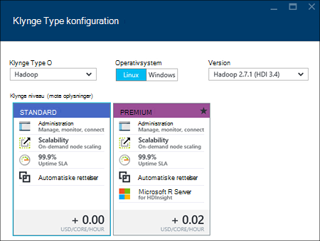

<properties
    pageTitle="Oprette Hadoop, HBase, Storm eller knallertmotor klynger på Linux i HDInsight ved hjælp af portalen | Microsoft Azure"
    description="Lær at oprette Hadoop, HBase, Storm eller knallertmotor klynger på Linux til HDInsight ved hjælp af en webbrowser og portalen Azure preview."
    services="hdinsight"
    documentationCenter=""
    authors="nitinme"
    manager="jhubbard"
    editor="cgronlun"
    tags="azure-portal"/>

<tags
    ms.service="hdinsight"
    ms.devlang="na"
    ms.topic="article"
    ms.tgt_pltfrm="na"
    ms.workload="big-data"
    ms.date="10/05/2016"
    ms.author="nitinme"/>

#Oprette Linux-baserede klynger i portalen til Azure HDInsight

[AZURE.INCLUDE [selector](../../includes/hdinsight-selector-create-clusters.md)]

Portalen Azure er en webbaseret administrationsværktøjer til tjenester og ressourcer, der er hostet i Microsoft Azure skyen. I denne artikel lærer du, hvordan du opretter Linux-baserede HDInsight klynger ved hjælp af portalen.

## Forudsætninger

[AZURE.INCLUDE [delete-cluster-warning](../../includes/hdinsight-delete-cluster-warning.md)]

- **En Azure-abonnement**. Se [få Azure gratis prøveversion](https://azure.microsoft.com/documentation/videos/get-azure-free-trial-for-testing-hadoop-in-hdinsight/).
- __En moderne webbrowser__. Portalen Azure bruger HTML5 og Javascript og fungerer muligvis ikke korrekt i ældre webbrowsere.

### Krav til Access

[AZURE.INCLUDE [access-control](../../includes/hdinsight-access-control-requirements.md)]

##Oprette klynger

Portalen Azure fremviser de fleste klynge egenskaber. Ved hjælp af Azure ressourcestyring skabelon, kan du skjule mange detaljer. Yderligere oplysninger finder du se [oprette Linux-baserede Hadoop klynger i HDInsight ved hjælp af Azure ressourcestyring skabeloner](hdinsight-hadoop-create-linux-clusters-arm-templates.md).

1. Log på [Azure-portalen](https://portal.azure.com).

2. Klik på **Ny**, klik på **Data Analytics**, og klik derefter på **HDInsight**.

    ![Oprette en ny klynge i portalen Azure] (./media/hdinsight-hadoop-create-linux-cluster-portal/HDI.CreateCluster.1.png "Oprette en ny klynge i portalen Azure")
3. Angiv **Klyngenavn**: dette navn skal være globalt entydig.
4. Klik på **Vælg klynge Type**, og vælg derefter:

    - **Klynge Type**: Hvis du ikke ved, hvad du skal vælge, vælge **Hadoop**. Det er den mest populære klynge type.

        > [AZURE.IMPORTANT] HDInsight klynger kommer i en række forskellige typer, der svarer til det arbejdsbelastningen eller den teknologi, der er tilpasset klyngen til. Der er ingen understøttet metode til at oprette en klynge, der kombinerer flere typer, som Storm og HBase på en klynge. 

    - **Operativsystem**: Vælg **Linux**.
    - **Version**: bruge standardversionen, hvis du ikke ved, hvad du skal vælge. Du kan finde yderligere oplysninger finder [HDInsight klynge versioner](hdinsight-component-versioning.md).
    - **Klynge niveau**: Azure HDInsight giver stor data skyen tilbud i to kategorier: Standard niveau og Premium niveau. Du kan finde flere oplysninger [klynge niveauer](hdinsight-hadoop-provision-linux-clusters.md#cluster-tiers).
    
    

4. Klik på **abonnement** for at markere det Azure abonnement, der skal bruges til klyngen.

5. Klik på **Ressourcegruppe** for at vælge en eksisterende ressourcegruppe, eller klik på **Ny** for at oprette en ny ressourcegruppe

    > [AZURE.NOTE] Hvis det er tilgængeligt som standard dette element til en af dine eksisterende ressourcegrupper.

6. Klik på **legitimationsoplysninger** og derefter angive en adgangskode for admin-brugeren. Du skal også angive en **SSH brugernavn** og en **adgangskode** eller **Offentlig nøgle**, der bruges til at godkende brugeren SSH. Ved hjælp af en offentlig nøgle, er den anbefalede måde. Klik på **Vælg** nederst til at gemme legitimationsoplysninger konfiguration.

    ![Angiv klynge legitimationsoplysninger] (./media/hdinsight-hadoop-create-linux-cluster-portal/HDI.CreateCluster.3.png "Angiv klynge legitimationsoplysninger")

    Du kan finde flere oplysninger om brug af SSH med HDInsight du se en af følgende artikler:

    * [Bruge SSH med Linux-baserede Hadoop på HDInsight fra Linux, Unix eller OS X](hdinsight-hadoop-linux-use-ssh-unix.md)
    * [Bruge SSH med Linux-baserede Hadoop på HDInsight fra Windows](hdinsight-hadoop-linux-use-ssh-windows.md)

7. Klik på **Datakilden** for at vælge en eksisterende datakilde for-klyngen, eller Opret en ny.

    ![Datakilde blade] (./media/hdinsight-hadoop-create-linux-cluster-portal/HDI.CreateCluster.4.png "Angiv datakilde konfiguration")

    I øjeblikket kan du vælge en Azure-lager konto som datakilde til en HDInsight klynge. Brug følgende fremgangsmåde til at forstå posterne på bladet **Datakilde** .

    - **Markering metode**: Angiv denne indstilling til **fra alle abonnementer** for at aktivere gennemsyn af lagerplads konti fra alle dine abonnementer. Angive dette **Hurtigtast** , hvis du vil angive **Lagerplads navn** og **Hurtigtast** til en eksisterende konto lagerplads.

    - **Vælg lagerplads konto / nye**: Klik på **Vælg lagerplads konto** til at gennemse, og vælg en eksisterende lagerplads-konto, du vil knytte til klyngen. Eller klik på **Ny** for at oprette en ny lagerplads-konto. Brug det felt, der vises, for at angive navnet på kontoen, lagerplads. Hvis navnet er tilgængelig, vises en grøn markering.

    - **Vælg standard objektbeholder**: Brug dette til at skrive navnet på objektbeholderen standard skal bruges til klyngen. Selvom du kan angive et navn her, anbefaler vi, at du med det samme navn som klyngen, så du let kan genkende, bruges objektbeholderen for denne specifikke klynge.

    - **Placering**: geografisk område, der er i kontoen lagerplads eller oprettes i.

        > [AZURE.IMPORTANT] Vælge en placering til standard-datakilde kan også angive placeringen af HDInsight klyngen. Datakilden klynge og standard skal være placeret i samme region.
        
    - **Klynge AAD identitet**: ved at konfigurere den, du gør klyngen tilgængeligt for de Azure Data sø butikker, der er baseret på AAD konfigurationen.

    Klik på **Vælg** for at gemme konfigurationen af datakilden.

8. Klik på **Node priser niveauer** for at få vist oplysninger om de noder, der oprettes for denne klynge. Angiv antallet af knuder, arbejder, som du har brug for klyngen. De estimerede omkostninger for klyngen kan ses i bladet.

    ![Node priser niveauer blade] (./media/hdinsight-hadoop-create-linux-cluster-portal/HDI.CreateCluster.5.png "Angiv antallet af knuder, klynge")
    
    > [AZURE.IMPORTANT] Hvis du planlægger på mere end 32 arbejder noder, enten ved klynge oprettelse eller ved at skalere klyngen efter oprettelse, skal du vælge en hoved node størrelse med mindst 8 kerner og 14GB ram.
    >
    > Se [HDInsight priser](https://azure.microsoft.com/pricing/details/hdinsight/)kan finde flere oplysninger om node størrelser og det tilknyttede omkostninger.

    Klik på **Vælg** for at gemme node priser konfigurationen.

9. Klik på **Valgfri konfiguration** for at vælge den klynge version samt konfigurere andre valgfri indstillinger som deltager i et **Virtuelt netværk**, konfiguration af en **Ekstern Metastore** til at indeholde data for Hive og Oozie, bruge scripthandlinger til at tilpasse en klynge for at installere brugerdefinerede komponenter, eller brug af ekstra lager konti med klyngen.

    * **Virtuelt netværk**: Vælg en Azure virtuelt netværk og undernettet, hvis du vil placere klynge i et virtuelt netværk.  

        ![Virtuel netværk blade] (./media/hdinsight-hadoop-create-linux-cluster-portal/HDI.CreateCluster.6.png "Angiv virtuelt netværk detaljer")

        Se [udvide HDInsight-funktioner ved hjælp af et virtuelt netværk med Azure](hdinsight-extend-hadoop-virtual-network.md)oplysninger om brug af HDInsight med et virtuelt netværk, herunder af specifikke konfigurationskrav til det virtuelle netværk.

    * Klik på **Eksterne Metastores** for at angive SQL-database, du vil bruge til at gemme Hive og Oozie metadata, der er knyttet til klyngen.
    
        > [AZURE.NOTE] Metastore konfiguration er ikke tilgængelig for HBase klynge typer.

        ![Brugerdefineret metastores blade] (./media/hdinsight-hadoop-create-linux-cluster-portal/HDI.CreateCluster.7.png "Angiv eksterne metastores")

        Klik på **Ja**, Vælg en SQL-database, og giv dernæst brugernavn og adgangskode til databasen til **Brug af en eksisterende SQL DB for Hive** metadata. Gentag disse trin, hvis du vil **bruge en eksisterende SQL DB til Oozie metadata**. Klik på **Vælg** , indtil du er tilbage på bladet **Valgfri konfiguration** .

        >[AZURE.NOTE] Azure SQL-database, der bruges til metastore skal tillade forbindelse til andre Azure tjenesterne, herunder Azure HDInsight. Klik på navnet på serveren dashboardet Azure SQL-database til højre. Dette er den server, der kører SQL database-forekomsten. Når du er i visningen server, skal du klikke på **Konfigurer**, og klik derefter på **Ja**for **Azure Services**, og klik derefter på **Gem**.

        &nbsp;

        > [AZURE.IMPORTANT] Når du opretter en metastore, Brug ikke et databasenavn, der indeholder stiplet eller bindestreger, da dette kan medføre, at oprettelsen af klynge mislykkes.

    * **Scripthandlinger** Hvis du vil bruge et brugerdefineret script til at tilpasse en klynge, som klyngen der oprettes. Du kan finde flere oplysninger om scripthandlinger, [tilpasse HDInsight klynger ved hjælp af Script handlingen](hdinsight-hadoop-customize-cluster-linux.md). Give oplysninger på bladet scripthandlinger som vist i skærmbilledet.

        ![Script handling blade] (./media/hdinsight-hadoop-create-linux-cluster-portal/HDI.CreateCluster.8.png "Angiv scripthandling")

    * Klik på **Sammenkædet lagerplads konti** for at angive yderligere lagerplads konti, for at knytte til klyngen. Klik på **Tilføj en lagerplads nøgle**, og vælg en eksisterende konto lagerplads eller Opret en ny konto, i bladet **Azure lagerplads taster** .

        ![Ekstra lagerplads blade] (./media/hdinsight-hadoop-create-linux-cluster-portal/HDI.CreateCluster.9.png "Angiv ekstra lagerplads konti")

        Du kan også tilføje yderligere lagerplads konti, når en klynge er blevet oprettet.  Se [tilpasse Linux-baserede HDInsight klynger ved hjælp af Script handlingen](hdinsight-hadoop-customize-cluster-linux.md).

        Klik på **Vælg** , indtil du er tilbage på den **nye HDInsight klynge** blade.
        
        Ud over Blob storage-konto, kan du også sammenkæde Azure Data sø butikker. Konfigurationen kan være ved at konfigurere AAD fra datakilde, hvor du har konfigureret lagerplads standardkonto og standard beholder.

10. Kontrollér, at **Fastgør til Startboard** er markeret, og klik derefter på **Opret**bladet **Ny HDInsight klynge** . Dette opretter klyngen og føje et felt til det til Startboard af din Azure portal. Ikonet indikerer, at klyngen er klargøring, og ændres for at få vist ikonet HDInsight, når klargøring er afsluttet.

  	| Mens klargøring | Klargøring af fuldført |
  	| ------------------ | --------------------- |
  	|  |  |

    > [AZURE.NOTE] Det kan tage lidt tid for klynge skal oprettes, normalt omkring 15 minutter. Brug feltet på Startboard eller posten **beskeder** til venstre på siden til at se, om klargøring processen.

11. Når processen til oprettelse af er fuldført, skal du klikke på feltet for klynge fra Startboard til Start bladet klynge. Bladet klynge indeholder vigtige oplysninger om klynge som navnet ressourcegruppen den hører til placeringen, og operativsystemet, URL-adressen til klynge dashboard osv.

    ![Klynge blade] (./media/hdinsight-hadoop-create-linux-cluster-portal/HDI.Cluster.Blade.png "Klynge egenskaber")

    Brug følgende fremgangsmåde til at forstå ikonerne øverst på denne blade og i afsnittet **Essentials** :

    * **Indstillinger** og **Alle indstillinger**: Viser bladet **Indstillinger** for klynge, hvor du kan få adgang til detaljerede konfigurationsoplysninger for-klyngen.

    * **Dashboard**, **Klynge Dashboard**og **URL-adresse**: Dette er alle metoder til at få adgang til dashboardet klynge, som er en webportalen for at køre job på klyngen.

    * **Secure Shell**: oplysninger, der skal bruges til at få adgang til den klynge ved hjælp af SSH.

    * **Slette**: Sletter HDInsight klynge.

    * **Hurtig start** (): Viser oplysninger, der hjælper dig med at komme i gang ved hjælp af HDInsight.

    * **Brugere** (): gør det muligt at angive tilladelser for _portalen administration_ af denne klynge for andre brugere på dit Azure-abonnement.

        > [AZURE.IMPORTANT] Denne _kun_ påvirker adgang og tilladelser til denne klynge i Azure-portalen, og har ingen indflydelse på hvem der kan oprette forbindelse til eller sende job til HDInsight klynge.

    * **Mærker** (): mærker gør det muligt at angive nøgle/værdi-par til at definere en brugerdefineret taksonomi for dine tjenester til skyen. For eksempel kan du oprette en nøgle med navnet __projekt__og derefter bruge en fælles værdi for alle tjenester, der er knyttet til et bestemt projekt.

##Tilpasse klynger

- Se [tilpasse HDInsight klynger ved hjælp af Bootstrap](hdinsight-hadoop-customize-cluster-bootstrap.md).
- Se [tilpasse Linux-baserede HDInsight klynger ved hjælp af Script handlingen](hdinsight-hadoop-customize-cluster-linux.md).

##Slette klyngen

[AZURE.INCLUDE [delete-cluster-warning](../../includes/hdinsight-delete-cluster-warning.md)]

##Næste trin

Nu, hvor du har oprettet en HDInsight klynge, kan du bruge følgende til at få mere for at vide om at arbejde med din klynge:

###Hadoop klynger

* [Bruge Hive med HDInsight](hdinsight-use-hive.md)
* [Brug gris med HDInsight](hdinsight-use-pig.md)
* [Bruge MapReduce med HDInsight](hdinsight-use-mapreduce.md)

###HBase klynger

* [Komme i gang med HBase på HDInsight](hdinsight-hbase-tutorial-get-started-linux.md)
* [Udvikle Java-programmer til HBase på HDInsight](hdinsight-hbase-build-java-maven-linux.md)

###Storm klynger

* [Udvikle Java topologier for Storm på HDInsight](hdinsight-storm-develop-java-topology.md)
* [Bruge Python komponenter i Storm på HDInsight](hdinsight-storm-develop-python-topology.md)
* [Installere og overvåge topologier med Storm på HDInsight](hdinsight-storm-deploy-monitor-topology-linux.md)

###Knallertmotor klynger

* [Oprette en enkeltstående program, ved hjælp af Scala](hdinsight-apache-spark-create-standalone-application.md)
* [Køre job fra en fjernplacering på en knallertmotor klynge, ved hjælp af Livius](hdinsight-apache-spark-livy-rest-interface.md)
* [Knallertmotor med BI: analyse af interaktive data ved hjælp af knallertmotor i HDInsight med BI-værktøjer](hdinsight-apache-spark-use-bi-tools.md)
* [Knallertmotor med Machine Learning: Brug knallertmotor i HDInsight til at forudsige mad undersøgelsesresultaterne](hdinsight-apache-spark-machine-learning-mllib-ipython.md)
* [Knallertmotor Streaming: Brug knallertmotor i HDInsight til udvikling af realtid streaming programmer](hdinsight-apache-spark-eventhub-streaming.md)
