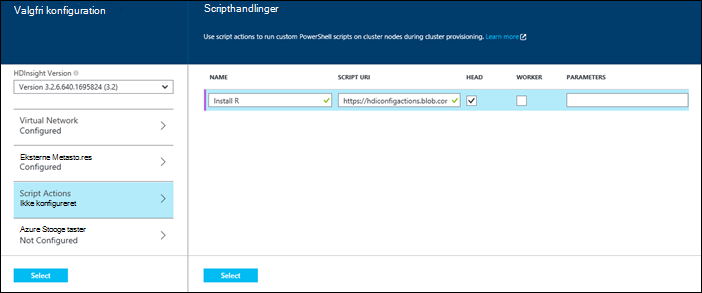
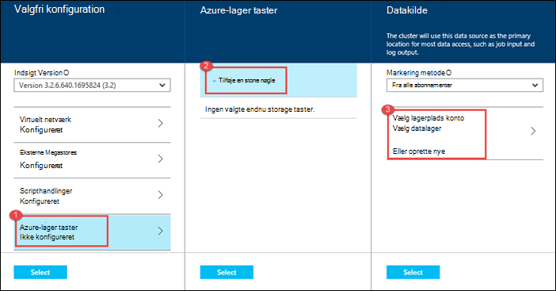

<properties
   pageTitle="Oprette Hadoop klynger i HDInsight | Microsoft Azure"
    description="Lær at oprette klynger til Azure HDInsight ved hjælp af portalen Azure."
   services="hdinsight"
   documentationCenter=""
   tags="azure-portal"
   authors="mumian"
   manager="jhubbard"
   editor="cgronlun"/>

<tags
   ms.service="hdinsight"
   ms.devlang="na"
   ms.topic="article"
   ms.tgt_pltfrm="na"
   ms.workload="big-data"
   ms.date="09/02/2016"
   ms.author="jgao"/>

# Oprette Windows-baseret Hadoop klynger i portalen til Azure HDInsight

[AZURE.INCLUDE [selector](../../includes/hdinsight-selector-create-clusters.md)]

Lær, hvordan du opretter en Hadoop-klynge i portalen til Azure HDInsight. Microsoft [Azure-portalen](../azure-portal-overview.md) er et centralt sted, hvor du kan tildele og administrere dine Azure ressourcer. Azure-portalen er et af de værktøjer, du kan bruge til at oprette enten Linux-baserede eller Windows-baseret Hadoop klynge i HDInsight. Andre klynge oprettelse af værktøjer og funktioner, klik på fanen Vælg øverst på denne side eller se [metoder til oprettelse af klynge](hdinsight-provision-clusters.md#cluster-creation-methods).

##Forudsætninger for:

[AZURE.INCLUDE [delete-cluster-warning](../../includes/hdinsight-delete-cluster-warning.md)]

Før du begynder vejledningen i denne artikel, skal du have følgende:

- Et Azure-abonnement. Se [få Azure gratis prøveversion](https://azure.microsoft.com/documentation/videos/get-azure-free-trial-for-testing-hadoop-in-hdinsight/).

### Krav til Access

[AZURE.INCLUDE [access-control](../../includes/hdinsight-access-control-requirements.md)]

## Oprette klynger

**Oprette en HDInsight klynge**

1. Log på [Azure-portalen](https://portal.azure.com).
2. Klik på **Ny**, klik på **Data Analytics**, og klik derefter på **HDInsight**.

    ![Oprette en ny klynge i portalen Azure] (./media/hdinsight-provision-clusters/HDI.CreateCluster.1.png "Oprette en ny klynge i portalen Azure")

3. Skriv eller Vælg følgende værdier:

    * **Klyngenavn**: Skriv et navn til klyngen. En grøn markering vises ved siden af klyngenavnet, hvis navnet er tilgængelig.

    * **Klynge Type**: Vælg **Hadoop**. Andre indstillinger inclue **HBase**, **Storm**og **gnister**.

        > [AZURE.IMPORTANT] HDInsight klynger kommer i en række forskellige typer, der svarer til det arbejdsbelastningen eller den teknologi, der er tilpasset klyngen til. Der er ingen understøttet metode til at oprette en klynge, der kombinerer flere typer, som Storm og HBase på en klynge.

    * **Klynge operativsystem**: Vælg **Windows**. For at oprette en Linux-base klynge skal du vælge **Linux**.
    * **Version**: se [HDInsight versioner](hdinsight-component-versioning.md).
    * **Abonnement**: Vælg det Azure abonnement, der skal bruges til at oprette denne klynge.
    * **Ressourcegruppe**: Vælg en eksisterende eller oprette en ny ressourcegruppe. Hvis det er tilgængeligt som standard dette element til en af dine eksisterende ressourcegrupper.
    * **Legitimationsoplysninger**: Konfigurer brugernavnet og adgangskoden til brugerens Hadoop (HTTP bruger). Hvis du aktiverer Fjernskrivebord for-klyngen, skal du konfigurere remote desktop brugeren brugernavn og adgangskode og en konto udløbsdato. Klik på **Vælg** nederst til at gemme ændringerne.

        ![Angiv klynge legitimationsoplysninger] (./media/hdinsight-provision-clusters/HDI.CreateCluster.3.png "Angiv klynge legitimationsoplysninger")

    * **Datakilde**: oprette en ny eller vælge en eksisterende Azure-lager konto skal bruges som standard-filsystemet for-klyngen.

        ![Datakilde blade] (./media/hdinsight-provision-clusters/HDI.CreateCluster.4.png "Angiv datakilde konfiguration")

        * **Markering metode**: Angiv denne indstilling til **fra alle abonnementer** for at aktivere gennemsyn af lagerplads konti fra alle dine abonnementer. Angive dette **Hurtigtast** , hvis du vil angive **Lagerplads navn** og **Hurtigtast** til en eksisterende konto lagerplads.
        * **Vælg lagerplads konto / Opret et nyt**: Klik på **Vælg lagerplads konto** til at gennemse, og vælg en eksisterende lagerplads-konto, du vil knytte til klyngen. Eller klik på **Opret ny** for at oprette en ny lagerplads-konto. Brug det felt, der vises, for at angive navnet på kontoen, lagerplads. Hvis navnet er tilgængelig, vises en grøn markering.
        * **Vælg standard objektbeholder**: Brug dette til at skrive navnet på objektbeholderen standard skal bruges til klyngen. Selvom du kan angive et navn her, anbefaler vi, at du med det samme navn som klyngen, så du let kan genkende, bruges objektbeholderen for denne specifikke klynge.
        * **Placering**: geografisk område, der er i kontoen lagerplads eller oprettes i. Denne placering bestemmer den klynge placering.  Klyngen og dens lagerplads standardkonto skal samtidig Find i den samme Azure datacenter.
    
    * **Node priser niveauer**: angive antallet af knuder, arbejder, som du har brug for klyngen. De estimerede omkostninger for klyngen kan ses i bladet.
  

        ![Node priser niveauer blade] (./media/hdinsight-provision-clusters/HDI.CreateCluster.5.png "Angiv antallet af knuder, klynge")

    * **Valgfri konfiguration** for at vælge den klynge version samt konfigurere andre valgfri indstillinger som deltager i et **Virtuelt netværk**, konfiguration af en **Ekstern Metastore** til at indeholde data for Hive og Oozie, bruge scripthandlinger til at tilpasse en klynge for at installere brugerdefinerede komponenter, eller brug ekstra lagerplads konti med klyngen.

    * **HDInsight Version**: Vælg den version, du vil bruge til klyngen. Du kan finde yderligere oplysninger finder [HDInsight klynge versioner](hdinsight-component-versioning.md).
    * **Virtuelt netværk**: Vælg en Azure virtuelt netværk og undernettet, hvis du vil placere klynge i et virtuelt netværk.  

        ![Virtuel netværk blade] (./media/hdinsight-provision-clusters/HDI.CreateCluster.6.png "Angiv virtuelt netværk detaljer")

        Du kan finde oplysninger om brug af HDInsight med et virtuelt netværk, herunder af specifikke konfigurationskrav til det virtuelle netværk og [udvide HDInsight capbilities ved hjælp af et virtuelt Azure-netværk](hdinsight-extend-hadoop-virtual-network.md).
  

        
    * **Eksterne Metastores**: angive en Azure SQL-database for at gemme Hive og Oozie metadata, der er knyttet til klyngen.
 
        > [AZURE.NOTE] Metastore konfiguration er ikke tilgængelig for HBase klynge typer.

    ![Brugerdefineret metastores blade] (./media/hdinsight-provision-clusters/HDI.CreateCluster.7.png "Angiv eksterne metastores")

    Klik på **Ja**, Vælg en SQL-database, og giv dernæst brugernavn og adgangskode til databasen til **Brug af en eksisterende SQL DB for Hive** metadata. Gentag disse trin, hvis du vil **bruge en eksisterende SQL DB til Oozie metadata**. Klik på **Vælg** , indtil du er tilbage på bladet **Valgfri konfiguration** .

    >[AZURE.NOTE] Azure SQL-database, der bruges til metastore skal tillade forbindelse til andre Azure tjenesterne, herunder Azure HDInsight. Klik på navnet på serveren dashboardet Azure SQL-database til højre. Dette er den server, der kører SQL database-forekomsten. Når du er i visningen server, skal du klikke på **Konfigurer**, og klik derefter på **Ja**for **Azure Services**, og klik derefter på **Gem**.

            &nbsp;

            > [AZURE.IMPORTANT] Når du opretter en metastore, Brug ikke et databasenavn, der indeholder stiplet eller bindestreger, da dette kan medføre, at oprettelsen af klynge mislykkes.
        
        * **Script Actions** if you want to use a custom script to customize a cluster, as the cluster is being created. For more information about script actions, see [Customize HDInsight clusters using Script Action](hdinsight-hadoop-customize-cluster.md). On the Script Actions blade provide the details as shown in the screen capture.
    

            

        * **Azure Storage Keys**: Specify additional storage accounts to associate with the cluster. In the **Azure Storage Keys** blade, click **Add a storage key**, and then select an existing storage account or create a new account.
    

            

4. Klik på **Opret**. Markere **Fastgør til Startboard** føjer et felt for klynge til Startboard af din Portal. Ikonet indikerer, at klyngen oprettes, og vil ændre for at få vist ikonet HDInsight, når oprettelse af er afsluttet.
    
    Det kan tage lidt tid for klynge skal oprettes, normalt omkring 15 minutter. Brug feltet på Startboard eller posten **beskeder** til venstre på siden til at se, om klargøring processen.
    

5. Når oprettelsen er fuldført, skal du klikke på feltet for klynge fra Startboard til Start bladet klynge. Bladet klynge indeholder vigtige oplysninger om klynge som navnet ressourcegruppen den hører til placeringen, og operativsystemet, URL-adressen til klynge dashboard osv.

    ![Klynge blade] (./media/hdinsight-provision-clusters/HDI.Cluster.Blade.png "Klynge egenskaber")

    Brug følgende fremgangsmåde til at forstå ikonerne øverst på denne blade og i afsnittet **Essentials** :

    * **Indstillinger** og **Alle indstillinger**: Viser bladet **Indstillinger** for klynge, hvor du kan få adgang til detaljerede konfigurationsoplysninger for-klyngen.
    * **Dashboard**, **Klynge Dashboard**og **URL-adresse**: Dette er alle metoder til at få adgang til dashboardet klynge, som er en webportalen for at køre job på klyngen.
    * **Fjernskrivebord**: gør det muligt at aktivere/deaktivere Fjernskrivebord på klyngenoderne.
    * **Skala klynge**: gør det muligt at ændre antallet af knuder arbejder for denne klynge.
    * **Slette**: Sletter HDInsight klynge.
    * **Hurtig start** (): Viser oplysninger, der hjælper dig med at komme i gang ved hjælp af HDInsight.
    * **Brugere** (): gør det muligt at angive tilladelser for _portalen administration_ af denne klynge for andre brugere på dit Azure-abonnement.
    

        > [AZURE.IMPORTANT] Denne _kun_ påvirker adgang og tilladelser til denne klynge i portalen, og har ingen indflydelse på hvem der kan oprette forbindelse til eller sende job til HDInsight klynge.
        
    * **Mærker** (): mærker gør det muligt at angive nøgle/værdi-par til at definere en brugerdefineret taksonomi for dine tjenester til skyen. For eksempel kan du oprette en nøgle med navnet __projekt__og derefter bruge en fælles værdi for alle tjenester, der er knyttet til et bestemt projekt.

##Tilpasse klynger

- Se [tilpasse HDInsight klynger ved hjælp af Bootstrap](hdinsight-hadoop-customize-cluster-bootstrap.md).
- Se [tilpasse Windows-baseret HDInsight klynger ved hjælp af Script handlingen](hdinsight-hadoop-customize-cluster.md).

##Næste trin
Du har lært flere måder at oprette en HDInsight klynge i denne artikel. Hvis du vil vide mere, skal du se følgende artikler:

* [Introduktion til Azure HDInsight](hdinsight-hadoop-linux-tutorial-get-started.md) - Lær, hvordan du begynde at arbejde med din HDInsight klynge
* [Sende Hadoop job fra et program](hdinsight-submit-hadoop-jobs-programmatically.md) – Lær, hvordan du automatisk sende job til HDInsight
* [Administrere Hadoop klynger i HDInsight ved hjælp af portalen Azure](hdinsight-administer-use-management-portal.md)

