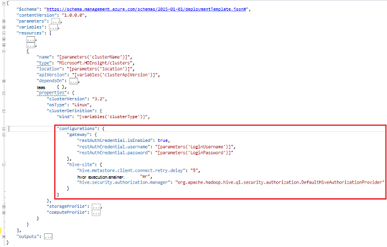

<properties
    pageTitle="Tilpasse HDInsight klynger ved hjælp af bootstrap | Microsoft Azure"
    description="Lær, hvordan du tilpasser HDInsight klynger ved hjælp af bootstrap."
    services="hdinsight"
    documentationCenter=""
    authors="mumian"
    manager="jhubbard"
    editor="cgronlun"
    tags="azure-portal"/>

<tags
    ms.service="hdinsight"
    ms.workload="big-data"
    ms.tgt_pltfrm="na"
    ms.devlang="na"
    ms.topic="article"
    ms.date="09/02/2016"
    ms.author="jgao"/>

# Tilpasse HDInsight klynger ved hjælp af Bootstrap

Nogle gange, vil du konfigurere konfigurationsfilerne, omfatter:

- clusterIdentity.xml
- Core-site.xml
- gateway.XML
- hbase env.xml
- hbase site.xml
- hdfs site.xml
- hive-env.xml
- hive-site.xml
- mapred-websted
- oozie site.xml
- oozie env.xml
- storm site.xml
- tez site.xml
- webhcat site.xml
- Garn site.xml

Klynger kan ikke bevare ændringerne på grund af imaging igen. Se [Rolle forekomst genstarter forfaldne til OS opgraderinger](http://blogs.msdn.com/b/kwill/archive/2012/09/19/role-instance-restarts-due-to-os-upgrades.aspx)kan finde flere oplysninger om imaging igen. Hvis du vil bevare ændringer via de klynger levetid, kan du bruge HDInsight klynge tilpasning under oprettelsesprocessen. Dette er den anbefalede måde at ændre konfigurationer af en klynge og fastholdes på tværs af disse Azure reimage genstart Genstart begivenheder. Disse ændringer i konfigurationen er anvendt før service start, så tjenester ikke behøver skal genstartes. 

Der er 3 metoder til at bruge bootstrap:

- Bruge Azure PowerShell

    [AZURE.INCLUDE [upgrade-powershell](../../includes/hdinsight-use-latest-powershell.md)]
    
- Brug af .NET SDK
- Brug Azure ressourcestyring skabelon

Du kan finde oplysninger om installation af yderligere komponenter på HDInsight klynge under oprettelsestidspunkt, i:

- [Tilpasse HDInsight klynger ved hjælp af Script-handlingen (Linux)](hdinsight-hadoop-customize-cluster-linux.md)
- [Tilpasse HDInsight klynger ved hjælp af Script-handlingen (Windows)](hdinsight-hadoop-customize-cluster.md)

## Bruge Azure PowerShell

Den følgende PowerShell-kode tilpasser en Hive-konfiguration:

    # hive-site.xml configuration
    $hiveConfigValues = @{ "hive.metastore.client.socket.timeout"="90" }
    
    $config = New-AzureRmHDInsightClusterConfig `
        | Set-AzureRmHDInsightDefaultStorage `
            -StorageAccountName "$defaultStorageAccountName.blob.core.windows.net" `
            -StorageAccountKey $defaultStorageAccountKey `
        | Add-AzureRmHDInsightConfigValues `
            -HiveSite $hiveConfigValues 
    
    New-AzureRmHDInsightCluster `
        -ResourceGroupName $existingResourceGroupName `
        -ClusterName $clusterName `
        -Location $location `
        -ClusterSizeInNodes $clusterSizeInNodes `
        -ClusterType Hadoop `
        -OSType Windows `
        -Version "3.2" `
        -HttpCredential $httpCredential `
        -Config $config 

En komplet arbejde PowerShell-script kan findes i [Tillæg A](#hdinsight-hadoop-customize-cluster-bootstrap.md/appx-a:-powershell-sample).

**Sådan kontrolleres ændringen:**

1. Log [Azure-portalen](https://portal.azure.com).
2. Klik på **Gennemse**i den venstre rude, og klik derefter på **HDInsight klynger**.
3. Klik på den klynge, du lige har oprettet ved hjælp af PowerShell-script.
4. Klik på **Dashboard** fra øverst del af bladet for at åbne Ambari UI.
5. Klik på **Hive** fra menuen til venstre.
6. Klik på **HiveServer2** fra **Oversigt**.
7. Klik på fanen **konfigurationer** .
8. Klik på **Hive** fra menuen til venstre.
9. Klik på fanen **Avanceret** .
10. Rul ned, og udvid derefter **Avancerede hive-websted**.
11. Se efter **hive.metastore.client.socket.timeout** i sektionen.

Nogle flere eksempler om tilpasning af andre konfigurationsfiler:

    # hdfs-site.xml configuration
    $HdfsConfigValues = @{ "dfs.blocksize"="64m" } #default is 128MB in HDI 3.0 and 256MB in HDI 2.1

    # core-site.xml configuration
    $CoreConfigValues = @{ "ipc.client.connect.max.retries"="60" } #default 50

    # mapred-site.xml configuration
    $MapRedConfigValues = @{ "mapreduce.task.timeout"="1200000" } #default 600000

    # oozie-site.xml configuration
    $OozieConfigValues = @{ "oozie.service.coord.normal.default.timeout"="150" }  # default 120

Yderligere oplysninger finder du under Azim Uddin blog med titlen [oprettelse af tilpasning af HDInsight klynge](http://blogs.msdn.com/b/bigdatasupport/archive/2014/04/15/customizing-hdinsight-cluster-provisioning-via-powershell-and-net-sdk.aspx).

## Brug af .NET SDK

Se [oprette Linux-baserede klynger i HDInsight ved hjælp af .NET SDK](hdinsight-hadoop-create-linux-clusters-dotnet-sdk.md#use-bootstrap).

## Brug ressourcestyring skabelon

Du kan bruge bootstrap i ressourcestyring skabelon:

    "configurations": {
        …
        "hive-site": {
            "hive.metastore.client.connect.retry.delay": "5",
            "hive.execution.engine": "mr",
            "hive.security.authorization.manager": "org.apache.hadoop.hive.ql.security.authorization.DefaultHiveAuthorizationProvider"
        }
    }

## Se også

- [Oprette Hadoop klynger i HDInsight] [ hdinsight-provision-cluster] indeholder instruktioner om, hvordan du opretter en HDInsight klynge ved brug af andre brugerdefinerede indstillinger.
- [Udvikle scripthandling scripts til HDInsight][hdinsight-write-script]
- [Installere og bruge knallertmotor på HDInsight klynger][hdinsight-install-spark]
- [Installere og bruge R på HDInsight klynger][hdinsight-install-r]
- [Installation og brug Solr på HDInsight klynger](hdinsight-hadoop-solr-install.md).
- [Installation og brug Giraph på HDInsight klynger](hdinsight-hadoop-giraph-install.md).

[hdinsight-install-spark]: hdinsight-hadoop-spark-install.md
[hdinsight-install-r]: hdinsight-hadoop-r-scripts.md
[hdinsight-write-script]: hdinsight-hadoop-script-actions.md
[hdinsight-provision-cluster]: hdinsight-provision-clusters.md
[powershell-install-configure]: powershell-install-configure.md

[img-hdi-cluster-states]: ./media/hdinsight-hadoop-customize-cluster/HDI-Cluster-state.png "Faser under oprettelse af klynge"

## Eksempel på Appx A: PowerShell

Denne PowerShell-script opretter en HDInsight klynge og tilpasser en Hive indstilling:

    ####################################
    # Set these variables
    ####################################
    #region - used for creating Azure service names
    $nameToken = "<ENTER AN ALIAS>" 
    #endregion

    #region - cluster user accounts
    $httpUserName = "admin"  #HDInsight cluster username
    $httpPassword = "<ENTER A PASSWORD>" #"<Enter a Password>"

    $sshUserName = "sshuser" #HDInsight ssh user name
    $sshPassword = "<ENTER A PASSWORD>" #"<Enter a Password>"
    #endregion

    ####################################
    # Service names and varialbes
    ####################################
    #region - service names
    $namePrefix = $nameToken.ToLower() + (Get-Date -Format "MMdd")

    $resourceGroupName = $namePrefix + "rg"
    $hdinsightClusterName = $namePrefix + "hdi"
    $defaultStorageAccountName = $namePrefix + "store"
    $defaultBlobContainerName = $hdinsightClusterName

    $location = "East US 2"
    #endregion

    # Treat all errors as terminating
    $ErrorActionPreference = "Stop"

    ####################################
    # Connect to Azure
    ####################################
    #region - Connect to Azure subscription
    Write-Host "`nConnecting to your Azure subscription ..." -ForegroundColor Green
    try{Get-AzureRmContext}
    catch{Login-AzureRmAccount}
    #endregion

    #region - Create an HDInsight cluster
    ####################################
    # Create dependent components
    ####################################
    Write-Host "Creating a resource group ..." -ForegroundColor Green
    New-AzureRmResourceGroup `
        -Name  $resourceGroupName `
        -Location $location

    Write-Host "Creating the default storage account and default blob container ..."  -ForegroundColor Green
    New-AzureRmStorageAccount `
        -ResourceGroupName $resourceGroupName `
        -Name $defaultStorageAccountName `
        -Location $location `
        -Type Standard_GRS

    $defaultStorageAccountKey = (Get-AzureRmStorageAccountKey `
                                    -ResourceGroupName $resourceGroupName `
                                    -Name $defaultStorageAccountName)[0].Value
    $defaultStorageContext = New-AzureStorageContext `
                                    -StorageAccountName $defaultStorageAccountName `
                                    -StorageAccountKey $defaultStorageAccountKey
    New-AzureStorageContainer `
        -Name $defaultBlobContainerName `
        -Context $defaultStorageContext #use the cluster name as the container name

    ####################################
    # Create a configuration object
    ####################################
    $hiveConfigValues = @{ "hive.metastore.client.socket.timeout"="90" }
        
    $config = New-AzureRmHDInsightClusterConfig `
        | Set-AzureRmHDInsightDefaultStorage `
            -StorageAccountName "$defaultStorageAccountName.blob.core.windows.net" `
            -StorageAccountKey $defaultStorageAccountKey `
        | Add-AzureRmHDInsightConfigValues `
            -HiveSite $hiveConfigValues 

    ####################################
    # Create an HDInsight cluster
    ####################################
    $httpPW = ConvertTo-SecureString -String $httpPassword -AsPlainText -Force
    $httpCredential = New-Object System.Management.Automation.PSCredential($httpUserName,$httpPW)

    $sshPW = ConvertTo-SecureString -String $sshPassword -AsPlainText -Force
    $sshCredential = New-Object System.Management.Automation.PSCredential($sshUserName,$sshPW)

    New-AzureRmHDInsightCluster `
        -ResourceGroupName $resourceGroupName `
        -ClusterName $hdinsightClusterName `
        -Location $location `
        -ClusterSizeInNodes 1 `
        -ClusterType Hadoop `
        -OSType Linux `
        -Version "3.2" `
        -HttpCredential $httpCredential `
        -SshCredential $sshCredential `
        -Config $config

    ####################################
    # Verify the cluster
    ####################################
    Get-AzureRmHDInsightCluster -ClusterName $hdinsightClusterName

    #endregion
