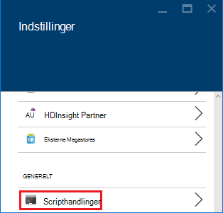

<properties
    pageTitle="Tilpasse HDInsight klynger ved hjælp af scripthandlinger | Microsoft Azure"
    description="Lær, hvordan du føjer brugerdefinerede komponenter til Linux-baserede HDInsight klynger ved hjælp af scripthandlinger. Script handlingerne er fest scripts, som på klyngenoderne og kan bruges til at tilpasse den klynge konfiguration eller flere tjenester og funktioner som Farvetone, Solr eller R."
    services="hdinsight"
    documentationCenter=""
    authors="Blackmist"
    manager="jhubbard"
    editor="cgronlun"
    tags="azure-portal"/>

<tags
    ms.service="hdinsight"
    ms.workload="big-data"
    ms.tgt_pltfrm="na"
    ms.devlang="na"
    ms.topic="article"
    ms.date="09/06/2016"
    ms.author="larryfr"/>

# Tilpasse Linux-baserede HDInsight klynger ved hjælp af scripthandling

HDInsight indeholder en indstilling for søgekonfiguration kaldet **Scripthandling** , der aktiverer brugerdefinerede scripts, tilpasses klyngen. Disse scripts kan bruges under oprettelse af klynge eller på en allerede kører klynge, og der bruges til at installere yderligere komponenter eller ændre indstillinger for søgekonfiguration.

> [AZURE.NOTE] Muligheden for at bruge scripthandlinger på en allerede kører klynge er kun tilgængelig for Linux-baserede HDInsight klynger. Du kan finde oplysninger om brug af scripthandlinger med Windows-baserede klynger [tilpasse HDInsight klynger ved hjælp af Script-handlingen (Windows)](hdinsight-hadoop-customize-cluster.md).

Scripthandlinger kan også publiceres til Azure Marketplace som et HDInsight-program. Nogle af eksemplerne i dette dokument viser, hvordan du kan installere et HDInsight-program ved hjælp af handlingen scriptkommandoer fra PowerShell og .NET SDK. Du kan finde flere oplysninger om HDInsight programmer, [publicere HDInsight programmer til Azure Marketplace](hdinsight-apps-publish-applications.md). 

## Forstå scripthandlinger

En Script-handling er blot et script, du angiver en URL-adressen til og parametre for, og derefter kørte på noderne HDInsight klynge fest. Følgende er egenskaber og funktioner i scripthandlinger.

* Skal være gemt på en URI, der er tilgængeligt fra HDInsight klynge. Følgende er mulige lagerplads placeringer:

    * En blob storage-konto, som enten er den primære eller eventuelle yderligere lagerplads konto for HDInsight-klyngen. Da HDInsight er tildelt adgang til begge af disse kontotyper lagerplads under oprettelse af klynge, er disse en måde at bruge en ikke-offentlige scripthandling.
    
    * En offentligt læsbare URI som en Azure Blob, GitHub, OneDrive, Dropbox osv.
    
    Eksempler på URI for scripts, der er gemt i blob objektbeholder (offentligt læsbare), i afsnittet [eksempel script handling scripts](#example-script-action-scripts) .

* Kan være begrænset til at __køre på bestemte node__, for eksempel hoved noder eller arbejder noder.

    > [AZURE.NOTE] Når anvendes sammen med HDInsight Premium, kan du angive, at scriptet skal bruges på noden kant.

* Kan være __bevaret__ eller __ad hoc__.

    __Persisted__ scripts er scripts, der er anvendt på arbejder noder og bliver automatisk kørte på nye noder oprettes, når skalering af en klynge.

    Et permanente script kan også anvende ændringer på en anden nodetype som en hoved node, men fra et funktionalitet perspektiv er den eneste grund til at bevare et script, så gælder for nye arbejder noder, der oprettes, når en klynge skaleres.

    > [AZURE.IMPORTANT] Permanente scripthandlinger skal have et entydigt navn.

    __Ad hoc-__ scripts bevares ikke; men du kan efterfølgende hæve et ad hoc-script til et permanente script eller sænke et permanente script til et ad hoc-script.

    > [AZURE.IMPORTANT] Scripthandlinger, der bruges under oprettelse af klynge bevares automatisk.
    >
    > Scripts, ikke som er fejl permanent, selvom du specifikt angiver, at de skal være.

* Kan acceptere __parametre__ , der bruges af scriptet under kørsel af.

* Er kørte med __root niveau rettigheder__ på klyngenoderne.

* Kan bruges via __Azure-portalen__, __Azure PowerShell__, __Azure CLI__eller __HDInsight.NET SDK__

    [AZURE.INCLUDE [upgrade-powershell](../../includes/hdinsight-use-latest-powershell-cli-and-dotnet-sdk.md)]

For at hjælpe med at forstå, hvilke scripts blevet anvendt på en klynge og ved fastlæggelse af ID-scripts til reklame eller demotion, klyngen gemmer en oversigt over alle scripts, der er blevet løb.

> [AZURE.IMPORTANT] Der findes ingen automatisk måde at fortryde ændringer af en scripthandling. Hvis du vil ændre effekterne i et script, skal du forstå, hvilke ændringer foretaget og manuelt tilbageføre dem (eller angive et scripthandling, der vender dem.)

### Scripthandling i oprettelsen af klynge

Scripthandlinger, der bruges under oprettelse af klynge er en smule anderledes end script handlinger stødte på en eksisterende klynge:

* Scriptet er __automatisk bevaret__.

* __Fejl__ i scriptet kan medføre, at oprettelsen af klynge mislykkes.

I følgende diagram vises, når Script handlingen er udført under oprettelsen af:

![HDInsight klynge tilpasning og stadier under oprettelse af klynge][img-hdi-cluster-states]

Scriptet er løb, mens HDInsight konfigureres. På dette tidspunkt scriptet er kørte parallelt på alle de angivne noder i klyngen, og er kørte med rod rettigheder på noderne.

> [AZURE.NOTE] Fordi scriptet med rod afdelingsniveau har kørt på klyngenoderne, kan du udføre handlinger som stopper og starter tjenesterne, herunder tjenester, der vedrører Hadoop. Hvis du stopper tjenester, skal du kontrollere, at tjenesten Ambari og andre tjenester, der vedrører Hadoop oppe at køre før scriptet er afsluttet. Disse tjenester er påkrævet til at bestemme tilstand og tilstanden for klyngen korrekt, mens det oprettes.

Under oprettelse af klynge, kan du angive flere scripthandlinger, der aktiveres i den rækkefølge, hvori de blev angivet.

> [AZURE.IMPORTANT] Scripthandlinger skal udføre på 60 minutter, eller de kan timeout. Under klynge klargøringen kørte scriptet sammen med andre installation og konfiguration processer. Konkurrencen for de ressourcer, som CPU klokkeslæt eller netværk båndbredde kan medføre scriptet til at tage længere tid at færdiggøre end i dit udviklingsmiljø.
>
> Hvis du vil minimere tid, tager det at køre scriptet, skal du undgå opgaver som downloade og sammensætning af programmer fra kilde. I stedet allerede samle programmet og gemme den binære fil i Azure Blob-lager, så den kan hurtigt hentes til klyngen.

###Scripthandling på en igangværende klynge

I modsætning til script handlinger bruges under oprettelse af klynge, en fejl i et script stødte på en allerede kører klynge forårsager ikke automatisk klynge for at ændre til en fejltilstand. Når et script er fuldført, skal klyngen gå tilbage til tilstanden "kører".

> [AZURE.IMPORTANT] Det betyder ikke, at din kører klynge er beskyttet mod meddelelser til scripts, som gør forkert ting. Et script kan for eksempel slette filer, der kræves af klynge, ændre konfiguration, så tjenester ikke osv.
>
> Scripts handlinger kører med rod rettigheder, så du skal sikre dig, at du forstår gør et script før du anvender den til din klynge.

Når du anvender et script til en klynge, vil tilstanden klynge fra __kører__ til __accepteret__, derefter __HDInsight konfiguration__, ændre og til sidst igen for at __køre__ til vellykket scripts. Scriptstatus er logget på script handling oversigten, og du kan bruge dette til at afgøre, hvis scriptet vellykkede eller mislykkede. For eksempel på `Get-AzureRmHDInsightScriptActionHistory` PowerShell-cmdlet kan bruges til at få vist status for et script. Det vil returnere oplysninger som følger:

    ScriptExecutionId : 635918532516474303
    StartTime         : 2/23/2016 7:40:55 PM
    EndTime           : 2/23/2016 7:41:05 PM
    Status            : Succeeded

> [AZURE.NOTE] Hvis du har ændret klynge bruger (admin) adgangskode, når klyngen blev oprettet, kan det medføre script handlinger kørte mod denne klynge mislykkes. Hvis du har en hvilken som helst permanente scripthandlinger, target arbejder noder, kan disse mislykkes, når du har tilføjet noder til klynge gennem ændre størrelsen på Handlinger.

## Eksempel på scripthandling scripts

Script handling scripts kan bruges fra portalen Azure, Azure PowerShell, Azure CLI eller HDInsight .NET SDK. HDInsight indeholder scripts for at installere følgende komponenter på HDInsight klynger:

Navn | Script
----- | -----
**Tilføje en konto til Azure-lager** | https://hdiconfigactions.BLOB.Core.Windows.NET/linuxaddstorageaccountv01/Add-Storage-Account-v01.sh. Se [anvende en scripthandling til en igangværende klynge](#apply-a-script-action-to-a-running-cluster).
**Installere farvetone** | https://hdiconfigactions.BLOB.Core.Windows.NET/linuxhueconfigactionv02/Install-Hue-uber-v02.sh. Se [installation og brug farvetone på HDInsight klynger](hdinsight-hadoop-hue-linux.md).
**Installere R** | https://hdiconfigactions.BLOB.Core.Windows.NET/linuxrconfigactionv01/r-Installer-v01.sh. Se [installation og brug R på HDInsight klynger](hdinsight-hadoop-r-scripts-linux.md).
**Installere Solr** | https://hdiconfigactions.BLOB.Core.Windows.NET/linuxsolrconfigactionv01/solr-Installer-v01.sh. Se [installation og brug Solr på HDInsight klynger](hdinsight-hadoop-solr-install-linux.md).
**Installere Giraph** | https://hdiconfigactions.BLOB.Core.Windows.NET/linuxgiraphconfigactionv01/giraph-Installer-v01.sh. Se [installation og brug Giraph på HDInsight klynger](hdinsight-hadoop-giraph-install-linux.md).
| **Foreløbig Indlæs Hive biblioteker** | https://hdiconfigactions.BLOB.Core.Windows.NET/linuxsetupcustomhivelibsv01/Setup-customhivelibs-v01.sh. Se [tilføje Hive biblioteker på HDInsight klynger](hdinsight-hadoop-add-hive-libraries.md) |

## Brug et scripthandling under oprettelse af klynge

Dette afsnit indeholder eksempler på de forskellige måder, du kan bruge scripthandlinger ved oprettelse af en HDInsight klynge - fra Azure-portalen, ved hjælp af en skabelon til Azure Ressourcestyring, ved hjælp af PowerShell CMDlets og ved hjælp af .NET SDK.

### Brug et scripthandling under oprettelse af klynge fra Azure-portalen

1. Begynde at oprette en klynge, som beskrevet på [oprette Hadoop klynger i HDInsight](hdinsight-provision-clusters.md#portal).

2. Under __Valgfri konfiguration__for bladet **Scripthandlinger** skal du klikke på **Tilføj scripthandling** for at vise detaljer om handlingen script, som vist nedenfor:

    

  	| Egenskaben | Værdi |
  	| -------- | ----- |
  	| Navn | Angiv et navn for handlingen script. |
  	| Script URI | Angiv URI til det script, der er aktiveret for at tilpasse klyngen. |
  	| Hoved/arbejder | Angiv noderne (**hoved**, **arbejder**eller **ZooKeeper**) under tilpasning scriptet kører. |
  	| Parametre | Angiv parametrene, hvis det er nødvendigt ved scriptet. |

    Tryk på ENTER for at tilføje mere end én scripthandling for at installere flere komponenter på klyngen.

3. Klik på **Vælg** for at gemme indstillingerne og fortsætte med oprettelse af klynge.

### Brug et scripthandling fra Azure ressourcestyring skabeloner

I dette afsnit skal bruge vi Azure ressourcestyring skabeloner til at oprette en HDInsight klynge og også bruge handlingen script til at installere brugerdefinerede komponenter (R, i dette eksempel) på klyngen. Dette afsnit indeholder et eksempel på en skabelon for at oprette en klynge ved hjælp af scripthandling.

> [AZURE.NOTE] Trinnene i dette afsnit viser oprettelse af en klynge ved hjælp af en scripthandling. Et eksempel på oprettelse af en klynge fra en skabelon, ved hjælp af en HDInsight-program, kan du se [installere brugerdefinerede HDInsight-programmer](hdinsight-apps-install-custom-applications.md).

#### Inden du går i gang

* Finde oplysninger om at konfigurere en arbejdsstation for at køre HDInsight Powershell-cmdlet'er [installere og konfigurere Azure PowerShell](../powershell-install-configure.md).
* Du kan finde oplysninger om, hvordan du kan oprette skabeloner, [redigering Azure ressourcestyring skabeloner](../resource-group-authoring-templates.md).
* Hvis du ikke har benyttet Azure PowerShell med Ressourcestyring, kan du se [Bruge Azure PowerShell med Azure ressourcestyring](../powershell-azure-resource-manager.md).

#### Oprette klynger ved hjælp af scripthandling

1. Kopiere følgende skabelon til en placering på computeren. Denne skabelon installerer Giraph på headnodes samt arbejder noderne i klyngen. Du kan også kontrollere, om skabelonen JSON er gyldig. Indsæt din skabelonindhold i [JSONLint](http://jsonlint.com/), et online JSON validering værktøj.

            {
            "$schema": "http://schema.management.azure.com/schemas/2015-01-01/deploymentTemplate.json#",
            "contentVersion": "1.0.0.0",
            "parameters": {
                "clusterLocation": {
                    "type": "string",
                    "defaultValue": "West US",
                    "allowedValues": [ "West US" ]
                },
                "clusterName": {
                    "type": "string"
                },
                "clusterUserName": {
                    "type": "string",
                    "defaultValue": "admin"
                },
                "clusterUserPassword": {
                    "type": "securestring"
                },
                "sshUserName": {
                    "type": "string",
                    "defaultValue": "username"
                },
                "sshPassword": {
                    "type": "securestring"
                },
                "clusterStorageAccountName": {
                    "type": "string"
                },
                "clusterStorageAccountResourceGroup": {
                    "type": "string"
                },
                "clusterStorageType": {
                    "type": "string",
                    "defaultValue": "Standard_LRS",
                    "allowedValues": [
                        "Standard_LRS",
                        "Standard_GRS",
                        "Standard_ZRS"
                    ]
                },
                "clusterStorageAccountContainer": {
                    "type": "string"
                },
                "clusterHeadNodeCount": {
                    "type": "int",
                    "defaultValue": 1
                },
                "clusterWorkerNodeCount": {
                    "type": "int",
                    "defaultValue": 2
                }
            },
            "variables": {
            },
            "resources": [
                {
                    "name": "[parameters('clusterStorageAccountName')]",
                    "type": "Microsoft.Storage/storageAccounts",
                    "location": "[parameters('clusterLocation')]",
                    "apiVersion": "2015-05-01-preview",
                    "dependsOn": [ ],
                    "tags": { },
                    "properties": {
                        "accountType": "[parameters('clusterStorageType')]"
                    }
                },
                {
                    "name": "[parameters('clusterName')]",
                    "type": "Microsoft.HDInsight/clusters",
                    "location": "[parameters('clusterLocation')]",
                    "apiVersion": "2015-03-01-preview",
                    "dependsOn": [
                        "[concat('Microsoft.Storage/storageAccounts/', parameters('clusterStorageAccountName'))]"
                    ],
                    "tags": { },
                    "properties": {
                        "clusterVersion": "3.2",
                        "osType": "Linux",
                        "clusterDefinition": {
                            "kind": "hadoop",
                            "configurations": {
                                "gateway": {
                                    "restAuthCredential.isEnabled": true,
                                    "restAuthCredential.username": "[parameters('clusterUserName')]",
                                    "restAuthCredential.password": "[parameters('clusterUserPassword')]"
                                }
                            }
                        },
                        "storageProfile": {
                            "storageaccounts": [
                                {
                                    "name": "[concat(parameters('clusterStorageAccountName'),'.blob.core.windows.net')]",
                                    "isDefault": true,
                                    "container": "[parameters('clusterStorageAccountContainer')]",
                                    "key": "[listKeys(resourceId('Microsoft.Storage/storageAccounts', parameters('clusterStorageAccountName')), '2015-05-01-preview').key1]"
                                }
                            ]
                        },
                        "computeProfile": {
                            "roles": [
                                {
                                    "name": "headnode",
                                    "targetInstanceCount": "[parameters('clusterHeadNodeCount')]",
                                    "hardwareProfile": {
                                        "vmSize": "Large"
                                    },
                                    "osProfile": {
                                        "linuxOperatingSystemProfile": {
                                            "username": "[parameters('sshUserName')]",
                                            "password": "[parameters('sshPassword')]"
                                        }
                                    },
                                    "scriptActions": [
                                        {
                                            "name": "installGiraph",
                                            "uri": "https://hdiconfigactions.blob.core.windows.net/linuxgiraphconfigactionv01/giraph-installer-v01.sh",
                                            "parameters": ""
                                        }
                                    ]
                                },
                                {
                                    "name": "workernode",
                                    "targetInstanceCount": "[parameters('clusterWorkerNodeCount')]",
                                    "hardwareProfile": {
                                        "vmSize": "Large"
                                    },
                                    "osProfile": {
                                        "linuxOperatingSystemProfile": {
                                            "username": "[parameters('sshUserName')]",
                                            "password": "[parameters('sshPassword')]"
                                        }
                                    },
                                    "scriptActions": [
                                        {
                                            "name": "installR",
                                            "uri": "https://hdiconfigactions.blob.core.windows.net/linuxrconfigactionv01/r-installer-v01.sh",
                                            "parameters": ""
                                        }
                                    ]
                                }
                            ]
                        }
                    }
                }
            ],
            "outputs": {
                "cluster":{
                    "type" : "object",
                    "value" : "[reference(resourceId('Microsoft.HDInsight/clusters',parameters('clusterName')))]"
                }
            }
        }

2. Start Azure PowerShell og Log på din Azure-konto. Når du har indtastet dine legitimationsoplysninger, returnerer kommandoen oplysninger om din konto.

        Add-AzureRmAccount

        Id                             Type       ...
        --                             ----
        someone@example.com            User       ...

3. Hvis du har flere abonnementer, skal du give det abonnement-id, du vil bruge til installation.

        Select-AzureRmSubscription -SubscriptionID <YourSubscriptionId>

    > [AZURE.NOTE] Du kan bruge `Get-AzureRmSubscription` til at få en liste over alle abonnementer, der er knyttet til din konto, som omfatter abonnementets Id for hver enkelt.

5. Hvis du ikke har en eksisterende ressourcegruppe, kan du oprette en ny ressourcegruppe. Angiv navnet på den ressourcegruppe og placering, du skal bruge til din løsning. Der returneres en oversigt over den nye ressourcegruppe.

        New-AzureRmResourceGroup -Name myresourcegroup -Location "West US"

        ResourceGroupName : myresourcegroup
        Location          : westus
        ProvisioningState : Succeeded
        Tags              :
        Permissions       :
                            Actions  NotActions
                            =======  ==========
                            *
        ResourceId        : /subscriptions/######/resourceGroups/ExampleResourceGroup

6. Kør kommandoen **Ny AzureRmResourceGroupDeployment** for at oprette en ny installation til ressourcegruppen, og Angiv de nødvendige parametre. Parametrene, der omfatter et navn til din installation, navnet på din ressourcegruppe, og den sti eller URL-adressen til den skabelon, du har oprettet. Hvis skabelonen kræver en hvilken som helst parametre, skal du overføre disse parametre samt. I dette tilfælde kræver handlingen script til at installere R på klyngen ikke en hvilken som helst parametre.

        New-AzureRmResourceGroupDeployment -Name mydeployment -ResourceGroupName myresourcegroup -TemplateFile <PathOrLinkToTemplate>

    Du bliver bedt om at angive værdier for de parametre, der er defineret i skabelonen.

7. Når ressourcegruppen er blevet installeret, får du vist en oversigt over installationen.

          DeploymentName    : mydeployment
          ResourceGroupName : myresourcegroup
          ProvisioningState : Succeeded
          Timestamp         : 8/17/2015 7:00:27 PM
          Mode              : Incremental
          ...

8. Hvis din installation mislykkes, kan du bruge følgende cmdletter for at få oplysninger om fejlene i.

        Get-AzureRmResourceGroupDeployment -ResourceGroupName myresourcegroup -ProvisioningState Failed

### Brug et scripthandling under oprettelse af klynge fra Azure PowerShell

I dette afsnit skal bruge vi [Tilføj AzureRmHDInsightScriptAction](https://msdn.microsoft.com/library/mt603527.aspx) cmdlet til at starte scripts ved hjælp af scripthandling til at tilpasse en klynge. Før du fortsætter, Sørg for, at du har installeret og konfigureret Azure PowerShell. Finde oplysninger om at konfigurere en arbejdsstation for at køre HDInsight PowerShell-cmdlet'er [installere og konfigurere Azure PowerShell](../powershell-install-configure.md).

Udfør følgende trin:

1. Åbne konsollen Azure PowerShell og bruge følgende for at logge på abonnementet Azure og erklære nogle PowerShell variabler:

        # LOGIN TO ZURE
        Login-AzureRmAccount

        # PROVIDE VALUES FOR THESE VARIABLES
        $subscriptionId = "<SubscriptionId>"        # ID of the Azure subscription
        $clusterName = "<HDInsightClusterName>"         # HDInsight cluster name
        $storageAccountName = "<StorageAccountName>"    # Azure storage account that hosts the default container
        $storageAccountKey = "<StorageAccountKey>"      # Key for the storage account
        $containerName = $clusterName
        $location = "<MicrosoftDataCenter>"             # Location of the HDInsight cluster. It must be in the same data center as the storage account.
        $clusterNodes = <ClusterSizeInNumbers>          # The number of nodes in the HDInsight cluster.
        $resourceGroupName = "<ResourceGroupName>"      # The resource group that the HDInsight cluster will be created in

2. Angiv konfiguration værdierne (såsom noderne i klyngen) og standard lagerplads, der skal bruges.

        # SPECIFY THE CONFIGURATION OPTIONS
        Select-AzureRmSubscription -SubscriptionId $subscriptionId
        $config = New-AzureRmHDInsightClusterConfig
        $config.DefaultStorageAccountName="$storageAccountName.blob.core.windows.net"
        $config.DefaultStorageAccountKey=$storageAccountKey

3. Bruge **Tilføj AzureRmHDInsightScriptAction** cmdlet til at starte scriptet. I følgende eksempel bruges et script, der installeres Giraph på klyngen:

        # INVOKE THE SCRIPT USING THE SCRIPT ACTION FOR HEADNODE AND WORKERNODE
        $config = Add-AzureRmHDInsightScriptAction -Config $config -Name "Install Giraph"  -NodeType HeadNode -Uri https://hdiconfigactions.blob.core.windows.net/linuxgiraphconfigactionv01/giraph-installer-v01.sh
        $config = Add-AzureRmHDInsightScriptAction -Config $config -Name "Install Giraph"  -NodeType WorkerNode -Uri https://hdiconfigactions.blob.core.windows.net/linuxgiraphconfigactionv01/giraph-installer-v01.sh

    **Tilføj AzureRmHDInsightScriptAction** cmdlet bruger følgende parametre:

  	| Parameter | Definition |
  	| --------- | ---------- |
  	| Config | Af konfigurationsobjektet til hvilke script føjes handling oplysningerne. |
  	| Navn | Navnet på handlingen script. |
  	| NodeType | Angiver den node, som scriptet tilpasning kører. Gyldige værdier er **HeadNode** (for at installere på noden hoved) **WorkerNode** (for at installere på alle data noder) eller **ZookeeperNode** (for at installere på noden zookeeper). |
  	| Parametre | Parametre, der kræves af scriptet. |
  	| URI | Angiver URI, der script, der udføres. |

4. Angive administrator/HTTPS-bruger for-klyngen:

        $httpCreds = get-credential

    Når du bliver bedt om det, Angiv "admin" som navnet, og angive en adgangskode.

5. Angive SSH legitimationsoplysninger:

        $sshCreds = get-credential

    Når du bliver bedt om det, Angiv SSH brugernavn og adgangskode. Hvis du vil sikre kontoen SSH med et certifikat i stedet for en adgangskode, skal du bruge en tom adgangskode og angive `$sshPublicKey` til indholdet af den offentlige certifikat-nøgle, du vil bruge. Eksempel:

        $sshPublicKey = Get-Content .\path\to\public.key -Raw

4. Til sidst skal oprette klyngen:

        New-AzureRmHDInsightCluster -config $config -clustername $clusterName -DefaultStorageContainer $containerName -Location $location -ResourceGroupName $resourceGroupName -ClusterSizeInNodes $clusterNodes -HttpCredential $httpCreds -SshCredential $sshCreds -OSType Linux

    Hvis du bruger en offentlig nøgle til at sikre kontoen SSH, skal du også angive `-SshPublicKey $sshPublicKey` som en parameter.

Det kan tage flere minutter, før klyngen oprettes.

### Brug et scripthandling under oprettelse af klynge fra HDInsight .NET SDK

HDInsight .NET SDK indeholder klientbiblioteker, der gør det nemmere at arbejde med HDInsight fra et .NET-program. Du kan finde en kode prøve og [oprette Linux-baserede klynger i HDInsight ved hjælp af .NET SDK](hdinsight-hadoop-create-linux-clusters-dotnet-sdk.md#use-script-action).

## Anvende en Script-handling til en igangværende klynge

Dette afsnit indeholder eksempler på de forskellige måder, du kan anvende scripthandlinger på en igangværende HDInsight klynge; Brug af PowerShell CMDlets, ved hjælp af flere platforme Azure CLI, og .NET SDK fra portalen Azure. Handlingen permanente script, der bruges i dette afsnit føjer en eksisterende Azure-lager-konto til en igangværende klynge. Du kan også bruge andre scripthandlinger skal du se [eksempel scripthandling scripts](#example-script-action-scripts).

### Anvende en Script-handling til en igangværende klynge fra Azure-portalen

1. [Azure-portalen](https://portal.azure.com), Vælg din HDInsight klynge.

2. Vælg feltet __Scripthandlinger__ fra bladet HDInsight klynge.

    

    > [AZURE.NOTE] Du kan også vælge __alle indstillinger__ og derefter vælge __Scripthandlinger__ fra bladet indstillinger.

4. Fra toppen af bladet scripthandlinger skal du vælge __Send ny__.

    

5. Angiv følgende oplysninger fra bladet Tilføj scripthandling.

    * __Navn__: den fulde navn for handlingen Script. I dette eksempel `Add Storage account`.
    * __SCRIPT URI__: feltet URI til scriptet. I dette eksempel`https://hdiconfigactions.blob.core.windows.net/linuxaddstorageaccountv01/add-storage-account-v01.sh`
    * __Hoved__, __arbejder__og __Zookeeper__: kontrollere noderne dette script skal anvendes på. I dette eksempel er hoved, arbejder og Zookeeper markeret.
    * __Parametre__: Hvis scriptet accepterer parametre, du angiver dem her. Angiv kontonavn lager og kontonøgle lager i dette eksempel:

        

        På skærmbilledet, `contosodata` er en eksisterende Azure-lager-konto, skal den anden linje er kontonøgle lagerplads.
    * __PERSISTED__: Markér dette element, hvis du vil bevare scriptet, så den vil blive anvendt til nye arbejder noder, når du skalere op på klynge.

6. Til sidst skal du bruge knappen __Opret__ til at anvende scriptet til klyngen.

### Anvende en Script-handling til en igangværende klynge fra Azure PowerShell

Før du fortsætter, Sørg for, at du har installeret og konfigureret Azure PowerShell. Finde oplysninger om at konfigurere en arbejdsstation for at køre HDInsight PowerShell-cmdlet'er [installere og konfigurere Azure PowerShell](../powershell-install-configure.md).

1. Åbne konsollen Azure PowerShell og bruge følgende for at logge på abonnementet Azure og erklære nogle PowerShell variabler:

        # LOGIN TO ZURE
        Login-AzureRmAccount

        # PROVIDE VALUES FOR THESE VARIABLES
        $clusterName = "<HDInsightClusterName>"         # HDInsight cluster name
        $saName = "<ScriptActionName>"                  # Name of the script action
        $saURI = "<URI to the script>"                  # The URI where the script is located
        $nodeTypes = "headnode", "workernode"
        
    > [AZURE.NOTE] Hvis du bruger en HDInsight Premium klynge, kan du bruge en nodetype af `"edgenode"` til at køre scriptet på noden kant.

2. Brug følgende kommando til at anvende scriptet til klyngen:

        Submit-AzureRmHDInsightScriptAction -ClusterName $clusterName -Name $saName -Uri $saURI -NodeTypes $nodeTypes -PersistOnSuccess

    Når jobbet er fuldført, skal du få vist oplysninger i stil med følgende:

        OperationState  : Succeeded
        ErrorMessage    :
        Name            : Giraph
        Uri             : https://hdiconfigactions.blob.core.windows.net/linuxgiraphconfigactionv01/giraph-installer-v01.sh
        Parameters      :
        NodeTypes       : {HeadNode, WorkerNode}

### Anvende en Script-handling til en igangværende klynge fra Azure CLI

Før du fortsætter, Sørg for, at du har installeret og konfigureret Azure CLI. Se [installere Azure CLI](../xplat-cli-install.md)kan finde flere oplysninger.

    [AZURE.INCLUDE [use-latest-version](../../includes/hdinsight-use-latest-cli.md)] 

1. Åbn en shellsession, terminal, kommandoprompt eller andre kommandolinjen til dit system, og brug følgende kommando til at skifte til Azure ressourcestyring tilstand.

        azure config mode arm

2. Du kan bruge følgende til at godkende abonnementet Azure.

        azure login

3. Brug følgende kommando for at anvende handlingen script på en igangværende klynge

        azure hdinsight script-action create <clustername> -g <resourcegroupname> -n <scriptname> -u <scriptURI> -t <nodetypes>

    Hvis du udelader parametre for denne kommando, vil du blive bedt om dem. Hvis scriptet, du angiver med `-u` accepterer parametre, du kan angive dem ved hjælp af den `-p` parameter.

    Gyldige __nodetypes__ er __headnode__, __workernode__og __zookeeper__. Hvis scriptet skal anvendes til flere node-typer, Angiv de typer, der er adskilt af en ';'. For eksempel `-n headnode;workernode`.

    Kan du bevare scriptet, tilføje den `--persistOnSuccess`. Du kan også fastholdes scriptet på et senere tidspunkt ved hjælp af `azure hdinsight script-action persisted set`.
    
    Når jobbet er fuldført, får du output, der svarer til følgende.
    
        info:    Executing command hdinsight script-action create
        + Executing Script Action on HDInsight cluster
        data:    Operation Info
        data:    ---------------
        data:    Operation status:
        data:    Operation ID:  b707b10e-e633-45c0-baa9-8aed3d348c13
        info:    hdinsight script-action create command OK

### Anvende en Script-handling på en igangværende klynge ved hjælp af REST-API

Se [Køre scripthandlinger på en igangværende klynge](https://msdn.microsoft.com/library/azure/mt668441.aspx).
### Anvende en Script-handling til en igangværende klynge fra HDInsight .NET SDK

Du kan finde et eksempel på brug af .NET SDK til at anvende scripts til en klynge, [https://github.com/Azure-Samples/hdinsight-dotnet-script-action](https://github.com/Azure-Samples/hdinsight-dotnet-script-action).

## Se Oversigt over, hæve og sænke scripthandlinger

### Ved hjælp af portalen Azure

1. [Azure-portalen](https://portal.azure.com), Vælg din HDInsight klynge.

2. Vælg __Indstillinger__fra bladet HDInsight klynge.

    

3. Vælg __Scripthandlinger__fra bladet indstillinger.

    

4. En liste over de permanente scripts, samt en oversigt over scripts, der er anvendt på klynge, vises på bladet scripthandlinger. Du kan se, at Solr script er kørt på denne klynge, men, ingen scripthandlinger er blevet bevaret i skærmbilledet nedenfor.

    

5. Markere et script i oversigten vises bladet egenskaber for dette script. Fra toppen af bladet, kan du køre scriptet igen eller hæve den.

    

6. Du kan også bruge __…__ til højre for poster på bladet scripthandlinger til at udføre handlinger, som Kør igen, fastholdes eller slette (for permanente handlinger).

    

### Brug af Azure PowerShell

| Brug følgende... | Til... |
| ----- | ----- |
| Get-AzureRmHDInsightPersistedScriptAction | Hente oplysninger om permanente scripthandlinger |
| Get-AzureRmHDInsightScriptActionHistory | Hente en oversigt over scripthandlinger anvendes på klynge eller detaljer for et bestemt script |
| Angiv AzureRmHDInsightPersistedScriptAction | Gør reklame for et ad hoc-scripthandling til en permanente scripthandling |
| Fjern AzureRmHDInsightPersistedScriptAction | Sænker handlingen permanente script til et ad hoc-handling |

> [AZURE.IMPORTANT] Ved hjælp af `Remove-AzureRmHDInsightPersistedScriptAction` ikke Fortryd handlingerne, der er udført af et script, det kun fjerner flaget permanente, så scriptet ikke bliver kørte på nye arbejder noder, der er føjet til klyngen.

Følgende eksempel script viser ved hjælp af cmdlet'erne hæve, og derefter sænke et script.

    # Get a history of scripts
    Get-AzureRmHDInsightScriptActionHistory -ClusterName mycluster

    # From the list, we want to get information on a specific script
    Get-AzureRmHDInsightScriptActionHistory -ClusterName mycluster -ScriptExecutionId 635920937765978529

    # Promote this to a persisted script
    # Note: the script must have a unique name to be promoted
    # if the name is not unique, you will receive an error
    Set-AzureRmHDInsightPersistedScriptAction -ClusterName mycluster -ScriptExecutionId 635920937765978529

    # Demote the script back to ad hoc
    # Note that demotion uses the unique script name instead of
    # execution ID.
    Remove-AzureRmHDInsightPersistedScriptAction -ClusterName mycluster -Name "Install Giraph"

### Brug af Azure CLI

| Brug følgende... | Til... |
| ----- | ----- |
| `azure hdinsight script-action persisted list <clustername>` | Hente en liste over permanente scripthandlinger |
| `azure hdinsight script-action persisted show <clustername> <scriptname>` | Hente oplysninger om en bestemt permanente scripthandling |
| `azure hdinsight script-action history list <clustername>` | Hente en oversigt over scripthandlinger, der er anvendt til klyngen |
| `azure hdinsight script-action history show <clustername> <scriptname>` | Hente oplysninger om en bestemt scripthandling |
| `azure hdinsight script action persisted set <clustername> <scriptexecutionid>` | Gør reklame for et ad hoc-scripthandling til en permanente scripthandling |
| `azure hdinsight script-action persisted delete <clustername> <scriptname>` | Sænker handlingen permanente script til et ad hoc-handling |

> [AZURE.IMPORTANT] Ved hjælp af `azure hdinsight script-action persisted delete` ikke Fortryd handlingerne, der er udført af et script, det kun fjerner flaget permanente, så scriptet ikke bliver kørte på nye arbejder noder, der er føjet til klyngen.

### Ved hjælp af HDInsight .NET SDK

Et eksempel på brug af .NET SDK til at hente script historik fra en klynge hæve eller sænke scripts, skal du se [https://github.com/Azure-Samples/hdinsight-dotnet-script-action](https://github.com/Azure-Samples/hdinsight-dotnet-script-action).

> [AZURE.NOTE] I dette eksempel vises, hvordan du installerer et HDInsight-program ved hjælp af .NET SDK.

## Fejlfinding i forbindelse med

Du kan bruge Ambari web brugergrænseflade til at få vist oplysninger, der er logget af scripthandlinger. Hvis scriptet blev brugt under klynge oprettelse og klynge oprettelse af mislykkedes på grund af en fejl i scriptet, loggene er også tilgængelige i standardkontoen lagerplads der er knyttet til klyngen. Dette afsnit indeholder oplysninger om, hvordan du hente loggene ved hjælp af begge disse indstillinger.

### Brug af webdelen Ambari brugergrænseflade

1. I din browser skal du gå til https://CLUSTERNAME.azurehdinsight.net. Erstat CLUSTERNAME med navnet på din HDInsight klynge.

    Når du bliver bedt om det, Angiv kontonavn Administration (admin) og adgangskoden for-klyngen. Du kan være nødvendigt at angive Administratoroplysninger i en webformular igen.

2. Vælg et __ops__ element på linjen øverst på siden. Dette viser en liste over aktuelle og forrige handlinger, der udføres på klynge gennem Ambari.

    

3. Find de poster, der har __køre\_customscriptaction__ i kolonnen __Operations__ . Disse oprettes, når de scripthandlinger er kørte.

    

    Markér dette element, og analysér ned gennem linkene til at få vist STDOUT og STDERR output genereres, når scriptet blev kørte på klyngen.

### Access logfiler fra lagerplads standardkontoen

Hvis klynge oprettelsen mislykkedes på grund af en fejl i scripthandling, script handling loggene kan stadig få adgang til direkte fra standardkontoen lagerplads der er knyttet til klyngen.

* Loggene lagerplads findes på `\STORAGE_ACOCUNT_NAME\DEFAULT_CONTAINER_NAME\custom-scriptaction-logs\CLUSTER_NAME\DATE`.

    

    Under dette organiseret loggene separat til headnode, workernode og zookeeper noder. Nogle eksempler er:
    * **Headnode** - `<uniqueidentifier>AmbariDb-hn0-<generated_value>.cloudapp.net`
    * **Arbejder node** - `<uniqueidentifier>AmbariDb-wn0-<generated_value>.cloudapp.net`
    * **Zookeeper node** - `<uniqueidentifier>AmbariDb-zk0-<generated_value>.cloudapp.net`

* Alle stdout og stderr tilsvarende værten for er overført til kontoen lagerplads. Der er et **output -\*.txt** og **fejl –\*.txt** for hver scripthandling. Output *.txt filen indeholder oplysninger om URI på det script, har du køre på værten. For eksempel

        'Start downloading script locally: ', u'https://hdiconfigactions.blob.core.windows.net/linuxrconfigactionv01/r-installer-v01.sh'

* Det er muligt, at du opretter en script handling klynge flere gange med samme navn. Du kan skelne loggene relevante baseret på mappenavnet dato i så fald. For eksempel bliver mappestrukturen for en klynge (mycluster), der er oprettet på forskellige datoer:
    * `\STORAGE_ACOCUNT_NAME\DEFAULT_CONTAINER_NAME\custom-scriptaction-logs\mycluster\2015-10-04`
    * `\STORAGE_ACOCUNT_NAME\DEFAULT_CONTAINER_NAME\custom-scriptaction-logs\mycluster\2015-10-05`

* Hvis du opretter en script handling klynge med samme navn på den samme ugedag, kan du bruge entydige præfikset til at identificere de relevante logfiler.

* Hvis du opretter en klynge i slutningen af dag, kan det skyldes, at logfilerne dække på tværs af to dage. I disse tilfælde vil du se to forskellige dato mapper til den samme klynge.

* Overførsel af logfiler til objektbeholderen standard kan tage op til 5 minutter, især til store klynger. Så, hvis du vil have adgang til logfilerne, du skal ikke umiddelbart slette klyngen Hvis handlingen script mislykkes.

## Understøttelse af open source-software, der bruges på HDInsight klynger

Tjenesten Microsoft Azure HDInsight er en fleksibel platform, som gør det muligt at opbygge stor data-programmer i skyen ved hjælp af et netværk af open source-teknologier udformet omkring Hadoop. Microsoft Azure indeholder et generelt understøttelsesniveau til open source-teknologier, som beskrevet i afsnittet **Understøtter omfang** af [Azure understøtter ofte stillede spørgsmål om websted](https://azure.microsoft.com/support/faq/). Tjenesten HDInsight giver et ekstra niveau af understøttelse af nogle af komponenterne, som beskrevet nedenfor.

Der findes to typer open source-komponenter, der er tilgængelige i tjenesten HDInsight:

- **Indbyggede komponenter** - disse komponenter er forudinstalleret på HDInsight klynger og angive kernefunktioner af klyngen. For eksempel hører GARN Ressourcestyring, forespørgselssprog Hive (HiveQL) og biblioteket Mahout til denne kategori. En komplet liste over klyngekomponenter er tilgængelig i [Nyheder i de Hadoop klynge versioner, der leveres af HDInsight?](hdinsight-component-versioning.md).

- **Brugerdefineret komponenter** - dig, som bruger af klynge, kan installere eller bruge i din arbejdsbyrde alle komponenter, der er tilgængelige i community'et eller oprettet af dig.

> [AZURE.WARNING] Komponenter i HDInsight klynge understøttes fuldt ud, og Microsoft Support hjælper med at isolere og løse problemer i forbindelse med disse komponenter.
>
> Brugerdefinerede komponenter modtager kommercielt begrundet support for at hjælpe dig med at foretage yderligere fejlfinding af problemet. Dette kan medføre løse problemet eller beder dig om at deltage tilgængelige kanaler for de Åbn kilde-teknologier, hvor deep ekspertise i forbindelse med teknologien, der er fundet. For eksempel, der er mange communitywebsteder, der kan bruges, ønsker: [MSDN-forum for HDInsight](https://social.msdn.microsoft.com/Forums/azure/en-US/home?forum=hdinsight), [http://stackoverflow.com](http://stackoverflow.com). Også Apache projekter har projektwebsteder på [http://apache.org](http://apache.org), for eksempel: [Hadoop](http://hadoop.apache.org/).

Tjenesten HDInsight indeholder flere måder at bruge brugerdefinerede komponenter. Uanset hvordan bruges en komponent eller installeret på klyngen, gælder det samme niveau af support. Nedenfor finder du en liste over de mest almindelige måder, brugerdefinerede komponenter, der kan bruges på HDInsight klynger:

1. Jobbet - Hadoop eller andre typer job, udføre eller bruge brugerdefinerede komponenter kan sendes til klyngen.

2. Tilpasning af klynge - under oprettelse af klynge, kan du angive flere indstillinger og brugerdefinerede komponenter, der skal installeres på klyngenoderne.

3. Prøver - For populære brugerdefinerede komponenter, Microsoft og andre muligvis give eksempler på, hvordan disse komponenter kan bruges på HDInsight klynger. Disse eksempler er angivet uden understøttelse af.

##Fejlfinding i forbindelse med

###Oversigt over viser ikke scripts, som bruges under oprettelse af klynge

Hvis din klynge er blevet oprettet før 15 marts 2016, kan du ikke kan se en post på scripthandling historikken for en hvilken som helst scripts, som bruges under oprettelse af klynge. Men hvis du ændrer størrelsen på klynge efter 15 marts 2016 scripts ved hjælp af under oprettelse af klynge vises i oversigten som de anvendes på nye noder i klyngen som en del af handlingen tilpasning af størrelsen.

Der er to undtagelser:

* Hvis din klynge blev oprettet før September 1st 2015. Dette er, når der blev introduceret scripthandlinger, så en klynge, der er oprettet før denne dato ikke kan har brugt scripthandlinger til oprettelse af klynge.

* Hvis du brugte flere scripthandlinger under oprettelse af klynge og bruges det samme navn til flere scripts, eller det samme navn, samme URI, men andre parametre til flere scripts. I disse tilfælde får du vist følgende fejlmeddelelse.

    Ingen nye scripthandlinger kan udføres på denne klynge på grund af problemer med uoverensstemmende script navne i eksisterende scripts. Script navne, der er angivet i klynge oprette skal være alle entydige. Eksisterende scripts stadig udføres på tilpasning af størrelsen.

## Næste trin

Se følgende oplysninger og eksempler til at oprette og bruge scripts til at tilpasse en klynge:

- [Udvikle scripthandling scripts til HDInsight](hdinsight-hadoop-script-actions-linux.md)
- [Installere og bruge Solr på HDInsight klynger](hdinsight-hadoop-solr-install-linux.md)
- [Installere og bruge Giraph på HDInsight klynger](hdinsight-hadoop-giraph-install-linux.md)

[img-hdi-cluster-states]: ./media/hdinsight-hadoop-customize-cluster-linux/HDI-Cluster-state.png "Faser under oprettelse af klynge"
