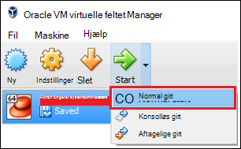

<properties
    pageTitle="Bruge en Hadoop sandkasse til at få mere for at vide om Hadoop | Microsoft Azure"
    description="Hvis du vil Lær om brug af Hadoop økosystemet, kan du konfigurere en Hadoop sandkasse fra Hortonworks på en Azure virtuel maskine. "
    keywords="hadoop-emulator, hadoop sandkassetilstand"
    editor="cgronlun"
    manager="jhubbard"
    services="hdinsight"
    authors="nitinme"
    documentationCenter=""
    tags="azure-portal"/>

<tags
    ms.service="hdinsight"
    ms.workload="big-data"
    ms.tgt_pltfrm="na"
    ms.devlang="na"
    ms.topic="article"
    ms.date="08/24/2016"
    ms.author="nitinme"/>

# Komme i gang med Hadoop økosystemet med en Hadoop sandkasse på en virtuel maskine

Lær, hvordan du installerer Hadoop sandkassetilstand fra Hortonworks på en virtuel maskine til at få mere at vide om Hadoop økosystemet. I sandkassetilstanden giver en lokal udviklingsmiljø til at få mere at vide om Hadoop, Hadoop-distribueret fil System (HDFS) og jobbet.

## Forudsætninger

* [Oracle VirtualBox](https://www.virtualbox.org/)

Når du er bekendt med Hadoop, kan du begynde at bruge Hadoop på Azure ved at oprette en HDInsight klynge. Du kan finde flere oplysninger om, hvordan du kommer i gang, kan du se [komme i gang med Hadoop på HDInsight](hdinsight-hadoop-linux-tutorial-get-started.md).

## Downloade og installere den virtuelle maskine

1. Vælg __DOWNLOAD VIRTUALBOX FOR__ elementet for HDP 2.4 på Hortonworks sandkassetilstand [http://hortonworks.com/downloads/#sandbox](http://hortonworks.com/downloads/#sandbox). Du bliver bedt om at registrere med Hortonworks, før overførslen begynder.

    

2. Klik på __VirtualBox installationsvejledning__ til HDP 2.4 på Hortonworks sandkassetilstand fra den samme webside. Dette vil hente en PDF-fil, der indeholder installationsvejledning til den virtuelle maskine.

    

## Start virtual machine

1. Starte VirtualBox, Vælg Hortonworks sandkassetilstand, og vælg __Start__, og derefter __Normal Start__.

    

2. Når den virtuelle maskine afsluttes startprocessen, viser den logonvejledningen. Åbn en webbrowser og gå til URL-adressen vises (som regel http://127.0.0.1:8888).

## Angive adgangskoder

1. Vælg __Avancerede indstillinger for visning__på trinnet __Introduktion__ på siden Hortonworks sandkassetilstand. Brug oplysningerne på denne side for at logge på sandkassetilstand ved hjælp af SSH. Brug brugernavn og adgangskode, der er angivet.

    > [AZURE.NOTE] Hvis du ikke har en SSH-klient, der er installeret, kan du bruge den webbaserede SSH fra på den virtuelle maskine på __http://localhost:4200 /__.

    Første gang du opretter forbindelse ved hjælp af SSH, skal du bedt om at ændre adgangskoden for kontoen rod. Angiv en ny adgangskode, der skal bruges, når du logger på ved hjælp af SSH i fremtiden.

2. Når du er logget på, Skriv følgende kommando:

        ambari-admin-password-reset
    
    Når du bliver bedt om det, kan du angive en adgangskode til administratorkonto Ambari. Dette vil blive brugt, når du får adgang til Ambari Webbrugergrænsefladen.

## Bruge kommandoen hive

1. Brug følgende kommando til at starte Hive shell fra en SSH-forbindelse til sandkassen:

        hive

2. Når shell er startet, skal du bruge følgende for at få vist de tabeller, der følger med sandkassen:

        show tables;

3. Bruge følgende for at hente 10 rækker fra den `sample_07` tabel:

        select * from sample_07 limit 10;

## Næste trin

* [Lær at bruge Visual Studio med Hortonworks sandkassetilstand](hdinsight-hadoop-emulator-visual-studio.md)
* [Lære tove af Hortonworks sandkassetilstand](http://hortonworks.com/hadoop-tutorial/learning-the-ropes-of-the-hortonworks-sandbox/)
* [Hadoop-selvstudium - Introduktion til HDP](http://hortonworks.com/hadoop-tutorial/hello-world-an-introduction-to-hadoop-hcatalog-hive-and-pig/)