<properties
pageTitle="Bruge værktøjerne i Microsoft Azure Data sø til Visual Studio med Hortonworks sandkassetilstand | Microsoft Azure"
description="Lær at bruge Azure Data sø Tools til VIsual Studio med Hortonworks sandkassetilstanden (køre i en lokal VM). Med disse værktøjer kan du oprette og køre Hive og gris job på sandkassetilstand og få vist jobbet output og historik."
services="hdinsight"
documentationCenter=""
authors="Blackmist"
manager="paulettm"
editor="cgronlun"/>

<tags
ms.service="hdinsight"
ms.devlang="na"
ms.topic="article"
ms.tgt_pltfrm="na"
ms.workload="big-data"
ms.date="08/26/2016"
ms.author="larryfr"/>

# Bruge Azure Data sø Tools til Visual Studio med Hortonworks sandkassetilstand

Azure Data sø værktøjer til Visual Studio indeholder værktøjer til at arbejde med generisk Hadoop-klynger, ud over værktøjer til at arbejde med Azure Data sø og HDInsight. Dette dokument indeholder de trin, der er behov for at bruge værktøjerne i Azure Data sø med Hortonworks sandkassetilstand kører i en lokal virtuelle maskine.

Brug af Hortonworks sandkassetilstand, kan du arbejde med Hadoop lokalt på din udviklingsmiljø. Når du har udviklet en løsning og vil installere den på skala, kan du derefter flytte til en HDInsight klynge.

## Forudsætninger

* Den Hortonworks sandkassetilstand, der kører på en virtuel computer på dit udviklingsmiljø. Dette dokument blev skrevet og testet med sandkassetilstand kører i Oracle VirtualBox, som blev konfigureret ved hjælp af oplysningerne i [komme i gang med Hadoop økosystemet](hdinsight-hadoop-emulator-get-started.md) dokumentet.

* Visual Studio 2013 eller 2015, en hvilken som helst edition.

* [Azure SDK til .NET](https://azure.microsoft.com/downloads/) 2.7.1 eller nyere

* [Azure Data sø Tools til Visual Studio](https://www.microsoft.com/download/details.aspx?id=49504)

## Konfigurere adgangskoder for sandkassetilstanden

Sørg for, at Hortonworks sandkassetilstand kører og derefter følge trinnene i [komme i gang med Hadoop økosystemet](hdinsight-hadoop-emulator-get-started.md#set-passwords) for at konfigurere adgangskoden til SSH `root` -konto, og Ambari `admin` konto. Disse adgangskoder, der skal bruges, når du opretter forbindelse til sandkassetilstanden fra Visual Studio.

## Oprette forbindelse værktøjerne til sandkassetilstanden

1. Åbne Visual Studio, og vælg __Vis__, og klik derefter __Server Explorer__.

2. Højreklik på posten __HDInsight__ __Server Explorer__, og vælg derefter __Opret forbindelse til HDInsight Emulator__.

    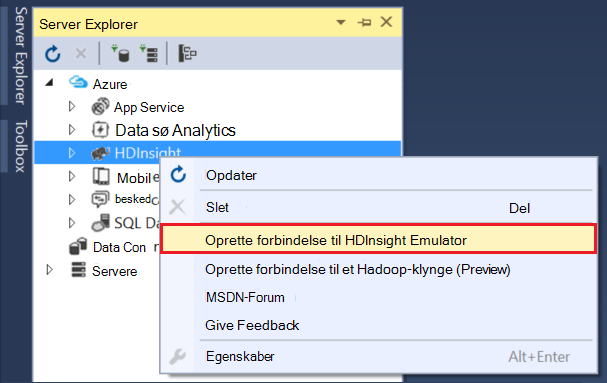

3. Skriv den adgangskode, du har konfigureret for Ambari fra dialogboksen __Opret forbindelse til HDInsight Emulator__ .

    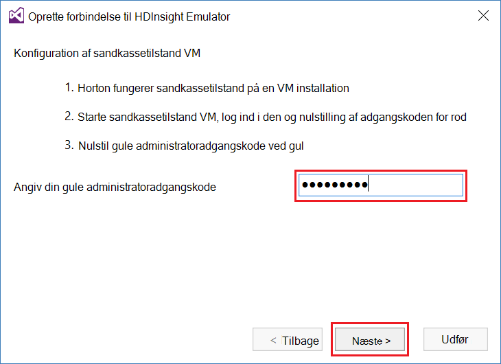

    Klik på __Næste__ at fortsætte.

4. Brug feltet __adgangskode__ til at angive den adgangskode, du har konfigureret til den `root` konto. Lade de andre felter standardværdi.

    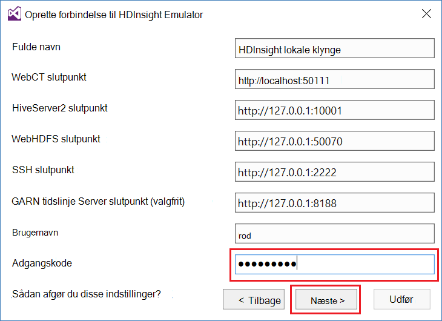

    Klik på __Næste__ at fortsætte.

5. Vent til validering af tjenesterne til at fuldføre. I nogle tilfælde validering mislykkes og bede dig om at opdatere konfigurationen. Når dette sker, klik på knappen __Opdater__ , og vent konfiguration og -bekræftelse for tjenesten til at fuldføre.

    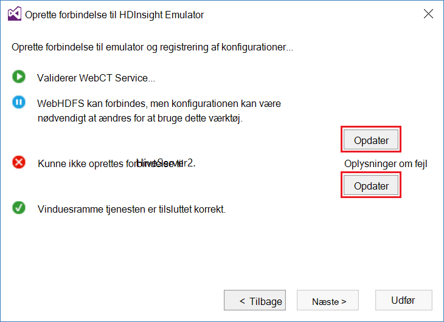

    > [AZURE.NOTE] Opdateringsprocessen bruger Ambari til at ændre Hortonworks sandkassetilstand konfigurationen til hvad der forventes ved Azure Data sø værktøjerne til Visual Studio.

    Når validering er færdig, skal du vælge __er færdig med__ at afslutte konfiguration.

    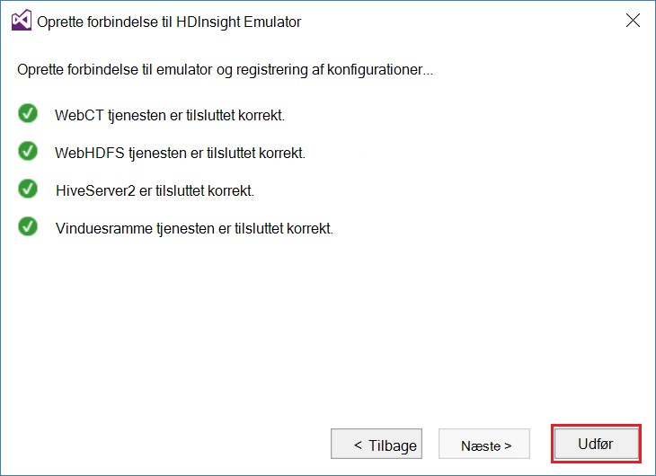

    > [AZURE.NOTE] Afhængigt af hastigheden på din udviklingsmiljø, og mængden hukommelse, der er allokeret til den virtuelle maskine, kan det tage flere minutter til at konfigurere og validere tjenesterne.

Når du har fulgt disse trin, har du nu en "HDInsight lokale klynge" post på Server Explorer under afsnittet HDInsight.

## Skrive en Hive-forespørgsel

Hive indeholder en SQL-lignende forespørgselssprog (HiveQL) til at arbejde med strukturerede data. Brug følgende trin til at se, hvordan du kører ad hoc-forespørgsler i forhold til den lokale klynge.

1. I __Server Explorer__, højreklik på posten for den lokale klynge, du tilføjede tidligere, og vælg derefter __skrive en Hive-forespørgsel__.

    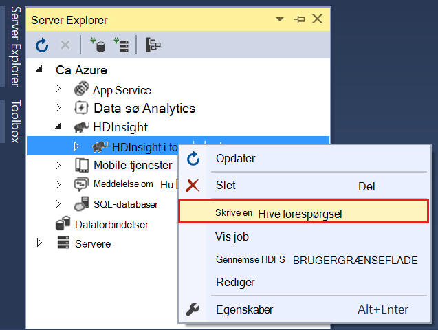

    Dette åbner en ny forespørgselsvinduet, hvor du kan hurtigt Udarbejd og afsendelse af en forespørgsel til den lokale klynge.

2. Angiv følgende i forespørgselsvinduet ny:

        select count(*) from sample_08;
    
    Sørg for, at konfigurationen for den lokale klynge er markeret, og vælg derefter __Send__øverst i forespørgselsvinduet. Du kan lade de andre værdier (__Batch__ og servernavn,) på standardværdierne.

    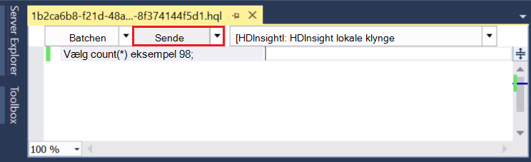

    Bemærk, at du kan også bruge rullemenuen ud for __Send__ til at markere __Avanceret__. Dette åbner en dialogboks, hvor du kan angive flere indstillinger, når sendt jobbet.

    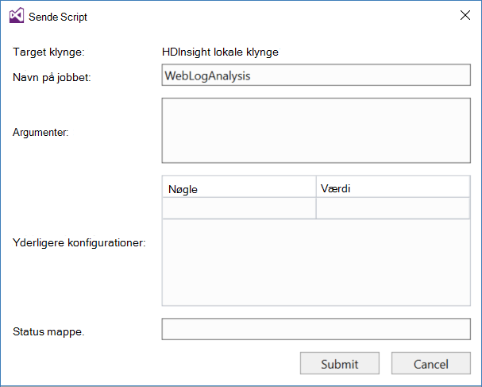

3. Når du sender forespørgslen, vises jobstatus. Dette giver oplysninger på sag, der er behandlet af Hadoop. Posten __Job tilstand__ indeholder den aktuelle status for jobbet. Tilstanden opdateres med jævne mellemrum, eller du kan bruge på opdateringsikonet manuelt opdatere tilstanden.

    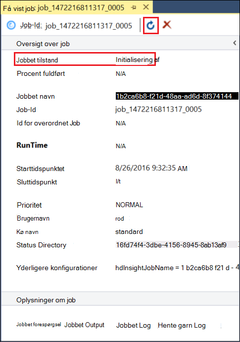

    Når __Jobstatus__ ændres til __færdig__, vises en ført acykliske Graph (DAG). Dette beskriver udførelse af stien, der er angivet af Tez (udførelse af standardprogrammet til Hive på den lokale klynge.) 
    
    > [AZURE.NOTE] Tez er også standard, når du bruger Linux-baserede HDInsight klynger. Det er ikke standard på Windows-baseret HDInsight bruge den der, du skal tilføje linjen `set hive.execution.engine = tez;` til starten af forespørgslen Hive. 

    Brug linket __Job Output__ til at få vist output. I dette tilfælde er det __823__; antallet af rækker i tabellen sample_08. Du kan få vist diagnosticeringsoplysninger om jobbet ved hjælp af linkene __Job Log__ og __Hente GARN Log__ .

4. Du kan også køre Hive job interaktivt ved at ændre feltet __Batch__ til __interaktivt__, og vælg derefter __Udfør__. 

    

    Dette streamer outputlogfilen genereres under behandling til vinduet __HiveServer2 Output__ .
    
    > [AZURE.NOTE] Dette er de samme oplysninger, som er tilgængelig fra linket __Job Log__ , når et job er fuldført.

    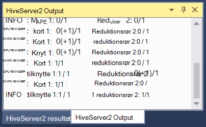

## Oprette et Hive-projekt

Du kan også oprette et projekt, der indeholder flere Hive scripts. Dette er nyttigt, når du har relaterede scripts, som du vil holde sammen og vedligeholde ved hjælp af en version kontrolsystemer.

1. I Visual Studio, skal du vælge __filer__, __Ny__og then__Project__.

2. Udvid __skabeloner__, __Azure Data sø__ på listen over projekter, og vælg derefter __HIVE (HDInsight)__. Vælg __Hive eksempel__på listen over skabeloner. Angiv et navn og placering og derefter vælge __OK__.

    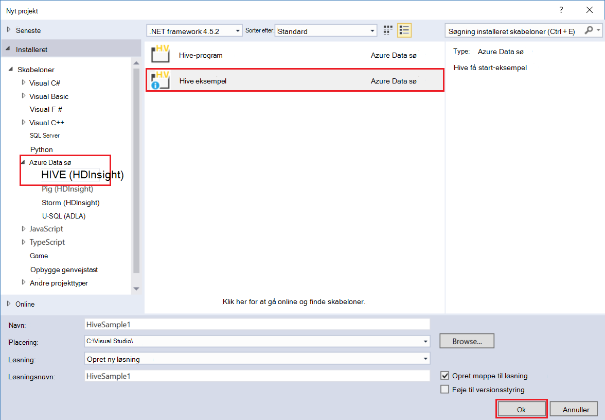

__Eksempel på Hive__ projektet indeholder to scripts, __WebLogAnalysis.hql__ og __SensorDataAnalysis.hql__. Du kan sende dem ved hjælp af den samme __Send__ -knap øverst i vinduet.

## Oprette et gris projekt

Mens Hive giver en SQL-lignende sprog til at arbejde med strukturerede data, giver gris et sprog (gris latinsk), der gør det muligt at udvikle en rørledning transformationer, der er anvendt til dine data. Brug følgende trin til at bruge gris med den lokale klynge.

1. Åbne Visual Studio, og vælg __filer__, __Ny__og derefter __Project__. Udvid __skabeloner__, __Azure Data sø__, på listen over projekter, og vælg derefter __gris (HDInsight)__. Vælg __Gris program__på listen over skabeloner. Skriv et navn, placering, og klik derefter på __OK__.

    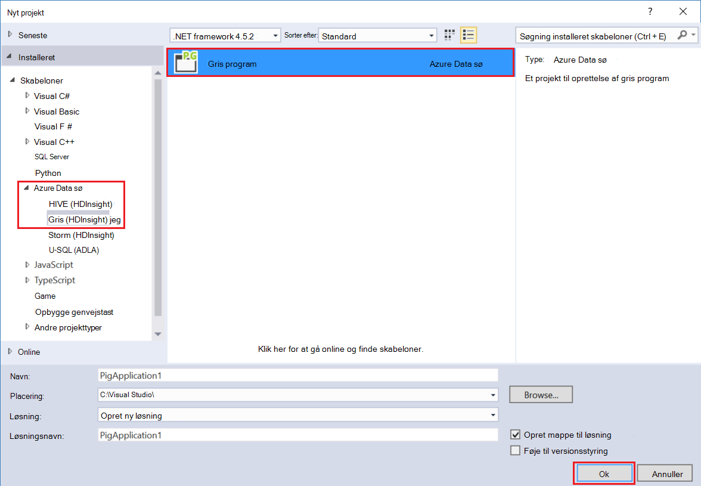

2. Angiv følgende oplysninger som indholdet af filen __script.pig__ , der er oprettet med dette projekt.

        a = LOAD '/demo/data/Website/Website-Logs' AS (
            log_id:int, 
            ip_address:chararray, 
            date:chararray, 
            time:chararray, 
            landing_page:chararray, 
            source:chararray);
        b = FILTER a BY (log_id > 100);
        c = GROUP b BY ip_address;
        DUMP c;

    Mens gris bruger et andet sprog end Hive, er hvordan du udfører job ensartet mellem begge sprog via knappen __Send__ . Vælge på rullelisten ned ved siden af __Send__ viser en avanceret Send dialogboksen for gris.

    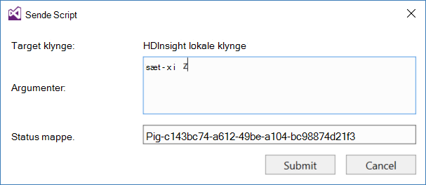
    
3. Jobstatus og output er også vises på samme måde som en Hive-forespørgsel.

    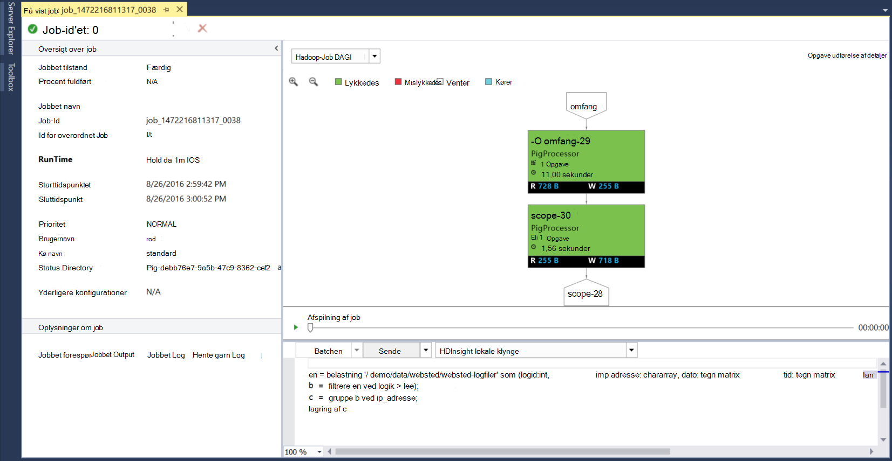

## Vis job

Azure Dataværktøjer sø også tillade, at du kan nemt få vist oplysninger om job, der har været kørte på Hadoop. Følge nedenstående trin for at se de opgaver, som er blevet kørte på den lokale klynge.

1. Højreklik på den lokale klynge __Server Explorer__, og vælg derefter __Vis job__. Derved vises en liste over job, der er sendt til klyngen.

    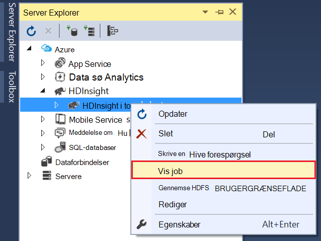

2. Vælg en til at få vist oplysninger om job fra listen over job.

    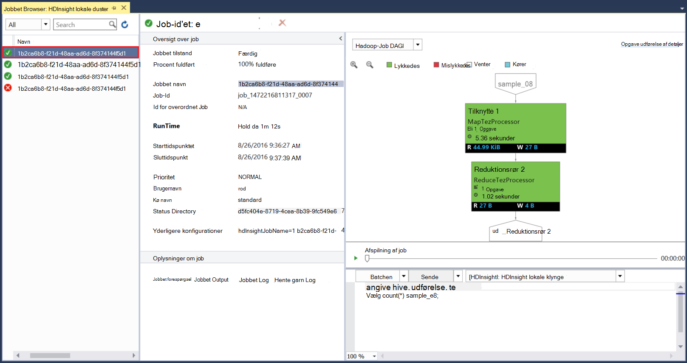

    De viste oplysninger, der ligner det, du ser, når du kører en Hive eller gris forespørgsel, fuldført med links til at få vist output og logge oplysninger.

3. Du kan også redigere og indsend igen jobbet her.

## Få vist Hive databaser

1. Udvid posten __HDInsight lokale klynge__ i __Server Explorer__, og udvid derefter __Hive databaser__. Dette kan afsløre __standard__ og __xademo__ databaserne på den lokale klynge. Udvide en database, vises tabellerne i databasen.

    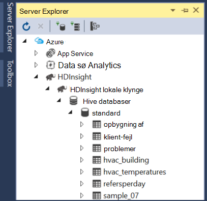

2. Udvide en tabel indeholder kolonnerne for den pågældende tabel. Du kan højreklikke på en tabel og vælg __Vis de øverste 100 rækker__ til hurtigt at få vist dataene.

    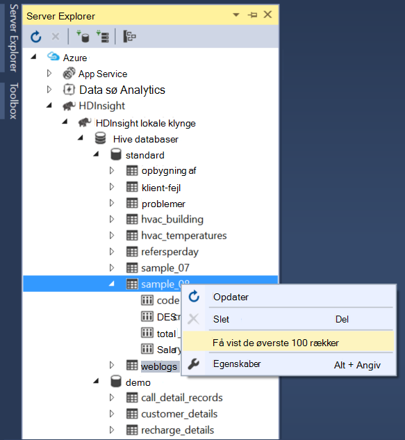

### Egenskaber for database og tabel

Du har muligvis bemærket, at du kan vælge at få vist __egenskaberne__ på en database eller en tabel. Her kan se detaljerne for det valgte element i egenskabsvinduet.

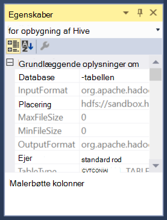

### Oprette en tabel

Hvis du vil oprette en ny tabel, skal du højreklikke på en database, og vælg derefter __Opret tabel__.

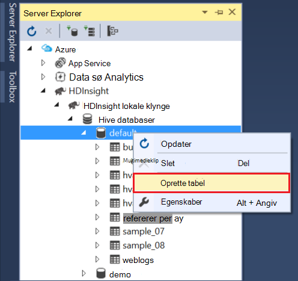

Derefter kan du oprette den tabel, ved hjælp af en formular. Du kan se den rå HiveQL, der skal bruges til at oprette tabellen nederst på denne side.

## Næste trin

* [Lære tove af Hortonworks sandkassetilstand](http://hortonworks.com/hadoop-tutorial/learning-the-ropes-of-the-hortonworks-sandbox/)
* [Hadoop-selvstudium - Introduktion til HDP](http://hortonworks.com/hadoop-tutorial/hello-world-an-introduction-to-hadoop-hcatalog-hive-and-pig/)