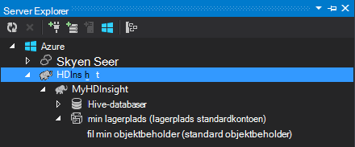

<properties
    pageTitle="Bruge C# med Hive og gris på Hadoop i HDInsight | Microsoft Azure"
    description="Lær at bruge C# brugerdefinerede funktioner (UDF) med Hive og gris streaming i Azure HDInsight."
    services="hdinsight"
    documentationCenter=""
    authors="Blackmist"
    manager="jhubbard"
    editor="cgronlun"
    tags="azure-portal"/>

<tags
    ms.service="hdinsight"
    ms.workload="big-data"
    ms.tgt_pltfrm="na"
    ms.devlang="dotnet"
    ms.topic="article"
    ms.date="10/28/2016"
    ms.author="larryfr"/>

#Bruge C# brugerdefinerede funktioner med Hive og gris streaming på Hadoop i HDInsight

Hive og gris er gode til at arbejde med data i Azure HDInsight, men nogle gange du vil bruge et mere generelle sprogversion. Både Hive og gris kan du ringe til eksterne kode til brugerdefinerede funktioner eller streaming.

Lær, hvordan du bruger C# med Hive og gris i dette dokument.

##Forudsætninger

* Windows 7 eller nyere.

* Visual Studio med følgende versioner:

    * Visual Studio 2012 Professional/Premium/Ultimate med [opdatere 4](http://www.microsoft.com/download/details.aspx?id=39305)

    * Visual Studio 2013 Community/Professional/Premium/Ultimate med [opdatere 4](https://www.microsoft.com/download/details.aspx?id=44921)

    * Visual Studio 2015

* Hadoop på HDInsight klynge - se [klargøring en HDInsight klynge](hdinsight-provision-clusters.md) til trin til at oprette en klynge

* Hadoop-værktøjer til Visual Studio. Se [Introduktion til brug af HDInsight Hadoop-værktøjer til Visual Studio](hdinsight-hadoop-visual-studio-tools-get-started.md) vejledning i installation og konfiguration af værktøjerne.

##.NET på HDInsight

Som standard på Windows-baseret HDInsight klynger installeret .NET common language runtime (CLR) og rammer. Dette kan du bruge C#-programmer med Hive og gris streaming (dataene er overført mellem Hive/gris og C#-program via stdout/stdin).

> [AZURE.NOTE] Der er i øjeblikket ingen understøttelse til kørsel af .NET Framework brugerdefinerede funktioner på Linux-baserede HDInsight klynger. 

##.NET og streaming

Streaming omfatter Hive og gris overføre data til et eksternt program over stdout og modtage resultaterne via stdin. For C#-programmer, dette er nemmeste måde at gøre `Console.ReadLine()` og `Console.WriteLine()`.

Da Hive og gris har du brug at aktivere programmet på kørselstidspunktet, skal skabelonen **Console-program** bruges til dine C#-projekter.

##Hive og C & #35

###Oprette C#-projekt

1. Åbne Visual Studio, og Opret en ny løsning. Vælg **Console programmet**type projekt, og navngiv det nye projekt **HiveCSharp**.

2. Erstat indholdet af **Program.cs** med følgende:

        using System;
        using System.Security.Cryptography;
        using System.Text;
        using System.Threading.Tasks;

        namespace HiveCSharp
        {
            class Program
            {
                static void Main(string[] args)
                {
                    string line;
                    // Read stdin in a loop
                    while ((line = Console.ReadLine()) != null)
                    {
                        // Parse the string, trimming line feeds
                        // and splitting fields at tabs
                        line = line.TrimEnd('\n');
                        string[] field = line.Split('\t');
                        string phoneLabel = field[1] + ' ' + field[2];
                        // Emit new data to stdout, delimited by tabs
                        Console.WriteLine("{0}\t{1}\t{2}", field[0], phoneLabel, GetMD5Hash(phoneLabel));
                    }
                }
                /// 

                /// Returns an MD5 hash for the given string
                /// 

                /// <param name="input">string value</param>
                /// <returns>an MD5 hash</returns>
                static string GetMD5Hash(string input)
                {
                    // Step 1, calculate MD5 hash from input
                    MD5 md5 = System.Security.Cryptography.MD5.Create();
                    byte[] inputBytes = System.Text.Encoding.ASCII.GetBytes(input);
                    byte[] hash = md5.ComputeHash(inputBytes);

                    // Step 2, convert byte array to hex string
                    StringBuilder sb = new StringBuilder();
                    for (int i = 0; i < hash.Length; i++)
                    {
                        sb.Append(hash[i].ToString("x2"));
                    }
                    return sb.ToString();
                }
            }
        }

3. Oprette projektet.

###Overføre til lager

1. I Visual Studio, skal du åbne **Server Explorer**.

3. Udvid **Azure**, og udvid derefter **HDInsight**.

4. Hvis du bliver bedt om det, Angiv dine legitimationsoplysninger Azure-abonnement, og klik derefter på **Log på**.

5. Udvid den HDInsight-klynge, du vil installere dette program til, og udvid derefter **Standardkontoen for lagerplads**.

    

6. Dobbeltklik på **Standard beholder** for-klyngen. Derved åbnes et nyt vindue, der viser indholdet af standard objektbeholderen.

7. Klik på ikonet Overfør, og derefter gå til mappen **bin\debug** for **HiveCSharp** projektet. Endelig, Vælg fil, **HiveCSharp.exe** og klikke på **Ok**.

    

8. Når overførslen er færdig, vil du kunne bruge programmet fra en Hive-forespørgsel.

###Hive forespørgsel

1. I Visual Studio, skal du åbne **Server Explorer**.

2. Udvid **Azure**, og udvid derefter **HDInsight**.

5. Højreklik på den-klynge, du har installeret programmet **HiveCSharp** til, og vælg derefter **skriver en Hive forespørgsel**.

6. Du kan bruge følgende til forespørgslen Hive:

        add file wasbs:///HiveCSharp.exe;

        SELECT TRANSFORM (clientid, devicemake, devicemodel)
        USING 'HiveCSharp.exe' AS
        (clientid string, phoneLabel string, phoneHash string)
        FROM hivesampletable
        ORDER BY clientid LIMIT 50;

    Dette markerer den `clientid`, `devicemake`, og `devicemodel` felter fra `hivesampletable`, og den overfører felterne til programmet HiveCSharp.exe. Forespørgslen forventer programmet til at returnere tre felter, som er gemt som `clientid`, `phoneLabel`, og `phoneHash`. Forespørgslen også forventer at finde HiveCSharp.exe i roden af objektbeholderen til lagring af standard (`add file wasbs:///HiveCSharp.exe`).

5. Klik på **Send** for at sende jobbet til HDInsight klynge. Vinduet **Hive Job oversigt** åbnes.

6. Klik på **Opdater** for at opdatere oversigten, indtil **Jobstatus** ændres til **fuldført**. For at få vist jobbet output, skal du klikke på **Jobbet Output**.

##Gris og C & #35

###Oprette C#-projekt

1. Åbne Visual Studio, og Opret en ny løsning. Vælg **Console programmet**type projekt, og navngiv det nye projekt **PigUDF**.

2. Erstat indholdet af filen **Program.cs** med følgende:

        using System;

        namespace PigUDF
        {
            class Program
            {
                static void Main(string[] args)
                {
                    string line;
                    // Read stdin in a loop
                    while ((line = Console.ReadLine()) != null)
                    {
                        // Fix formatting on lines that begin with an exception
                        if(line.StartsWith("java.lang.Exception"))
                        {
                            // Trim the error info off the beginning and add a note to the end of the line
                            line = line.Remove(0, 21) + " - java.lang.Exception";
                        }
                        // Split the fields apart at tab characters
                        string[] field = line.Split('\t');
                        // Put fields back together for writing
                        Console.WriteLine(String.Join("\t",field));
                    }
                }
            }
        }

    Dette program kan fortolkes de linjer, der sendes fra gris og omformatere linjer, der starter med `java.lang.Exception`.

3. Gem **Program.cs**, og derefter bygge projektet.

###Overføre programmet

1. Gris streaming forventer, at programmet skal være lokale på radialklyngebaseret filsystemet. Aktivere Fjernskrivebord for HDInsight-klyngen, og derefter oprette forbindelse til den ved at følge vejledningen på [Opret forbindelse til HDInsight klynger ved hjælp af RDP](hdinsight-administer-use-management-portal.md#rdp).

2. Når forbindelse, kopiere **PigUDF.exe** fra mappen **placering/fejlfinding** for PigUDF projektet på din lokale computer, og sæt den til mappen **% PIG_HOME %** på klyngen.

###Bruge programmet fra gris latinsk

1. Start Hadoop kommandolinjen ved hjælp af ikonet **Hadoop kommandolinjen** på skrivebordet fra Fjernskrivebord-session.

2. Brug følgende fremgangsmåde til at starte kommandolinjen gris:

        cd %PIG_HOME%
        bin\pig

    Du vil få vist en `grunt>` prompt.

3. Angiv følgende for at køre et simpelt gris job ved hjælp af .NET Framework-program:

        DEFINE streamer `pigudf.exe` SHIP('pigudf.exe');
        LOGS = LOAD 'wasbs:///example/data/sample.log' as (LINE:chararray);
        LOG = FILTER LOGS by LINE is not null;
        DETAILS = STREAM LOG through streamer as (col1, col2, col3, col4, col5);
        DUMP DETAILS;

    Den `DEFINE` sætning opretter et alias for `streamer` for programmer pigudf.exe og `SHIP` placerer den på tværs af knuderne i klyngen. Senere, `streamer` bruges sammen med den `STREAM` operator til at behandle de enkeltstående linjer, der er indeholdt i LOG og returnere dataene som en række kolonner.

> [AZURE.NOTE] Navnet på programmet, der bruges til streaming skal skrives i den \` (backtick) tegn hvornår alias, og ' (enkelt anførselstegn) når den bruges med `SHIP`.

3. Når du har skrevet den sidste linje, skal jobbet startes. Til sidst returneres output ligner følgende:

        (2012-02-03 20:11:56 SampleClass5 [WARN] problem finding id 1358451042 - java.lang.Exception)
        (2012-02-03 20:11:56 SampleClass5 [DEBUG] detail for id 1976092771)
        (2012-02-03 20:11:56 SampleClass5 [TRACE] verbose detail for id 1317358561)
        (2012-02-03 20:11:56 SampleClass5 [TRACE] verbose detail for id 1737534798)
        (2012-02-03 20:11:56 SampleClass7 [DEBUG] detail for id 1475865947)

##Oversigt

I dette dokument, har du lært hvordan du bruger en .NET Framework-program fra Hive og gris på HDInsight. Hvis du vil lære at bruge Python med Hive og gris, kan du se [Bruge Python med Hive og gris i HDInsight](hdinsight-python.md).

For at få andre måder at bruge gris og Hive og for at få mere at vide om brug af MapReduce, se følgende:

* [Bruge Hive med HDInsight](hdinsight-use-hive.md)

* [Brug gris med HDInsight](hdinsight-use-pig.md)

* [Bruge MapReduce med HDInsight](hdinsight-use-mapreduce.md)
