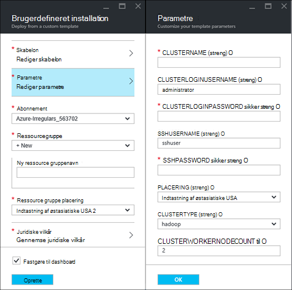
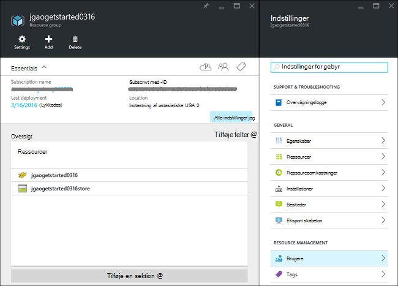
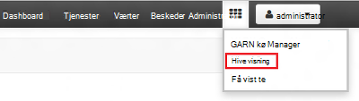
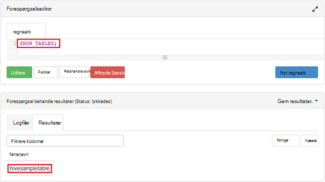

<properties
    pageTitle="Linux Selvstudium: Introduktion til Hadoop og Hive | Microsoft Azure"
    description="Følg selvstudiet Linux at komme i gang ved hjælp af Hadoop i HDInsight. Lær, hvordan du klargør Linux klynger og forespørge data med Hive."
    services="hdinsight"
    documentationCenter=""
    authors="mumian"
    manager="jhubbard"
    editor="cgronlun"
    tags="azure-portal"/>

<tags
    ms.service="hdinsight"
    ms.devlang="na"
    ms.topic="hero-article"
    ms.tgt_pltfrm="na"
    ms.workload="big-data"
    ms.date="09/14/2016"
    ms.author="jgao"/>

# Hadoop-Selvstudium: Introduktion til brug af Linux-baserede Hadoop i HDInsight

> [AZURE.SELECTOR]
- [Linux-baserede](hdinsight-hadoop-linux-tutorial-get-started.md)
- [Windows-baseret](hdinsight-hadoop-tutorial-get-started-windows.md)

Lær, hvordan du opretter Linux-baserede [Hadoop](http://hadoop.apache.org/) klynger i HDInsight, og hvordan du kan køre Hive job i HDInsight. [Apache Hive](https://hive.apache.org/) er den mest populære komponent i Hadoop økosystemet. Aktuelt HDInsight leveres med 4 forskellige klynge typer: [Hadoop](hdinsight-hadoop-introduction.md), [tænding](hdinsight-apache-spark-overview.md), [HBase](hdinsight-hbase-overview.md) og [Storm](hdinsight-storm-overview.md).  Hver klynge type understøtter et andet sæt komponenter. Alle 4 klynge typer understøtter Hive. Se en liste over understøttede komponenter i HDInsight [Nyheder i de Hadoop klynge versioner, der leveres af HDInsight?](hdinsight-component-versioning.md)  

[AZURE.INCLUDE [delete-cluster-warning](../../includes/hdinsight-delete-cluster-warning.md)]

## Forudsætninger

Inden du starter selvstudiet, skal du have:

- **Azure-abonnement**: Hvis du vil oprette en gratis prøveversion én måned-konto, skal du gå til [azure.microsoft.com/free](https://azure.microsoft.com/free).

### Krav til Access

[AZURE.INCLUDE [access-control](../../includes/hdinsight-access-control-requirements.md)]

## Oprette klynge

De fleste Hadoop-job er batchjob. Du opretter en klynge, kører nogle job og slet derefter klyngen. I dette afsnit, skal oprette du en Linux-baserede Hadoop klynge i HDInsight ved hjælp af [Azure ressourcestyring skabelon](../resource-group-template-deploy.md). Ressourcestyring skabelonen er fuldt ud justerbart; det er nemt at oprette Azure ressourcer som HDInsight. Ressourcestyring skabelon oplevelse er ikke påkrævet for at følge dette selvstudium. Se [oprette HDInsight klynger](hdinsight-hadoop-provision-linux-clusters.md)til andre metoder til oprettelse af klynge og forstå de egenskaber, der bruges i dette selvstudium. Skabelonen ressourceleder, der bruges i dette selvstudium er placeret i en offentlig blob beholder, [https://hditutorialdata.blob.core.windows.net/armtemplates/create-linux-based-hadoop-cluster-in-hdinsight.json](https://hditutorialdata.blob.core.windows.net/armtemplates/create-linux-based-hadoop-cluster-in-hdinsight.json). 

1. Klik på følgende billede for at logge på Azure og åbne skabelonen ressourcestyring i portalen Azure. 

    

2. Angiv følgende oplysninger fra bladet **parametre** :

    .

    - **ClusterName**: Angiv et navn til den Hadoop-klynge, du vil oprette.
    - **Klynge login-navn og din adgangskode**: login standardnavnet er **administrator**.
    - **SSH brugernavn og din adgangskode**: standard brugernavn er **sshuser**.  Du kan omdøbe den. 
    
    Andre parametre er valgfri for følge dette selvstudium. Du kan lade dem, som de er. 
    
    Hver klynge har en konto afhængighed til Azure Blob-lager. Det er normalt refereres som lager standardkontoen. HDInsight klynge og dens lagerplads standardkonto skal samtidig placeret i det samme Azure område. Slette klynger bliver ikke slettet kontoen lagerplads. I skabelonen er kontonavn standard lager defineret som klyngenavn med "store" føjet. 
    
3. Klik på **OK** for at gemme parametrene.
4. Angiv **nye ressource gruppenavn** for at oprette en ny ressourcegruppe fra bladet **brugerdefineret installation** .  Ressourcegruppen er en objektbeholder, der grupperer klyngen, kontoen afhængige lagerplads og andre s. Ressource gruppe placering kan være forskellige fra den klynge placering.
5. Klik på **juridiske begreber**, og klik derefter på **Opret**.
6. Bekræft afkrydsningsfeltet **Fastgør til dashboard** er markeret, og klik derefter på **Opret**. Du får vist et nyt felt med titlen **installation af installation af skabelon**. Det tager om omkring 20 minutter om at oprette en klynge. 
7.  Når klyngen er oprettet, ændret titelteksten for feltet til ressource gruppenavn, du har angivet. Og portalen åbnes automatisk to blade med klyngen og indstillinger for klynge. 

    .

    Der findes to ressourcer, der er angivet, klyngen og lagerplads standardkontoen.

##Køre Hive-forespørgsler

[Apache Hive](hdinsight-use-hive.md) er den mest populære komponent, der bruges i HDInsight. Der findes mange måder til at køre Hive job i HDInsight. I dette selvstudium bruger du visningen Ambari Hive fra portalen til at køre nogle Hive-job. For andre metoder til at sende Hive job, kan du se [Brug Hive i HDInsight](hdinsight-use-hive.md).

1. Gå til **https://&lt;ClusterName >. azurehdinsight.net**, hvor &lt;ClusterName > er klyngen du oprettede i forrige afsnit for at åbne Ambari.
2. Angiv Hadoop-brugernavn og adgangskode, du har angivet i forrige afsnit. Standard-brugernavn er **administrator**.
3. Åbne **Hive visningen** , som vist på følgende skærmbillede:

    .
4. I sektionen __Forespørgselseditor__ på siden, kan du indsætte følgende HiveQL sætninger i regnearket:

        SHOW TABLES;

    >[AZURE.NOTE] Semikolon kræves af Hive.       
        
5. Klik på __Udfør__. En __Proces forespørgselsresultater__ sektion skal vises under Forespørgselseditor og få vist oplysninger om jobbet. 

    Når forespørgslen er færdig, vises sektionen __Proces forespørgselsresultater__ resultaterne af handlingen. Du skal du se én tabel, der kaldes **hivesampletable**. Denne Hive eksempeltabel leveres med alle HDInsight klynger.

    .

6. Gentag trin 4 og 5 for at køre følgende forespørgsel:

        SELECT * FROM hivesampletable;

    > [AZURE.TIP] Bemærk, at på __Gem resultaterne fra__ rullelisten øverst til venstre for sektionen, __Proces forespørgselsresultater__ ; Du kan bruge det til enten at hente resultaterne, eller gemme dem til HDInsight lager som en CSV-fil.

7. Klik på **Oversigt** for at få en liste over job.

Når du har fuldført et Hive-job, kan du [eksportere resultaterne til Azure SQL-database eller SQL Server-database](hdinsight-use-sqoop-mac-linux.md), du kan også [visualisere resultaterne ved hjælp af Excel](hdinsight-connect-excel-power-query.md). Se [Brug Hive og HiveQL med Hadoop i HDInsight til at analysere et eksempel Apache log4j-fil](hdinsight-use-hive.md), du kan finde flere oplysninger om brug af Hive i HDInsight.

##Rydde op i selvstudiet

Når du har fuldført selvstudiet, kan du vil slette klyngen. Med HDInsight gemmes dine data i Azure-lager, så du kan slette en klynge sikkert, når den ikke er i brug. Du betaler også for en HDInsight klynge, selvom den ikke er i brug. Da gebyrerne for klyngen mange gange mere end gebyrer for lagerplads, giver økonomiske mening at slette klynger, når de ikke er i brug. 

>[AZURE.NOTE] Brug af [Azure Data Factory](hdinsight-hadoop-create-linux-clusters-adf.md), kan du oprette HDInsight klynger efter behov og konfigurere en TimeToLive indstilling til at slette klynger automatisk. 

**Slette klyngen og/eller lagerplads standardkontoen**

1. Log på [Azure-portalen](https://portal.azure.com).
2. Klik på feltet med den ressource gruppenavn, du brugte, da du oprettede klyngen portalen dashboard.
3. Klik på **Slet** i bladet ressource slette ressourcegruppen, som indeholder klyngen og lagerplads standardkontoen; eller klik på klyngenavnet i feltet **ressourcer** , og klik derefter på **Slet** på bladet klynge. Bemærk, at slette ressourcegruppen, skal du slettes kontoen lagerplads. Hvis du vil beholde kontoen lagerplads, skal du vælge at slette klynge kun.

## Næste trin

I dette selvstudium, har du lært, hvordan du opretter en Linux-baserede HDInsight klynge, ved hjælp af en ressourcestyring skabelon, og hvordan du kan udføre grundlæggende Hive forespørgsler.

Hvis du vil vide mere om analyse af data med HDInsight skal du se følgende:

- Hvis du vil vide mere om at bruge Hive med HDInsight, herunder hvordan du udfører Hive forespørgsler fra Visual Studio, skal du se [Brug Hive med HDInsight][hdinsight-use-hive].

- Hvis du vil vide mere om gris, et sprog, der bruges til at transformere data, se [Brug gris med HDInsight][hdinsight-use-pig].

- Hvis du vil vide mere om MapReduce, en metode til at skrive programmer, der behandler data på Hadoop, se [Brug MapReduce med HDInsight][hdinsight-use-mapreduce].

- Hvis du vil lære at bruge værktøjerne HDInsight til Visual Studio til at analysere data på HDInsight, kan du se [Introduktion til brug af Visual Studio Hadoop værktøjer til HDInsight](hdinsight-hadoop-visual-studio-tools-get-started.md).

Hvis du er klar til at begynde at arbejde med dine egne data, og brug for at vide mere om, hvordan HDInsight lagrer data eller til at hente data til HDInsight, skal du gøre følgende:

- Du kan finde oplysninger om, hvordan HDInsight bruger Azure blob-lager, [Brug Azure Blob-lager med HDInsight](hdinsight-hadoop-use-blob-storage.md).

- Se oplysninger om, hvordan du overfører data til HDInsight, [overføre data til HDInsight][hdinsight-upload-data].

Hvis du vil have mere at vide om at oprette eller administrere en HDInsight klynge, se følgende:

- For at få mere for at vide om administration af din klynge Linux-baserede HDInsight, skal du se [administrere HDInsight klynger ved hjælp af Ambari](hdinsight-hadoop-manage-ambari.md).

- Se [Oprette HDInsight på Linux ved hjælp af brugerdefinerede indstillinger](hdinsight-hadoop-provision-linux-clusters.md)for at få mere for at vide om de indstillinger, du kan vælge, når du opretter en HDInsight klynge.

- Hvis du allerede kender, Linux og Hadoop, men gerne vil vide specifikke oplysninger om Hadoop på HDInsight, kan du se [arbejde med HDInsight på Linux](hdinsight-hadoop-linux-information.md). Dette giver oplysninger som f.eks.:

    * URL-adresser til services på klynge, som Ambari og WebHCat
    * Placeringen af Hadoop-filer og eksempler på det lokale filsystem
    * Brug af Azure lagerplads (WASB) i stedet for HDFS som standarddata gemme

[1]: ../HDInsight/hdinsight-hadoop-visual-studio-tools-get-started.md

[hdinsight-provision]: hdinsight-provision-clusters.md
[hdinsight-admin-powershell]: hdinsight-administer-use-powershell.md
[hdinsight-upload-data]: hdinsight-upload-data.md
[hdinsight-use-mapreduce]: hdinsight-use-mapreduce.md
[hdinsight-use-hive]: hdinsight-use-hive.md
[hdinsight-use-pig]: hdinsight-use-pig.md

[powershell-download]: http://go.microsoft.com/fwlink/p/?linkid=320376&clcid=0x409
[powershell-install-configure]: powershell-install-configure.md
[powershell-open]: powershell-install-configure.md#Install

[img-hdi-dashboard]: ./media/hdinsight-hadoop-tutorial-get-started-windows/HDI.dashboard.png
[img-hdi-dashboard-query-select]: ./media/hdinsight-hadoop-tutorial-get-started-windows/HDI.dashboard.query.select.png
[img-hdi-dashboard-query-select-result]: ./media/hdinsight-hadoop-tutorial-get-started-windows/HDI.dashboard.query.select.result.png
[img-hdi-dashboard-query-select-result-output]: ./media/hdinsight-hadoop-tutorial-get-started-windows/HDI.dashboard.query.select.result.output.png
[img-hdi-dashboard-query-browse-output]: ./media/hdinsight-hadoop-tutorial-get-started-windows/HDI.dashboard.query.browse.output.png
[image-hdi-clusterstatus]: ./media/hdinsight-hadoop-tutorial-get-started-windows/HDI.ClusterStatus.png
[image-hdi-gettingstarted-powerquery-importdata]: ./media/hdinsight-hadoop-tutorial-get-started-windows/HDI.GettingStarted.PowerQuery.ImportData.png
[image-hdi-gettingstarted-powerquery-importdata2]: ./media/hdinsight-hadoop-tutorial-get-started-windows/HDI.GettingStarted.PowerQuery.ImportData2.png
