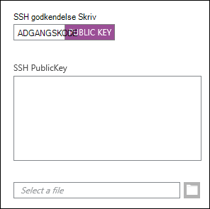
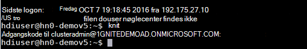
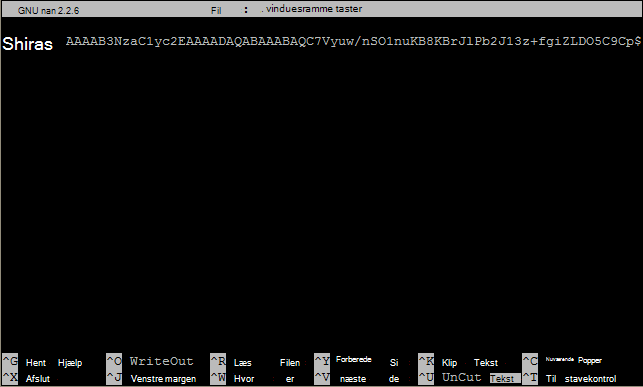

<properties
   pageTitle="Brug SSH-nøgler med Linux-baserede Hadoop fra Linux, Unix eller OS X | Microsoft Azure"
   description=" Du kan få adgang til Linux-baserede HDInsight ved hjælp af Secure Shell (SSH). Dette dokument indeholder oplysninger om brug af SSH med HDInsight fra Linux, Unix eller OS X-klienter."
   services="hdinsight"
   documentationCenter=""
   authors="Blackmist"
   manager="jhubbard"
   editor="cgronlun"
    tags="azure-portal"/>

<tags
   ms.service="hdinsight"
   ms.devlang="na"
   ms.topic="get-started-article"
   ms.tgt_pltfrm="na"
   ms.workload="big-data"
   ms.date="09/13/2016"
   ms.author="larryfr"/>

#<a name="use-ssh-with-linux-based-hadoop-on-hdinsight-from-linux-unix-or-os-x"></a>Brug SSH med Linux-baserede Hadoop på HDInsight fra Linux, Unix eller OS X

> [AZURE.SELECTOR]
- [Windows](hdinsight-hadoop-linux-use-ssh-windows.md)
- [Linux, Unix, OS X](hdinsight-hadoop-linux-use-ssh-unix.md)

[Secure Shell (SSH)](https://en.wikipedia.org/wiki/Secure_Shell) giver dig mulighed at udføre handlinger på din Linux-baserede HDInsight klynger ved hjælp af en kommandolinjebaseret brugergrænseflade eksternt. Dette dokument indeholder oplysninger om brug af SSH med HDInsight fra Linux, Unix eller OS X-klienter.

> [AZURE.NOTE] Trinnene i denne artikel antages, at du bruger en klient, Linux, Unix eller OS X. Disse trin kan udføres på en Windows-baseret klient, hvis du har installeret en pakke, der indeholder `ssh` og `ssh-keygen`, såsom [Bash på Ubuntu på Windows](https://msdn.microsoft.com/commandline/wsl/about).
>
> Hvis du ikke har installeret på din Windows-baseret klient SSH, kan du bruge trinnene i [Bruge SSH med Linux-baserede HDInsight (Hadoop) fra Windows](hdinsight-hadoop-linux-use-ssh-windows.md) for at få oplysninger om installation og brug af trykfarver.

##<a name="prerequisites"></a>Forudsætninger

* **SSH-keygen** og **ssh** til Linux, Unix og OS X-klienter. Denne funktioner leveres normalt med operativsystemet, eller tilgængelig via pakke management system.

* En moderne web-browser, der understøtter HTML5.

ELLER

* [Azure CLI](../xplat-cli-install.md).

    [AZURE.INCLUDE [use-latest-version](../../includes/hdinsight-use-latest-cli.md)] 

##<a name="what-is-ssh"></a>Hvad er SSH?

SSH er et værktøj til at logge på og eksternt udfører kommandoer på en fjernserver. Med Linux-baserede HDInsight SSH etablerer en krypteret forbindelse til den klynge headnode og viser en kommandolinje, der bruges til at indtaste kommandoer. Derefter udføres kommandoerne direkte på serveren.

###<a name="ssh-user-name"></a>SSH-brugernavn

En SSH-brugernavnet er det navn, du bruger til at godkende HDInsight klyngen. Når du angiver et brugernavn til SSH under oprettelse af klyngen, oprettes denne bruger på alle noder i klyngen. Når klyngen er oprettet, kan du bruge dette brugernavn skal tilsluttes HDInsight cluster-headnodes. Fra headnodes, du kan oprette forbindelse til de enkelte medarbejder noder.

###<a name="ssh-password-or-public-key"></a>SSH adgangskode eller offentlig nøgle

En SSH-brugere kan bruge enten en adgangskode eller en offentlig nøgle til godkendelse. En adgangskode er blot en tekststreng du foretager, mens en offentlig nøgle er en del af et krypteret nøglepar, der er genereret entydigt identificerer du.

En nøgle er sikrere end en adgangskode, men det kræver yderligere trin til at generere nøglen, og du skal vedligeholde de filer, der indeholder nøglen til et sikkert sted. Hvis nogen får adgang til vigtige filer, kan de få adgang til din konto. Eller hvis du mister vigtige filer, kan du ikke logge på din konto.

Et nøglepar, der består af en offentlig nøgle (som er sendt til serveren HDInsight) og en privat nøgle (som er gemt på din klientcomputer.) Når du opretter forbindelse til serveren HDInsight bruger SSH, bruge den private nøgle SSH-klient på din computer til at godkende serveren.

##<a name="create-an-ssh-key"></a>Oprette en SSH-nøgle

Brug følgende oplysninger, hvis du har planer om at bruge SSH-nøgler med din klynge. Hvis du har planer om at bruge en adgangskode, kan du springe dette afsnit over.

1. Åbn en terminalsession og bruge følgende kommando til at se, om du har en eksisterende SSH-nøgler:

        ls -al ~/.ssh

    Se efter følgende filer i mappevisningen. Disse er almindelige navne for offentlige SSH-nøgler.

    * id\_dsa.pub
    * id\_ecdsa.pub
    * id\_ed25519.pub
    * id\_rsa.pub

2. Hvis du ikke vil bruge en eksisterende fil, eller du har ingen eksisterende SSH-nøgler, du bruge følgende for at oprette en ny fil:

        ssh-keygen -t rsa

    Du vil blive bedt om følgende oplysninger:

    * Filens placering - placeringen som standard ~/.ssh/id\_rsa.
    * Et adgangsudtryk - bliver du bedt om at indtaste det igen.

        > [AZURE.NOTE] Vi anbefaler, at du bruger en sikker adgangsudtryk for nøglen. Hvis du glemmer adgangsudtrykket, er der ingen måde at gendanne den.

    Når kommandoen er fuldført, har du to nye filer, den private nøgle (for eksempel **id\_rsa**) og den offentlige nøgle (for eksempel **id\_rsa.pub**).

##<a name="create-a-linux-based-hdinsight-cluster"></a>Oprette en HDInsight for Linux-baseret klynge

Når du opretter en Linux-baseret HDInsight-klynge, skal du angive den offentlige nøgle, der er oprettet tidligere. Der er to måder at oprette en klynge af HDInsight fra Linux, Unix eller OS X-klienter:

* **Azure Portal** - bruger en webbaseret portal til at oprette-klyngen.

* **Azure CLI til Mac, Linux og Windows** - bruger kommandolinjekommandoer for at oprette-klyngen.

Hver af disse metoder kræver enten en adgangskode eller en offentlig nøgle. Du kan finde oplysninger om oprettelse af en HDInsight for Linux-baseret klynge [HDInsight bestemmelse Linux-baserede klynger](hdinsight-hadoop-provision-linux-clusters.md).

###<a name="azure-portal"></a>Azure Portal

Når du bruger [Azure Portal] [ preview-portal] for at oprette en Linux-baseret HDInsight-klynge, skal du angive en **SSH brugernavn**og vælge for at angive en **adgangskode** eller **SSH offentlige nøgle**.

Hvis du vælger **SSH offentlige nøgle**, kan du enten indsætte den offentlige nøgle (indeholdt i filen med filtypenavnet **.pub** ) i feltet __SSH PublicKey__ eller Vælg __Vælg en fil__ til at gennemse og vælge filen offentlige nøgle.



> [AZURE.NOTE] Nøglefilen er blot en tekstfil. Oplysningerne skal vises i stil med følgende:
> ```
ssh-rsa AAAAB3NzaC1yc2EAAAADAQABAAABAQCelfkjrpYHYiks4TM+r1LVsTYQ4jAXXGeOAF9Vv/KGz90pgMk3VRJk4PEUSELfXKxP3NtsVwLVPN1l09utI/tKHQ6WL3qy89WVVVLiwzL7tfJ2B08Gmcw8mC/YoieT/YG+4I4oAgPEmim+6/F9S0lU2I2CuFBX9JzauX8n1Y9kWzTARST+ERx2hysyA5ObLv97Xe4C2CQvGE01LGAXkw2ffP9vI+emUM+VeYrf0q3w/b1o/COKbFVZ2IpEcJ8G2SLlNsHWXofWhOKQRi64TMxT7LLoohD61q2aWNKdaE4oQdiuo8TGnt4zWLEPjzjIYIEIZGk00HiQD+KCB5pxoVtp user@system
> ```

Derved oprettes et logon til den angivne bruger ved hjælp af adgangskode eller en offentlig nøgle, du angiver.

###<a name="azure-command-line-interface-for-mac-linux-and-windows"></a>Azure kommandolinjegrænsefladen til Mac, Linux og Windows

Du kan bruge [Til Mac, Linux og Windows Azure-CLI](../xplat-cli-install.md) for at oprette en ny klynge ved hjælp af `azure hdinsight cluster create` kommando.

Du kan finde flere oplysninger om brug af denne kommando, [bestemmelse Hadoop Linux klynger i HDInsight ved hjælp af brugerdefinerede indstillinger](hdinsight-hadoop-provision-linux-clusters.md).

##<a name="connect-to-a-linux-based-hdinsight-cluster"></a>Oprette forbindelse til en klynge af Linux-baserede HDInsight

Brug kommandoen SSH til at oprette forbindelse til klynge-headnode ved at angive navnet på adressen og bruger fra en terminalsession:

* **SSH adresse** - der er to adresser, der kan bruges til at oprette forbindelse til en klynge ved hjælp af SSH:

    * **Opret forbindelse til headnode**: klyngenavnet, efterfulgt af **-ssh.azurehdinsight.net**. Eksempel: **mycluster ssh.azurehdinsight.net**.
    
    * **Opret forbindelse til noden kant**: Hvis klyngen er R Server på HDInsight, klyngen også indeholde en kantnode, der kan opnås ved hjælp af **RServer.CLUSTERNAME.ssh.azurehdinsight.net**, hvor __CLUSTERNAME__ er navnet på klyngen.

* **Brugernavn** - til SSH brugernavn du angav, da du oprettede-klyngen.

Følgende eksempel opretter forbindelse til den primære headnode i **mycluster** som brugeren **mig**:

    ssh me@mycluster-ssh.azurehdinsight.net

Hvis du har en adgangskode for brugerkontoen, bliver du bedt om at angive adgangskoden.

Hvis du har brugt en SSH-nøgle, der er sikret med et adgangsudtryk, bliver du bedt om at angive adgangsudtrykket. Ellers forsøger SSH automatisk at godkende ved hjælp af en af de lokale private nøgler på din klient.

> [AZURE.NOTE] Hvis SSH ikke godkender automatisk med den korrekte private nøgle, kan du bruge parameteren **-i** og angive stien til den private nøgle. I følgende eksempel indlæses den private nøgle fra `~/.ssh/id_rsa`:
>
> `ssh -i ~/.ssh/id_rsa me@mycluster-ssh.azurehdinsight.net`

Hvis du opretter forbindelse til ved hjælp af adressen for headnode, og ingen port er angivet, standard SSH port 22, som opretter forbindelse til den primære headnode i HDInsight-klyngen. Hvis du bruger port 23, du vil oprette forbindelse til sekundært. Yderligere oplysninger om headnodes, at se [tilgængeligheden og pålideligheden af Hadoop klynger i HDInsight](hdinsight-high-availability-linux.md).

###<a name="connect-to-worker-nodes"></a>Oprette forbindelse til arbejderen noder

Arbejder-noder, der ikke er direkte tilgængelig uden for datacenteret Azure, men de kan åbnes fra cluster-headnode via SSH.

Hvis du bruger en SSH-nøgle til at godkende din brugerkonto, skal du udføre følgende trin på din klient:

1. Åbn en teksteditor, `~/.ssh/config`. Hvis denne fil ikke findes, kan du oprette den ved at indtaste `touch ~/.ssh/config` i terminalen.

2. Du kan tilføje følgende i filen. Erstat *CLUSTERNAME* med navnet på din HDInsight-klynge.

        Host CLUSTERNAME-ssh.azurehdinsight.net
          ForwardAgent yes

    Dette konfigurerer SSH-agenten videresendelse for HDInsight-klynge.

3. Test SSH-agenten viderestilling ved hjælp af følgende kommando fra terminalen:

        echo "$SSH_AUTH_SOCK"

    Det skulle give oplysninger svarer til følgende:

        /tmp/ssh-rfSUL1ldCldQ/agent.1792

    Hvis intet returneres, betyder det, at **ssh-agenten** ikke kører. Du i dokumentationen til operativsystemet for bestemte trin i installation og konfiguration af **ssh-agenten**, eller se [Brug ssh-agent med ssh](http://mah.everybody.org/docs/ssh).

4. Når du har kontrolleret, at **ssh-agenten** kører, kan du bruge følgende til at føje din private nøgle SSH til agenten:

        ssh-add ~/.ssh/id_rsa

    Hvis din private nøgle er gemt i en anden fil, kan du erstatte `~/.ssh/id_rsa` med stien til filen.

Brug følgende trin til at oprette forbindelse til arbejderen noderne i klyngen.

> [AZURE.IMPORTANT] Hvis du bruger en SSH-nøgle til at godkende din konto, skal du fuldføre de foregående trin for at kontrollere denne agent videresendelse fungerer.

1. Oprette forbindelse til HDInsight-klynge ved hjælp af SSH som beskrevet tidligere.

2. Når du er tilsluttet, kan du bruge følgende til at hente en liste over noderne i klyngen. Erstat *ADMINPASSWORD* med adgangskoden til kontoen cluster administrator. Erstat *CLUSTERNAME* med navnet på klyngen.

        curl --user admin:ADMINPASSWORD https://CLUSTERNAME.azurehdinsight.net/api/v1/hosts

    Dette vil returnere oplysninger i JSON format for noder i klyngen, herunder `host_name`, som indeholder det fuldt kvalificerede domænenavn (FQDN) for hver enkelt node. Følgende er et eksempel på en `host_name` post, der returneres af kommandoen **curl** :

        "host_name" : "workernode0.workernode-0-e2f35e63355b4f15a31c460b6d4e1230.j1.internal.cloudapp.net"

3. Når du har en liste over de arbejder noder, du vil oprette forbindelse til, kan du bruge følgende kommando fra SSH-session til serveren til at åbne en forbindelse til en node for arbejderen:

        ssh USERNAME@FQDN

    Erstat *brugernavn* med dit brugernavn for SSH og *FQDN* med FQDN for noden, der arbejder. For eksempel `workernode0.workernode-0-e2f35e63355b4f15a31c460b6d4e1230.j1.internal.cloudapp.net`.

    > [AZURE.NOTE] Hvis du bruger en adgangskode til godkendelse SSH-session, bliver du bedt om at angive adgangskoden igen. Hvis du bruger en SSH-nøgle, skal forbindelsen afsluttes uden.

4. Når sessionen er oprettet, ændres den terminal prompt fra `username@hn#-clustername` til `username@wk#-clustername` til at angive, at du har forbindelse til noden, der arbejder. De kommandoer, du kører på dette tidspunkt kan køre på noden, der arbejder.

4. Når du er færdig med at udføre handlinger på noden, der arbejder ved hjælp af `exit` kommando for at lukke sessionen til noden arbejder. Du vender tilbage til `username@hn#-clustername` prompt.

## <a name="connect-to-a-domain-joined-hdinsight-cluster"></a>Oprette forbindelse til en klynge af HDInsight, der er medlem af et domæne

[HDInsight, der er medlem af et domæne](hdinsight-domain-joined-introduction.md) i Kerberos kan integreres med Hadoop i HDInsight. Da SSH-brugeren ikke er en domænebruger Active-mappen, kan ikke denne brugerkonto køre Hadoop kommandoer fra SSH shell i en klynge, der er medlem af et domæne direkte. Du skal først køre *kinit* . 

**At køre Hive forespørger på en HDInsight, der er medlem af et domæne-klynge ved hjælp af SSH**

1. Oprette forbindelse til en klynge med HDInsight, der er medlem af et domæne ved hjælp af SSH.  Du kan finde instrocutions, [Opret forbindelse til en klynge af Linux-baserede HDInsight](#connect-to-a-linux-based-hdinsight-cluster).
2. Kør kinit. Det vil bede dig om en domænebrugernavn og domæneadgangskode bruger. Yderligere oplysninger om at konfigurere domænebrugere til domænesamlede HDInsight klynger, se [konfigurere domænesamlede HDInisight klynger](hdinsight-domain-joined-configure.md).

    
3. Åbn hiven konsollen ved at skrive:

        hive

    Du kan derefter køre Hive kommandoer.

##<a name="add-more-accounts"></a>Tilføje flere konti

1. Som beskrevet i afsnittet [oprette en SSH-nøgle](#create-an-ssh-key-optional) , skal du oprette en ny offentlig nøgle og en privat nøgle til den nye brugerkonto.

    > [AZURE.NOTE] Den private nøgle skal enten genereres på en klient, som brugeren skal bruge til at oprette forbindelse til klyngen eller overføres sikkert til sådan en klient efter oprettelsen.

1. Tilføj ny bruger med følgende kommando fra en SSH-session til klyngen:

        sudo adduser --disabled-password <username>

    Dette opretter en ny brugerkonto, men du vil deaktivere autentifikation af adgangskode.

2. Opret den mappe og de filer, der skal holde nede ved hjælp af følgende kommandoer:

        sudo mkdir -p /home/<username>/.ssh
        sudo touch /home/<username>/.ssh/authorized_keys
        sudo nano /home/<username>/.ssh/authorized_keys

3. Når nano-editor åbnes og, kopier og Indsæt indholdet af den offentlige nøgle til den nye brugerkonto. Endelig, bruge **Ctrl + X for** at gemme filen og afslutte editoren.

    

4. Du kan bruge følgende kommando til at ændre ejerskabet af mappen .ssh og indhold til den nye brugerkonto:

        sudo chown -hR <username>:<username> /home/<username>/.ssh

5. Du bør nu kunne godkendes til serveren med den nye brugerkonto og den private nøgle.

##<a id="tunnel"></a>SSH tunneling

SSH kan bruges til tunnel lokale anmodninger, som webanmodninger til HDInsight-klynge. Anmodningen sendes derefter til den ønskede ressource, som om den havde stammer fra på HDInsight cluster-headnode.

> [AZURE.IMPORTANT] En SSH tunnel er et krav for at få adgang til web UI for nogle Hadoop tjenester. For eksempel kan både Job oversigt UI eller Resource Manager UI kun opnås ved hjælp af en SSH-tunnel.

Yderligere oplysninger om oprettelse og brug af en SSH-tunnel, kan du se [Bruge SSH Tunneling adgang til Ambari web UI, Ressourcestyring, JobHistory, NameNode, Oozie, og andre web UI'S](hdinsight-linux-ambari-ssh-tunnel.md).

##<a name="next-steps"></a>Næste trin

Nu hvor du forstår, hvordan du godkender ved hjælp af en SSH-nøgle, lære at bruge MapReduce med Hadoop på HDInsight.

* [Bruge Hive med HDInsight](hdinsight-use-hive.md)

* [Du kan bruge svin med HDInsight](hdinsight-use-pig.md)

* [Brug MapReduce job med HDInsight](hdinsight-use-mapreduce.md)

[preview-portal]: https://portal.azure.com/
