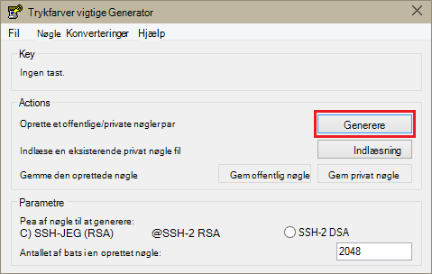
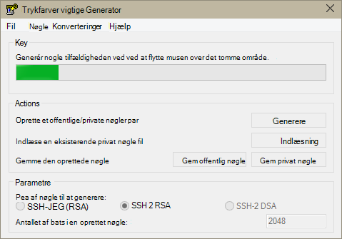
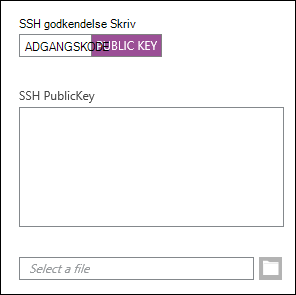
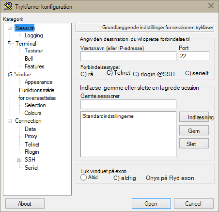
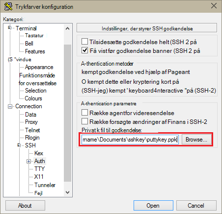
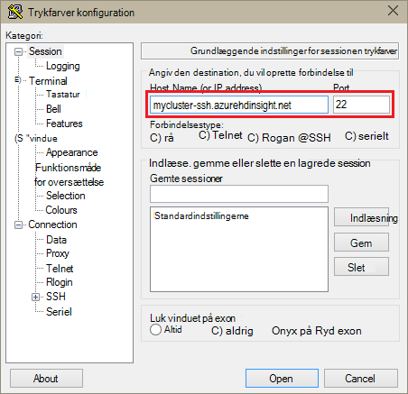
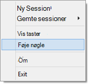
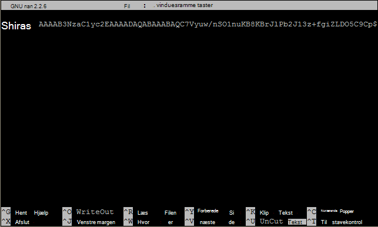

<properties
   pageTitle="Bruge SSH taster med Hadoop på Linux-baserede klynger fra Windows | Microsoft Azure"
   description="Lær at oprette og bruge SSH taster til at godkende Linux-baserede HDInsight klynger. Forbind klynger fra Windows-baserede klienter ved hjælp af trykfarver SSH klienten."
   services="hdinsight"
   documentationCenter=""
   authors="Blackmist"
   manager="jhubbard"
   editor="cgronlun"
    tags="azure-portal"/>

<tags
   ms.service="hdinsight"
   ms.devlang="na"
   ms.topic="get-started-article"
   ms.tgt_pltfrm="na"
   ms.workload="big-data"
   ms.date="08/30/2016"
   ms.author="larryfr"/>

#Bruge SSH med Linux-baserede Hadoop på HDInsight fra Windows

> [AZURE.SELECTOR]
- [Windows](hdinsight-hadoop-linux-use-ssh-windows.md)
- [Linux, Unix, OS X](hdinsight-hadoop-linux-use-ssh-unix.md)

[Secure Shell (SSH)](https://en.wikipedia.org/wiki/Secure_Shell) giver dig mulighed at udføre handlinger på din Linux-baserede HDInsight klynger ved hjælp af en kommandolinjen fra en fjernplacering. Dette dokument indeholder oplysninger om at oprette forbindelse til HDInsight fra Windows-baserede klienter ved hjælp af trykfarver SSH klienten.

> [AZURE.NOTE] Trinnene i denne artikel forudsætter, at du bruger en Windows-baseret klient. Hvis du bruger en Linux, Unix eller OS X-klienten, skal du se [Brug SSH med Linux-baserede Hadoop på HDInsight fra Linux, Unix, eller OS X](hdinsight-hadoop-linux-use-ssh-unix.md).
>
> Hvis du har Windows 10 og bruger [Bash på Ubuntu på Windows](https://msdn.microsoft.com/commandline/wsl/about), kan du bruge trinnene i den [Bruge SSH med Linux-baserede Hadoop på HDInsight fra Linux, Unix, eller OS X](hdinsight-hadoop-linux-use-ssh-unix.md) -dokument.

##Forudsætninger

* **Trykfarver** og **PuTTYGen** til Windows-baserede klienter. Disse funktioner er tilgængelige fra [http://www.chiark.greenend.org.uk/~sgtatham/putty/download.html](http://www.chiark.greenend.org.uk/~sgtatham/putty/download.html).

* En moderne webbrowser, der understøtter HTML5.

ELLER

* [Azure CLI](../xplat-cli-install.md).

    [AZURE.INCLUDE [use-latest-version](../../includes/hdinsight-use-latest-cli.md)] 

##Hvad er SSH?

SSH er et værktøj til logge på og fra en fjernplacering udfører kommandoer på en fjernserver. Med Linux-baserede HDInsight SSH fastlægger krypteret forbindelse til Klyngenoden hoved og viser en kommandolinje, som du kan bruge til at indtaste kommandoer. Derefter udføres kommandoerne direkte på serveren.

###SSH brugernavn

En SSH brugernavn er det navn, du bruger til at godkende HDInsight klynge. Når du angiver en SSH brugernavn under oprettelse af klynge, er denne bruger oprettet på alle noder i klyngen. Når klyngen er oprettet, kan du bruge dette brugernavn skal oprettes forbindelse til noderne HDInsight klynge hoved. Fra hoved noderne, kan du derefter oprette forbindelse til noderne enkelt medarbejder.

###SSH adgangskode eller offentlig nøgle

En SSH brugeren kan bruge en adgangskode eller offentlig nøgle til godkendelse. En adgangskode er bare en streng med tekst, du foretager, mens en offentlig nøgle er en del af et cryptographic vigtige par genereres entydigt identificerer du.

En nøgle er mere sikker end en adgangskode, men det kræver yderligere trin for at oprette nøglen, og du skal vedligeholde de filer, der indeholder nøglen i et sikkert sted. Hvis alle får adgang til de vigtigste filer, kan de få adgang til din konto. Eller hvis du mister de vigtigste filer, kan du ikke kan logge på din konto.

Et par vigtige består af en offentlig nøgle (som er sendt til HDInsight-serveren), og en privat nøgle (som er gemt på klientcomputeren.) Når du opretter forbindelse til HDInsight-serveren ved hjælp af SSH, bruge tasten private SSH klienten på computeren til at godkende med serveren.

##Oprette en SSH nøgle

Brug følgende oplysninger, hvis du har planer om at bruge SSH taster med din klynge. Hvis du har planer om at bruge en adgangskode, kan du springe dette afsnit.

1. Åbn PuTTYGen.

2. Vælg **SSH 2 RSA** **Type nøgle til at generere**, og klik derefter på **Opret**.

    

3. Flyt musen i området under statuslinjen, indtil værktøjslinjen udfylder. Flytte musen genererer tilfældige data, der bruges til at generere nøglen.

    

    Når nøglen er oprettet, vises den offentlige nøgle.

4. Du kan angive en adgangskode i feltet **nøgle adgangskoden** og derefter skrive den samme værdi i feltet **Bekræft adgangskode** for ekstra sikkerhed.

    

    > [AZURE.NOTE] Vi anbefaler, at du bruger en sikker adgangskoden for nøglen. Hvis du glemmer adgangskoden, findes der ingen måde at gendanne den.

5. Klik på **Gem privat nøgle** for at gemme nøglen i en **.ppk** fil. Denne tast bruges til at godkende din klynge Linux-baserede HDInsight.

    > [AZURE.NOTE] Du skal gemme denne tast i et sikkert sted, som det kan bruges til at få adgang til din klynge Linux-baserede HDInsight.

6. Klik på **Gem offentlig nøgle** for at gemme tasten som en **.txt** -fil. Dette kan du genbruge den offentlige nøgle i fremtiden, når du opretter flere Linux-baserede HDInsight klynger.

    > [AZURE.NOTE] Offentlig nøgle vises også øverst i PuTTYGen. Du kan højreklikke på feltet, kopiere værdien og derefter sætte det ind i en formular, når du opretter en klynge ved hjælp af portalen Azure.

##Oprette en Linux-baserede HDInsight klynge

Når du opretter en Linux-baserede HDInsight klynge, skal du angive den offentlige nøgle, der tidligere har oprettet. Fra Windows-baserede klienter er der to måder at oprette en Linux-baserede HDInsight klynge:

* **Azure Portal** - bruger en webbaseret portal til at oprette klyngen.

* **Azure CLI til Mac, Linux og Windows** - bruger kommandolinjen kommandoer til at oprette klyngen.

Hver af disse metoder kræver offentlig nøgle. Se [klargøring Linux-baserede HDInsight klynger](hdinsight-hadoop-provision-linux-clusters.md)detaljerede oplysninger om oprettelse af en Linux-baserede HDInsight klynge.

###Azure-portalen

Når du bruger [Azure Portal] [ preview-portal] for at oprette en Linux-baserede HDInsight klynge, skal du angive en **SSH brugernavn**og vælge for at angive en **adgangskode** eller **SSH offentlig nøgle**.

Hvis du vælger **SSH offentlig nøgle**, kan du enten indsætte offentlig nøgle (vises i den __offentlig nøgle for indsættelse i OpenSSH godkendt\_taster fil__ i PuttyGen,) i __SSH PublicKey__ felt, eller Vælg __Vælg en fil__ til at gennemse, og vælg den fil, der indeholder den offentlige nøgle.

Dette opretter et logon for den angivne bruger, og gør det muligt for godkendelse af adgangskode eller SSH nøgle-godkendelse.

###Azure kommandolinjen til Mac, Linux og Windows

Du kan bruge [Azure CLI til Mac, Linux og Windows](../xplat-cli-install.md) til at oprette en ny klynge ved hjælp af den `azure hdinsight cluster create` kommandoen.

Du kan finde flere oplysninger om brug af denne kommando [klargøring Hadoop Linux klynger i HDInsight ved hjælp af brugerdefinerede indstillinger](hdinsight-hadoop-provision-linux-clusters.md).

##Oprette forbindelse til en Linux-baserede HDInsight klynge

1. Åbn trykfarver.

    

2. Hvis du har angivet en SSH nøgle, da du oprettede din brugerkonto, skal du udføre følgende trin for at markere den private nøgle skal anvendes ved godkendelse til klyngen:

    Udvid **forbindelse**i **kategori**, udvide **SSH**, og vælg **Auth**. Til sidst, klik på **Gennemse** , og vælg den fil, .ppk, der indeholder din private nøgle.

    

3. Vælg **Session**i **kategori**. Angiv SSH adressen på din HDInsight server fra skærmbilledet **grundlæggende indstillinger for sessionen trykfarver** i feltet **værtsnavn (eller IP-adresse)** . Der er to mulige SSH adresser du kan bruge, når du opretter forbindelse til en klynge:

    * __I afsnit nodeadresse__: Hvis du vil oprette forbindelse til noden hoved af klyngen, Brug klyngenavnet på din, derefter **-ssh.azurehdinsight.net**. For eksempel, **mycluster ssh.azurehdinsight.net**.
    
    * __Kant nodeadresse__: Hvis du opretter forbindelse til en Server til R på HDInsight klynge, du kan oprette forbindelse til noden R Server kant ved hjælp af adressen __RServer.CLUSTERNAME.ssh.azurehdinsight.net__, hvor CLUSTERNAME er navnet på din klynge. For eksempel, __RServer.mycluster.ssh.azurehdinsight.net__.

    

4. Angiv et navn til denne forbindelse under **Gemt sessioner**for at gemme forbindelsesoplysningerne til senere brug, og klik derefter på **Gem**. Forbindelsen, føjes til listen over gemte sessioner.

5. Klik på **Åbn** for at oprette forbindelse til klyngen.

    > [AZURE.NOTE] Hvis dette er første gang du har knyttet til klyngen, får du en sikkerhedsadvarsel. Dette er normalt. Vælg **Ja** til at cachelagre serverens RSA2 tast for at fortsætte.

6. Når du bliver bedt om det, kan du angive den bruger, du har angivet, da du oprettede klyngen. Hvis du har angivet en adgangskode til brugeren, bliver du bedt om at angive det også.

> [AZURE.NOTE] Ovenstående trin forudsætter, at du bruger port 22, som opretter forbindelse til den primære headnode på HDInsight klynge. Hvis du bruger port 23, kan du oprette forbindelse til sekundært. Se [tilgængelighed og pålidelighed af Hadoop klynger i HDInsight](hdinsight-high-availability-linux.md)kan finde flere oplysninger om noderne hoved.

###Oprette forbindelse til arbejder noder

Noderne arbejder er ikke direkte tilgængelige fra uden for det Azure datacenter, men de kan åbnes fra Klyngenoden hoved via SSH.

Hvis du har angivet en SSH nøgle, da du oprettede din brugerkonto, skal du udføre følgende trin for at bruge den private nøgle, når godkendelse til klyngen, hvis du vil oprette forbindelse til noderne arbejder.

1. Du kan installere Pageant fra [http://www.chiark.greenend.org.uk/~sgtatham/putty/download.html](http://www.chiark.greenend.org.uk/~sgtatham/putty/download.html). Denne funktion bruges til at cachelagre SSH taster til trykfarver.

2. Køre Pageant. Det minimeres til et ikon i status bakke. Højreklik på ikonet, og vælg **Tilføj nøgle**.

    

3. Når der vises dialogboksen gennemse, Vælg den fil, .ppk, der indeholder nøglen, og klik derefter på **Åbn**. Dette indsætter tasten Pageant, som får det til trykfarver ved oprettelse af forbindelse til klyngen.

    > [AZURE.IMPORTANT] Hvis du har brugt en SSH nøgle til at sikre din konto, skal du udføre de forrige trin, før du vil kunne oprette forbindelse til arbejder noder.

4. Åbn trykfarver.

5. Hvis du bruger en SSH nøgle til at godkende, i sektionen **kategori** Udvid **forbindelse**, udvide **SSH**, og vælg derefter **Auth**.

    Aktivere **Tillad agent for videresendelse**i sektionen **godkendelsesparametre** . Dette giver mulighed for trykfarver til at overføre certifikatgodkendelse via forbindelsen til Klyngenoden hoved automatisk, når du opretter forbindelse til arbejder noder.

    

6. Oprette forbindelse til klyngen, som beskrevet tidligere. Hvis du bruger en SSH nøgle til godkendelse, behøver du ikke har markeret nøglen - tasten SSH føjet til Pageant bruges til at godkende til klyngen.

7. Når forbindelsen er oprettet, kan du bruge følgende til at hente en liste over knuderne i din klynge. Erstat *ADMINPASSWORD* med adgangskoden til din klynge administratorkonto. Erstat *CLUSTERNAME* med navnet på din klynge.

        curl --user admin:ADMINPASSWORD https://CLUSTERNAME.azurehdinsight.net/api/v1/hosts

    Dette vil returnere oplysninger i JSON format for knuderne i klynge, herunder `host_name`, som indeholder det fulde domænenavn (fulde Domænenavn) for hver enkelt node. Følgende er et eksempel på en `host_name` post, der returneres af kommandoen **curl** :

        "host_name" : "workernode0.workernode-0-e2f35e63355b4f15a31c460b6d4e1230.j1.internal.cloudapp.net"

8. Når du har en liste over noderne arbejder, du vil oprette forbindelse til, kan du bruge følgende kommando fra trykfarver sessionen til at åbne en forbindelse til en kollega node:

        ssh USERNAME@FQDN

    Erstat *brugernavn* med din SSH brugernavn og den *fulde Domænenavn* med det fulde Domænenavn for noden arbejder. For eksempel `workernode0.workernode-0-e2f35e63355b4f15a31c460b6d4e1230.j1.internal.cloudapp.net`.

    > [AZURE.NOTE] Hvis du bruger en adgangskode til godkendelse sessionen SSH, bliver du bedt om at angive adgangskoden igen. Hvis du bruger en SSH nøgle, skal forbindelsen afsluttes uden nogen prompter.

9. Når sessionen er blevet oprettet, på prompten for sessionen trykfarver ændres fra `username@hn#-clustername` til `username@wn#-clustername` til at angive, at du har forbindelse til noden arbejder. Du kører på dette tidspunkt kommandoer kan køre på noden arbejder.

10. Når du er færdig med at udføre handlinger på noden arbejder, kan du bruge den `exit` kommando for at lukke sessionen til noden arbejder. Dette vil returnere du den `username@hn#-clustername` prompt.

##Tilføje flere konti

Hvis du vil tilføje flere konti til din klynge skal du udføre følgende trin:

1. Oprette en ny offentlig nøgle og privat nøgle til den nye brugerkonto, som beskrevet tidligere.

2. Tilføje den nye bruger med følgende kommando fra en SSH session til klyngen:

        sudo adduser --disabled-password <username>

    Dette opretter en ny brugerkonto, men deaktiverer godkendelse af adgangskode.

3. Opret mappe og filer til at holde tasten ved hjælp af følgende kommandoer:

        sudo mkdir -p /home/<username>/.ssh
        sudo touch /home/<username>/.ssh/authorized_keys
        sudo nano /home/<username>/.ssh/authorized_keys

4. Når nanosystemer editor åbnes, skal du kopiere og indsætte indholdet af den offentlige nøgle for den nye brugerkonto. Til sidst skal bruge **Ctrl + X for** at gemme filen og afslutte editoren.

    

5. Brug følgende kommando til at ændre ejerskabet af .ssh mappen og indhold til den nye brugerkonto:

        sudo chown -hR <username>:<username> /home/<username>/.ssh

6. Du bør nu kunne godkendes af serveren med ny brugerkonto og privat nøgle.

##SSH tunnelføring

SSH kan bruges til at tunnel lokale anmodninger, som web anmodninger om, at HDInsight klyngen. Anmodningen sendes derefter til den ønskede ressource, som om den havde stammer på den HDInsight klynge hovedsæde node.

> [AZURE.IMPORTANT] En SSH tunnel er et krav for at få adgang til internettet brugergrænseflade for nogle Hadoop-tjenester. For eksempel kan både Job oversigt over Brugergrænsefladen eller Ressourcestyring brugergrænseflade kun åbnes ved hjælp af en SSH tunnel.

Se [Brug SSH tunnel til adgang til Ambari web brugergrænseflade, Ressourcestyring, JobHistory, NameNode, Oozie, og andre web Brugergrænsefladens](hdinsight-linux-ambari-ssh-tunnel.md)kan finde flere oplysninger om oprettelse og brug af en SSH tunnel.

##Næste trin

Nu hvor du ved, hvordan godkende ved hjælp af en SSH nøgle, Lær at bruge MapReduce med Hadoop på HDInsight.

* [Bruge Hive med HDInsight](hdinsight-use-hive.md)

* [Brug gris med HDInsight](hdinsight-use-pig.md)

* [Brug MapReduce sager med HDInsight](hdinsight-use-mapreduce.md)

[preview-portal]: https://portal.azure.com/
