<properties
   pageTitle="Overvåge og administrere HDInsight klynger ved hjælp af Apache Ambari Webbrugergrænsefladen | Microsoft Azure"
   description="Lær, hvordan du bruger Ambari til at overvåge og administrere Linux-baserede HDInsight klynger. I dette dokument lærer du, hvordan du bruger Ambari Webbrugergrænsefladen inkluderet med HDInsight klynger."
   services="hdinsight"
   documentationCenter=""
   authors="Blackmist"
   manager="jhubbard"
   editor="cgronlun"
    tags="azure-portal"/>

<tags
   ms.service="hdinsight"
   ms.devlang="na"
   ms.topic="article"
   ms.tgt_pltfrm="na"
   ms.workload="big-data"
   ms.date="09/27/2016"
   ms.author="larryfr"/>

#Administrere HDInsight klynger ved hjælp af brugergrænsefladen i Ambari Web.

[AZURE.INCLUDE [ambari-selector](../../includes/hdinsight-ambari-selector.md)]

Apache Ambari forenkler for administration og overvågning af en Hadoop-klynge ved at indsende en nem at bruge web Brugergrænsefladen og REST-API. Ambari findes på Linux-baserede HDInsight klynger og bruges til at overvåge klyngen og foretage ændringer i konfigurationen.

I dette dokument lærer du, hvordan du bruger Ambari Webbrugergrænsefladen med en HDInsight klynge.

##Hvad er Ambari?

<a href="http://ambari.apache.org" target="_blank">Apache Ambari</a> gør Hadoop management enklere ved at indsende en nemt bruge web brugergrænseflade, der kan bruges til at klargøre, administrere og overvåge Hadoop klynger. Udviklere kan integrere disse funktioner i deres programmer ved hjælp af <a href="https://github.com/apache/ambari/blob/trunk/ambari-server/docs/api/v1/index.md" target="_blank">Ambari REST API'er</a>.

Ambari Webbrugergrænsefladen er angivet som standard med Linux-baserede HDInsight klynger. 

##Forbindelse

Ambari Webbrugergrænsefladen er tilgængelig på din HDInsight klynge på HTTPS://CLUSTERNAME.azurehdidnsight.net, hvor __CLUSTERNAME__ er navnet på din klynge. 

> [AZURE.IMPORTANT] Oprette forbindelse til Ambari på HDInsight kræver HTTPS. Du skal også godkende til Ambari ved hjælp af det administrator kontonavn (standard er __administrator__), og den adgangskode, du angav, da klyngen blev oprettet.

##SSH proxy

> [AZURE.NOTE] Mens Ambari for din klynge er tilgængeligt direkte via internettet, nogle links fra Ambari Webbrugergrænsefladen (f.eks som JobTracker,) vises ikke på internettet. Så modtager "server ikke fundet" fejl, når du forsøger at få adgang til disse funktioner, medmindre du bruger en Secure Shell (SSH) tunnel til proxy webtrafik til Klyngenoden hoved.

Oplysninger om oprettelse af en SSH tunnel til at arbejde med Ambari, kan du se [Brug SSH tunnel til adgang til Ambari web brugergrænseflade, Ressourcestyring, JobHistory, NameNode, Oozie, og andre web Brugergrænsefladens](hdinsight-linux-ambari-ssh-tunnel.md).

##Ambari Web brugergrænseflade

Ved tilslutning til Ambari Webbrugergrænseflade, bliver du bedt om at godkende til siden. Brug klynge administrator bruger (standard administrator) og adgangskode, du brugte under oprettelse af klynge.

Når siden åbnes, skal du være opmærksom på linjen øverst. Dette resultat indeholder følgende oplysninger og kontrolelementer:

* **Ambari logo** - åbnes dashboard, der kan bruges til at overvåge klyngen.

* **Klynge navn # ops** - viser antallet af igangværende Ambari handlinger. Valg af klyngenavnet eller **# ops** vises en liste over handlinger i baggrunden.

* **# beskeder** - advarsler eller vigtige beskeder, hvis det er relevant for-klyngen. Hvis du markerer dette, vises en liste over beskeder.

* **Dashboard** - viser dashboard.

* **Services** - oplysninger og konfiguration af indstillinger for tjenester i klyngen.

* **Hosts** - oplysninger og konfiguration af indstillinger for knuderne i klyngen.

* **Beskeder** - en logfil over oplysninger, advarsler og vigtige beskeder.

* **Administrator** - Software stak/tjenester, der er installeret på den klynge, kontooplysningerne-tjenesten og Kerberos sikkerhed.

* **Knappen Admin** - Ambari administration, indstillinger og log.

##Overvågning

###Beskeder

Ambari indeholder mange påmindelser, som har et af følgende som status:

* **Ok**

* **Advarsel**

* **KRITISK**

* **UKENDT**

Beskeder end **OK** medfører **# beskeder** posten øverst på siden for at få vist antallet af beskeder. Hvis du vælger denne post vises de vigtige beskeder og deres status.

Beskeder er organiseret i flere standardgrupper, der kan ses fra siden **beskeder** .

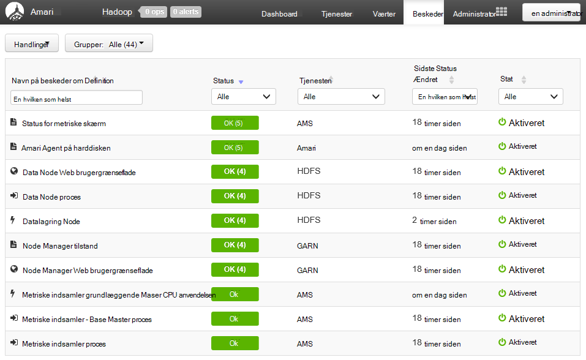

Du kan administrere grupperne ved hjælp af menuen **Handlinger** og vælge **Administrer beskeder om grupper**. Dette giver dig mulighed at ændre eksisterende grupper eller oprette nye grupper.

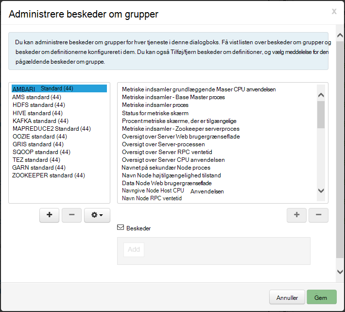

Du kan også oprette påmindelser fra menuen **Handlinger** . Dette kan du oprette udløsere, sender meddelelser via **mail** eller **SNMP** , når der optræder bestemte besked/alvorlighed kombinationer. For eksempel kan du sende en besked, når et eller flere af de vigtige beskeder i gruppen **GARN standard** er indstillet til **kritisk**.

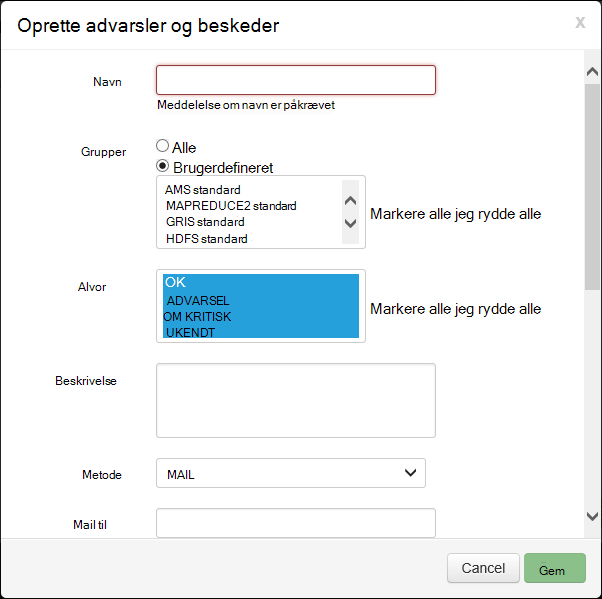

###Klynge

Fanen **målepunkter** af dashboardet indeholder en række knapper, som gør det nemt at overvåge statussen for din klynge et hurtigt overblik. Flere knapper, såsom **CPU-brug**, angive yderligere oplysninger, når der klikkes på.

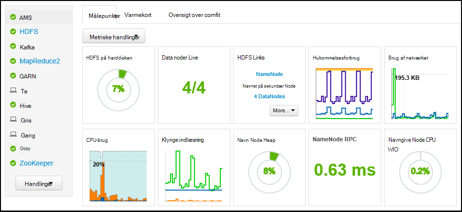

Fanen **Heatmaps** viser målepunkter som farvede heatmaps, går fra grøn til rød.

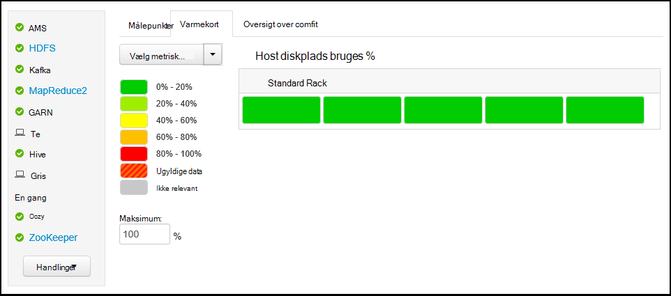

Vælg **Hosts**kan finde mere detaljerede oplysninger om noderne inden for klyngen, og vælg derefter den specifikke node, du er interesseret i.

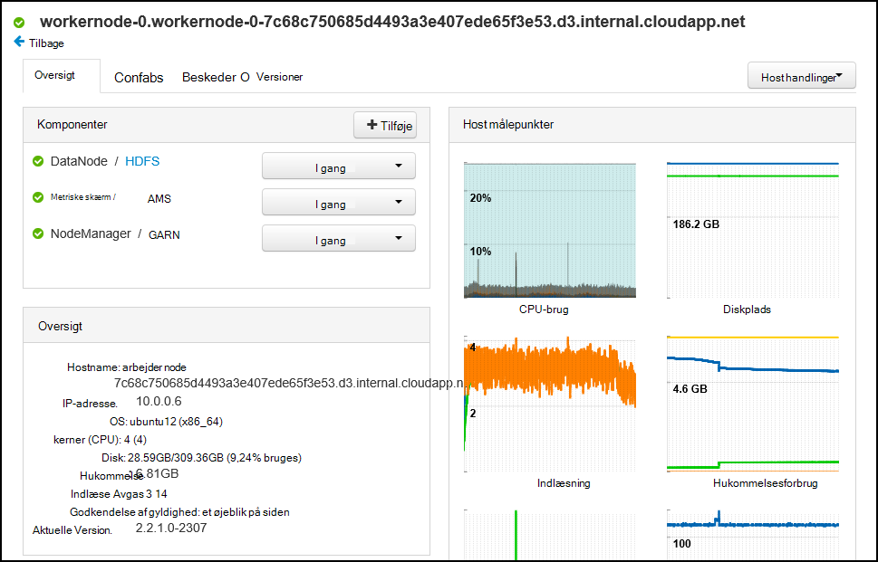

###Tjenester

**Services** sidepanelet på dashboardet giver hurtig indsigt i status for de tjenester, der kører på klyngen. Forskellige ikoner bruges til at angive status eller handlinger, der skal udføres, såsom symbolet gule Papirkurv, hvis en tjeneste skal genbruges.

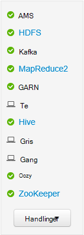

Valg af en tjeneste vises mere detaljerede oplysninger om tjenesten.

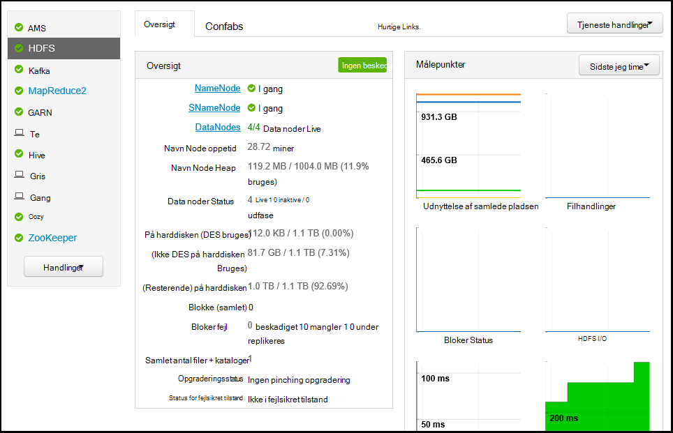

####Hurtige links

Nogle af tjenesterne vises et link af **Hurtige Links** øverst på siden. Dette kan bruges til at få adgang til tjenestens web computerens brugergrænseflade, f.eks.:

* **En oversigt over** - MapReduce jobs.

* **Ressourcestyring** - GARN ressourcestyring brugergrænseflade.

* **NameNode** - Hadoop-distribueret fil System (HDFS) NameNode brugergrænseflade.

* **Oozie Web brugergrænseflade** - Oozie brugergrænseflade.

Vælge en af disse links, åbnes en ny fane i browseren, som vises den markerede side.

> [AZURE.NOTE] Vælge en **Hurtige Links** link for alle tjenester resulterer i fejlen "server ikke fundet", medmindre du bruger en Secure Sockets Layer (SSL) tunnel til proxy webtrafik til klyngen. Dette skyldes, at de webprogrammer, der bruges til at vise disse oplysninger ikke vises på internettet.
>
> Se oplysninger om brug af en SSL-tunnel med HDInsight, [Brug SSH tunnel til adgang til Ambari web brugergrænseflade, Ressourcestyring, JobHistory, NameNode, Oozie, og andre web Brugergrænsefladens](hdinsight-linux-ambari-ssh-tunnel.md)

##Administration

###Ambari brugere, grupper og tilladelser

Administration af brugere, grupper og tilladelser skal ikke bruges med HDInsight klynger.

###Værter

Siden **Hosts** viser alle værter i klyngen. Hvis du vil administrere hosts, skal du følge disse trin.

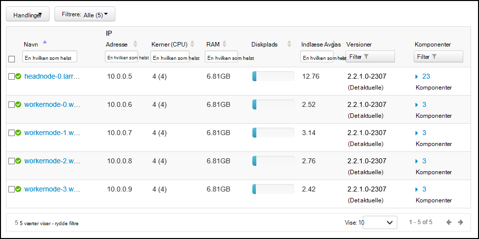

> [AZURE.NOTE] Tilføje, udfase eller recommissioning en vært skal ikke bruges med HDInsight klynger.

1. Vælg den host(s), du vil administrere.

2. Brug menuen **Handlinger** til at vælge den handling, du vil udføre:

    * **Start alle komponenter** – Start alle komponenter på værten.

    * **Stoppe alle komponenter** - Stop alle komponenter på værten.

    * **Genstart alle komponenter** - Stop, og start alle komponenter på værten.

    * **Slå Vedligeholdelsestilstand** - undertrykker beskeder for værten. Dette bør være aktiveret, hvis du vil udføre handlinger, der genererer påmindelser, såsom at genstarte en tjeneste, som er afhængige tjenester, der kører på.

    * **Deaktivere Vedligeholdelsestilstand** – returnerer værten til normal advarer.

    * **Stoppe** - Stop DataNode eller NodeManagers på værten.

    * **Start** - starter DataNode eller NodeManagers på værten.

    * **Genstart** - stopper og starter DataNode eller NodeManagers på værten.

    * **Decommission** - fjerner en vært fra klyngen.

        > [AZURE.NOTE] Brug ikke denne handling på HDInsight klynger.

    * **Recommission** - tilføjer en tidligere afvikles vært til klyngen.

        > [AZURE.NOTE] Brug ikke denne handling på HDInsight klynger.

###Tjenester

Brug knappen **Handlinger** i bunden af listen over tjenester til at stoppe og starte alle tjenester fra siden **Dashboard** eller **tjenester** .

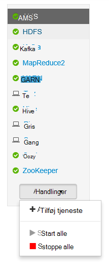

> [AZURE.WARNING] Mens __Tilføj tjeneste__ står anført i denne menu, der det ikke bør benyttes til at føje tjenester til HDInsight klynge. Nye tjenester, der skal tilføjes ved hjælp af handlingen Script under klynge klargøringen. Du kan finde flere oplysninger om brug af scripthandlinger, [tilpasse HDInsight klynger ved hjælp af scripthandlinger](hdinsight-hadoop-customize-cluster-linux.md).

Mens knappen **Handlinger** kan genstarte alle tjenester, vil ofte du starte, stoppe eller genstarte en bestemt tjeneste. Brug følgende trin til at udføre handlinger på en bestemt tjeneste:

1. Vælg en tjeneste på siden **Dashboard** eller **tjenester** .

2. Brug knappen **Tjeneste handlinger** fra toppen af under fanen **Oversigt** , og vælg handlingen, der skal tage. Dette genstartes tjenesten på alle noder.

    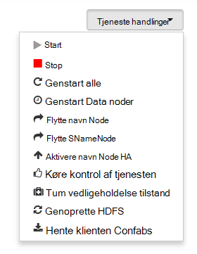

    > [AZURE.NOTE] Genstart nogle af tjenesterne, mens der kører på klynge kan generere beskeder. Du kan bruge knappen **Tjeneste handlinger** til at aktivere **Vedligeholdelsestilstand** for tjenesten før du udfører på Genstart for at undgå dette ved.

3. Når en handling, der er valgt, øge posten **# op** øverst på siden for at få vist, at en Baggrundshandling af bliver til virkelighed. Hvis konfigureret til at vise, vises på listen over handlinger i baggrunden.

    > [AZURE.NOTE] Hvis du har aktiveret **Vedligeholdelsestilstand** for tjenesten, huske at deaktivere den ved hjælp af knappen **Tjeneste handlinger** , når handlingen afsluttes.

For at konfigurere en tjeneste skal du følge nedenstående trin:

1. Vælg en tjeneste på siden **Dashboard** eller **tjenester** .

2. Vælg fanen **konfigurationer** . Den aktuelle konfiguration vises. En oversigt over tidligere konfigurationer vises også.

    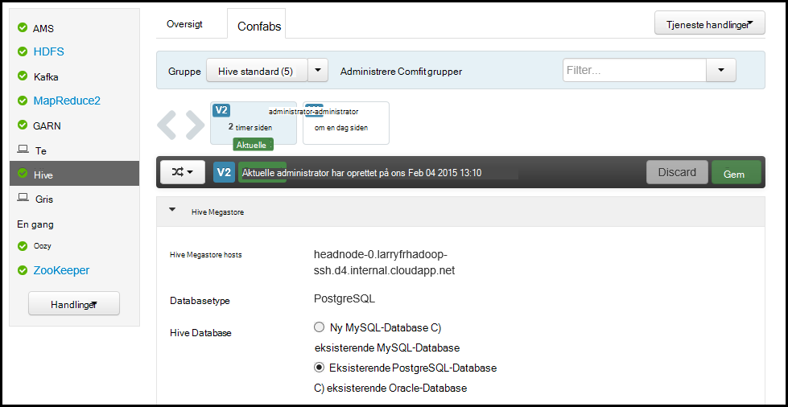

3. Brug de felter, der vises for at ændre konfigurationen, og vælg derefter **Gem**. Eller Vælg en tidligere konfiguration, og vælg derefter **gøre aktuel** at vende tilbage til de tidligere indstillinger.

##Ambari visninger

Ambari visninger kan udviklere sætte elementer i Brugergrænsefladen i Ambari Webbrugergrænsefladen ved hjælp af [Ambari visninger Framework](https://cwiki.apache.org/confluence/display/AMBARI/Views). HDInsight indeholder følgende visninger med Hadoop klynge typer:

* Garn kø Manager: kø manager indeholder en enkel brugergrænseflade til visning og redigering af GARN køer.
* Hive visning: Visningen Hive kan du køre Hive forespørgsler direkte fra din webbrowser. Du kan gemme forespørgsler, få vist resultaterne, Gem resultater til klynge lager eller hente resultater til det lokale system. Du kan finde flere oplysninger om brug af Hive visninger, [Brug Hive visninger med HDInsight](hdinsight-hadoop-use-hive-ambari-view.md).
* Tez visning: Fanen Tez View kan du bedre kan forstå og optimere job ved at få vist oplysninger om hvordan Tez skal udføres, og hvilke ressourcer, der anvendes af jobbet.
