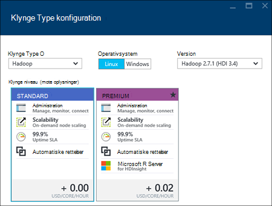
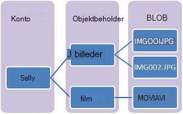
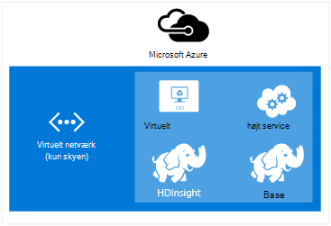

<properties
    pageTitle="Oprette Hadoop, HBase, Storm eller knallertmotor klynger på Linux i HDInsight | Microsoft Azure"
    description="Lær at oprette Hadoop, HBase, Storm eller sætte gang klynger på Linux til HDInsight ved hjælp af en browser, Azure CLI, Azure PowerShell, RESTEN, eller via en SDK."
    services="hdinsight"
    documentationCenter=""
    authors="mumian"
    manager="jhubbard"
    editor="cgronlun"
    tags="azure-portal"/>

<tags
    ms.service="hdinsight"
    ms.devlang="na"
    ms.topic="article"
    ms.tgt_pltfrm="na"
    ms.workload="big-data"
    ms.date="10/18/2016"
    ms.author="jgao"/>

# Oprette Linux-baserede Hadoop klynger i HDInsight

[AZURE.INCLUDE [selector](../../includes/hdinsight-selector-create-clusters.md)]

En Hadoop klynge består af flere virtuelle maskiner (noder), der bruges til fordelt behandling af opgaver på klyngen. Azure abstracts implementering oplysninger om installation og konfiguration af individuelle noder, så du kun skal angive af generelle konfigurationsoplysninger. I denne artikel kan du få mere at vide om disse indstillinger for søgekonfiguration.

## Krav til Access

[AZURE.INCLUDE [access-control](../../includes/hdinsight-access-control-requirements.md)]

## Typer af klynge

I øjeblikket indeholder Azure HDInsight fem forskellige typer klynger, hver med et sæt komponenter til at levere visse funktioner.

| Klynge type | Funktionalitet |
| ------------ | ----------------------------- |
| Hadoop       | Forespørgsel og analyse (batchjob)     |
| HBase        | NoSQL datalagring            |
| Storm        | Behandling af realtid hændelse |
| Knallertmotor        | I hukommelsen behandling, interaktive forespørgsler micro batchen stream behandling |
| [Interaktive Hive (Preview)](hdinsight-hadoop-use-interactive-hive.md) | I hukommelsen cachelagring af interaktive og hurtigere Hive-forespørgsler|
| R Server på knallertmotor (Preview) | En række forskellige big data statistik, skønnet modellering og machine learning-funktioner |

Hver klynge type har sit eget antal noder inden for klyngen, terminologi for noder inden for klyngen og VM standardstørrelsen for hver nodetype. I følgende tabel er antallet af knuder for hver nodetype i parenteser.

| Type| Noder | Diagram|
|-----|------|--------|
|Hadoop| I afsnit node (2) datanode (1 +)||
|HBase|Hoved-server (2), område-server (1 +), Master/Zookeeper node (3)||
|Storm|Nimbus node (2), overordnede server (1 +), Zookeeper node (3)||
|Knallertmotor|I afsnit node (2), arbejder node (1 +), Zookeeper node (3) (gratis for A1 Dyrepasserne VM størrelse)||

I følgende tabel vises VM standardstørrelser til HDInsight:

- Alle understøttede områder undtagen Brasilien sydlige og vestlige Japan:

  	|Klynge type                     | Hadoop               | HBase                | Storm                | Knallertmotor                                                                 | R-Server |
  	|---------------------------------|----------------------|----------------------|----------------------|-----------------------------------------------------------------------|-----------------------------------------------------------------------|
  	|Hoved – standard VM størrelse           | D3 v2                | D3 v2                | A3                   | D12 v2                                                                | D12 v2                                                                |
  	|Hoved – anbefalede VM størrelser      | D3 v2, D4 v2, D12 v2 | D3 v2, D4 v2, D12 v2 | A3, A4, A5           | D12 v2, D13 v2, D14 v2                                                | D12 v2, D13 v2, D14 v2                                                |
  	|Arbejder – standard VM størrelse         | D3 v2                | D3 v2                | D3 v2                | Windows: D12 v2; Linux: D4 v2                                         | Windows: D12 v2; Linux: D4 v2                                         |
  	|Arbejder – anbefalede VM størrelser    | D3 v2, D4 v2, D12 v2 | D3 v2, D4 v2, D12 v2 | D3 v2, D4 v2, D12 v2 | Windows: D12 v2, D13 v2, D14 v2; Linux: D4 v2 D12 v2 D13 v2, og D14 v2 | Windows: D12 v2, D13 v2, D14 v2; Linux: D4 v2 D12 v2 D13 v2, og D14 v2 |
  	|Zookeeper – standard VM størrelse      |                      | A3                   | A2                   |                                                                       |
  	|Zookeeper – anbefalede VM størrelser |                      | A3, A4, A5           | A2, A3, A4           |                                                                       |
  	|Kant - standard VM størrelse           |                      |                      |                      |                                                                       | Windows: D12 v2; Linux: D4 v2                                         |
  	|Kant - anbefalet VM størrelse       |                      |                      |                      |                                                                       | Windows: D12 v2, D13 v2, D14 v2; Linux: D4 v2 D12 v2 D13 v2, og D14 v2 |

- Brasilien syd og Japan Vest kun (ingen v2 størrelser her):

  	|Klynge type                     | Hadoop      | HBase       | Storm      | Knallertmotor                                          |R-Server|
  	|---------------------------------|-------------|-------------|------------|------------------------------------------------|--------|
  	|Hoved – standard VM størrelse           | D3          | D3          | A3         | D12                                            | D12|
  	|Hoved – anbefalede VM størrelser      | D3, D4, D12 | D3, D4, D12 | A3, A4, A5 | D12, D13 D14                                  | D12, D13 D14|
  	|Arbejder – standard VM størrelse         | D3          | D3          | D3         | Windows: D12; Linux: D4                        | Windows: D12; Linux: D4|
  	|Arbejder – anbefalede VM størrelser    | D3, D4, D12 | D3, D4, D12 | D3, D4, D12| Windows: D12, D13 D14; Linux: D4, D12, D13 D14| Windows: D12, D13 D14; Linux: D4, D12, D13 D14|
  	|Zookeeper – standard VM størrelse      |             | A2          | A2         |                                                | |
  	|Zookeeper – anbefalede VM størrelser |             | A2, A3, A4  | A2, A3, A4 |                                                | |
  	|Kant-standard VM størrelser          |             |             |            |                                                | Windows: D12; Linux: D4 |
  	|Kant-anbefalede VM størrelser      |             |             |            |                                                | Windows: D12, D13 D14; Linux: D4, D12, D13 D14 |

Bemærk, at i afsnit er kendt som *Nimbus* Storm klynge type. Bruger, der kendes som *område* for typen HBase klynge og som *overordnede* Storm klynge type.

> [AZURE.IMPORTANT] Hvis du vil have mere end 32 arbejder noder, enten ved klynge oprettelse eller ved at skalere klyngen efter oprettelse af, skal du vælge en hoved node størrelse med mindst 8 kerner og 14 GB RAM.

Du kan føje andre komponenter som farvetone eller R til disse grundlæggende typer ved hjælp af [Scripthandlinger](#customize-clusters-using-script-action).

> [AZURE.IMPORTANT] HDInsight klynger kommer i en række forskellige typer, der svarer til det arbejdsbelastningen eller den teknologi, der er tilpasset klyngen til. Der er ingen understøttet metode til at oprette en klynge, der kombinerer flere typer, som Storm og HBase på en klynge. 

Hvis din løsning kræver teknologier, der fordeles på tværs af flere HDInsight klynge typer, skal du oprette et virtuelt Azure-netværk og oprette de nødvendige klynge typer inden for det virtuelle netværk. Dette giver mulighed for klynger og en hvilken som helst kode, du installerer i dem, at kommunikere direkte med hinanden.

Du kan finde flere oplysninger om brug af et virtuelt Azure-netværk med HDInsight, [Udvide HDInsight med Azure virtuelle netværk](hdinsight-extend-hadoop-virtual-network.md).

Du kan finde et eksempel på brug af to typer af klynge i et virtuelt netværk med Azure [analysér føler data med Storm og HBase](hdinsight-storm-sensor-data-analysis.md).

## Klynge niveauer

Azure HDInsight giver stor data skyen tilbud i to kategorier: Standard og [Premium](hdinsight-component-versioning.md#hdinsight-standard-and-hdinsight-premium). HDInsight Premium omfatter R og andre yderligere komponenter. HDInsight Premium understøttes kun på HDInsight version 3.4.

I følgende tabel vises den HDInsight klynge type og HDInsight Premium support matrix.

| Klynge type | Standard | Premium  |
|--------------|---------------|--------------|
| Hadoop       | Ja           | Ja          |
| Knallertmotor        | Ja           | Ja          |
| HBase        | Ja           | Nej           |
| Storm        | Ja           | Nej           |
| R Server på knallertmotor | Nej | Ja |

I denne tabel opdateres, når flere klynge typer er inkluderet i HDInsight Premium. Følgende skærmbillede viser Azure portalen oplysninger for at vælge klynge typer.

## Grundlæggende indstillinger

Følgende er de grundlæggende indstillinger, der bruges til at oprette en HDInsight klynge.

### Klyngenavn ###

Klyngenavn bruges til at identificere en klynge. Klyngenavnet skal være entydigt globalt, og det skal overholde følgende retningslinjer for navngivning:

- Feltet skal være en streng, der indeholder mellem 3 og 63 tegn.
- Feltet kan indeholde kun bogstaver, tal og bindestreger.

### Klynge type###

Se [klynge filtyper](#cluster-types) og [klynge niveauer](#cluster-tiers).

### Operativsystem ###

Du kan oprette HDInsight klynger på en af følgende to operativsystemer:

- HDInsight på Linux.  HDInsight giver mulighed for at konfigurere Linux klynger på Azure. Konfigurere en Linux klynge, hvis du allerede kender, Linux eller Unix, skifte fra en eksisterende Hadoop-Linux-baseret løsning, eller vil nem integration med Hadoop økosystemet komponenter er bygget til Linux. Yderligere oplysninger finder du se [komme i gang med Hadoop på Linux i HDInsight](hdinsight-hadoop-linux-tutorial-get-started.md).
- HDInsight i Windows (Windows Server 2012 R2 Datacenter).

### HDInsight version###

Det bruges til at bestemme versionen af HDInsight, der kræves for denne klynge. Få mere at vide under [Hadoop klynge versioner og komponenter i HDInsight](https://go.microsoft.com/fwLink/?LinkID=320896&clcid=0x409).

### Navn på abonnement###

Hver HDInsight klynge er knyttet til ét Azure abonnement.

### Ressource gruppenavn ###

[Azure ressourcestyring](../azure-resource-manager/resource-group-overview.md) til at arbejde med ressourcerne, der i dit program som en gruppe, kaldes en Azure ressourcegruppe. Du kan installere, opdatere, overvåge eller slette alle ressourcerne for dit program i en enkelt koordineret handling.

### Legitimationsoplysninger###

Du kan konfigurere to brugerkonti under oprettelse af klynge med HDInsight klynger:

- HTTP-brugere. Standardnavnet er *administrator* ved hjælp af den grundlæggende konfiguration på Azure-portalen. Nogle gange hedder den "Klynge bruger".
- SSH bruger (Linux klynger). Det bruges til at oprette forbindelse til den klynge ved hjælp af SSH. Når klyngen er oprettet ved at følge trinnene i [Brug SSH med Linux-baserede Hadoop på HDInsight fra Linux, Unix, eller OS X](hdinsight-hadoop-linux-use-ssh-unix.md) eller [Brug SSH med Linux-baserede Hadoop på HDInsight fra Windows](hdinsight-hadoop-linux-use-ssh-unix.md), kan du oprette ekstra SSH brugerkonti.

    >[AZURE.NOTE] Du kan oprette en RDP bruger til at oprette forbindelse til den klynge ved hjælp af RDP til Windows-baserede klynger.

### Datakilde###

Det oprindelige Hadoop-distribueret filsystem (HDFS) bruger mange lokale drev på klyngen. HDInsight bruger Azure Blob-lager til lagring af data. Azure Blob-lager er en robust, generel storageløsning, der integreres problemfrit med HDInsight. Gennem en HDFS grænseflade, kan det samlede sæt af komponenter i HDInsight fungere direkte på strukturerede eller ustrukturerede data i Blob-lager. Lagring af data i Blob-lager, kan du sikkert at slette de HDInsight klynger, der bruges til beregning uden at miste brugerdata.

Under konfiguration, skal du angive en Azure-lager-konto og en objektbeholder til lagring af Azure Blob på kontoen Azure-lager. Nogle oprettelse af processer kræver kontoen Azure-lager og objektbeholderen til lagring af Blob oprettes på forhånd. Objektbeholderen til lagring af Blob bruges som standardplaceringen af klyngen. Du kan eventuelt angive yderligere Azure-lager-konti (sammenkædede storage), der skal være tilgængelig for klyngen. Klyngen kan også få adgang til en hvilken som helst Blob objektbeholdere, der er konfigureret med fuld offentlige læseadgang eller offentlige læseadgang for BLOB kun.  Få mere at vide under [Administrere adgang til Azure lagerplads ressourcer](../storage/storage-manage-access-to-resources.md).

>[AZURE.NOTE] En objektbeholder til lagring af Blob indeholder en gruppering af et sæt af blob, som vist på følgende billede.

Vi anbefaler ikke bruge standard Blob storage objektbeholder til lagring af forretningsdata. Slette objektbeholderen standard Blob-lager, når hver brug at reducere lagerplads omkostninger er en god ide. Bemærk, at objektbeholderen standard indeholder program- og logfiler. Sørg for at hente loggene før du sletter objektbeholderen.

>[AZURE.WARNING] Dele en objektbeholder til lagring af Blob til flere klynger understøttes ikke.

Du kan finde flere oplysninger om brug af sekundær Blob-lager, [Ved hjælp af Azure Blob-lager med HDInsight](hdinsight-hadoop-use-blob-storage.md).

Ud over Azure Blob-lager, kan du også bruge [Azure sø datalager](../data-lake-store/data-lake-store-overview.md) , som en standardkonto lagerplads for HBase klynge i HDInsight og som sammenkædede lagerplads for alle fire typer HDInsight-klynge. Se [oprette en HDInsight klynge med sø datalager Azure portalen](../data-lake-store/data-lake-store-hdinsight-hadoop-use-portal.md)kan finde flere oplysninger.

### Placering (område) ###

HDInsight klynge og dens standardkonto lagerplads skal være placeret i den samme Azure placering.

Klik på rullelisten **område** på [HDInsight priser](https://go.microsoft.com/fwLink/?LinkID=282635&clcid=0x409)for en liste over understøttede områder.

### Node priser niveauer###

Kunder faktureres for brugen af disse noder for varigheden af den klynge liv. Fakturering starter, når en klynge oprettes og stopper, når klyngen slettes. Klynger kan ikke deaktivere allokeres eller sætte i venteposition.

Forskellige klynge typer har forskellige node-typer, antal noder og node størrelser. For eksempel har en Hadoop klynge typen to _hoved noder_ og en standardindstilling af fire _data noder_, mens en Storm klynge type har to _nimbus noder_, tre _zookeeper noder_og en standardindstilling af fire _overordnede noder_. Omkostningerne for HDInsight klynger bestemmes af antallet af knuder og virtuelle maskiner størrelsen for noderne. Eksempelvis hvis du ved, at du skal udføre handlinger, som har brug for en masse hukommelse, kan du vil markere en Beregn ressource med mere hukommelse. Til at blive fortrolig formål, er det anbefales at bruge en datanode. Du kan finde flere oplysninger om HDInsight priser, se [HDInsight priser](https://go.microsoft.com/fwLink/?LinkID=282635&clcid=0x409).

>[AZURE.NOTE] Størrelsesgrænsen klynge varierer mellem Azure abonnementer. Du kan kontakte Faktureringssupport at øge grænsen.

>Noderne bruges af din klynge tæller ikke som virtuelle maskiner, fordi de virtuelt billeder, der bruges til noderne er en implementering oplysninger om tjenesten HDInsight. Beregn borekerner bruges af noderne tæller med det samlede antal Beregn kerner tilgængelige for dit abonnement. Du kan se antallet af tilgængelige kerner og borekerner, der skal bruges ved klynge i sektionen Oversigt over bladet Node priser niveauer, når du opretter en HDInsight klynge.

Når du bruger portalen Azure til at konfigurere klyngen, er nodestørrelsen tilgængelig via bladet __Node priser niveau__ . Du kan også få vist de omkostninger, der er knyttet til anden node størrelserne. Følgende skærmbillede viser en Linux-base Hadoop klynge Kategorifilter.

De følgende tabeller viser størrelsen understøttes af HDInsight klynger og de giver kapaciteten.

#### Standard niveau: A-serie####

Nogle VM størrelser er lidt anderledes i PowerShell og CLI i modellen Klassisk installation.
* Standard_A3 er stor
* Standard_A4 er ExtraLarge

|Størrelse |CPU-kerner|Hukommelse|Netværkskort (maks.)|Maks. diskstørrelse|Maks. datadisce (1023 GB, der er hver)|Maks. IOP'ER (500 per disken)|
|---|---|---|---|---|---|---|
|Standard_A3\Large|4|7 GB|2|Midlertidige = 285 GB |8|8 x 500|
|Standard_A4\ExtraLarge|8|14 GB|4|Midlertidige = 605 GB |16|16 x 500|
|Standard_A6|4|28 GB|2|Midlertidige = 285 GB |8|8 x 500|
|Standard_A7|8|56 GB|4|Midlertidige = 605 GB |16|16 x 500|

#### Standard niveau: D-serie####

|Størrelse |CPU-kerner|Hukommelse|Netværkskort (maks.)|Maks. diskstørrelse|Maks. datadisce (1023 GB, der er hver)|Maks. IOP'ER (500 per disk)|
|---|---|---|---|---|---|---|
|Standard_D3 |4|14 GB|4|Midlertidig (SSD) = 200 GB |8|8 x 500|
|Standard_D4 |8|28 GB|8|Midlertidig (SSD) = 400 GB |16|16 x 500|
|Standard_D12 |4|28 GB|4|Midlertidig (SSD) = 200 GB |8|8 x 500|
|Standard_D13 |8|56 GB|8|Midlertidig (SSD) = 400 GB |16|16 x 500|
|Standard_D14 |16|112 GB|8|Midlertidig (SSD) = 800 GB |32|32 x 500|

#### Standard niveau: Dv2 serie####

|Størrelse |CPU-kerner|Hukommelse|Netværkskort (maks.)|Maks. diskstørrelse|Maks. datadisce (1023 GB, der er hver)|Maks. IOP'ER (500 per disken)|
|---|---|---|---|---|---|---|
|Standard_D3_v2 |4|14 GB|4|Midlertidig (SSD) = 200 GB |8|8 x 500|
|Standard_D4_v2 |8|28 GB|8|Midlertidig (SSD) = 400 GB |16|16 x 500|
|Standard_D12_v2 |4|28 GB|4|Midlertidig (SSD) = 200 GB |8|8 x 500|
|Standard_D13_v2 |8|56 GB|8|Midlertidig (SSD) = 400 GB |16|16 x 500|
|Standard_D14_v2 |16|112 GB|8|Midlertidig (SSD) = 800 GB |32|32 x 500|    

Du kan finde overvejelser om installation skal være opmærksom på, når du planlægger at bruge disse ressourcer, [størrelser til virtuelle computere](../virtual-machines/virtual-machines-windows-sizes.md). Finde oplysninger om priser i forskellige størrelser, [HDInsight priser](https://azure.microsoft.com/pricing/details/hdinsight).   

> [AZURE.IMPORTANT] Hvis du vil have mere end 32 arbejder noder, enten ved klynge oprettelse eller ved at skalere klyngen efter oprettelse af, skal du vælge en hoved node størrelse med mindst 8 kerner og 14 GB RAM.

Fakturering starter, når en klynge oprettes, og stopper, når klyngen slettes. Du kan finde flere oplysninger om priser, [HDInsight prisoplysninger](https://azure.microsoft.com/pricing/details/hdinsight/).

## Brug af ekstra lager

I nogle tilfælde kan du tilføje yderligere lagerplads til klyngen. Du skal muligvis flere Azure lagerplads konti til forskellige geografiske områder eller forskellige tjenester for eksempel, men du vil analysere dem alle med HDInsight.

Du kan tilføje lagerplads konti, når du opretter en HDInsight klynge, eller når en klynge er blevet oprettet.  Se [tilpasse Linux-baserede HDInsight klynger ved hjælp af Script handlingen](hdinsight-hadoop-customize-cluster-linux.md).

Du kan finde flere oplysninger om sekundær Blob-lager, [ved hjælp af Azure Blob-lager med HDInsight](hdinsight-hadoop-use-blob-storage.md). Du kan finde flere oplysninger om sekundær sø datalager, [oprette HDInsight klynger med datalager sø Azure portalen](../data-lake-store/data-lake-store-hdinsight-hadoop-use-portal.md).

## Bruge Hive/Oozie metastore

Vi anbefaler, at du bruger en brugerdefineret metastore, hvis du vil bevare dine Hive-tabeller, når du har slettet din HDInsight klynge. Du kan vedhæfte metastore til en anden HDInsight klynge.

> [AZURE.IMPORTANT] HDInsight metastore oprettet en HDInsight klynge version, kan ikke deles på tværs af forskellige HDInsight klynge versioner. Du kan finde en liste over HDInsight versioner, [understøttes HDInsight versioner](hdinsight-component-versioning.md#supported-hdinsight-versions).

Metastore indeholder Hive og Oozie metadata, som Hive tabeller, partitioner, ved hjælp af skemaer og kolonner. Metastore hjælper dig med at bevare dine Hive og Oozie metadata, så du ikke behøver at genskabe Hive tabeller eller Oozie job, når du opretter en ny klynge. Som standard bruger Hive en integreret Azure SQL-database til at gemme disse oplysninger. Integreret databasen kan ikke bevare metadata, når klyngen slettes. Når du opretter Hive tabel i en HDInsight klynge med en Hive metastore, der er konfigureret, bevares disse tabeller, når du genskabe de klynge ved hjælp af den samme Hive metastore.

Metastore konfiguration er ikke tilgængelig for HBase klynge typer.

> [AZURE.IMPORTANT] Når du opretter en brugerdefineret metastore, Brug ikke et databasenavn, der indeholder stiplet eller bindestreger. Dette kan medføre, at oprettelsen af klynge mislykkes.

## Bruge Azure virtuelle netværk

Med en [Azure virtuelt netværk](https://azure.microsoft.com/documentation/services/virtual-network/), kan du oprette en sikker, fast netværk, der indeholder de ressourcer, du skal bruge til din løsning. Med et virtuelt netværk kan du:

* Oprette forbindelse skyen ressourcer sammen i et privat netværk (kun skyen).

    

* Forbinde dine skyen ressourcer til dit lokale datacenter netværk (-websted eller punkt-til-websted) ved hjælp af et virtuelt privat netværk (VPN).

| Konfiguration af websted til websted | Konfiguration af punkt-til-websted |
| -------------------------- | --------------------------- |
| Med konfiguration af websted til websted, du kan oprette forbindelse flere ressourcer fra dit datacenter til Azure virtuelle netværk ved hjælp af en hardware VPN eller Routing og Remote Access Service.  | Du kan forbinde en bestemt ressource til Azure virtuelle netværk med konfiguration af punkt-til-websted ved hjælp af en software VPN.  |

Windows-baserede klynger kræver en v1 (klassisk) virtuelt netværk, mens Linux-baserede klynger kræver et virtuelt netværk v2 (Azure ressourcestyring). Hvis du ikke har den korrekte type netværk, kan den ikke bruges, når du opretter klyngen.

Se [udvide HDInsight-funktioner ved hjælp af en Azure virtuelt netværk](hdinsight-extend-hadoop-virtual-network.md)kan finde flere oplysninger om at bruge HDInsight med et virtuelt netværk, herunder af specifikke konfigurationskrav til det virtuelle netværk.

## Tilpasse klynger ved hjælp af HDInsight klynge tilpasning (bootstrap)

Nogle gange vil du konfigurere følgende konfigurationsfiler:

- clusterIdentity.xml
- Core-site.xml
- gateway.XML
- hbase env.xml
- hbase site.xml
- hdfs site.xml
- hive-env.xml
- hive-site.xml
- mapred-websted
- oozie site.xml
- oozie env.xml
- storm site.xml
- tez site.xml
- webhcat site.xml
- Garn site.xml

Du kan bruge HDInsight klynge tilpasning under oprettelsen af for at beholde ændringer via levetiden for en klynge, eller du kan bruge Ambari i Linux-baserede klynger. Se [tilpasse HDInsight klynger ved hjælp af Bootstrap](hdinsight-hadoop-customize-cluster-bootstrap.md)kan finde flere oplysninger.

>[AZURE.NOTE] Windows-baserede klynger kan ikke bevare ændringer på grund af billede igen. Se [Rolle forekomst genstarter forfaldne til OS opgraderinger](http://blogs.msdn.com/b/kwill/archive/2012/09/19/role-instance-restarts-due-to-os-upgrades.aspx)kan finde flere oplysninger.  Hvis du vil bevare ændringer via de klynger levetid, skal du bruge HDInsight klynge tilpasning under oprettelsesprocessen.

## Tilpasse klynger ved hjælp af scripthandling

Du kan installere yderligere komponenter eller tilpasse klynge konfiguration ved hjælp af scripts under oprettelse. Sådanne scripts aktiveres via **Scripthandling**, som er en konfigurationsindstilling for, der kan bruges fra portalen Azure, HDInsight Windows PowerShell-cmdlet'er eller HDInsight .NET SDK. Se [tilpasse HDInsight klynge ved hjælp af scripthandling](hdinsight-hadoop-customize-cluster-linux.md)kan finde flere oplysninger.

Nogle indbyggede Java-komponenter, som Mahout og kaskadevis, kan køres på klyngen som Java arkiv (glas) filer. Filerne glas kan distribueres til Azure Blob-lager og sendes til HDInsight klynger gennem Hadoop-job bidrag metode. Yderligere oplysninger finder du se [sende Hadoop job fra et program](hdinsight-submit-hadoop-jobs-programmatically.md).

>[AZURE.NOTE] Hvis du har problemer med installation af glas filer til HDInsight klynger eller ringer glas filer på HDInsight klynger, skal du kontakte [Microsoft Support](https://azure.microsoft.com/support/options/).

> Overlappende understøttes ikke af HDInsight og er ikke omfattet Microsoft Support. Lister over understøttede komponenter, se [Nyheder i de klynge versioner, der leveres af HDInsight?](hdinsight-component-versioning.md)

## Brug kantnode

 En tom kantnode er en Linux virtuel maskine med de samme klientværktøjer installeret og konfigureret som headnodes. Du kan bruge noden kant til adgang til klyngen, test din klientprogrammer og vært for din klientprogrammer. Du kan finde yderligere oplysninger finder [Brug tomme kant knuder på HDInsight](hdinsight-apps-use-edge-node.md).
 
## Metoder til oprettelse af klynge

Du har lært grundlæggende oplysninger om oprettelse af en Linux-baserede HDInsight klynge i denne artikel. Brug tabellen nedenfor til at finde bestemte oplysninger om, hvordan du opretter en klynge ved hjælp af en metode, der passer bedst til dine behov.

| Klynger, der er oprettet med | Webbrowser | Kommandolinje | REST-API | SDK | Linux, Mac OS X eller Unix | Windows |
| ------------------------------- |:----------------------:|:--------------------:|:------------------:|:------------:|:-----------------------------:|:------------:|
| [Azure-portalen](hdinsight-hadoop-create-linux-clusters-portal.md) | ✔     | &nbsp; | &nbsp; | &nbsp; | ✔      | ✔ |
| [Azure Data Factory](hdinsight-hadoop-create-linux-clusters-adf.md) | ✔     | ✔  | ✔  |✔  | ✔      | ✔ |
| [Azure CLI](hdinsight-hadoop-create-linux-clusters-azure-cli.md)         | &nbsp; | ✔     | &nbsp; | &nbsp; | ✔      | ✔ |
| [Azure PowerShell](hdinsight-hadoop-create-linux-clusters-azure-powershell.md) | &nbsp; | ✔     | &nbsp; | &nbsp; | ✔ | ✔ |
| [Krøllet](hdinsight-hadoop-create-linux-clusters-curl-rest.md) | &nbsp; | ✔     | ✔ | &nbsp; | ✔      | ✔ |
| [.NET SDK](hdinsight-hadoop-create-linux-clusters-dotnet-sdk.md) | &nbsp; | &nbsp; | &nbsp; | ✔ | ✔      | ✔ |
| [Azure ressourcestyring skabeloner](hdinsight-hadoop-create-linux-clusters-arm-templates.md) | &nbsp; | ✔     | &nbsp; | &nbsp; | ✔      | ✔ |
