<properties
   pageTitle="Komme i gang med R Server på HDInsight (preview) | Azure"
   description="Lær, hvordan du opretter en Apache knallertmotor på HDInsight (Hadoop) klynge, der indeholder R Server (preview), og derefter sende en R-script på klyngen."
   services="HDInsight"
   documentationCenter=""
   authors="jeffstokes72"
   manager="jhubbard"
   editor="cgronlun"
/>

<tags
   ms.service="HDInsight"
   ms.devlang="R"
   ms.topic="article"
   ms.tgt_pltfrm="na"
   ms.workload="data-services"
   ms.date="08/19/2016"
   ms.author="jeffstok"
/>

# Introduktion til brug af R Server på HDInsight (preview)

Det premium niveau tilbyder for HDInsight omfatter R Server som en del af din klynge HDInsight (preview). Dette giver mulighed for at bruge MapReduce og knallertmotor til at køre fordelt beregninger R scripts. I dette dokument lære du, hvordan du opretter en ny R-Server på HDInsight og derefter køre en R-script, som demonstrerer brugen af knallertmotor fordelt R beregninger.

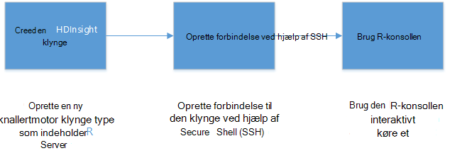

## Forudsætninger

* __En Azure-abonnement__: inden du starter selvstudiet, skal du have en Azure abonnement. Se [få Azure gratis prøveversion](https://azure.microsoft.com/documentation/videos/get-azure-free-trial-for-testing-hadoop-in-hdinsight/) for flere oplysninger.

* __A Secure Shell (SSH) klient__: en SSH klient bruges til at oprette forbindelse til HDInsight klyngen og køre kommandoer direkte på klyngen fra en fjernplacering. Linux, Unix og OS X giver en SSH klient gennem den `ssh` kommandoen. For Windows-systemer anbefaler vi [trykfarver](http://www.chiark.greenend.org.uk/~sgtatham/putty/download.html).

    * __SSH taster (valgfrit)__: Du kan sikre kontoen SSH bruges til at oprette forbindelse til den klynge ved hjælp af en adgangskode eller en offentlig nøgle. Ved hjælp af en adgangskode er nemmere, og gør det muligt at komme i gang uden at oprette et offentlige/private nøgler par; men ved hjælp af en nøgle er mere sikker.
    
        Trinnene i dette dokument forudsætter, at du bruger en adgangskode. Du kan finde oplysninger om, hvordan du opretter og bruger SSH taster med HDInsight følgende dokumenter:
        
        * [Bruge SSH med HDInsight fra Linux, Unix eller OS X-klienter](hdinsight-hadoop-linux-use-ssh-unix.md)
        
        * [Bruge SSH med HDInsight fra Windows-klienter](hdinsight-hadoop-linux-use-ssh-windows.md)

### Krav til Access

[AZURE.INCLUDE [access-control](../../includes/hdinsight-access-control-requirements.md)]

## Oprette klyngen

> [AZURE.NOTE] Trinnene i dette dokument oprette en R-Server på HDInsight ved hjælp af grundlæggende konfigurationsoplysninger. Du kan finde andre klynge konfigurationsindstillinger (som tilføjelse af ekstra lager konti, ved hjælp af et virtuelt Azure-netværk eller oprette en metastore Hive), [oprette Linux-baserede HDInsight klynger](hdinsight-hadoop-provision-linux-clusters.md).

1. Log på [Azure-portalen](https://portal.azure.com).

2. Vælg __Ny__ __Data + analyser__og derefter __HDInsight__.

    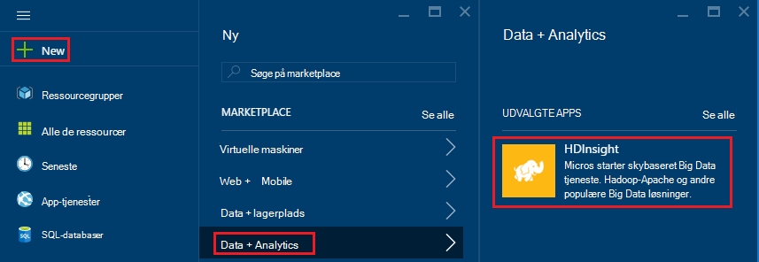

3. Angiv et navn for-klyngen i feltet __Navn__ . Hvis du har flere Azure abonnementer skal du bruge posten __abonnement__ til at vælge det, du vil bruge.

    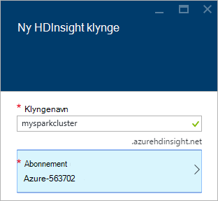

4. Vælg __Marker klynge Type__. Vælg følgende indstillinger under bladet __Klynge Type__ :

    * __Klynge Type__: R Server på knallertmotor
    
    * __Klynge niveau__: Premium

    Lad andre indstillinger på standardværdierne og derefter bruge knappen __Vælg__ til at gemme den klynge type.
    
    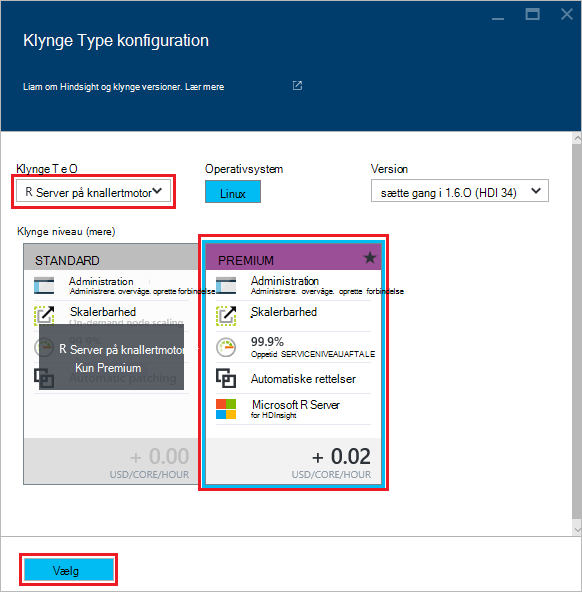
    
    > [AZURE.NOTE] Du kan også tilføje R Server til andre HDInsight klynge typer (såsom Hadoop eller HBase,) ved at vælge den klynge type, og derefter vælge __Premium__.

5. Vælg **Ressourcegruppe** til at se en liste over eksisterende grupper og derefter vælge den til at oprette klynge i. Eller du kan vælge **Opret ny** og derefter skrive navnet på den nye ressourcegruppe. Der vises en grøn markering til at angive, at det nye gruppenavn er tilgængelig.

    > [AZURE.NOTE] Hvis det er tilgængeligt som standard dette element til en af dine eksisterende ressourcegrupper.
    
    Bruge knappen __Vælg__ til at gemme ressourcegruppen.

6. Vælg **legitimationsoplysninger**og derefter angive et **Klynge Login brugernavn** og en **Klynge-logonadgangskode**.

    Angiv en __SSH brugernavn__.  SSH bruges til at oprette forbindelse fra en fjernplacering til klynge ved hjælp af en __Secure Shell (SSH)__ -klient. Du kan enten angive SSH brugeren i denne dialogboks eller efter klyngen er blevet oprettet (fanen konfiguration for-klyngen). R serveren er konfigureret til at forvente en __SSH brugernavn__ for "remoteuser".  Hvis du bruger et andet brugernavn, er du nødt til at udføre yderligere trin, når klyngen er blevet oprettet.
    
    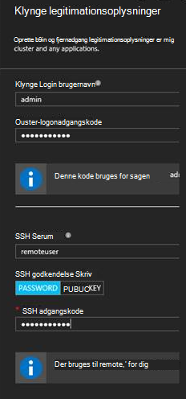

    __SSH godkendelsestype__: Vælg __adgangskode__ som godkendelsestype, medmindre du foretrækker brug af en offentlig nøgle.  Hvis du vil have adgang til R Server på klynge via en remote klient, f.eks. RTVS, RStudio eller en anden computer IDE, skal du bruge et offentlige/private nøgler par.   

    Oprette og bruge en offentlige/private nøgle par Vælg 'Offentlig nøgle' og fortsætte på følgende måde.  Disse instruktioner forudsætter, at du har Cygwin med ssh keygen eller tilsvarende installeret.

    -    Oprette et offentlige/private nøgler par fra kommandoprompten på din bærbare computer:
      
            SSH keygen - t rsa -b 2048 – f < privat-nøgle-filename >
      
    -    Dette vil oprette en privat nøgle fil og en offentlig nøgle fil under navnet < privat-nøgle-filename > .pub, f.eks.  davec og davec.pub.  Angiv den offentlig nøgle fil (* .pub) når du tildeler HDI klynge legitimationsoplysninger:
      
        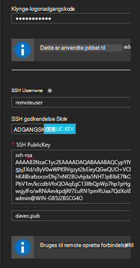  
      
    -    Ændre tilladelser til den private keyfile på din bærbare computer
      
            chmod 600 < privat-nøgle-filename >
      
    -    Bruge privat nøgle filen med SSH til remote logon, f.eks.
      
            SSH – i < privat-nøgle-filename >remoteuser@<hostname public ip>
      
      eller som del af definitionen af Hadoop Spark Beregn konteksten for R Server på klienten (se brug af Microsoft R Server som en Hadoop-klient i afsnittet [oprette en beregne sammenhæng for gnister](https://msdn.microsoft.com/microsoft-r/scaler-spark-getting-started#creating-a-compute-context-for-spark) af online [RevoScaleR Hadoop knallertmotor Introduktion til](https://msdn.microsoft.com/microsoft-r/scaler-spark-getting-started)).

7. Vælg **Datakilde** for at vælge en datakilde til klyngen. Enten vælge en eksisterende konto lager ved at vælge __Vælg lagerplads konto__ og derefter vælge kontoen, eller Opret en ny konto ved hjælp af linket __Ny__ i sektionen __Vælg lagerplads konto__ .

    Hvis du vælger __Ny__, skal du angive et navn til den nye konto lagerplads. En grøn markering vises, hvis navnet accepteres.

    __Standard beholder__ som standard til navnet på klyngen. Lad dette denne værdi.
    
    Vælg __placering__ til at vælge det område til at oprette kontoen lagerplads i.
    
    > [AZURE.IMPORTANT] Vælge en placering til standard-datakilde kan også angive placeringen af HDInsight klyngen. Datakilden klynge og standard skal være placeret i samme region.

    Bruge knappen **Vælg** til at gemme konfigurationen af datakilden.
    
    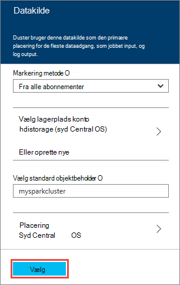

8. Vælg **Node priser lag** til at få vist oplysninger om de noder, der oprettes for denne klynge. Medmindre du ved, at du skal bruge en større klynge, lade antallet af knuder, arbejder standardindstillingen for `4`. De estimerede omkostninger for klyngen kan ses i bladet.

    > [AZURE.NOTE] Hvis det er nødvendigt, kan du ændre størrelsen din klynge senere via portalen (klynge -> Indstillinger -> skala klynge) at øge eller mindske antallet af knuder, arbejder.  Det kan være nyttige for tomgang ned klynge når den ikke er i brug eller for at tilføje kapaciteten til imødekommer behovet hos større opgaver.

    Nogle faktorer, du skal huske på, når sidetilpasning din klynge, noderne data og noden kant omfatter:  
   
    - Ydeevnen for fordelt R Server analyser på knallertmotor er proportional med antallet af knuder, arbejder, når dataene er stort.  
    - Ydeevnen for R Server analyser er lineær i størrelsen af data, der analysere. Eksempel:  
        - For lille til at mindre data bliver ydeevne bedst, hvis analysere i en lokal Beregn kontekst på noden kant.  Yderligere oplysninger om scenarierne under hvilket mappeindstillingerne lokale og knallertmotor Beregn sammenhænge, der fungerer bedst Beregn kontekst til R Server på HDInsight. 
        - Hvis du logge på noden kant og køre scriptet R der og derefter alle men ScaleR modtagelse-funktionerne udføre <strong>lokalt</strong> på noden kant så hukommelse og antal kerner for noden kant skal være størrelse i overensstemmelse hermed. Det samme gælder, hvis du bruger R Server på HDI som en remote Beregn kontekst fra din bærbare computer.
    
    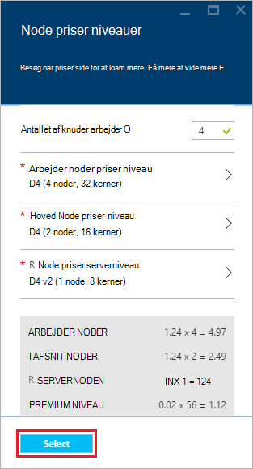

    Bruge knappen **Vælg** til at gemme noden priser konfiguration.
    
9. Sørg for, at **Fastgør til Startboard** er markeret på bladet **Ny HDInsight klynge** , og vælg derefter **Opret**. Dette opretter klyngen og føje et felt til det til Startboard af din Azure-Portal. Ikonet indikerer, at klyngen opretter, og ændres for at få vist ikonet HDInsight, når oprettelse af er afsluttet.

  	| Mens du opretter | Oprettelse af fuldført |
  	| ------------------ | --------------------- |
  	|  |  |

    > [AZURE.NOTE] Det kan tage lidt tid for klynge skal oprettes, normalt omkring 15 minutter. Brug feltet på Startboard eller posten **beskeder** til venstre på siden til at se, om processen til oprettelse af.

## Oprette forbindelse til noden R Server kant

Oprette forbindelse til R Server kantnode i den HDInsight klynge, ved hjælp af SSH:

    ssh USERNAME@r-server.CLUSTERNAME-ssh.azurehdinsight.net
    
> [AZURE.NOTE] Du kan også finde den `R-Server.CLUSTERNAME-ssh.azurehdinsight.net` adressen i Azure-portalen ved at vælge din klynge, og derefter __Indstillinger for alle__, __Apps__og __RServer__. Derved vises SSH slutpunkt oplysningerne om noden kant.
>
> 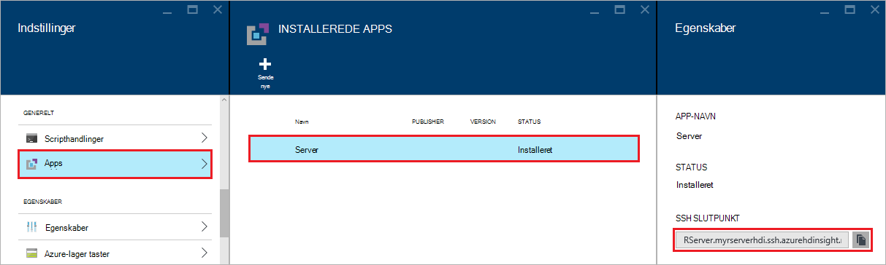
    
Hvis du brugte en adgangskode til at sikre brugerkontoen SSH, bliver du bedt om at angive det. Hvis du har brugt en offentlig nøgle, kan du skal bruge den `-i` parameter for at angive den tilsvarende privat nøgle. For eksempel `ssh -i ~/.ssh/id_rsa USERNAME@R-Server.CLUSTERNAME-ssh.azurehdinsight.net`.
    
Du kan finde flere oplysninger om brug af SSH med Linux-baserede HDInsight, i følgende artikler:

* [Bruge SSH med Linux-baserede Hadoop på HDInsight fra Linux, Unix eller OS X](hdinsight-hadoop-linux-use-ssh-unix.md)

* [Bruge SSH med Linux-baserede Hadoop på HDInsight fra Windows](hdinsight-hadoop-linux-use-ssh-windows.md)

Når forbindelse, modtager du en stil med følgende kommandoprompten.

    username@ed00-myrser:~$

## Brug R-konsollen

1. Brug følgende kommando for at starte konsollen R fra session SSH.

        R
    
    Du får vist output, der svarer til følgende.
    
        R version 3.2.2 (2015-08-14) -- "Fire Safety"
        Copyright (C) 2015 The R Foundation for Statistical Computing
        Platform: x86_64-pc-linux-gnu (64-bit)

        R is free software and comes with ABSOLUTELY NO WARRANTY.
        You are welcome to redistribute it under certain conditions.
        Type 'license()' or 'licence()' for distribution details.

        Natural language support but running in an English locale

        R is a collaborative project with many contributors.
        Type 'contributors()' for more information and
        'citation()' on how to cite R or R packages in publications.

        Type 'demo()' for some demos, 'help()' for on-line help, or
        'help.start()' for an HTML browser interface to help.
        Type 'q()' to quit R.

        Microsoft R Server version 8.0: an enhanced distribution of R
        Microsoft packages Copyright (C) 2016 Microsoft Corporation

        Type 'readme()' for release notes.

        >

2. Fra den `>` Spørg, kan du angive R kode. R server indeholder pakker, så du kan nemt at interagere med Hadoop og køre fordelt beregninger. For eksempel bruge følgende kommando for at få vist i roden af standard-filsystemet for HDInsight-klyngen.

        rxHadoopListFiles("/")
    
    Du kan også bruge WASB typografi håndtere.
    
        rxHadoopListFiles("wasbs:///")

## Brug af R Server på HDI fra en ekstern forekomst af Microsoft R Server eller Microsoft R-klient

I sektionen over vedrørende anvendelse af offentlige/private nøgler par at få adgang til klyngen, det er muligt at konfiguration af adgang til HDI Hadoop knallertmotor Beregn konteksten fra en ekstern forekomst af Microsoft R Server eller Microsoft R klient, der kører på en stationær eller bærbar computer (se brug af Microsoft R Server som en Hadoop-klient i afsnittet [oprette en beregne sammenhæng for gnister](https://msdn.microsoft.com/microsoft-r/scaler-spark-getting-started#creating-a-compute-context-for-spark) af online [RevoScaleR Hadoop knallertmotor Introduktion til](https://msdn.microsoft.com/microsoft-r/scaler-spark-getting-started)).  Gøre så skal du angive følgende indstillinger, når du definerer RxSpark beregne kontekst på din bærbare computer: hdfsShareDir, shareDir, sshUsername, sshHostname, sshSwitches, og sshProfileScript. Eksempel:

    
    myNameNode <- "default"
    myPort <- 0 
 
    mySshHostname  <- 'rkrrehdi1-ssh.azurehdinsight.net'  # HDI secure shell hostname
    mySshUsername  <- 'remoteuser'# HDI SSH username
    mySshSwitches  <- '-i /cygdrive/c/Data/R/davec'   # HDI SSH private key
 
    myhdfsShareDir <- paste("/user/RevoShare", mySshUsername, sep="/")
    myShareDir <- paste("/var/RevoShare" , mySshUsername, sep="/")
 
    mySparkCluster <- RxSpark(
      hdfsShareDir = myhdfsShareDir,
      shareDir     = myShareDir,
      sshUsername  = mySshUsername,
      sshHostname  = mySshHostname,
      sshSwitches  = mySshSwitches,
      sshProfileScript = '/etc/profile',
      nameNode     = myNameNode,
      port         = myPort,
      consoleOutput= TRUE
    )

    
 
## Bruge en Beregn kontekst

En Beregn kontekst kan du kontrollere, om beregning udføres lokalt på noden kant, eller om det skal distribueres på tværs af knuder på HDInsight klyngen.
        
1. Bruge følgende fra konsollen R for at indlæse eksempeldataene i standard-lagerplads til HDInsight.

        # Set the HDFS (WASB) location of example data
        bigDataDirRoot <- "/example/data"
        # create a local folder for storaging data temporarily
        source <- "/tmp/AirOnTimeCSV2012"
        dir.create(source)
        # Download data to the tmp folder
        remoteDir <- "http://packages.revolutionanalytics.com/datasets/AirOnTimeCSV2012"
        download.file(file.path(remoteDir, "airOT201201.csv"), file.path(source, "airOT201201.csv"))
        download.file(file.path(remoteDir, "airOT201202.csv"), file.path(source, "airOT201202.csv"))
        download.file(file.path(remoteDir, "airOT201203.csv"), file.path(source, "airOT201203.csv"))
        download.file(file.path(remoteDir, "airOT201204.csv"), file.path(source, "airOT201204.csv"))
        download.file(file.path(remoteDir, "airOT201205.csv"), file.path(source, "airOT201205.csv"))
        download.file(file.path(remoteDir, "airOT201206.csv"), file.path(source, "airOT201206.csv"))
        download.file(file.path(remoteDir, "airOT201207.csv"), file.path(source, "airOT201207.csv"))
        download.file(file.path(remoteDir, "airOT201208.csv"), file.path(source, "airOT201208.csv"))
        download.file(file.path(remoteDir, "airOT201209.csv"), file.path(source, "airOT201209.csv"))
        download.file(file.path(remoteDir, "airOT201210.csv"), file.path(source, "airOT201210.csv"))
        download.file(file.path(remoteDir, "airOT201211.csv"), file.path(source, "airOT201211.csv"))
        download.file(file.path(remoteDir, "airOT201212.csv"), file.path(source, "airOT201212.csv"))
        # Set directory in bigDataDirRoot to load the data into
        inputDir <- file.path(bigDataDirRoot,"AirOnTimeCSV2012") 
        # Make the directory
        rxHadoopMakeDir(inputDir)
        # Copy the data from source to input
        rxHadoopCopyFromLocal(source, bigDataDirRoot)

2. Næste, Lad os oprette nogle data oplysninger og definere to datakilder, så vi kan arbejde med data.

        # Define the HDFS (WASB) file system
        hdfsFS <- RxHdfsFileSystem()
        # Create info list for the airline data
        airlineColInfo <- list(
            DAY_OF_WEEK = list(type = "factor"),
            ORIGIN = list(type = "factor"),
            DEST = list(type = "factor"),
            DEP_TIME = list(type = "integer"),
            ARR_DEL15 = list(type = "logical"))

        # get all the column names
        varNames <- names(airlineColInfo)

        # Define the text data source in hdfs
        airOnTimeData <- RxTextData(inputDir, colInfo = airlineColInfo, varsToKeep = varNames, fileSystem = hdfsFS)
        # Define the text data source in local system
        airOnTimeDataLocal <- RxTextData(source, colInfo = airlineColInfo, varsToKeep = varNames)

        # formula to use
        formula = "ARR_DEL15 ~ ORIGIN + DAY_OF_WEEK + DEP_TIME + DEST"

3. Lad os køre en logistiske regression over dataene ved hjælp af lokalt beregne kontekst.

        # Set a local compute context
        rxSetComputeContext("local")
        # Run a logistic regression
        system.time(
            modelLocal <- rxLogit(formula, data = airOnTimeDataLocal)
        )
        # Display a summary 
        summary(modelLocal)

    Du bør se output, der slutter med linjer, som svarer til følgende.

        Data: airOnTimeDataLocal (RxTextData Data Source)
        File name: /tmp/AirOnTimeCSV2012
        Dependent variable(s): ARR_DEL15
        Total independent variables: 634 (Including number dropped: 3)
        Number of valid observations: 6005381
        Number of missing observations: 91381
        -2*LogLikelihood: 5143814.1504 (Residual deviance on 6004750 degrees of freedom)

        Coefficients:
                        Estimate Std. Error z value Pr(>|z|)
        (Intercept)   -3.370e+00  1.051e+00  -3.208  0.00134 **
        ORIGIN=JFK     4.549e-01  7.915e-01   0.575  0.56548
        ORIGIN=LAX     5.265e-01  7.915e-01   0.665  0.50590
        ......
        DEST=SHD       5.975e-01  9.371e-01   0.638  0.52377
        DEST=TTN       4.563e-01  9.520e-01   0.479  0.63172
        DEST=LAR      -1.270e+00  7.575e-01  -1.676  0.09364 .
        DEST=BPT         Dropped    Dropped Dropped  Dropped
        ---
        Signif. codes:  0 ‘***’ 0.001 ‘**’ 0.01 ‘*’ 0.05 ‘.’ 0.1 ‘ ’ 1

        Condition number of final variance-covariance matrix: 11904202
        Number of iterations: 7

4. Næste, Lad os køre den samme logistiske regression ved hjælp af konteksten gnister. Konteksten knallertmotor distribuere databehandlingen over alle arbejder noderne i HDInsight klynge.

        # Define the Spark compute context 
        mySparkCluster <- RxSpark()
        # Set the compute context 
        rxSetComputeContext(mySparkCluster)
        # Run a logistic regression 
        system.time(  
            modelSpark <- rxLogit(formula, data = airOnTimeData)
        )
        # Display a summary
        summary(modelSpark)

    > [AZURE.NOTE] Du kan også bruge MapReduce til at distribuere beregning på tværs af klyngenoder. Se [beregne kontekst indstillinger for R Server på HDInsight premium](hdinsight-hadoop-r-server-compute-contexts.md)kan finde flere oplysninger om Beregn kontekst.

## Distribuere R-kode til flere noder

Med R-serveren kan du nemt gøre eksisterende R kode og køre den på tværs af flere noder i klyngen ved hjælp af `rxExec`. Dette er nyttigt, når du udfører en parameter oprydning eller simulering. Følgende er et eksempel på, hvordan du bruger `rxExec`.

    rxExec( function() {Sys.info()["nodename"]}, timesToRun = 4 )
    
Hvis du stadig bruger konteksten knallertmotor eller MapReduce, dette vil returnere værdien nodename for noderne arbejder, som koden (`Sys.info()["nodename"]`) er stødte. For eksempel på en klynge med fire noder, kan du få output, der svarer til følgende.

    $rxElem1
        nodename
    "wn3-myrser"

    $rxElem2
        nodename
    "wn0-myrser"

    $rxElem3
        nodename
    "wn3-myrser"

    $rxElem4
        nodename
    "wn3-myrser"

## Installere R-pakker

Hvis du vil gerne installere yderligere R-pakker på noden kant, kan du bruge `install.packages()` direkte fra i R konsol når du har forbindelse til noden kant gennem SSH. Hvis du vil installere R-pakker på noderne arbejder i klyngen, skal du bruge en Script-handling.

Scripthandlinger er fest scripts, som bruges til at foretage ændringer i konfigurationen til HDInsight klynge eller installere yderligere software. I dette tilfælde skal installere yderligere R pakker. For at installere flere pakker ved hjælp af handlingen Script skal du følge nedenstående trin.

> [AZURE.IMPORTANT] Brug af scripthandlinger til at installere yderligere R-pakker kan kun bruges, når klyngen er blevet oprettet. Det skal ikke bruges under klynge oprettelsen, som scriptet er afhængig af R Server der helt installeret og konfigureret.

1. Vælg R serveren på HDInsight klynge [Azure-portalen](https://portal.azure.com).

2. Vælg __Alle indstillinger__og derefter __Scripthandlinger__bladet klynge. Vælg __Send ny__ til at sende en ny scripthandling bladet __Scripthandlinger__ .

    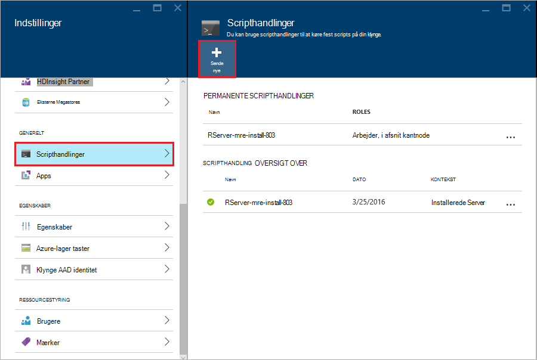

3. Angiv følgende oplysninger fra bladet __Send scripthandling__ .

  - __Navn__: et fuldt navn til at identificere dette script
  - __Bash script URI__:`http://mrsactionscripts.blob.core.windows.net/rpackages-v01/InstallRPackages.sh`
  - __Afsnit__: Dette skal være __markeret__
  - __Arbejder__: Dette skal være __markeret__
  - __Zookeeper__: Dette skal være __markeret__
  - __Parametre__: feltet R-pakker installeres. For eksempel`bitops stringr arules`
  - __Vedvarende overensstemmelseskoder denne scriptet …__: Dette skal være __markeret__  

    > [AZURE.NOTE] 1. som standard installeres alle R-pakker fra et øjebliksbillede af Microsoft MRAN lageret overensstemmelse med versionen af R-Server, der er installeret.  Hvis du vil gerne installere nyere versioner af pakker, så der er nogle risikoen for inkompatibilitet mellem, men det er muligt ved at angive `useCRAN` som det første element på pakkens listen f.eks.  `useCRAN bitops, stringr, arules`.  
    > 2. Nogle R-pakker kræver yderligere Linux system biblioteker. Fordel har vi forudinstalleret på afhængigheder, der bruges til de øverste 100 mest populære R pakker. Hvis de R-pakker, du har installeret kræver biblioteker ud over disse, derefter du skal hente base scriptet bruges her og tilføje trin for at installere system-biblioteker. Du skal overføre ændret scriptet til en offentlig blob objektbeholder i Azure-lager og bruge scriptet ændret til at installere pakkerne.
    > Du kan finde flere oplysninger om udvikling af scripthandlinger, [udvikling af scripthandling](hdinsight-hadoop-script-actions-linux.md).  

    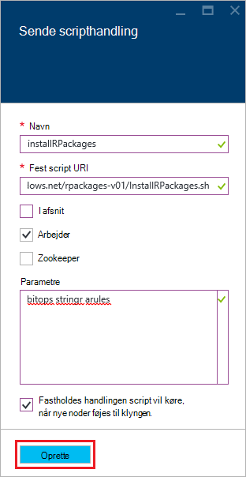

4. Vælg __Opret__ for at køre scriptet. Når scriptet er fuldført, skal R-pakker vises på alle arbejder noder.
    
## Næste trin

Nu hvor du ved, hvordan du opretter en ny HDInsight klynge, der indeholder R Server, og de grundlæggende regler for ved hjælp af konsollen R fra en SSH session, kan du bruge følgende til at finde andre måder at arbejde med R Server på HDInsight.

- [Føje RStudio Server til HDInsight premium](hdinsight-hadoop-r-server-install-r-studio.md)

- [Beregne kontekst indstillinger for R Server på HDInsight premium](hdinsight-hadoop-r-server-compute-contexts.md)

- [Azure lagerplads indstillinger for R Server på HDInsight premium](hdinsight-hadoop-r-server-storage.md)

### Azure ressourcestyring skabeloner

Hvis du er interesseret i automatisk oprettelse af R Server på HDInsight ved hjælp af Azure ressourcestyring skabeloner, skal du se følgende eksempel skabeloner.

* [Oprette en R-Server på HDInsight klynge ved hjælp af en SSH offentlig nøgle](http://go.microsoft.com/fwlink/p/?LinkID=780809)
* [Oprette en R-Server på HDInsight klynge ved hjælp af en SSH adgangskode](http://go.microsoft.com/fwlink/p/?LinkID=780810)

Oprette en ny HDInsight klynge og tilknyttede lagerplads konto begge skabeloner, og kan bruges fra Azure CLI, Azure PowerShell eller portalen Azure.

Se [oprette Linux-baserede Hadoop klynger i HDInsight ved hjælp af Azure ressourcestyring skabeloner](hdinsight-hadoop-create-linux-clusters-arm-templates.md)til generelle oplysninger om brug af Azure ressourcestyring skabeloner.
