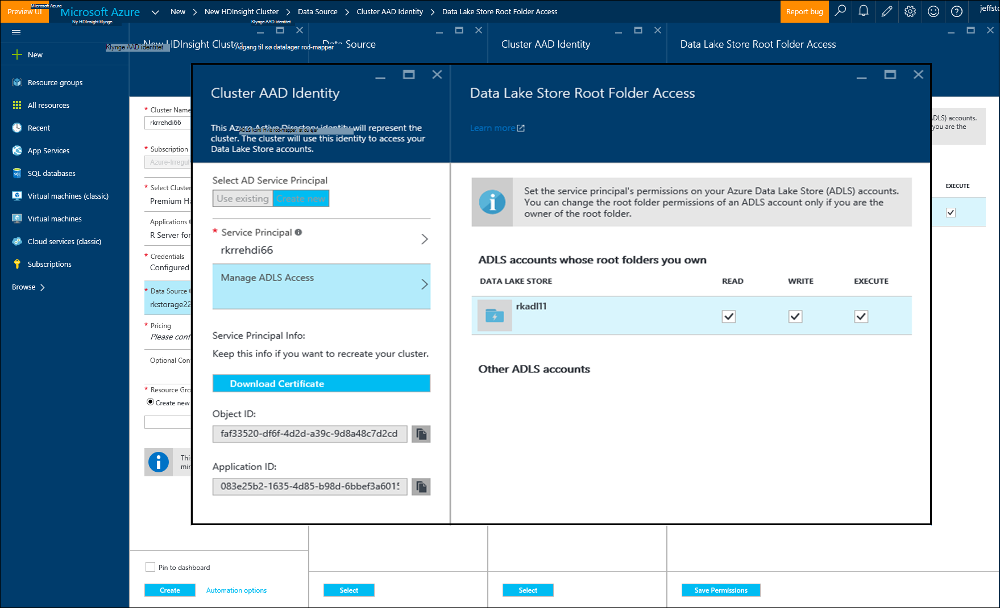

<properties
   pageTitle="Azure lagerplads indstillinger for R Server på HDInsight (preview) | Microsoft Azure"
   description="Få mere at vide om forskellige indstillinger for lagring af tilgængelige for brugere med R Server på HDInsight (preview)"
   services="HDInsight"
   documentationCenter=""
   authors="jeffstokes72"
   manager="jhubbard"
   editor="cgronlun"
/>

<tags
   ms.service="HDInsight"
   ms.devlang="R"
   ms.topic="article"
   ms.tgt_pltfrm="na"
   ms.workload="data-services"
   ms.date="09/01/2016"
   ms.author="jeffstok"
/>

# <a name="azure-storage-options-for-r-server-on-hdinsight-preview"></a>Azure lagerplads indstillinger for R Server på HDInsight (preview)

Microsoft R Server på HDInsight (preview) har adgang til begge Azure Blob og [Azure sø datalager](https://azure.microsoft.com/services/data-lake-store/), som en måde at gøre data, kode, giver objekter fra analyse, og så videre.

Når du opretter en Hadoop-klynge i HDInsight skal angive du en Azure-lager-konto. En objektbeholder til lagring af bestemte Blob fra denne konto indeholder filsystemet for den klynge, du opretter (for eksempel, Hadoop-distribueret filsystem). For ydeevnen formål oprettes HDInsight klyngen i den samme datacenter som den primære lagerplads-konto, du angiver. Du kan finde flere oplysninger i afsnittet [Brug Azure Blob-lager med HDInsight](hdinsight-hadoop-use-blob-storage.md "Brug Azure Blob-lager med HDInsight").   


## <a name="use-multiple-azure-blob-storage-accounts"></a>Bruge flere Azure Blob storage konti

Hvis det er nødvendigt, kan du få adgang til flere Azure lagerplads konti eller beholdere med din HDI klynge. For at gøre det, skal du angive kontiene ekstra lagerplads i Brugergrænsefladen, når du opretter klyngen, og følg derefter disse trin for at bruge dem i R.  

1.  Oprette en HDInsight klynge med et lager kontonavn af **storage1** og beholder standard kaldet **container1**.
2. Angive en ekstra lagerplads konto med navnet **storage2**.  
3. Kopier filen mycsv.csv til mappen /share, og Udfør analyse på denne fil.  

    ````
    hadoop fs –mkdir /share
    hadoop fs –copyFromLocal myscsv.scv /share  
    ````

3.  I R kode, skal du angive noden navn til **standard** og angive directory og fil for at behandle.  

    ````
    myNameNode <- "default"
    myPort <- 0
    ````

  Placeringen af data:  

    bigDataDirRoot <-"/ share"  

  Definere knallertmotor Beregn kontekst:

    mySparkCluster <-RxSpark(consoleOutput=TRUE)

  Angiv beregne kontekst:

    rxSetComputeContext(mySparkCluster)

  Definere filsystemet Hadoop-distribueret fil System (HDFS):

    hdfsFS <-RxHdfsFileSystem (hostName = myNameNode, port = myPort)

  Angiv filen input til at analysere i HDFS:

    Inputfil <-file.path(bigDataDirRoot,"mycsv.csv")

Alle af referencerne mappe- og peg på lagerplads kontoen wasbs://container1@storage1.blob.core.windows.net. Dette er den **lagerplads standardkonto** , der er knyttet til HDInsight klyngen.

Antag nu, du vil behandle en fil kaldet mySpecial.csv, der er placeret i /private directory af **container2** i **storage2**.

Peg navn node referencen til kontoen **storage2** lagerplads i din R-kode.

    myNameNode <- "wasbs://container2@storage2.blob.core.windows.net"
    myPort <- 0

  Placeringen af data:

    bigDataDirRoot <- "/private"

  Definere knallertmotor Beregn kontekst:

    mySparkCluster <- RxSpark(consoleOutput=TRUE, nameNode=myNameNode, port=myPort)

  Angiv beregne kontekst:

    rxSetComputeContext(mySparkCluster)

  Definere HDFS filsystem:

    hdfsFS <- RxHdfsFileSystem(hostName=myNameNode, port=myPort)

  Angiv filen input til at analysere i HDFS:

    inputFile <-file.path(bigDataDirRoot,"mySpecial.csv")

Alle af referencerne mappe- og nu peger på kontoen lagerplads wasbs://container2@storage2.blob.core.windows.net. Dette er den **Navnet Node** , du har specificeret.

Bemærk, at du nødt til at konfigurere/User/RevoShare/<SSH username> mappe på **storage2** på følgende måde:

    hadoop fs -mkdir wasbs://container2@storage2.blob.core.windows.net/user
    hadoop fs -mkdir wasbs://container2@storage2.blob.core.windows.net/user/RevoShare
    hadoop fs -mkdir wasbs://container2@storage2.blob.core.windows.net/user/RevoShare/<RDP username>

## <a name="use-an-azure-data-lake-store"></a>Bruge en Azure Data sø store

Hvis du vil bruge Data sø butikker med din HDInsight-konto, skal du give din klynge adgang til hver Azure Data sø butik, du vil bruge. Du bruger store i dit R script meget som om du bruger en sekundær lagerplads konto (som beskrevet i den foregående fremgangsmåde).

## <a name="add-cluster-access-to-your-azure-data-lake-stores"></a>Tilføj klynge adgang til dine Azure Data sø butikker

Du kan få adgang til et lager til Data sø ved hjælp af en Azure Active Directory (Azure AD) Service-konto, som er knyttet til din HDInsight klynge.

### <a name="to-add-a-service-principal"></a>Tilføje en tjeneste sikkerhedskonto
1. Når du opretter din HDInsight klynge, Vælg **Klynge AAD identitet** fra fanen **Datakilde** .
2. Vælg **Opret ny**i dialogboksen **Klynge AAD identitet** under **Vælg AD Service hovedstolen**.

Når du navngive Service hovedstolen og oprette en adgangskode til den, åbnes en ny fane, hvor du kan knytte tjenesten hovedstolen til dine Data sø butikker.

Bemærk, at du kan også tilføje adgang til en Data sø store senere ved at åbne Data sø store i portalen Azure og gå til **Data Explorer** > **adgang**.  Følgende er et eksempel på en dialogboks, der viser, hvordan du opretter en tjeneste hovedstolen og knytte den til "rkadl11" Data sø store.




## <a name="use-the-data-lake-store-with-r-server"></a>Bruge Data sø store med R-serveren
Når du har givet adgang til en Data sø store, kan du bruge store i R Server på HDInsight den måde, du ville gøre en sekundær Azure lagerplads konto. Den eneste forskel er det præfikset **wasb: / /** ændres til **adl: / /** på følgende måde:

````
# Point to the ADL store (e.g. ADLtest)
myNameNode <- "adl://rkadl1.azuredatalakestore.net"
myPort <- 0

# Location of the data (assumes a /share directory on the ADL account)
bigDataDirRoot <- "/share"  

# Define Spark compute context
mySparkCluster <- RxSpark(consoleOutput=TRUE, nameNode=myNameNode, port=myPort)

# Set compute context
rxSetComputeContext(mySparkCluster)

# Define HDFS file system
hdfsFS <- RxHdfsFileSystem(hostName=myNameNode, port=myPort)

# Specify the input file in HDFS to analyze
inputFile <-file.path(bigDataDirRoot,"AirlineDemoSmall.csv")

# Create factors for days of the week
colInfo <- list(DayOfWeek = list(type = "factor",
               levels = c("Monday", "Tuesday", "Wednesday", "Thursday",
                          "Friday", "Saturday", "Sunday")))

# Define the data source
airDS <- RxTextData(file = inputFile, missingValueString = "M",
                    colInfo  = colInfo, fileSystem = hdfsFS)

# Run a linear regression
model <- rxLinMod(ArrDelay~CRSDepTime+DayOfWeek, data = airDS)
````

Her er de kommandoer, der bruges til at konfigurere Data sø lagerplads konto med mappen RevoShare og tilføje eksempel .csv-filen fra det forrige eksempel:

````
hadoop fs -mkdir adl://rkadl1.azuredatalakestore.net/user
hadoop fs -mkdir adl://rkadl1.azuredatalakestore.net/user/RevoShare
hadoop fs -mkdir adl://rkadl1.azuredatalakestore.net/user/RevoShare/<user>

hadoop fs -mkdir adl://rkadl1.azuredatalakestore.net/share

hadoop fs -copyFromLocal /usr/lib64/R Server-7.4.1/library/RevoScaleR/SampleData/AirlineDemoSmall.csv adl://rkadl1.azuredatalakestore.net/share

hadoop fs –ls adl://rkadl1.azuredatalakestore.net/share
````

## <a name="use-azure-files-on-the-edge-node"></a>Bruge Azure filer på noden kant

Der er også en datalager praktisk data til brug på den kantnode kaldet [Azure filer](../storage/storage-how-to-use-files-linux.md "Azure-filer"). Det gør det muligt at tilslutte en Azure-lager filshare til Linux-filsystemet. Det kan være praktiske til lagring af datafiler, R scripts og resultatet objekter, der kan være nødvendigt senere hvornår det giver mening at bruge det oprindelige filsystem på kantnode i stedet for HDFS.

En overordnet fordel af Azure filer er, at filshares kan tilsluttet og bruges af en hvilken som helst system, der har en understøttet OS som Windows eller Linux. Det kan for eksempel bruges ved en anden HDInsight klynge, som du eller en person på dit team har, ved en Azure VM eller endda ved et lokalt system.


## <a name="next-steps"></a>Næste trin

Nu, hvor du forstår det grundlæggende omkring af hvordan du bruger konsollen R fra en SSH session, og hvordan du opretter en ny HDInsight klynge, der indeholder R Server, kan du bruge følgende links til at finde andre måder at arbejde med R Server på HDInsight.

- [Oversigt over R Server på HDInsight](hdinsight-hadoop-r-server-overview.md)
- [Komme i gang med R server på Hadoop](hdinsight-hadoop-r-server-get-started.md)
- [Føje RStudio Server til HDInsight premium](hdinsight-hadoop-r-server-install-r-studio.md)
- [Beregne kontekst indstillinger for R Server på HDInsight](hdinsight-hadoop-r-server-compute-contexts.md)
