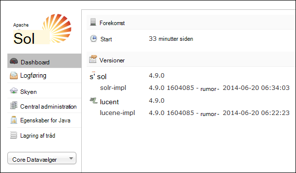
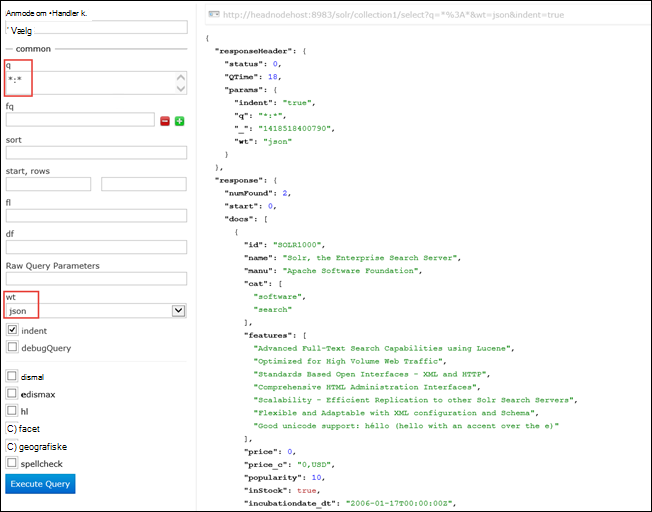

<properties
    pageTitle="Brug scripthandling til at installere Solr på Linux-baserede HDInsight | Microsoft Azure"
    description="Lær, hvordan du installerer Solr på Linux-baserede HDInsight Hadoop klynger ved hjælp af scripthandlinger."
    services="hdinsight"
    documentationCenter=""
    authors="Blackmist"
    manager="jhubbard"
    editor="cgronlun"
    tags="azure-portal"/>

<tags
    ms.service="hdinsight"
    ms.workload="big-data"
    ms.tgt_pltfrm="na"
    ms.devlang="na"
    ms.topic="article"
    ms.date="10/03/2016"
    ms.author="larryfr"/>

# Installere og bruge Solr på HDInsight Hadoop klynger

I dette emne lærer du, hvordan du installerer Solr på Azure HDInsight ved hjælp af scripthandling. Solr er en effektiv søgning platform og giver enterprise-niveau søgefunktioner til data, der administreres af Hadoop. Når du har installeret Solr på HDInsight klynge, skal du også se, hvordan søge data ved hjælp af Solr.

> [AZURE.NOTE] Trinnene i dette dokument kræver en Linux-baserede HDInsight klynge. Oplysninger om brug af Solr med en Windows-baseret klynge, se [installation og brug Solr på HDinsight Hadoop-klynger (Windows)](hdinsight-hadoop-solr-install.md)

Eksempelscriptet bruges i dette emne opretter en Solr klynge med en bestemt konfiguration. Hvis du vil konfigurere Solr klynge med forskellige samlinger, shards, skemaer, replikaer, osv., skal du redigere script og Solr binære filer i overensstemmelse hermed.

## Hvad er Solr?

[Apache Solr](http://lucene.apache.org/solr/features.html) er en enterprise search-platform, der gør det muligt for effektiv søgning i hele teksten på data. Mens Hadoop giver mulighed for at gemme og administrere store datamængder, indeholder Apache Solr søgefunktioner til hurtigt at hente dataene. Dette emne indeholder en vejledning til, hvordan du tilpasser en HDInsight klynge for at installere Solr.

> [AZURE.WARNING] Komponenter i HDInsight klynge understøttes fuldt ud, og Microsoft Support hjælper med at isolere og løse problemer i forbindelse med disse komponenter.
>
> Brugerdefinerede komponenter som Solr, modtager kommercielt begrundet support for at hjælpe dig med at foretage yderligere fejlfinding af problemet. Dette kan medføre løse problemet eller beder dig om at deltage tilgængelige kanaler for de Åbn kilde-teknologier, hvor deep ekspertise i forbindelse med teknologien, der er fundet. For eksempel, der er mange communitywebsteder, der kan bruges, ønsker: [MSDN-forum for HDInsight](https://social.msdn.microsoft.com/Forums/azure/en-US/home?forum=hdinsight), [http://stackoverflow.com](http://stackoverflow.com). Også Apache projekter har projektwebsteder på [http://apache.org](http://apache.org), for eksempel: [Hadoop](http://hadoop.apache.org/).

## Hvad betyder det scriptet

Dette script laver følgende ændringer til HDInsight klynge:

* Installerer Solr til`/usr/hdp/current/solr`
* Opretter en ny bruger, __solrusr__, som bruges til at køre tjenesten Solr
* Angiver __solruser__ som ejer af`/usr/hdp/current/solr`
* Tilføjer en [Upstart](http://upstart.ubuntu.com/) konfiguration, der starter Solr, hvis en klyngenode genstarter. Solr startes også automatisk klyngenoderne efter installationen

## Installere Solr ved hjælp af scripthandlinger

Et eksempel på script til at installere Solr på en HDInsight klynge er tilgængelig på følgende placering.

    https://hdiconfigactions.blob.core.windows.net/linuxsolrconfigactionv01/solr-installer-v01.sh

Dette afsnit indeholder en vejledning til, hvordan du bruger eksempelscript, når du opretter en ny klynge ved hjælp af portalen Azure. 

> [AZURE.NOTE] Azure PowerShell, Azure CLI, HDInsight .NET SDK eller Azure ressourcestyring skabeloner kan også bruges til at anvende scripthandlinger. Du kan også anvende scripthandlinger på allerede kører klynger. Se [tilpasse HDInsight klynger med scripthandlinger](hdinsight-hadoop-customize-cluster-linux.md)kan finde flere oplysninger.

1. Start klargøring en klynge ved hjælp af trinnene i [klargøring Linux-baserede HDInsight klynger](hdinsight-hadoop-create-linux-clusters-portal.md), men ikke fuldføre klargøring.

2. Vælg **Scripthandlinger**på bladet **Valgfri konfiguration** , og angiv oplysningerne nedenfor:

    * __Navn__: Angiv et fuldt navn for handlingen script.
    * __SCRIPT URI__: https://hdiconfigactions.blob.core.windows.net/linuxsolrconfigactionv01/solr-installer-v01.sh
    * __Afsnit__: kontrollere denne indstilling
    * __Arbejder__: kontrollere denne indstilling
    * __ZOOKEEPER__: Markér denne indstilling for at installere på noden Zookeeper
    * __Parametre__: Lad dette felt stå tomt

3. I bunden af **Scripthandlinger**, kan du bruge knappen **Vælg** til at gemme konfigurationen. Til sidst skal bruge knappen **Vælg** i bunden af bladet **Valgfri konfiguration** til at gemme oplysningerne om valgfri konfiguration.

4. Fortsæt med klargøring klyngen, som beskrevet i [klargøring Linux-baserede HDInsight klynger](hdinsight-hadoop-create-linux-clusters-portal.md).

## Hvordan bruger jeg Solr i HDInsight?

### Indeksering data

Du skal starte med indeksering Solr med nogle datafiler. Du kan derefter bruge Solr til at køre søgeforespørgsler på indekserede dataene. Brug følgende trin til at tilføje nogle eksempeldataene til Solr og derefter forespørge på den:

1. Oprette forbindelse til den HDInsight klynge, ved hjælp af SSH:

        ssh USERNAME@CLUSTERNAME-ssh.azurehdinsight.net

    Du kan finde flere oplysninger om brug af SSH med HDInsight, se følgende:

    * [Bruge SSH med Linux-baserede Hadoop på HDInsight fra Linux, Unix eller OS X](hdinsight-hadoop-linux-use-ssh-unix.md)

    * [Bruge SSH med Linux-baserede Hadoop på HDInsight fra Windows](hdinsight-hadoop-linux-use-ssh-windows.md)

    > [AZURE.IMPORTANT] Trin bruges senere i dette dokument tage af en SSL-tunnel til at oprette forbindelse til internettet Solr brugergrænseflade. For at udføre disse trin, skal du oprette en SSL-tunnel og derefter konfigurere din browser til at bruge den.
    >
    > Du kan finde flere oplysninger, se [Brug SSH tunnel til adgang til Ambari web brugergrænseflade, Ressourcestyring, JobHistory, NameNode, Oozie, og andre web Brugergrænsefladens](hdinsight-linux-ambari-ssh-tunnel.md)

2. Brug følgende kommandoer til at have Solr indeks eksempeldata:

        cd /usr/hdp/current/solr/example/exampledocs
        java -jar post.jar solr.xml monitor.xml

    Du får vist i følgende eksempel på konsollen:

        POSTing file solr.xml
        POSTing file monitor.xml
        2 files indexed.
        COMMITting Solr index changes to http://localhost:8983/solr/update..
        Time spent: 0:00:01.624

    Værktøjet post.jar indekserer Solr med dobbelt stikprøve dokumenter, **solr.xml** og **monitor.xml**. Disse gemmes i __collection1__ i Solr.

3. Du kan bruge følgende til at forespørge på REST-API, der vises af Solr:

        curl "http://localhost:8983/solr/collection1/select?q=*%3A*&wt=json&indent=true"

    Dette problemer i en forespørgsel til __collection1__ til dokumenter, der stemmer overens __ \*:\* __ (kodet som \*% 3A\* i forespørgselsstreng,) og, der skal returneres svaret som JSON. Svaret skal se ud som følger:

            "response": {
                "numFound": 2,
                "start": 0,
                "maxScore": 1,
                "docs": [
                  {
                    "id": "SOLR1000",
                    "name": "Solr, the Enterprise Search Server",
                    "manu": "Apache Software Foundation",
                    "cat": [
                      "software",
                      "search"
                    ],
                    "features": [
                      "Advanced Full-Text Search Capabilities using Lucene",
                      "Optimized for High Volume Web Traffic",
                      "Standards Based Open Interfaces - XML and HTTP",
                      "Comprehensive HTML Administration Interfaces",
                      "Scalability - Efficient Replication to other Solr Search Servers",
                      "Flexible and Adaptable with XML configuration and Schema",
                      "Good unicode support: héllo (hello with an accent over the e)"
                    ],
                    "price": 0,
                    "price_c": "0,USD",
                    "popularity": 10,
                    "inStock": true,
                    "incubationdate_dt": "2006-01-17T00:00:00Z",
                    "_version_": 1486960636996878300
                  },
                  {
                    "id": "3007WFP",
                    "name": "Dell Widescreen UltraSharp 3007WFP",
                    "manu": "Dell, Inc.",
                    "manu_id_s": "dell",
                    "cat": [
                      "electronics and computer1"
                    ],
                    "features": [
                      "30\" TFT active matrix LCD, 2560 x 1600, .25mm dot pitch, 700:1 contrast"
                    ],
                    "includes": "USB cable",
                    "weight": 401.6,
                    "price": 2199,
                    "price_c": "2199,USD",
                    "popularity": 6,
                    "inStock": true,
                    "store": "43.17614,-90.57341",
                    "_version_": 1486960637584081000
                  }
                ]
              }

### Ved hjælp af dashboardet Solr

Dashboardet Solr er en web brugergrænseflade, hvor du kan arbejde med Solr via din webbrowser. Dashboardet Solr vises ikke direkte på internettet fra din HDInsight klynge, men skal åbnes ved hjælp af en SSH tunnel. Du kan finde flere oplysninger om brug af en SSH tunnel, se [Brug SSH tunnel til adgang til Ambari web brugergrænseflade, Ressourcestyring, JobHistory, NameNode, Oozie, og andre web Brugergrænsefladens](hdinsight-linux-ambari-ssh-tunnel.md)

Når du har oprettet en SSH tunnel, følge nedenstående trin for at bruge dashboardet Solr:

1. Bestemme værtsnavnet for den primære headnode:

    1. Brug SSH til at oprette forbindelse til klynge på port 22. For eksempel `ssh USERNAME@CLUSTERNAME-ssh.azurehdinsight.net` hvor __brugernavn__ er dit SSH brugernavn og __CLUSTERNAME__ er navnet på din klynge.

        Du kan finde flere oplysninger om brug af SSH at se de dokumenter, der er følgende:

        * [Bruge SSH med Linux-baserede HDInsight fra en Linux, Unix eller Mac OS X-klient](hdinsight-hadoop-linux-use-ssh-unix.md)

        * [Bruge SSH med Linux-baserede HDInsight fra en Windows-klient](hdinsight-hadoop-linux-use-ssh-windows.md)
    
    3. Brug følgende kommando for at få den fuldstændige hostname:

            hostname -f

        Dette vil returnere et navn, der er som følger:

            hn0-myhdi-nfebtpfdv1nubcidphpap2eq2b.ex.internal.cloudapp.net
    
        Dette er den hostname, der skal bruges i de følgende trin.
    
1. I din browser skal du oprette forbindelse til __http://HOSTNAME:8983/solr / #/__, hvor __HOSTNAME__ er det navn, du har besluttet dig i de forrige trin. 

    Anmodningen skal distribueres gennem SSH tunnel til noden hoved for din HDInsight klynge. Du burde se en side, der ligner følgende:

    

2. Brug **Core Datavælger** ned til at vælge **collection1**i venstre rude. Flere poster skal dem vises under __collection1__.

3. Vælg __forespørgsel__fra poster under __collection1__. Brug følgende værdier til at udfylde siden søgning:

    * I tekstfeltet **spørgsmål** skal du angive ** \*:**\*. Følgende returnerer alle de dokumenter, der er indekseret i Solr. Hvis du vil søge efter et bestemt tekststreng i dokumenterne, kan du angive strengen her.

    * Vælg outputformatet i tekstfeltet **wt** . Standard er **json**.

    Markér knappen **Udfør forespørgsel** i bunden af søgning pate.

    

    Output returnerer de to dokumenter, vi bruges til indeksering Solr. Output ligner følgende:

            "response": {
                "numFound": 2,
                "start": 0,
                "maxScore": 1,
                "docs": [
                  {
                    "id": "SOLR1000",
                    "name": "Solr, the Enterprise Search Server",
                    "manu": "Apache Software Foundation",
                    "cat": [
                      "software",
                      "search"
                    ],
                    "features": [
                      "Advanced Full-Text Search Capabilities using Lucene",
                      "Optimized for High Volume Web Traffic",
                      "Standards Based Open Interfaces - XML and HTTP",
                      "Comprehensive HTML Administration Interfaces",
                      "Scalability - Efficient Replication to other Solr Search Servers",
                      "Flexible and Adaptable with XML configuration and Schema",
                      "Good unicode support: héllo (hello with an accent over the e)"
                    ],
                    "price": 0,
                    "price_c": "0,USD",
                    "popularity": 10,
                    "inStock": true,
                    "incubationdate_dt": "2006-01-17T00:00:00Z",
                    "_version_": 1486960636996878300
                  },
                  {
                    "id": "3007WFP",
                    "name": "Dell Widescreen UltraSharp 3007WFP",
                    "manu": "Dell, Inc.",
                    "manu_id_s": "dell",
                    "cat": [
                      "electronics and computer1"
                    ],
                    "features": [
                      "30\" TFT active matrix LCD, 2560 x 1600, .25mm dot pitch, 700:1 contrast"
                    ],
                    "includes": "USB cable",
                    "weight": 401.6,
                    "price": 2199,
                    "price_c": "2199,USD",
                    "popularity": 6,
                    "inStock": true,
                    "store": "43.17614,-90.57341",
                    "_version_": 1486960637584081000
                  }
                ]
              }

### Start og Stop Solr

Hvis du vil stoppe eller starte Solar manuelt, skal du bruge følgende kommandoer:

    sudo stop solr

    sudo start solr

## Indekserede sikkerhedskopidata

Som en god ide, bør du sikkerhedskopiere indekserede dataene fra Solr klyngenoder til Azure Blob-lager. Udfør følgende trin for at gøre det:

1. Oprette forbindelse til den klynge ved hjælp af SSH, og brug følgende kommando for at få værtsnavnet for noden hoved:

        hostname -f
        
2. Brug følgende fremgangsmåde til at oprette et øjebliksbillede af de indekserede data. Erstatte __HOSTNAME__ med det navn, der returneres fra den forrige kommando:

        curl http://HOSTNAME:8983/solr/replication?command=backup

    Du burde se et svar således:

        <?xml version="1.0" encoding="UTF-8"?>
        <response>
          <lst name="responseHeader">
            <int name="status">0</int>
            <int name="QTime">9</int>
          </lst>
          <str name="status">OK</str>
        </response>

2. Derefter skal du ændre mapper til __/usr/hdp/current/solr/example/solr__. Der vil være en undermappe for hver af websteder. Hver samling mappe indeholder en mappe, __data__ , som er, hvor et øjebliksbillede til samlingen er placeret.

    Eksempelvis hvis du har brugt trinnene tidligere indeksere eksempeldokumenterne, mappen __/usr/hdp/current/solr/example/solr/collection1/data__ bør nu indeholde en mappe med navnet __øjebliksbillede. ###__ hvor # er datoen og klokkeslættet for snapshot.

3. Oprette en komprimeret arkiv med mappen snapshot ved hjælp af en kommando, der ligner følgende:

        tar -zcf snapshot.20150806185338855.tgz snapshot.20150806185338855

    Dette vil oprette en ny arkiv med navnet __snapshot.20150806185338855.tgz__, som indeholder indholdet af mappen __snapshot.20150806185338855__ .

3. Derefter kan du gemme arkivet til den klynge primære lager ved hjælp af følgende kommando:

    hadoop fs - copyFromLocal snapshot.20150806185338855.tgz/eksempel/data

    > [AZURE.NOTE] Du vil oprette en dedikeret mappe til lagring af Solr snapshots. For eksempel `hadoop fs -mkdir /solrbackup`.

Du kan finde flere oplysninger om at arbejde med Solr sikkerhedskopierings- og gendanner du se [foretage og gendanne sikkerhedskopier af SolrCores](https://cwiki.apache.org/confluence/display/solr/Making+and+Restoring+Backups+of+SolrCores).

## Se også

- [Installation og brug farvetone på HDInsight klynger](hdinsight-hadoop-hue-linux.md). Nuance er et websted brugergrænseflade, der gør det nemt at oprette, køre, og Gem gris og Hive job samt Gennemse standard lagerplads til dit HDInsight klynge.

- [Installere R på HDInsight klynger][hdinsight-install-r]. Bruge klynge tilpasning til at installere R på HDInsight Hadoop klynger. R er et open source-sprog og miljø til statistiske computing. Den indeholder hundredvis af indbyggede statistiske funktioner og sin egen programmeringssprog, der kombinerer aspekter af funktionelle og objektorienteret programmering. Den indeholder også omfattende grafiske funktioner.

- [Installere Giraph på HDInsight klynger](hdinsight-hadoop-giraph-install-linux.md). Bruge klynge tilpasning til at installere Giraph på HDInsight Hadoop klynger. Giraph kan du udføre graph behandling ved hjælp af Hadoop, og de kan bruges med Azure HDInsight.

- [Installere farvetone på HDInsight klynger](hdinsight-hadoop-hue-linux.md). Bruge klynge tilpasning til at installere farvetone på HDInsight Hadoop klynger. Nuance er et sæt af webprogrammer, der bruges til at interagere med en Hadoop-klynge.

[hdinsight-install-r]: hdinsight-hadoop-r-scripts-linux.md
[hdinsight-cluster-customize]: hdinsight-hadoop-customize-cluster-linux.md
