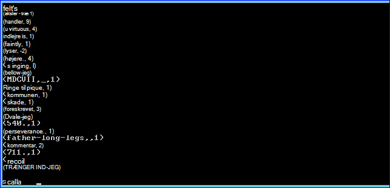
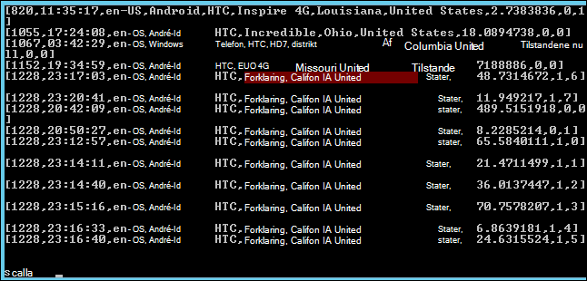

<properties
    pageTitle="Brug scripthandling til at installere knallertmotor på Hadoop klynge | Microsoft Azure"
    description="Lær at tilpasse en HDInsight klynge med knallertmotor ved hjælp af Script handlingen."
    services="hdinsight"
    documentationCenter=""
    authors="nitinme"
    manager="jhubbard"
    editor="cgronlun"/>

<tags
    ms.service="hdinsight"
    ms.workload="big-data"
    ms.tgt_pltfrm="na"
    ms.devlang="na"
    ms.topic="article"
    ms.date="02/05/2016"
    ms.author="nitinme"/>

# Installere og bruge knallertmotor på HDInsight Hadoop klynger ved hjælp af scripthandling

> [AZURE.IMPORTANT] I denne artikel frarådes nu. HDInsight indeholder nu knallertmotor som en førsteklasses klynge til Windows-baserede klynger, hvilket betyder, at du kan nu direkte oprette en knallertmotor klynge uden at ændre et Hadoop-klynge, ved hjælp af scripthandling. Brug af typen knallertmotor klynge, får du en HDInsight version 3.2 klynge med knallertmotor version 1.3.1.  Hvis du vil installere forskellige versioner af gnister, kan du bruge scripthandling. HDInsight indeholder et eksempel scripthandling script.

Lær, hvordan du installerer knallertmotor på Windows-baseret HDInsight ved hjælp af Script handlingen, og hvordan du kan køre knallertmotor forespørgsler på HDInsight klynger.

**Relaterede artikler**

- [Oprette Hadoop klynger i HDInsight](hdinsight-provision-clusters.md): generelle oplysninger om oprettelse af HDInsight klynger.

- [Komme i gang med Apache knallertmotor på HDInsight](hdinsight-apache-spark-jupyter-spark-sql.md): oprette en HDInsight Spark klynge.

- [Tilpasse HDInsight klynge ved hjælp af scripthandling][hdinsight-cluster-customize]: generelle oplysninger om tilpasning af HDInsight klynger ved hjælp af Script handlingen.

- [Udvikle scripthandling scripts til HDInsight](hdinsight-hadoop-script-actions.md).

## Hvad er knallertmotor?

<a href="http://spark.apache.org/docs/latest/index.html" target="_blank">Apache knallertmotor</a> er et open source-parallelt behandling af framework, der understøtter i hukommelsen behandling for at øge ydeevnen for big data analytisk programmer. Knallertmotors i hukommelsen beregning funktioner gør det et godt valg for gentagen algoritmer i maskine læring og graph beregninger.

Knallertmotor kan også bruges til at udføre traditionelt diskbaserede databehandling. Knallertmotor forbedrer den traditionelle MapReduce framework ved at undgå skriver til disken i mellemliggende trin. Desuden er knallertmotor kompatibel med Hadoop-distribueret fil System (HDFS) og Azure Blob-lager, så de eksisterende data kan nemt behandles via gnister.

Dette emne indeholder en vejledning til, hvordan du tilpasser en HDInsight klynge for at installere gnister.

## Installere knallertmotor ved hjælp af portalen Azure

Et eksempel på script til at installere knallertmotor på en HDInsight klynge er tilgængelig fra en skrivebeskyttet Azure lagerplads blob på [https://hdiconfigactions.blob.core.windows.net/sparkconfigactionv03/spark-installer-v03.ps1](https://hdiconfigactions.blob.core.windows.net/sparkconfigactionv03/spark-installer-v03.ps1). Dette script kan installere knallertmotor 1.2.0 eller knallertmotor 1.0.2 afhængigt af versionen af den HDInsight klynge, du opretter.

- Hvis du bruger scriptet mens du opretter en **HDInsight 3.2** klynge, installeres **knallertmotor 1.2.0**.
- Hvis du bruger scriptet mens du opretter en **HDInsight 3.1** klynge, installeres **knallertmotor 1.0.2**.

Du kan ændre dette script eller oprette dit eget script for at installere andre versioner af knallertmotor.

> [AZURE.NOTE] Eksempelscriptet fungerer kun med HDInsight 3.1 og 3.2 klynger. Du kan finde flere oplysninger om HDInsight klynge versioner, [HDInsight klynge versioner](hdinsight-component-versioning.md).

1. Begynde at oprette en klynge ved hjælp af indstillingen **Opret brugerdefineret** , som beskrevet på [oprette Hadoop klynger i HDInsight](hdinsight-provision-clusters.md#portal). Vælg den klynge version afhængigt af følgende:

    - Hvis du vil installere **knallertmotor 1.2.0**, skal du oprette en HDInsight 3.2 klynge.
    - Hvis du vil installere **knallertmotor 1.0.2**, skal du oprette en HDInsight 3.1 klynge.

2. Klik på **Tilføj scripthandling** for at vise detaljer om handlingen script på siden **Scripthandlinger** i guiden, som vist nedenfor:

    ![Brug scripthandling til at tilpasse en klynge] (./media/hdinsight-hadoop-spark-install/HDI.CustomProvision.Page6.png "Brug scripthandling til at tilpasse en klynge")

    <table border='1'>
        <tr><th>Egenskaben</th><th>Værdi</th></tr>
        <tr><td>Navn</td>
            <td>Angiv et navn for handlingen script. For eksempel <b>Installere gnister</b>.</td></tr>
        <tr><td>Script URI</td>
            <td>Angiv URI Uniform Resource Identifier () til det script, der er aktiveret for at tilpasse klyngen. Eksempel: <i>https://hdiconfigactions.blob.core.windows.net/sparkconfigactionv03/spark-installer-v03.ps1</i></td></tr>
        <tr><td>Node af Type</td>
            <td>Angiv noderne, hvor tilpasning scriptet skal køres. Du kan vælge <b>alle noder</b>, <b>hoved noder kun</b>eller <b>arbejder noder kun</b>.
        <tr><td>Parametre</td>
            <td>Angiv parametrene, hvis det er nødvendigt ved scriptet. Scriptet til at installere knallertmotor kræver ikke en hvilken som helst parametre, så du kan lade feltet være tomt.</td></tr>
    </table>

    Du kan tilføje mere end én scripthandling for at installere flere komponenter på klyngen. Når du har tilføjet scriptene, skal du klikke på markeringen for at starte oprettelsen af klynge.

Du kan også bruge scriptet til at installere knallertmotor på HDInsight ved hjælp af Azure PowerShell eller HDInsight .NET SDK. Vejledning til disse procedurer får senere i dette emne.

## Bruge knallertmotor i HDInsight
Knallertmotor indeholder API'er i Scala, Python og Java. Du kan også bruge den interaktive knallertmotor shell til at køre knallertmotor forespørgsler. Dette afsnit indeholder en vejledning til, hvordan du bruger de forskellige metoder til at arbejde med knallertmotor:

- [Brug af knallertmotor shell til at køre interaktive forespørgsler](#sparkshell)
- [Bruge knallertmotor shell til at køre knallertmotor SQL-forespørgsler](#sparksql)
- [Bruge et enkeltstående Scala program](#standalone)

###Brug af knallertmotor shell til at køre interaktive forespørgsler
Udfør følgende trin for at køre knallertmotor forespørgsler fra en interaktiv knallertmotor shell. I dette afsnit skal vi køre en knallertmotor forespørgsel på en stikprøve-datafil (/ example/data/gutenberg/davinci.txt), der er tilgængelig på HDInsight klynger som standard.

1. Aktivere Fjernskrivebord for den klynge, du har oprettet med tænding installeret, og derefter remote i klyngen fra portalen Azure. Du kan finde instruktioner, [Opret forbindelse til HDInsight klynger ved hjælp af RDP](hdinsight-administer-use-management-portal.md#rdp).

2. Åbn Hadoop kommandolinjen (fra en skrivebordsgenvej) i RDP Remote Desktop Protocol ()-sessionen fra skrivebordet, og gå til det sted, hvor knallertmotor er installeret for eksempel, **C:\apps\dist\spark-1.2.0**.

3. Kør følgende kommando for at starte knallertmotor shell:

         .\bin\spark-shell --master yarn

    Når kommandoen er færdig, skal du hente en Scala Spørg:

         scala>

5. På Scala bliver spurgt, skal du angive forespørgslen knallertmotor vist nedenfor. Denne forespørgsel tæller forekomsten af hvert ord i filen davinci.txt, som er tilgængelig på/eksempel/data/gutenberg/placeringen på det Azure Blob-lager, der er knyttet til klyngen.

        val file = sc.textFile("/example/data/gutenberg/davinci.txt")
        val counts = file.flatMap(line => line.split(" ")).map(word => (word, 1)).reduceByKey(_ + _)
        counts.toArray().foreach(println)

6. Output skal ligne følgende:

    

7. Angiv: q for at afslutte Scala prompten.

        :q

###Bruge knallertmotor shell til at køre knallertmotor SQL-forespørgsler

Knallertmotor SQL kan du bruge knallertmotor til at køre relationelle forespørgsler udtrykt i SQL Structured Query Language (), HiveQL eller Scala. I dette afsnit skal se vi på ved hjælp af knallertmotor til at køre en Hive forespørgsel på en stikprøve Hive tabel. Tabellen Hive bruges i dette afsnit (kaldet **hivesampletable**) er som standard tilgængelig, når du opretter en klynge.

>[AZURE.NOTE] Eksemplet nedenfor blev oprettet mod **sætte gang i 1.2.0**, som er installeret, hvis du kører handlingen script under oprettelse af HDInsight 3.2 klynge.

1. Aktivere Fjernskrivebord for den klynge, du har oprettet med tænding installeret, og derefter remote i klyngen fra portalen Azure. Du kan finde instruktioner, [Opret forbindelse til HDInsight klynger ved hjælp af RDP](hdinsight-administer-use-management-portal.md#rdp).

2. Åbn Hadoop kommandolinjen (fra en skrivebordsgenvej) i RDP-sessionen fra skrivebordet, og gå til det sted, hvor knallertmotor er installeret for eksempel, **C:\apps\dist\spark-1.2.0**.

3. Kør følgende kommando for at starte knallertmotor shell:

         .\bin\spark-shell --master yarn

    Når kommandoen er færdig, skal du hente en Scala Spørg:

         scala>

4. Under Scala bliver spurgt, skal du angive konteksten Hive. Dette er påkrævet for at arbejde med Hive forespørgsler ved hjælp af knallertmotor.

        val hiveContext = new org.apache.spark.sql.hive.HiveContext(sc)

    Bemærk denne **sc** er standard knallertmotor kontekst, der er angivet, når du starter knallertmotor shell.

5. Køre en Hive forespørgsel ved hjælp af konteksten Hive og udskrive output til konsollen. Forespørgslen henter data på enheder af en bestemt Foretag og begrænser antallet af poster, der er hentet til 20.

        hiveContext.sql("""SELECT * FROM hivesampletable WHERE devicemake LIKE "HTC%" LIMIT 20""").collect().foreach(println)

6. Du burde se output ud som følger:

    

7. Angiv: q for at afslutte Scala prompten.

        :q

### Bruge et enkeltstående Scala program

I dette afsnit skal vi skrive en Scala-program, der tæller antallet af linjer med bogstaverne "a" og "b" i en eksempel-datafil (/ example/data/gutenberg/davinci.txt), der er tilgængelig på HDInsight klynger som standard. For at skrive og bruge et enkeltstående Scala program med en klynge tilpasset med knallertmotor installation, skal du udføre følgende trin:

- Skrive et Scala program
- Opbygge programmet Scala at finde filen .jar
- Køre jobbet på klyngen

#### Skrive et Scala program
I dette afsnit, skal du skrive et Scala program, der tæller antallet af linjer, der indeholder 'a' og 'b' i eksempelfilen data.

1. Åbn en teksteditor, og Indsæt følgende kode:

        /* SimpleApp.scala */
        import org.apache.spark.SparkContext
        import org.apache.spark.SparkContext._
        import org.apache.spark.SparkConf

        object SimpleApp {
          def main(args: Array[String]) {
            val logFile = "/example/data/gutenberg/davinci.txt"         //Location of the sample data file on Azure Blob storage
            val conf = new SparkConf().setAppName("SimpleApplication")
            val sc = new SparkContext(conf)
            val logData = sc.textFile(logFile, 2).cache()
            val numAs = logData.filter(line => line.contains("a")).count()
            val numBs = logData.filter(line => line.contains("b")).count()
            println("Lines with a: %s, Lines with b: %s".format(numAs, numBs))
          }
        }

2. Gem filen med navnet **SimpleApp.scala**.

#### Opbygge programmet Scala
I dette afsnit, skal bruge du <a href="http://www.scala-sbt.org/0.13/docs/index.html" target="_blank">Enkelt opbygge værktøj</a> (eller sbt) til at oprette programmet Scala. sbt kræver Java 1,6 eller nyere, så Vær sikker på, at du har den rigtige version af Java installeret før du fortsætter med dette afsnit.

1. Du kan installere sbt fra http://www.scala-sbt.org/0.13/tutorial/Installing-sbt-on-Windows.html.
2. Oprette en mappe med navnet **SimpleScalaApp**, og Opret en fil kaldet **simple.sbt**i denne mappe. Dette er en konfigurationsfil, der indeholder oplysninger om Scala version, bibliotek afhængigheder osv. Indsæt følgende i simple.sbt filen og gemme den:

        name := "SimpleApp"

        version := "1.0"

        scalaVersion := "2.10.4"

        libraryDependencies += "org.apache.spark" %% "spark-core" % "1.2.0"

    >[AZURE.NOTE] Kontrollér, at du bevare de tomme linjer i filen.

3. Oprette en mappe struktur **\src\main\scala** under mappen **SimpleScalaApp** , og Indsæt det Scala program (**SimpleApp.scala**), du oprettede tidligere under mappen \src\main\scala.
4. Åbn en kommandoprompt, gå til mappen SimpleScalaApp, og Skriv følgende kommando:

        sbt package

    Når programmet er kompileret, vises der en **simpleapp_2.10 1.0.jar** fil oprettes under mappen **\target\scala-2.10** i SimpleScalaApp rodmappen.

#### Køre jobbet på klyngen
I dette afsnit, skal du remote i den klynge, der indeholder knallertmotor installeret og derefter kopiere SimpleScalaApp projektets destinationsmappen. Du kan derefter bruge kommandoen **knallertmotor-sende** til at sende jobbet på klyngen.

1. Remote i den klynge, der indeholder gnister, der er installeret. Fra den computer, hvor du har skrevet, og indbygget SimpleApp.scala programmet, skal du kopiere mappen **SimpleScalaApp\target** og sætte den ind på en placering på klyngen.
2. Åbn kommandolinjen Hadoop i RDP-session fra skrivebordet, og gå til det sted, hvor du har indsat **destinationsmappen** .
3. Skriv følgende kommando for at køre programmet SimpleApp.scala:

        C:\apps\dist\spark-1.2.0\bin\spark-submit --class "SimpleApp" --master local target/scala-2.10/simpleapp_2.10-1.0.jar

4. Når programmet er afsluttet, vises output på konsollen.

        Lines with a: 21374, Lines with b: 11430

## Installere knallertmotor med Azure PowerShell

I dette afsnit skal bruge vi **<a href = "http://msdn.microsoft.com/library/dn858088.aspx" target="_blank">Tilføj AzureHDInsightScriptAction</a>** cmdlet til at starte scripts ved hjælp af scripthandling til at tilpasse en klynge. Før du fortsætter, Sørg for, at du har installeret og konfigureret Azure PowerShell. Finde oplysninger om konfiguration af en arbejdsstation for at køre Azure PowerShell-cmdlet'er til HDInsight [installere og konfigurere Azure PowerShell](../powershell-install-configure.md).

Udfør følgende trin:

1. Åbne en Azure PowerShell-vinduet og erklære følgende variabler:

        # Provide values for these variables
        $subscriptionName = "<SubscriptionName>"        # Name of the Azure subscription
        $clusterName = "<HDInsightClusterName>"         # HDInsight cluster name
        $storageAccountName = "<StorageAccountName>"    # Azure Storage account that hosts the default container
        $storageAccountKey = "<StorageAccountKey>"      # Key for the Storage account
        $containerName = $clusterName
        $location = "<MicrosoftDataCenter>"             # Location of the HDInsight cluster. It must be in the same data center as the Storage account.
        $clusterNodes = <ClusterSizeInNumbers>          # Number of nodes in the HDInsight cluster
        $version = "<HDInsightClusterVersion>"          # For example, "3.2"

2. Angive konfigurationsværdier som noder i klyngen og standard lagerplads, der skal bruges.

        # Specify the configuration options
        Select-AzureSubscription $subscriptionName
        $config = New-AzureHDInsightClusterConfig -ClusterSizeInNodes $clusterNodes
        $config.DefaultStorageAccount.StorageAccountName="$storageAccountName.blob.core.windows.net"
        $config.DefaultStorageAccount.StorageAccountKey=$storageAccountKey
        $config.DefaultStorageAccount.StorageContainerName=$containerName

3. Brug cmdlet'en **Tilføj AzureHDInsightScriptAction** til at tilføje en scripthandling klynge konfigurationen. Senere, når klyngen oprettes, får udføres handlingen script.

        # Add a script action to the cluster configuration
        $config = Add-AzureHDInsightScriptAction -Config $config -Name "Install Spark" -ClusterRoleCollection HeadNode -Uri https://hdiconfigactions.blob.core.windows.net/sparkconfigactionv03/spark-installer-v03.ps1

    **Tilføj AzureHDInsightScriptAction** cmdlet bruger følgende parametre:

    <table style="border-color: #c6c6c6; border-width: 2px; border-style: solid; border-collapse: collapse;">
    <tr>
    <th style="border-color: #c6c6c6; border-width: 2px; border-style: solid; border-collapse: collapse; width:90px; padding-left:5px; padding-right:5px;">Parameter</th>
    <th style="border-color: #c6c6c6; border-width: 2px; border-style: solid; border-collapse: collapse; width:550px; padding-left:5px; padding-right:5px;">Definition</th></tr>
    <tr>
    <td style="border-color: #c6c6c6; border-width: 2px; border-style: solid; border-collapse: collapse; padding-left:5px;">Config</td>
    <td style="border-color: #c6c6c6; border-width: 2px; border-style: solid; border-collapse: collapse; padding-left:5px; padding-right:5px;">Objektet configuration føjes til hvilke script handling oplysningerne.</td></tr>
    <tr>
    <td style="border-color: #c6c6c6; border-width: 2px; border-style: solid; border-collapse: collapse; padding-left:5px;">Navn</td>
    <td style="border-color: #c6c6c6; border-width: 2px; border-style: solid; border-collapse: collapse; padding-left:5px;">Navnet på handlingen script.</td></tr>
    <tr>
    <td style="border-color: #c6c6c6; border-width: 2px; border-style: solid; border-collapse: collapse; padding-left:5px;">ClusterRoleCollection</td>
    <td style="border-color: #c6c6c6; border-width: 2px; border-style: solid; border-collapse: collapse; padding-left:5px;">Angiver noderne, hvor tilpasning scriptet skal køres. Gyldige værdier er HeadNode (for at installere på noden hoved) eller DataNode (for at installere på alle noderne data). Du kan bruge en af eller begge værdier.</td></tr>
    <tr>
    <td style="border-color: #c6c6c6; border-width: 2px; border-style: solid; border-collapse: collapse; padding-left:5px;">URI</td>
    <td style="border-color: #c6c6c6; border-width: 2px; border-style: solid; border-collapse: collapse; padding-left:5px;">Angiver URI, der script, der udføres.</td></tr>
    <tr>
    <td style="border-color: #c6c6c6; border-width: 2px; border-style: solid; border-collapse: collapse; padding-left:5px;">Parametre</td>
    <td style="border-color: #c6c6c6; border-width: 2px; border-style: solid; border-collapse: collapse; padding-left:5px;">Parametre, der kræves af scriptet. Eksempelscriptet bruges i dette emne kræver ikke en hvilken som helst parametre, og du kan derfor ikke se denne parameter i kodestykket ovenfor.
    </td></tr>
    </table>

4. Til sidst skal begynde at oprette en tilpasset klynge med gnister, der er installeret.  

        # Start creating a cluster with Spark installed
        New-AzureHDInsightCluster -Config $config -Name $clusterName -Location $location -Version $version

Når du bliver bedt om det, Angiv legitimationsoplysningerne for-klyngen. Det kan tage flere minutter, før klyngen oprettes.

## Installere knallertmotor ved hjælp af PowerShell

Se [tilpasse HDInsight klynger ved hjælp af Script handlingen](hdinsight-hadoop-customize-cluster.md#call_scripts_using_powershell).

## Installere knallertmotor ved hjælp af .NET SDK

Se [tilpasse HDInsight klynger ved hjælp af Script handlingen](hdinsight-hadoop-customize-cluster.md#call_scripts_using_azure_powershell).

## Se også

- [Oprette Hadoop klynger i HDInsight](hdinsight-provision-clusters.md): oprette HDInsight klynger.
- [Komme i gang med Apache knallertmotor på HDInsight](hdinsight-apache-spark-jupyter-spark-sql.md): Introduktion til knallertmotor på HDInsight.
- [Tilpasse HDInsight klynge ved hjælp af scripthandling][hdinsight-cluster-customize]: tilpasse HDInsight klynger ved hjælp af Script handlingen.
- [Udvikle scripthandling scripts til HDInsight](hdinsight-hadoop-script-actions.md): udvikle scripthandling scripts.
- [Installere R på HDInsight klynger] [ hdinsight-install-r] indeholder en vejledning til, hvordan du bruger klynge tilpasning til at installere og bruge R på HDInsight Hadoop klynger. R er et open source-sprog og miljø til statistiske computing. Den indeholder hundredvis af indbyggede statistiske funktioner og sin egen programmeringssprog, der kombinerer aspekter af funktionelle og objektorienteret programmering. Den indeholder også omfattende grafiske funktioner.
- [Installere Giraph på HDInsight klynger](hdinsight-hadoop-giraph-install.md). Bruge klynge tilpasning til at installere Giraph på HDInsight Hadoop klynger. Giraph kan du udføre graf behandling ved hjælp af Hadoop, og de kan bruges med Azure HDInsight.
- [Installere Solr på HDInsight klynger](hdinsight-hadoop-solr-install.md). Bruge klynge tilpasning til at installere Solr på HDInsight Hadoop klynger. Solr giver dig mulighed at udføre effektiv søgning handlinger på data, der gemmes.

[hdinsight-provision]: hdinsight-provision-clusters.md
[hdinsight-install-r]: hdinsight-hadoop-r-scripts.md
[hdinsight-cluster-customize]: hdinsight-hadoop-customize-cluster.md
[powershell-install-configure]: powershell-install-configure.md
