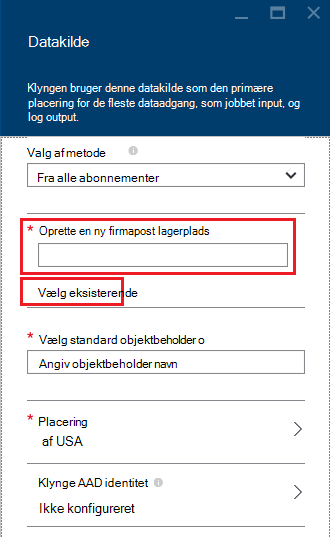

<properties
    pageTitle="Forespørge efter data fra HDFS-kompatible Blob-lager | Microsoft Azure"
    description="HDInsight bruger Azure Blob-lager som stor datalageret for HDFS. Lær at forespørge efter data fra Blob-lager og gemme resultaterne af din analyse."
    keywords="BLOB-lager, hdfs, strukturerede data, ustrukturerede data"
    services="hdinsight,storage"
    documentationCenter=""
    tags="azure-portal"
    authors="mumian"
    manager="jhubbard"
    editor="cgronlun"/>

<tags
    ms.service="hdinsight"
    ms.workload="big-data"
    ms.tgt_pltfrm="na"
    ms.devlang="na"
    ms.topic="get-started-article"
    ms.date="09/06/2016"
    ms.author="jgao"/>

# Bruge HDFS-kompatible Azure Blob-lager med Hadoop i HDInsight

Lær, hvordan du bruger lave omkostninger Azure Blob-lager med HDInsight, oprette Azure lagerplads konto og Blob-objektbeholder til lagring og derefter adresse af data i.

Azure Blob-lager er en robust, generel storageløsning, der integreres problemfrit med HDInsight. Via en Hadoop-distribueret fil system (HDFS)-grænseflade, kan det samlede sæt af komponenter i HDInsight fungere direkte på strukturerede eller ustrukturerede data i Blob-lager.

Lagring af data i Blob-lager, kan du sikkert at slette de HDInsight klynger, der bruges til beregning uden at miste brugerdata.

> [AZURE.IMPORTANT] HDInsight understøtter kun Bloker BLOB. Den ikke understøtter side eller tilføje BLOB.

Oplysninger om oprettelse af en HDInsight klynge, se [Komme i gang med HDInsight] [ hdinsight-get-started] eller [oprette HDInsight grupper][hdinsight-creation].

## HDInsight lagerplads arkitektur
I det følgende diagram giver en abstrakte visning af HDInsight lagerplads arkitektur:

![Hadoop klynger Brug HDFS API til at få adgang til og gemme strukturerede og ustrukturerede data i Blob-lager.] (./media/hdinsight-hadoop-use-blob-storage/HDI.WASB.Arch.png "HDInsight lagerplads arkitektur")

HDInsight giver adgang til den distribueret filsystem, der er tilknyttet noderne Beregn lokalt. Dette filsystem kan åbnes ved hjælp af den fulde URI, f.eks.:

    hdfs://<namenodehost>/<path>

Desuden giver HDInsight mulighed for at access-data, der er gemt i Azure Blob-lager. Syntaksen er:

    wasb[s]://<containername>@<accountname>.blob.core.windows.net/<path>

> [AZURE.NOTE] I tidligere versioner af HDInsight end 3.0, `asv://` blev brugt i stedet for `wasb://`. `asv://`der ikke bør benyttes med HDInsight klynger 3.0 eller nyere, som den medfører en fejl.

Hadoop understøtter en begrebet af standard-filsystemet. Standard-filsystemet indebærer en standard farveskema og nøglecenter. Det kan også bruges til at løse relative stier. Objektbeholder fra denne konto er angivet som standard-filsystemet under oprettelsen af HDInsight, en Azure-lager-konto og en bestemt Azure Blob-lager.

Du kan tilføje yderligere lagerplads konti fra samme Azure-abonnement eller forskellige Azure abonnementer ud over denne lagerplads konto under oprettelsesprocessen, eller når en klynge er blevet oprettet. Oplysninger om at tilføje yderligere lagerplads konti, skal du se [oprette HDInsight klynger][hdinsight-creation].

- **Beholdere i kontiene lagerplads, der er forbundet til en klynge:** Da kontonavnet og -tasten er knyttet til klyngen under oprettelse, har du fuld adgang til BLOB i disse beholdere.

- **Offentlige objektbeholdere eller offentlige BLOB i lagerplads konti, der ikke har forbindelse til en klynge:** Du har skrivebeskyttet tilladelse til at BLOB i beholdere.

    > [AZURE.NOTE]
        > Offentlige beholdere gør det muligt at få en liste over alle blob, der er tilgængelige i objektbeholderen og få objektbeholder metadata. Offentlige BLOB giver dig adgang til BLOB kun, hvis du kender den nøjagtige URL-adresse. Du kan finde yderligere oplysninger finder <a href="http://msdn.microsoft.com/library/windowsazure/dd179354.aspx">Begræns adgang til beholdere og BLOB</a>.

- **Privat beholdere i lagerplads konti, der ikke har forbindelse til en klynge:** Du kan ikke få adgang til BLOB i beholdere, medmindre du definerer kontoen lagerplads, når du sender WebHCat job. Det forklares senere i denne artikel.

Kontiene lagerplads, der er defineret i oprettelsen og deres nøgler er gemt i %HADOOP_HOME%/conf/core-site.xml på klyngenoderne. Standardfunktionsmåden for HDInsight er at bruge lagerplads konti, der er defineret i filen core site.xml. Det anbefales ikke at redigere filen core site.xml, fordi den klynge hoved node(master) kan reimaged eller overflyttet til enhver tid, og eventuelle ændringer af disse filer, går tabt.

Flere WebHCat job, herunder Hive, MapReduce, Hadoop-streaming og gris, kan udføre en beskrivelse af lagerplads konti og metadata med dem. (Dette virker aktuelt for gris med lagerplads konti, men ikke for metadata.) I sektionen [adgang BLOB ved hjælp af Azure PowerShell](#powershell) i denne artikel er der et eksempel på denne funktion. Få mere at vide under [Brug af en HDInsight klynge med alternative lagerplads konti og Metastores](http://social.technet.microsoft.com/wiki/contents/articles/23256.using-an-hdinsight-cluster-with-alternate-storage-accounts-and-metastores.aspx).

BLOB-lager kan bruges til strukturerede og ustrukturerede data. BLOB objektbeholdere lagre data som nøgle/værdi-par, og der er ingen mappehierarkiet. Skråstreg (/) kan dog bruges i navnet på den nøgle for at vise den som om en fil er gemt i en mappestruktur. En blob nøgle kan for eksempel være *input/log1.txt*. Der findes ingen faktiske *input* mappe, men på grund af tilstedeværelsen af skråstreg i navnet på den nøgle, der er udseendet af en sti til filen.

###Fordele ved Blob-lager
Implicit ydeevne omkostninger for ikke at finde samtidig beregne klynger og lagerplads ressourcer er afhjulpet af den måde computerklynger oprettes tæt lagerplads konto ressourcer i Azure område, hvor det hurtige netværk gør det meget effektiv for Beregn noder til at få adgang til dataene i Azure Blob-lager.

Der er flere fordele, der er knyttet til lagring af data i Azure Blob-lager i stedet for HDFS:

* **Deling og genbrug af data:** Dataene i HDFS findes i computerklynge. Kun de programmer, der har adgang til computerklynge kan bruge dataene ved hjælp af HDFS API'er. Kan få adgang til data i Azure Blob-lager, enten via HDFS API'er eller via [Blob Storage REST API'er][blob-storage-restAPI]. Dermed, et større udvalg af værktøjer og programmer (herunder andre HDInsight klynger) kan bruges til at oprette og bruge dataene.
* **Arkivering af data:** Lagring af data i Azure Blob-lager gør det muligt for de HDInsight klynger, der bruges til beregning skal slettes sikkert uden at miste brugerdata.
* **Data lagerplads omkostninger:** Lagring af data i DFS for på lang sigt er mere dyrt end gemme dataene i Azure Blob-lager, fordi omkostninger for en computerklynge er højere end omkostninger for en Azure Blob-objektbeholder til lagring. Fordi dataene, ikke behøver at genindlæses til generering af klynge hver Beregn, du desuden også gemme data ved indlæsning omkostninger.
* **Elastiske skala ud:** Selvom HDFS giver dig et skaleret filsystem, bestemmes skalaen af antallet af knuder, som du opretter til din klynge. Ændre skalaen kan være en mere kompliceret proces end stole på den elastiske skalering egenskaber, som du får automatisk i Azure Blob-lager.
* **Geografisk gentagelse:** Dine Azure Blob objektbeholdere kan være geografisk replikerede. Selvom det giver dig geografiske gendannelse og overflødige data, en failover til den placering, der geografisk replikerede påvirker alvorligt din ydeevne, og det kan blive pålagt ekstra omkostninger. Så vores anbefales, at vælge geografisk-gentagelse med omhu, og kun, hvis værdien af dataene er værd de ekstra omkostninger.

Visse MapReduce job og pakker kan oprette mellemliggende resultater, du virkelig ikke ønsker at gemme i Azure Blob-lager. Det er tilfældet, kan du vælge at gemme dataene i den lokale HDFS. Faktisk bruger HDInsight DFS for flere af disse mellemliggende resultater i Hive opgaver og andre processer.

> [AZURE.NOTE] De fleste HDFS kommandoer (for eksempel <b>ls</b>, <b>copyFromLocal</b> og <b>mkdir</b>) fungerer stadig som forventet. Kun de kommandoer, der er specifikke for den oprindelige HDFS implementering (som kaldes DFS), som <b>fschk</b> og <b>dfsadmin</b>, vises forskellig adfærd i Azure Blob-lager.

## Oprette Blob objektbeholdere

Hvis du vil bruge blob, skal du først oprette en [Azure-lager konto][azure-storage-create]. Som en del af dette skal angive du et Azure område, der skal indeholde de objekter, du opretter ud fra denne konto. Klyngen og lagerplads kontoen skal knyttes i samme region. Hive metastore SQL Server-database og Oozie metastore SQL Server-database skal også være placeret i samme område.

Det sted, hvor det er placeret, tilhører hver blob, du opretter en objektbeholder i kontoen Azure-lager. Denne objektbeholder kan være en eksisterende blob, der blev oprettet uden for HDInsight, eller det kan være en objektbeholder, der er oprettet for en HDInsight klynge.

Objektbeholderen standard Blob lagres klynge specifikke oplysninger som jobs og logfiler. Ikke dele en standard Blob objektbeholder med flere HDInsight klynger. Dette kan beskadiget jobs, og klyngen vil misbehave. Det anbefales at bruge en anden objektbeholder til hver klynge og sætte delte data i en sammenkædet lagerplads-konto, der er angivet i installation af alle relevante klynger i stedet for lagerplads standardkontoen. Du kan finde flere oplysninger om konfiguration af sammenkædede lagerplads konti, skal du se [oprette HDInsight klynger][hdinsight-creation]. Du kan dog genbruge en objektbeholder til lagring af standard, når den oprindelige HDInsight klynge er blevet slettet. Du kan faktisk bevare HBase tabel skemaet HBase klynger og data ved at oprette en ny HBase klynge ved hjælp af objektbeholderen standard blob-lager, der bruges af en HBase klynge, som er blevet slettet.

### Ved hjælp af portalen Azure

Når du opretter en HDInsight klynge fra portalen, har du indstillinger for at bruge en eksisterende lagerplads konto eller oprette en ny firmapost lagerplads:

###Brug af Azure CLI

[AZURE.INCLUDE [use-latest-version](../../includes/hdinsight-use-latest-cli.md)]

Hvis du har [installeret og konfigureret Azure CLI](../xplat-cli-install.md), kan følgende kommando bruges til en lagerplads konto og beholder.

    azure storage account create <storageaccountname> --type LRS

> [AZURE.NOTE] Den `--type` parameter angiver, hvordan kontoen lagerplads replikeres. Du kan finde yderligere oplysninger finder [Azure lagerplads gentagelse](../storage/storage-redundancy.md). Brug ikke ZRS, som ZRS ikke understøtter siden blob, fil, en tabel eller kø.

Du bliver bedt om at angive det geografiske område, kontoen lagerplads vil være placeret i. Du skal oprette kontoen lagring i det samme område, du har planer om at oprette din HDInsight klynge.

Når kontoen lagerplads er oprettet, skal du bruge følgende kommando til at hente tasterne lagerplads konto:

    azure storage account keys list <storageaccountname>

For at oprette en objektbeholder, skal du bruge følgende kommando:

    azure storage container create <containername> --account-name <storageaccountname> --account-key <storageaccountkey>

### Brug af Azure PowerShell

Hvis du [har installeret og konfigureret Azure PowerShell][powershell-install], du kan bruge følgende fra Azure PowerShell-prompt for at oprette en lagerplads konto og beholder:

[AZURE.INCLUDE [upgrade-powershell](../../includes/hdinsight-use-latest-powershell.md)]

    $SubscriptionID = "<Your Azure Subscription ID>"
    $ResourceGroupName = "<New Azure Resource Group Name>"
    $Location = "EAST US 2"
    
    $StorageAccountName = "<New Azure Storage Account Name>"
    $containerName = "<New Azure Blob Container Name>"
    
    Add-AzureRmAccount
    Select-AzureRmSubscription -SubscriptionId $SubscriptionID
    
    # Create resource group
    New-AzureRmResourceGroup -name $ResourceGroupName -Location $Location
    
    # Create default storage account
    New-AzureRmStorageAccount -ResourceGroupName $ResourceGroupName -Name $StorageAccountName -Location $Location -Type Standard_LRS 
    
    # Create default blob containers
    $storageAccountKey = (Get-AzureRmStorageAccountKey -ResourceGroupName $resourceGroupName -StorageAccountName $StorageAccountName)[0].Value
    $destContext = New-AzureStorageContext -StorageAccountName $storageAccountName -StorageAccountKey $storageAccountKey  
    New-AzureStorageContainer -Name $containerName -Context $destContext

## Adressefiler i Blob-lager

URI-skemaet for at få adgang til filer i Blob-lager fra HDInsight er:

    wasb[s]://<BlobStorageContainerName>@<StorageAccountName>.blob.core.windows.net/<path>

URI-skemaet indeholder ikke-krypteret access (med den *wasb:* præfiks) og SSL krypteret access (med *wasbs*). Det anbefales at bruge *wasbs* , når det er muligt, selv når adgang til data, der ligger i det samme område i Azure.

Den &lt;BlobStorageContainerName&gt; identificerer navnet på objektbeholderen i Azure Blob-lager.
Den &lt;StorageAccountName&gt; identificerer kontonavnet Azure-lager. Et fuldt domænenavn (fulde Domænenavn) er påkrævet.

Hvis hverken &lt;BlobStorageContainerName&gt; eller &lt;StorageAccountName&gt; er blevet angivet, der bruges af standard-filsystemet. Du kan bruge en relativ sti eller en absolut sti til filerne på standard-filsystemet. For eksempel kan filen *hadoop-mapreduce-examples.jar* , der følger med HDInsight klynger referere til ved hjælp af en af følgende:

    wasbs://mycontainer@myaccount.blob.core.windows.net/example/jars/hadoop-mapreduce-examples.jar
    wasbs:///example/jars/hadoop-mapreduce-examples.jar
    /example/jars/hadoop-mapreduce-examples.jar

> [AZURE.NOTE] Filnavnet er <i>hadoop-examples.jar</i> i HDInsight version 2.1 og 1,6 klynger.

Den &lt;stien&gt; er navnet på filen eller mappen HDFS sti. Da beholdere i Azure Blob-lager er blot nøgle-værdi butikker, er der ingen SAND hierarkiske filsystem. En skråstreg (/) i en blob nøgle fortolkes som en directory separator. For eksempel er blob navnet til *hadoop-mapreduce-examples.jar* :

    example/jars/hadoop-mapreduce-examples.jar

> [AZURE.NOTE] Når du arbejder med BLOB uden for HDInsight, de fleste funktioner ikke genkender formatet WASB og i stedet forventer et grundlæggende sti format, såsom `example/jars/hadoop-mapreduce-examples.jar`.

## Access BLOB ved hjælp af Azure CLI

Brug følgende kommando for at angive de blob-relaterede kommandoer:

    azure storage blob

**Eksempel på brug af Azure CLI for at overføre en fil**

    azure storage blob upload <sourcefilename> <containername> <blobname> --account-name <storageaccountname> --account-key <storageaccountkey>

**Eksempel på brug af Azure CLI for at hente en fil**

    azure storage blob download <containername> <blobname> <destinationfilename> --account-name <storageaccountname> --account-key <storageaccountkey>

**Eksempel på brug af Azure CLI for at slette en fil**

    azure storage blob delete <containername> <blobname> --account-name <storageaccountname> --account-key <storageaccountkey>

**Eksempel på brug af Azure CLI til liste over filer**

    azure storage blob list <containername> <blobname|prefix> --account-name <storageaccountname> --account-key <storageaccountkey>

## Access BLOB ved hjælp af Azure PowerShell

> [AZURE.NOTE] Kommandoerne i dette afsnit indeholder et eksempel på grundlæggende ved at bruge PowerShell til access-data, der er gemt i BLOB. Du kan finde en mere komplet eksempel, der er tilpasset til at arbejde med HDInsight, [HDInsight værktøjer](https://github.com/Blackmist/hdinsight-tools).

Brug følgende kommando til at få vist den blob-relaterede cmdletter:

    Get-Command *blob*

![Liste over blob-relaterede PowerShell-cmdlet'er.][img-hdi-powershell-blobcommands]

###Overføre filer

Se [overføre data til HDInsight][hdinsight-upload-data].

###Hente filer

Den følgende scrip henter en blok blob til den aktuelle mappe. Før du kører scriptet, kan du ændre mappen til en mappe, hvor du har tilladelse til at skrive.

    $resourceGroupName = "<AzureResourceGroupName>"
    $storageAccountName = "<AzureStorageAccountName>"   # The storage account used for the default file system specified at creation.
    $containerName = "<BlobStorageContainerName>"  # The default file system container has the same name as the cluster.
    $blob = "example/data/sample.log" # The name of the blob to be downloaded.
    
    # Use Add-AzureAccount if you haven't connected to your Azure subscription
    Login-AzureRmAccount 
    Select-AzureRmSubscription -SubscriptionID "<Your Azure Subscription ID>"
    
    Write-Host "Create a context object ... " -ForegroundColor Green
    $storageAccountKey = (Get-AzureRmStorageAccountKey -ResourceGroupName $resourceGroupName -Name $storageAccountName)[0].Value
    $storageContext = New-AzureStorageContext -StorageAccountName $storageAccountName -StorageAccountKey $storageAccountKey  
    
    Write-Host "Download the blob ..." -ForegroundColor Green
    Get-AzureStorageBlobContent -Container $ContainerName -Blob $blob -Context $storageContext -Force
    
    Write-Host "List the downloaded file ..." -ForegroundColor Green
    cat "./$blob"

Give ressource gruppenavn og klyngenavnet, kan du bruge følgende kode:

    $resourceGroupName = "<AzureResourceGroupName>"
    $clusterName = "<HDInsightClusterName>"
    $blob = "example/data/sample.log" # The name of the blob to be downloaded.
    
    $cluster = Get-AzureRmHDInsightCluster -ResourceGroupName $resourceGroupName -ClusterName $clusterName
    $defaultStorageAccount = $cluster.DefaultStorageAccount -replace '.blob.core.windows.net'
    $defaultStorageAccountKey = (Get-AzureRmStorageAccountKey -ResourceGroupName $resourceGroupName -Name $defaultStorageAccount)[0].Value
    $defaultStorageContainer = $cluster.DefaultStorageContainer
    $storageContext = New-AzureStorageContext -StorageAccountName $defaultStorageAccount -StorageAccountKey $defaultStorageAccountKey 
    
    Write-Host "Download the blob ..." -ForegroundColor Green
    Get-AzureStorageBlobContent -Container $defaultStorageContainer -Blob $blob -Context $storageContext -Force

###Slette filer

    Remove-AzureStorageBlob -Container $containerName -Context $storageContext -blob $blob

###Liste over filer

    Get-AzureStorageBlob -Container $containerName -Context $storageContext -prefix "example/data/"

###Køre Hive forespørgsler ved hjælp af en udefineret lagerplads konto

I dette eksempel viser, hvordan til at få vist en mappe fra lagerplads konto, der ikke er defineret under oprettelsesprocessen.
$clusterName = "<HDInsightClusterName>"

    $undefinedStorageAccount = "<UnboundedStorageAccountUnderTheSameSubscription>"
    $undefinedContainer = "<UnboundedBlobContainerAssociatedWithTheStorageAccount>"

    $undefinedStorageKey = Get-AzureStorageKey $undefinedStorageAccount | %{ $_.Primary }

    Use-AzureRmHDInsightCluster $clusterName

    $defines = @{}
    $defines.Add("fs.azure.account.key.$undefinedStorageAccount.blob.core.windows.net", $undefinedStorageKey)

    Invoke-AzureRmHDInsightHiveJob -Defines $defines -Query "dfs -ls wasbs://$undefinedContainer@$undefinedStorageAccount.blob.core.windows.net/;"

## Næste trin

I denne artikel, du har lært, hvordan du bruger HDFS-kompatible Azure Blob-lager med HDInsight, og du har lært, Azure Blob-lager er en grundlæggende komponent i HDInsight. Dette gør det muligt for dig at opbygge SVG, langsigtede, arkivering data acquisition løsninger med Azure Blob-lager og bruger HDInsight til at låse oplysningerne inden i de gemte strukturerede og ustrukturerede data.

Du kan finde flere oplysninger i:

* [Introduktion til Azure HDInsight][hdinsight-get-started]
* [Overføre data til HDInsight][hdinsight-upload-data]
* [Bruge Hive med HDInsight][hdinsight-use-hive]
* [Brug gris med HDInsight][hdinsight-use-pig]
* [Brug Azure lagerplads delt Access signaturer til at begrænse adgangen til data med HDInsight][hdinsight-use-sas]

[hdinsight-use-sas]: hdinsight-storage-sharedaccesssignature-permissions.md
[powershell-install]: ../powershell-install-configure.md
[hdinsight-creation]: hdinsight-provision-clusters.md
[hdinsight-get-started]: hdinsight-hadoop-tutorial-get-started-windows.md
[hdinsight-upload-data]: hdinsight-upload-data.md
[hdinsight-use-hive]: hdinsight-use-hive.md
[hdinsight-use-pig]: hdinsight-use-pig.md

[blob-storage-restAPI]: http://msdn.microsoft.com/library/windowsazure/dd135733.aspx
[azure-storage-create]: ../storage/storage-create-storage-account.md

[img-hdi-powershell-blobcommands]: ./media/hdinsight-hadoop-use-blob-storage/HDI.PowerShell.BlobCommands.png
[img-hdi-quick-create]: ./media/hdinsight-hadoop-use-blob-storage/HDI.QuickCreateCluster.png
[img-hdi-custom-create-storage-account]: ./media/hdinsight-hadoop-use-blob-storage/HDI.CustomCreateStorageAccount.png  
