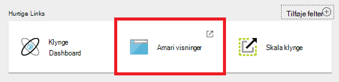
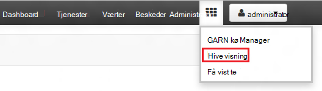
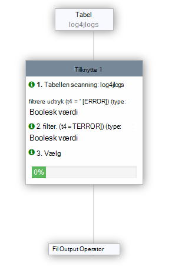

<properties
   pageTitle="Bruge Ambari visninger til at arbejde med Hive på HDInsight (Hadoop) | Microsoft Azure"
   description="Lær, hvordan du bruger visningen Hive fra din webbrowser til at sende Hive forespørgsler. Visningen Hive er en del af Ambari Webbrugergrænsefladen i din klynge Linux-baserede HDInsight."
   services="hdinsight"
   documentationCenter=""
   authors="Blackmist"
   manager="jhubbard"
   editor="cgronlun"
    tags="azure-portal"/>

<tags
   ms.service="hdinsight"
   ms.devlang="na"
   ms.topic="article"
   ms.tgt_pltfrm="na"
   ms.workload="big-data"
   ms.date="10/28/2016"
   ms.author="larryfr"/>

#Brug af Hive visningen med Hadoop i HDInsight

[AZURE.INCLUDE [hive-selector](../../includes/hdinsight-selector-use-hive.md)]

Ambari er en administration og overvågning værktøj, der leveres med Linux-baserede HDInsight klynger. En af de funktioner, der leveres via Ambari er en Web-brugergrænseflade, der kan bruges til at køre Hive forespørgsler. Dette er den __Hive visning__, en del af de tilgængelige med din HDInsight klynge Ambari visninger.

> [AZURE.NOTE] Ambari har en masse funktioner, der ikke er beskrevet i dette dokument. Se [administrere HDInsight klynger ved hjælp af Ambari Webbrugergrænsefladen](hdinsight-hadoop-manage-ambari.md)kan finde flere oplysninger.

##Forudsætninger

- En Linux-baserede HDInsight klynge. Oplysninger om oprettelse af en ny klynge, kan du se [komme i gang med Linux-baserede HDInsight](hdinsight-hadoop-linux-tutorial-get-started.md).

##Åbne visningen Hive

Du kan Ambari visninger fra Azure-portalen vælge din klynge HDInsight, og vælg derefter __Ambari visninger__ i afsnittet __Hurtige Links__ .

Du kan også gå direkte til Ambari ved at gå til https://CLUSTERNAME.azurehdinsight.net i en webbrowser (hvor __CLUSTERNAME__ er navnet på din HDInsight klynge) og derefter vælge sæt af kvadrater fra sidemenuen (ved siden af det link, __administrator__ og knappen til venstre på siden) til listen tilgængelige visninger. Vælg den __Hive visning__.

.

> [AZURE.NOTE] Når du åbner Ambari, bliver du bedt om at godkende til webstedet. Angiv administratoren (standard `admin`,) navn og en adgangskode, du brugte, når du opretter klyngen-konto.

Du burde se en side, der ligner følgende:

##Visningstabeller

Vælg feltets __Standardværdi__ under fanen __databaser__ i sektionen __Database Explorer__ på siden. Derved vises en liste over tabeller i standarddatabasen. Skal findes kun én tabel til en ny HDInsight klynge; __hivesampletable__.

Som nye tabeller er tilføjet gennemgå trinnene i dette dokument, kan du bruge på opdateringsikonet i øverste højre hjørne af Database-Explorer til at opdatere listen over tilgængelige tabeller.

##Forespørgselseditor

Brug følgende trin fra visningen Hive til at køre en Hive forespørgsel mod data, der følger med klyngen.

1. I sektionen __Forespørgselseditor__ på siden, kan du indsætte følgende HiveQL sætninger i regnearket:

        DROP TABLE log4jLogs;
        CREATE EXTERNAL TABLE log4jLogs(t1 string, t2 string, t3 string, t4 string, t5 string, t6 string, t7 string)
        ROW FORMAT DELIMITED FIELDS TERMINATED BY ' '
        STORED AS TEXTFILE LOCATION 'wasbs:///example/data/';
        SELECT t4 AS sev, COUNT(*) AS cnt FROM log4jLogs WHERE t4 = '[ERROR]' GROUP BY t4;

    Disse sætninger udføre følgende handlinger:

    - **DROP TABLE** - sletter tabellen og datafilen, i tilfælde af, at tabellen allerede findes.
    - **Opret eksterne tabel** - opretter en ny "eksterne" tabel i Hive. Eksterne tabeller gemme kun tabeldefinition i Hive; data, der er tilbage i den oprindelige placering.
    - **Række FORMAT** – som fortæller Hive hvordan dataene skal formateres. I dette tilfælde er felterne i hver log adskilt af et mellemrum.
    - **GEMT AS TEXTFILE placering** - fortæller Hive hvor dataene er gemt (mappen eksempeldataene /), og at det er gemt som tekst.
    - **Vælg** - markerer en optælling af alle rækker, hvor kolonne t4 indeholder værdien [ERROR].

    >[AZURE.NOTE] Eksterne tabeller skal bruges, når du forventer, at de underliggende data opdateres af en ekstern kilde, som et automatiseret data overførslen eller af en anden MapReduce handling, men du vil altid Hive forespørgsler til at bruge de nyeste data. Slippe en ekstern tabel betyder *ikke* slette dataene, kun tabeldefinition.

2. Brug knappen __Execute__ i bunden af Query Editor til at starte forespørgslen. Det skal slå orange, og ændrer teksten til __Stop udførelse af__. En __Proces forespørgselsresultater__ sektion skal vises under Forespørgselseditor og få vist oplysninger om jobbet.

    > [AZURE.IMPORTANT] Nogle browsere måske ikke korrekt opdateres oplysningerne om log eller resultater. Hvis du kører en sag, og det ser ud til at køre uendelig uden at opdatere logfilen eller returnere resultater skal du prøve at bruge Mozilla FireFox eller Google Chrome i stedet.

3. Når forespørgslen er færdig, vises sektionen __Proces forespørgselsresultater__ resultaterne af handlingen. Knappen __Stop udførelse af__ også skifte tilbage til en grøn __Execute__ -knap. Fanen __resultater__ skal indeholde følgende oplysninger:

        sev       cnt
        [ERROR]   3

    Fanen __logføring__ kan bruges til at få vist oplysninger om logføring oprettet af jobbet. Du kan bruge det til fejlfinding, hvis der er problemer med en forespørgsel.

    > [AZURE.TIP] Bemærk, at dialogboksen __Gem resultaterne fra__ rullelisten øverst til venstre for sektionen, __Proces forespørgselsresultater__ ; Du kan bruge det til enten at hente resultaterne, eller gemme dem til HDInsight lager som en CSV-fil.

3. Vælg de første fire linjer af denne forespørgsel og derefter vælge __Udfør__. Bemærk, at der er ingen resultater, når jobbet er fuldført. Dette skyldes, at ved hjælp af knappen __Udfør__ , når en del af forespørgslen er markeret kører kun de markerede sætninger. I dette tilfælde omfatter ikke markeringen den endelige opgørelse, der henter rækker fra tabellen. Hvis du vælger kun pågældende linje og bruger __Execute__, skal du se de forventede resultater.

3. Bruge knappen __Nyt regneark__ i bunden af __Query Editor__ til at oprette et nyt regneark. Angiv følgende HiveQL sætninger i det nye regneark:

        CREATE TABLE IF NOT EXISTS errorLogs (t1 string, t2 string, t3 string, t4 string, t5 string, t6 string, t7 string) STORED AS ORC;
        INSERT OVERWRITE TABLE errorLogs SELECT t1, t2, t3, t4, t5, t6, t7 FROM log4jLogs WHERE t4 = '[ERROR]';

    Disse sætninger udføre følgende handlinger:

    - **Oprette tabel Hvis ikke findes** - opretter en tabel, hvis den ikke allerede findes. Da nøgleordet **eksterne** ikke bruges, er dette en intern tabel, som er gemt i et Hive datalager og administreres helt af Hive. I modsætning til eksterne tabeller slippe en intern tabel, slettes de underliggende data.
    - **GEMT AS ORC** - gemmer dataene i optimeret række kolonne (ORC)-format. Dette er et meget optimerede og effektivt format til lagring af Hive data.
    - **Indsæt OVERSKRIV... Vælg** – markerer rækker fra tabellen **log4jLogs** , der indeholder [ERROR], og derefter indsætter dataene i tabellen **errorLogs** .

    Brug knappen __Execute__ til at køre forespørgslen. Fanen __resultater__ vil ikke indeholde nogle af oplysninger, som nogen rækker, der returneres af denne forespørgsel, men status skal vises som __lykkedes__.

###Hive indstillinger

Vælg ikonet __Indstillinger__ til højre for editoren.

Indstillinger kan bruges til at ændre forskellige Hive-indstillinger, som ændrer udførelse af programmet for Hive fra Tez (standard,) til MapReduce.

###Visual forklare

Vælg ikonet __Visuelle forklare__ til højre for editoren.

Dette er den __Visuelle forklare__ visning af forespørgslen, hvilket kan være nyttige strømmen af komplekse forespørgsler. Du kan få vist en indeholder tekst, der svarer til denne visning ved hjælp af knappen __Forklar__ i Forespørgselseditor.

###Tez

Vælg ikonet __Tez__ til højre for editoren.

Derved vises den ført acykliske Graph (DAG) bruges af Tez for denne forespørgsel, hvis der er tilgængelige. Hvis du vil have vist DAG for forespørgsler har du kørte i fortiden eller fejlfinding Tez processen, Brug [Tez visning](hdinsight-debug-ambari-tez-view.md) i stedet.

###Beskeder

Vælg ikonet __beskeder__ til højre for editoren.

Meddelelser er meddelelser, som oprettes, når du kører forespørgsler. For eksempel, modtager du en meddelelse om når en forespørgsel sendes, eller når der opstår en fejl.

##Gemte forespørgsler

1. Fra Forespørgselseditor, Opret et nyt regneark, og Angiv følgende forespørgsel:

        SELECT * from errorLogs;

    Udføre forespørgslen for at bekræfte, at den fungerer. Resultaterne bliver på følgende måde:

        errorlogs.t1    errorlogs.t2    errorlogs.t3    errorlogs.t4    errorlogs.t5    errorlogs.t6    errorlogs.t7
        2012-02-03  18:35:34    SampleClass0    [ERROR]     incorrect   id  
        2012-02-03  18:55:54    SampleClass1    [ERROR]     incorrect   id  
        2012-02-03  19:25:27    SampleClass4    [ERROR]     incorrect   id

2. Bruge knappen __Gem som__ i bunden af editoren. Navngiv denne forespørgsel __Errorlogs__ , og vælg __OK__. Bemærk, at navnet på regnearket ændres til __Errorlogs__.

3. Vælg fanen __Gemte forespørgsler__ øverst på siden Hive visning. Bemærk, at __Errorlogs__ vises nu som en gemt forespørgsel. Det forbliver på denne liste, indtil du fjerne den. Vælge navn åbnes forespørgslen i Forespørgselseditoren.

##Oversigt over forespørgsel

Knappen __Oversigt__ øverst i visningen Hive giver mulighed for at få vist forespørgsler, du har kørt tidligere. Bruge den nu, og vælg nogle af de forespørgsler, du har kørt tidligere. Når du vælger en forespørgsel, åbnes den i Forespørgselseditor.

##Brugerdefinerede funktioner (UDF)

Hive kan også udvides til **brugerdefinerede funktioner (UDF)**. EN gør det muligt at implementere funktionalitet or -logik, der ikke er nemt udformet i HiveQL.

Selvom du kan tilføje en som en del af sætningerne HiveQL i forespørgslen, kan du angive og gemme et sæt af brugerdefinerede funktioner, der kan bruges med __Query Editor__fanen UDF øverst i visningen Hive.

Når du har tilføjet en til visningen Hive, vises knappen __Indsæt brugerdefinerede funktioner__ nederst i __Forespørgselseditor__. Hvis du markerer dette, vises en rulleliste i de brugerdefinerede funktioner, der er defineret i visningen Hive. Hvis du vælger en føjer HiveQL sætninger til din forespørgsel til at aktivere udf-filen.

For eksempel, hvis du har defineret en UDF med følgende egenskaber:

* Ressourcenavn: myudfs
* Ressource sti: wasbs:///myudfs.jar
* UDF navn: myawesomeudf
* UDF klassenavnet: com.myudfs.Awesome

Ved hjælp af knappen __Indsæt brugerdefinerede funktioner__ , vises en post med navnet __myudfs__med en anden rullelisten for hver UDF, der er defineret for ressourcen. I dette tilfælde __myawesomeudf__. Hvis du vælger denne post tilføje følgende til starten af forespørgslen:

    add jar wasbs:///myudfs.jar;

    create temporary function myawesomeudf as 'com.myudfs.Awesome';

Du kan derefter bruge udf-filen i din forespørgsel. For eksempel `SELECT myawesomeudf(name) FROM people;`.

Du kan finde flere oplysninger om brug af brugerdefinerede funktioner med Hive på HDInsight, se følgende:

* [Brug af Python med Hive og gris i HDInsight](hdinsight-python.md)

* [Sådan føjer du en brugerdefineret Hive UDF til HDInsight](http://blogs.msdn.com/b/bigdatasupport/archive/2014/01/14/how-to-add-custom-hive-udfs-to-hdinsight.aspx)

##Næste trin

Generelle oplysninger om Hive i HDInsight:

* [Bruge Hive med Hadoop på HDInsight](hdinsight-use-hive.md)

Du kan arbejde med Hadoop på HDInsight oplysninger om andre måder:

* [Brug gris med Hadoop på HDInsight](hdinsight-use-pig.md)

* [Bruge MapReduce med Hadoop på HDInsight](hdinsight-use-mapreduce.md)
