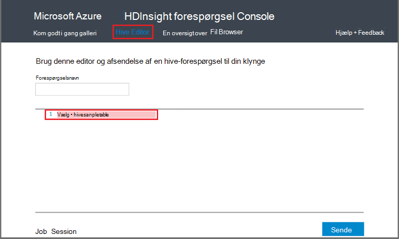

<properties
   pageTitle="Brug Hadoop Hive på konsollen forespørgsel i HDInsight | Microsoft Azure"
   description="Lær at bruge konsollen webbaseret forespørgsel til at køre Hive forespørgsler på en HDInsight Hadoop-klynge fra din browser."
   services="hdinsight"
   documentationCenter=""
   authors="Blackmist"
   manager="jhubbard"
   editor="cgronlun"
    tags="azure-portal"/>

<tags
   ms.service="hdinsight"
   ms.devlang="na"
   ms.topic="article"
   ms.tgt_pltfrm="na"
   ms.workload="big-data"
   ms.date="09/20/2016"
   ms.author="larryfr"/>

# Køre Hive forespørgsler ved hjælp af konsollen forespørgsel

[AZURE.INCLUDE [hive-selector](../../includes/hdinsight-selector-use-hive.md)]

I denne artikel kan lære du, hvordan du bruger konsollen HDInsight forespørgsel til at køre Hive forespørgsler på en HDInsight Hadoop-klynge fra din browser.

> [AZURE.IMPORTANT] Konsollen HDInsight forespørgsel er kun tilgængelig på Windows-baseret HDInsight klynger. Hvis du bruger en Linux-baserede HDInsight klynge, kan du se [køre Hive forespørgsler med visningen Hive](hdinsight-hadoop-use-hive-ambari-view.md).

##Forudsætninger

For at fuldføre trinnene i denne artikel, skal du følgende.

* En Windows-baseret HDInsight Hadoop-klynge

* En moderne webbrowser

##Køre Hive forespørgsler ved hjælp af konsollen forespørgsel

1. Åbn en webbrowser og gå til __https://CLUSTERNAME.azurehdinsight.net__, hvor __CLUSTERNAME__ er navnet på din HDInsight klynge. Hvis du bliver bedt om det, kan du angive det brugernavn og adgangskode, du brugte, da du oprettede klyngen.

2. Linkene øverst på siden Vælg **Hive Editor**. Dette viser en formular, der kan bruges til at indtaste de HiveQL sætninger, der skal køres i HDInsight klynge.

    

    Erstat teksten `Select * from hivesampletable` med følgende HiveQL sætninger:

        set hive.execution.engine=tez;
        DROP TABLE log4jLogs;
        CREATE EXTERNAL TABLE log4jLogs (t1 string, t2 string, t3 string, t4 string, t5 string, t6 string, t7 string)
        ROW FORMAT DELIMITED FIELDS TERMINATED BY ' '
        STORED AS TEXTFILE LOCATION 'wasbs:///example/data/';
        SELECT t4 AS sev, COUNT(*) AS count FROM log4jLogs WHERE t4 = '[ERROR]' AND INPUT__FILE__NAME LIKE '%.log' GROUP BY t4;

    Disse sætninger udføre følgende handlinger:

    * **Slip tabel**: sletter tabellen og datafilen, hvis der allerede findes i tabellen.
    * **Opret ekstern tabel**: opretter en ny 'ekstern' tabel i Hive. Eksterne tabeller gemme kun tabeldefinition i Hive; data, der er tilbage i den oprindelige placering.

    > [AZURE.NOTE] Eksterne tabeller skal bruges, når du forventer, at de underliggende data skal opdateres af en ekstern kilde (som et automatiseret data overførslen) eller af en anden MapReduce handling, men du vil altid Hive forespørgsler til at bruge de nyeste data.
    >
    > Slippe en ekstern tabel betyder **ikke** slette dataene, kun tabeldefinition.

    * **Række FORMAT**: fortæller Hive hvordan dataene skal formateres. I dette tilfælde er felterne i hver log adskilt af et mellemrum.
    * **GEMT AS TEXTFILE placering**: fortæller Hive hvor dataene er gemt (mappen eksempeldataene /), og det er gemt som tekst
    * **Vælg**: Vælg en optælling af alle rækker, hvor kolonne **t4** indeholder værdien **[ERROR]**. Dette skal returnere en værdi på **3** , fordi der er tre rækker, der indeholder denne værdi.
    * **INPUT__FILE__NAME som '%.log'** - fortæller Hive, som vi bør kun returnerer data fra filer, der slutter i. log. Dette begrænser søgningen til filen sample.log, der indeholder dataene, og beholder den returnerer data fra andre eksempel-datafiler, der ikke matcher skemaet vi definerede.

2. Klik på **Send**. **Jobbet Session** nederst på siden skal vise detaljer for jobbet.

3. Når feltet **Status** ændres til **fuldført**, skal du vælge **Vis detaljer** til jobbet. På siden detaljer **Job Output** indeholder `[ERROR]   3`. Du kan bruge knappen **Hent** under dette felt til at downloade en fil, der indeholder output fra jobbet.

##Oversigt

Som du kan se, indeholder en nem måde at køre Hive forespørgsler i en HDInsight klynge, overvåge jobstatus og hente output konsollen forespørgsel.

Vælg **Introduktion** øverst i konsollen forespørgsel for at få mere for at vide om brug af Hive forespørgsel Console til at køre Hive job, og derefter bruge eksemplerne, der kan bruges. Hver prøve vejleder gennem processen med at bruge Hive til at analysere data, herunder forklaringer om sætningerne HiveQL bruges i stikprøven.

##Næste trin

Du kan finde generelle oplysninger om Hive i HDInsight:

* [Bruge Hive med Hadoop på HDInsight](hdinsight-use-hive.md)

Du kan arbejde med Hadoop på HDInsight oplysninger om andre måder:

* [Brug gris med Hadoop på HDInsight](hdinsight-use-pig.md)

* [Bruge MapReduce med Hadoop på HDInsight](hdinsight-use-mapreduce.md)

Hvis du bruger Tez med Hive, skal du se følgende dokumenter til fejlfindingsoplysninger:

* [Brug Tez Brugergrænsefladen på Windows-baseret HDInsight](hdinsight-debug-tez-ui.md)

* [Brug af Ambari Tez visningen på Linux-baserede HDInsight](hdinsight-debug-ambari-tez-view.md)

[1]: ../HDInsight/hdinsight-hadoop-visual-studio-tools-get-started.md

[hdinsight-sdk-documentation]: http://msdnstage.redmond.corp.microsoft.com/library/dn479185.aspx

[azure-purchase-options]: http://azure.microsoft.com/pricing/purchase-options/
[azure-member-offers]: http://azure.microsoft.com/pricing/member-offers/
[azure-free-trial]: http://azure.microsoft.com/pricing/free-trial/

[apache-tez]: http://tez.apache.org
[apache-hive]: http://hive.apache.org/
[apache-log4j]: http://en.wikipedia.org/wiki/Log4j
[hive-on-tez-wiki]: https://cwiki.apache.org/confluence/display/Hive/Hive+on+Tez
[import-to-excel]: http://azure.microsoft.com/documentation/articles/hdinsight-connect-excel-power-query/

[hdinsight-use-oozie]: hdinsight-use-oozie.md
[hdinsight-analyze-flight-data]: hdinsight-analyze-flight-delay-data.md

[hdinsight-storage]: hdinsight-hadoop-use-blob-storage.md

[hdinsight-provision]: hdinsight-provision-clusters.md
[hdinsight-submit-jobs]: hdinsight-submit-hadoop-jobs-programmatically.md
[hdinsight-upload-data]: hdinsight-upload-data.md
[hdinsight-get-started]: hdinsight-hadoop-linux-tutorial-get-started.md

[Powershell-install-configure]: powershell-install-configure.md
[powershell-here-strings]: http://technet.microsoft.com/library/ee692792.aspx

[img-hdi-hive-powershell-output]: ./media/hdinsight-use-hive/HDI.Hive.PowerShell.Output.png
