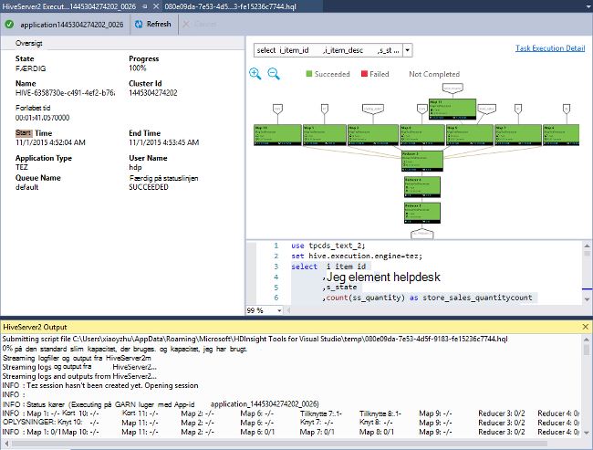

<properties
    pageTitle="Lær at bruge Visual Studio Hadoop værktøjer til HDInsight | Microsoft Azure"
    description="Lær at installere og bruge Visual Studio Hadoop værktøjer til HDInsight at oprette forbindelse til et Hadoop-klynge og køre en Hive-forespørgsel."
    keywords="hadoop værktøjer hive forespørgsel visual studio"
    services="HDInsight"
    documentationCenter=""
    tags="azure-portal"
    authors="mumian"
    manager="jhubbard"
    editor="cgronlun"/>

<tags
    ms.service="hdinsight"
    ms.devlang="na"
    ms.topic="get-started-article"
    ms.tgt_pltfrm="na"
    ms.workload="big-data"
    ms.date="08/10/2016"
    ms.author="jgao"/>

# Introduktion til brug af Visual Studio Hadoop værktøjer til HDInsight til at køre en Hive-forespørgsel

Lær, hvordan du kan bruge HDInsight værktøjer til Visual Studio til at oprette forbindelse til HDInsight klynger og sende Hive forespørgsler. Du kan finde flere oplysninger om brug af HDInsight, skal du se [Introduktion til HDInsight] [ hdinsight.introduction] og [komme i gang med HDInsight][hdinsight.get.started]. Du kan finde flere oplysninger om at oprette forbindelse til en Storm klynge se [udvikle C# topologier for Apache Storm på HDInsight ved hjælp af Visual Studio][hdinsight.storm.visual.studio.tools].

**Forudsætninger**

For at udføre dette selvstudium, og bruge værktøjerne i Hadoop i Visual Studio, skal du bruge følgende:

- En Azure HDInsight klynge: en Linux-baserede eller Windows-baseret klynge fungerer sammen med trinene i dette dokument. Se et af følgende for at få oplysninger om at oprette en klynge:

    - [Introduktion til brug af Linux-baserede HDInsight](hdinsight-hadoop-linux-tutorial-get-started.md)
    - [Introduktion til brug af Windows-baseret HDInsight](hdinsight-hadoop-tutorial-get-started-windows.md)

- En arbejdsstation med følgende software:

    - Windows 8.1, Windows 8 eller Windows 7
    - Visual Studio (én af følgende versioner):
        - Visual Studio 2013 Community/Professional/Premium/Ultimate med [opdatere 4](https://www.microsoft.com/download/details.aspx?id=44921)
        - Visual Studio 2015 (Community/Enterprise)

    >[AZURE.NOTE] HDInsight værktøjer til Visual Studio følger i øjeblikket kun med den engelske version.

## Installere HDInsight værktøjer til Visual Studio

HDInsight værktøjer til Visual Studio og Microsoft Hive ODBC-Driver er pakket med Microsoft Azure SDK til .NET version 2.5.1 eller nyere. Du kan installere det ved hjælp af [Web Platform Installer](http://go.microsoft.com/fwlink/?LinkId=255386). Du skal vælge det, der svarer til din version af Visual Studio. Hvis du ikke har Visual Studio er installeret, kan du installere de seneste Visual Studio Community og Azure SDK ved hjælp af [Web Platform Installer](http://go.microsoft.com/fwlink/?LinkId=255386) eller bruge linkene nedenfor:

- [Visual Studio Community 2015 med Microsoft Azure SDK](https://www.microsoft.com/web/handlers/webpi.ashx/getinstaller/VS2015CommunityAzurePack.appids)
- [Visual Studio Community 2013 med Microsoft Azure SDK](https://www.microsoft.com/web/handlers/webpi.ashx/getinstaller/VS2013CommunityAzurePack.appids)
- [Microsoft Azure SDK til .NET (VS-2015)](https://www.microsoft.com/web/handlers/webpi.ashx/getinstaller/VWDOrVs2015AzurePack.appids)
- [Microsoft Azure SDK til .NET (VS 2013)](https://www.microsoft.com/web/handlers/webpi.ashx/getinstaller/VWDOrVs2013AzurePack.appids)

![Hadoop-værktøjer: HDinsight Tools til Visual Studio Web Platform installer.][1]

## Oprette forbindelse til Azure-abonnementer
HDInsight værktøjer til Visual Studio gør det muligt at oprette forbindelse til din HDInsight klynger udføre nogle grundlæggende management handlinger, og kør Hive forespørgsler.

>[AZURE.NOTE] Se oplysninger om at oprette forbindelse til en generisk Hadoop-klynge, [skrive og sende Hive forespørgsler ved hjælp af Visual Studio](http://blogs.msdn.com/b/xiaoyong/archive/2015/05/04/how-to-write-and-submit-hive-queries-using-visual-studio.aspx).

**Oprette forbindelse til abonnementet Azure**

1.  Åbne Visual Studio.
2.  Menuen **Vis** , klik på **Server Explorer** for at åbne vinduet Server Explorer.
3.  Udvid **Azure**, og udvid derefter **HDInsight**.

    >[AZURE.NOTE]Bemærk vinduet **HDInsight opgaveliste** skal være åben. Hvis du ikke kan se den, klikke på **Andre vinduer** i menuen **Vis** , og klik **HDInsight opgave listeruden**.  
4.  Angiv dine legitimationsoplysninger Azure-abonnement, og klik derefter på **Log på**. Denne indstilling er kun påkrævet, hvis du har aldrig knyttet til Azure abonnementet fra Visual Studio på arbejdsstationen.
5.  I Server Explorer, får du vist en liste over eksisterende HDInsight klynger. Hvis du ikke har en hvilken som helst klynger, kan du klargøre en ved hjælp af portalen Azure, Azure PowerShell eller HDInsight SDK. Du kan finde flere oplysninger, se [klargøring HDInsight klynger][hdinsight-provision].

    ![Hadoop-værktøjer: HDInsight Tools til Visual Studio Server Explorer klynge liste][5]
6.  Udvide en HDInsight klynge. Du får vist **Hive databaser**, en standardkonto lagerplads, sammenkædede lagerplads konti og **loggen for Hadoop-tjenesten**. Du kan yderligere udvide enheder.

Når du har knyttet til abonnementet Azure, vil du kunne gøre følgende:

**Oprette forbindelse til portalen Azure fra Visual Studio**

- Fra Server Explorer skal du udvide **Azure** > **HDInsight**, skal du højreklikke på en HDInsight klynge, og klik derefter på **Administrer klynge Azure-portalen**.

**Stille spørgsmål og give feedback fra Visual Studio**

- Klik på **HDInsight**, i menuen **Funktioner** og derefter klikke på **MSDN-Forum** for at stille spørgsmål, eller klik på **Give Feedback**.

## Navigere i sammenkædede ressourcer

Du kan se lagerplads standardkontoen og eventuelle sammenkædede lagerplads konti fra Server Explorer. Hvis du udvider lagerplads standardkontoen, kan du se beholderne på kontoen lagerplads. Lagerplads standardkontoen og objektbeholderen standard er markeret. Du kan også højreklikke på en af objektbeholdere til at få vist indholdet.

![HDInsight værktøjer til Visual Studio server explorer klynge liste][2]

Efter kontrolkanalen en objektbeholder, kan du bruge følgende knapper til at overføre, slette og hente BLOB:

## Køre en Hive-forespørgsel
[Apache Hive] [ apache.hive] er en data warehouse infrastruktur, der er bygget på Hadoop for at levere data opsummering, forespørgsler og analyse. HDInsight værktøjer til Visual Studio understøtter kører Hive-forespørgsler fra Visual Studio. Du kan finde flere oplysninger om Hive, se [Brug Hive med HDInsight][hdinsight.hive].

Det er lang tid at teste Hive script mod en HDInsight klynge. Det kan tage flere minutter eller mere. HDInsight Tools til Visual Studio er stand til at validere Hive script lokalt uden at oprette forbindelse til en direkte klynge.

HDInsight værktøjer til Visual Studio også giver brugerne mulighed at se, hvad er placeret mellem Hive jobbet ved at indsamle og fremhævelse loggene GARN af bestemte Hive-job.

### Få vist **hivesampletable**
Alle HDInsight klynger forsynet med et eksempel på Hive tabellen kaldet *hivesampletable*. Vi bruger denne tabel viser, hvordan til listen Hive-tabeller, få vist tabel skemaer og få vist rækkerne i tabellen Hive.

**Liste over Hive tabeller og få vist Hive tabel skemaet**

1.  Fra **Server Explorer**skal du udvide **Azure** > **HDInsight** > klynge efter eget valg > **Hive databaser** > **standard** > **hivesampletable** til at se tabel skemaet.
4.  Højreklik på **hivesampletable**, og klik derefter på **Vis de øverste 100 rækker** for at få vist rækkerne. Det er svarer til at køre følgende Hive forespørgsel ved hjælp af Hive ODBC-driver:

        SELECT * FROM hivesampletable LIMIT 100

    Du kan tilpasse antallet af rækker.

    ![Hadoop-værktøjer: HDinsight Hive Visual Studio skemaforespørgsel][6]

### Oprette Hive tabeller

Du kan bruge den grafiske brugergrænseflade til at oprette en Hive tabel eller bruge Hive forespørgsler. Du kan finde oplysninger om brug af Hive forespørgsler [køre Hive forespørgsler](#run.queries).

**Oprette en Hive-tabel**

1. Fra **Server Explorer**skal du udvide **Azure** > **HDInsight klynger** en HDInsight klynge > **Hive databaser**, højreklik på **standard**, og klik på **Opret tabel**.
2. Konfigurere tabellen.
3. Klik på **Opret tabel** for at sende jobbet for at oprette en ny Hive-tabel.

    ![Hadoop-værktøjer: hdinsight visual studio-værktøjer oprette hive tabel][7]

### Validere og køre Hive-forespørgsler
Der er to måder at oprette og køre Hive forespørgsler:

- Oprette ad hoc-forespørgsler
- Oprette en Hive-program

**Hvis du vil oprette, validere og køre ad hoc-forespørgsler**

1. Udvid **Azure**fra **Server Explorer**, og udvid derefter **HDInsight klynger**.
2. Højreklik på den klynge, hvor du vil køre forespørgslen, og klik derefter på **skriver en Hive forespørgsel**.
3. Angiv Hive forespørgsler. Bemærk redigeringsprogrammet Hive understøtter IntelliSense. HDInsight værktøjer til Visual Studio understøtter indlæser remote metadata, når du redigerer din Hive-script. Når du skriver "Vælg * fra", viser IntelliSense eksempelvis alle foreslåede tabelnavne. Når der er angivet et tabelnavn, vises kolonnenavnene ved IntelliSense. Værktøjet understøtter næsten alle Hive DML sætninger, underforespørgsler og indbyggede brugerdefinerede funktioner.

    ![Hadoop-værktøjer: HDInsight Visual Studio værktøjer IntelliSense][13]

    ![Hadoop-værktøjer: HDInsight Visual Studio værktøjer IntelliSense][14]

    > [AZURE.NOTE] Der foreslås kun de metadata klynger, der er valgt i HDInsight værktøjslinjen.
4. (Valgfrit): Klik på **Valider Script** til at kontrollere syntaksen scriptfejl.

    ![Hadoop-værktøjer: hdinsight tools til Visual Studio lokale validering][10]

4. Klik på **Send** eller **Send (avanceret)**. Med indstillingen Avanceret Send, skal du konfigurere **Tingene navn**, **argumenter**, **Yderligere konfigurationer**og **Status Directory** til scriptet:

    ![hdinsight hadoop hive forespørgsel][9]

    Når du har indsendt sag, kan du få vist et **Hive Job oversigt** -vindue.

    ![Oversigt over en HDInsight Hadoop Hive forespørgsel][8]
5. Brug knappen **Opdater** for at opdatere status, indtil jobstatus ændres til **fuldført**.
6. Klik på linkene i bunden for at se følgende: **Jobbet forespørgsel**, **Jobbet Output**, **jobbet log**eller **garn log**.

**Oprette og køre en Hive-løsning**

1. Klik på **Ny**i menuen **filer** , og klik derefter på **projekt**.
2. Vælg **HDInsight** i venstre rude, Vælg **Hive program** i den midterste rude, angive egenskaberne, og klik derefter på **OK**.

    ![Hadoop-værktøjer: hdinsight visual studio tools hive projekt][11]
3. **Solution Explorer**skal du dobbeltklikke på **Script.hql** for at åbne den.
4. For at validere Hive-script, kan du klikke på knappen **Validere Script** eller skal du højreklikke på scriptet i editoren Hive og klik derefter på **Valider Script** i kontekstmenuen.

### Få vist Hive job
Du kan få vist jobbet forespørgsler, jobbet output, jobbet logfiler og garn logfiler for Hive sager. Du kan finde yderligere oplysninger finder den forrige skærmbillede.

Den seneste version af værktøjet kan du se hvad er i din Hive-job ved at indsamle og fremhævelse GARN logfiler. En logfil over GARN kan hjælpe dig behandlende problemer med ydeevnen. Du kan finde flere oplysninger om, hvordan HDInsight indsamler GARN logger, under [Access HDInsight programmet logge automatisk][hdinsight.access.application.logs].

**Sådan får du vist Hive job**

1. Udvid **Azure**fra **Server Explorer**, og udvid derefter **HDInsight**.
2. Højreklik på en HDInsight klynge, og klik derefter på **Vis job**. Du får vist en liste over de Hive-job, der har kørt på klyngen.
3. Klik på en sag i joblisten at markere den, og derefter bruge vinduet **Hive Job oversigt** til at åbne **Jobbet forespørgsel**, **Jobbet Output**, **Jobbet Log**eller **garn log**.

    ![Hadoop-værktøjer: HDInsight Visual Studio Tools vist Hive job][12]

### Hurtigere sti Hive udførelse af via HiveServer2

>[AZURE.NOTE] Denne funktion virker kun på HDInsight klynge version 3.2 og nyere.

Den HDInsight-værktøjer, der bruges til at sende Hive job via [WebHCat](https://cwiki.apache.org/confluence/display/Hive/WebHCat) (også kaldet Templeton). Det tog lang tid til at returnere oplysninger om job og fejloplysninger.
For at løse dette problem med ydeevnen, udfører værktøjerne HDInsight Hive job direkte i klynge gennem HiveServer2, så det tilsidesætte RDP/SSH.
Brugere kan også se Hive på Tez grafer og oplysningerne, opgave ud over at forbedre ydeevnen.

HDInsight klynge version 3.2 eller nyere, kan du se knappen **Udfør via HiveServer2** :

Og du kan se loggene streames tilbage i realtid og se job grafer, hvis Hive forespørgslen køres i Tez.

**Forskellen mellem udførelse af forespørgsler via HiveServer2 og sende forespørgsler via WebHCat**

Selvom udførelse af forespørgsler via HiveServer2 har mange fordele i ydeevne, har flere begrænsninger. Nogle af begrænsningerne er ikke egnet til fremstilling brugen. Følgende tabel viser forskellene:

| |Afholde via HiveServer2 |Sende via WebHCat|
|---|---|---|
|Udføre forespørgsler|Fjerner omkostninger i WebHCat (hvilket startes et MapReduce Job kaldet "TempletonControllerJob").|Som en forespørgsel køres via WebHCat, Start WebHCat et MapReduce job som introducerer flere ventetid.|
|Stream logfiler tilbage|Nær i realtid.|Loggene job udførelse af findes kun, når den er færdig.|
|Få vist historikken for job|Det er jobs (job loggen, jobbet output) bevares ikke, hvis en forespørgsel køres via HiveServer2. Programmet kan ses i GARN Brugergrænsefladen med begrænsede oplysninger.|Hvis en forespørgsel køres via WebHCat, det er jobs (job loggen, jobbet output) bevares og kan ses ved hjælp af Visual Studio/HDInsight SDK/PowerShell. |
|Lukke vindue|  Afholde via HiveServer2 er en "synkron" måde, så du skal holde windows åben. Hvis windows er lukket annulleres udførelse af forespørgsler.|Sende via WebHCat er en "Asynkron" måde, så du kan sende forespørgslen via WebHCat og lukke Visual Studio. Du kan vende tilbage og se resultaterne, når som helst.|

### Tez Hive job Ydeevnegraf

Fra HDInsight Visual Studio Tools support, der viser ydeevne grafer for Hive-job kørte af Tez udførelse af programmet. Du kan finde oplysninger om aktivering af Tez i [Brug Hive i HDInsight][hdinsight.hive]. Når du sender en Hive sag i Visual Studio, viser Visual Studio grafen når jobbet er fuldført.  Du skal muligvis klikke på knappen **Opdater** for at få den seneste jobstatus.

> [AZURE.NOTE] Denne funktion er kun tilgængelig for HDInsight klynge version over 3.2.4.593 og kan kun arbejde for fuldførte job (Hvis du har indsendt tingene gennem WebHCat; denne graph blive vist når du kører din forespørgsel gennem HiveServer2). Det fungerer for både Windows og Linux baseret klynger.

For at hjælpe dig med at forstå forespørgslen Hive bedre, værktøjet tilføje visningen Hive Operator i denne udgave. Du skal blot Dobbeltklik på knudepunkter for jobbet diagrammet, og du kan se alle operatorer i knudepunktet. Du kan også pege på en bestemt operator til at få vist flere oplysninger om denne operator.

### Opgave udførelse af visningen af Hive på Tez job

Opgave udførelse af visningen af Hive på Tez job kan bruges til at få strukturerede og visualized oplysninger for Hive sager, og få flere oplysninger om job. Når der er problemer med ydeevnen, kan du bruge visningen for at få yderligere oplysninger. For eksempel, hvordan de enkelte opgaver fungerer og de detaljerede oplysninger om hver enkelt opgave (data læse-og skriveadgang, Planlæg/start/slut klokkeslæt, osv.), så du kan finjustere job konfigurationer eller systemarkitektur baseret på de visualized oplysninger.

## Køre gris scripts

HDInsight Tools til Visual Studio understøtter oprettelse af og indsende gris scripts til HDInsight klynger. Brugere kan oprette et gris projekt ud fra skabelon og derefter sende scriptet til HDInsight klynger.

## Feedback og kendte problemer

- Aktuelt vises HiveServer2 resultaterne i ren tekst måde, som ikke er ideel. Vi arbejder på at løse.

- Hvis resultatet er i gang med NULL-værdier, vises i øjeblikket resultaterne ikke. Vi har løst problemet, og hvis du er blokeret på dette problem ved Velkommen til at slippe os en mail eller Kontakt supportteamet.

- Scriptet HQL oprettet af Visual Studio kodes afhængigt af indstilling for brugerens lokale region. Det kan ikke udføres korrekt Hvis bruger overfører scriptet til klynge som binært tal.

Hvis du har en hvilken som helst forslag eller feedback, eller hvis du støder på problemer, når du bruger dette værktøj, Velkommen til at slippe os en mail på hdivstool på microsoft prik com.

## Næste trin
Du har lært hvordan du kan oprette forbindelse til HDInsight klynger fra Visual Studio, ved hjælp af pakken Hadoop-værktøjer, og hvordan du kører en Hive-forespørgsel i denne artikel. Du kan finde flere oplysninger i:

- [Brug Hadoop Hive i HDInsight][hdinsight.hive]
- [Introduktion til brug af Hadoop i HDInsight][hdinsight.get.started]
- [Sende Hadoop-job i HDInsight][hdinsight.submit.jobs]
- [Analysere Twitter data med Hadoop i HDInsight][hdinsight.analyze.twitter.data]

<!--Anchors-->
[Installation]: #installation
[Connect to your Azure subscription]: #connect-to-your-azure-subscription
[Navigate the linked resources]: #navigate-the-linked-resources
[Run Hive queries]: #run-hive-queries
[Next steps]: #next-steps

<!--Image references-->
[1]: ./media/hdinsight-hadoop-visual-studio-tools-get-started/hdinsight.visual.studio.tools.wpi.png
[2]: ./media/hdinsight-hadoop-visual-studio-tools-get-started/hdinsight.visual.studio.tools.linked.resources.png
[5]: ./media/hdinsight-hadoop-visual-studio-tools-get-started/hdinsight.visual.studio.tools.server.explorer.png
[6]: ./media/hdinsight-hadoop-visual-studio-tools-get-started/hdinsight.visual.studio.tools.hive.schema.png
[7]: ./media/hdinsight-hadoop-visual-studio-tools-get-started/hdinsight.visual.studio.tools.create.hive.table.png
[8]: ./media/hdinsight-hadoop-visual-studio-tools-get-started/hdinsight.visual.studio.tools.run.hive.job.summary.png
[9]: ./media/hdinsight-hadoop-visual-studio-tools-get-started/hdinsight.visual.studio.tools.submit.jobs.advanced.png
[10]: ./media/hdinsight-hadoop-visual-studio-tools-get-started/hdinsight.visual.studio.tools.validate.hive.script.png
[11]: ./media/hdinsight-hadoop-visual-studio-tools-get-started/hdinsight.visual.studio.tools.new.hive.project.png
[12]: ./media/hdinsight-hadoop-visual-studio-tools-get-started/hdinsight.visual.studio.tools.view.hive.jobs.png
[13]: ./media/hdinsight-hadoop-visual-studio-tools-get-started/hdinsight.visual.studio.tools.intellisense.table.names.png
[14]: ./media/hdinsight-hadoop-visual-studio-tools-get-started/hdinsight.visual.studio.tools.intellisense.column.names.png

<!--Link references-->
[hdinsight-provision]: hdinsight-provision-clusters.md
[hdinsight.introduction]: hdinsight-hadoop-introduction.md
[hdinsight.get.started]: hdinsight-hadoop-linux-tutorial-get-started.md
[hdinsight.hive]: hdinsight-use-hive.md
[hdinsight.submit.jobs]: hdinsight-submit-hadoop-jobs-programmatically.md
[hdinsight.analyze.twitter.data]: hdinsight-analyze-twitter-data.md
[hdinsight.storm.visual.studio.tools]: hdinsight-storm-develop-csharp-visual-studio-topology.md
[hdinsight.access.application.logs]: hdinsight-hadoop-access-yarn-app-logs.md

[apache.hive]: http://hive.apache.org
