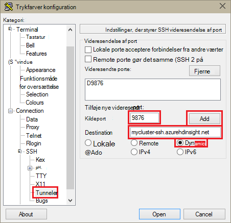
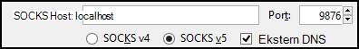
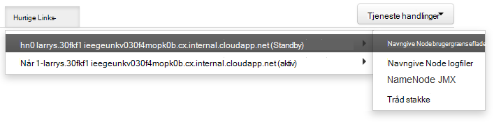

<properties
pageTitle="Brug SSH-tunnelføring til at få adgang til Ambari web brugergrænseflade, Ressourcestyring, JobHistory, NameNode, Oozie og andre web brugergrænseflade"
description="Lær, hvordan du bruger en SSH tunnel til at gennemse sikkert webressourcer hostes på din Linux-baserede HDInsight noder."
services="hdinsight"
documentationCenter=""
authors="Blackmist"
manager="jhubbard"
editor="cgronlun"/>

<tags
ms.service="hdinsight"
ms.devlang="na"
ms.topic="article"
ms.tgt_pltfrm="na"
ms.workload="big-data"
ms.date="10/17/2016"
ms.author="larryfr"/>

# Brug SSH-tunnelføring til at få adgang til Ambari web brugergrænseflade, JobHistory, NameNode, Oozie og andre web brugergrænseflade

Linux-baserede HDInsight klynger giver adgang til Ambari web Brugergrænsefladen via internettet, men nogle funktioner i Brugergrænsefladen er ikke. For eksempel internettet brugergrænseflade for andre tjenester, der er fået gennem Ambari. Fuld funktionalitet af webdelen Ambari brugergrænseflade, skal du bruge en SSH tunnel for klynge hoved.

## Hvad kræver en SSH tunnel?

Flere menuer i Ambari udfylder ikke fuldt uden en SSH tunnel, som de skal bruge til websteder og tjenester, der vises af andre Hadoop-tjenester, der kører på klyngen. Ofte er disse websteder ikke sikret, så det ikke er sikkert at eksponere dem direkte på internettet. Tjenesten kører nogle gange webstedet på en anden klyngenode som en Zookeeper node.

Følgende er tjenester, der bruger Ambari web brugergrænseflade, kan ikke åbnes uden en SSH tunnel:

* JobHistory,
* NameNode,
* Tråd stakke,
* Oozie web brugergrænseflade
* HBase Master og hændelseslogge brugergrænseflade

Hvis du bruger scripthandlinger til at tilpasse din klynge, kræver tjenester eller værktøjer, du installerer, der viser en web Brugergrænsefladen en SSH tunnel. Hvis du installerer farvetone ved hjælp af handlingen Script, skal du bruge en SSH tunnel at få adgang til webstedet farvetone brugergrænseflade.

## Hvad er en SSH tunnel?

[Secure Shell (SSH) tunnelføring](https://en.wikipedia.org/wiki/Tunneling_protocol#Secure_Shell_tunneling) dirigerer trafik, der sendes til en port på computeren lokale, via en SSH forbindelse til din HDInsight klynge hoved knude, hvor anmodningen derefter løses som om den stammer fra på noden hoved. Svaret sendes derefter tilbage gennem tunnel til computeren.

## Forudsætninger

Når du bruger en SSH tunnel til webtrafik, skal du have følgende:

* En SSH-klient. For Linux og Unix eller Macintosh OS X på `ssh` kommandoen leveres med operativsystemet. Til Windows anbefaler vi [trykfarver](http://www.chiark.greenend.org.uk/~sgtatham/putty/download.html)

    > [AZURE.NOTE] Hvis du vil bruge en SSH klient andet end `ssh` eller trykfarver, skal du se i dokumentationen til din kunde om, hvordan du opretter en SSH tunnel.

* En webbrowser, der kan være konfigureret til at bruge en SOCKS-proxy

## Oprette en tunnel med kommandoen SSH

Brug følgende kommando for at oprette en SSH tunnel ved hjælp af den `ssh` kommandoen. Erstatte __brugernavn__ med en SSH bruger for din HDInsight klynge, og Erstat __CLUSTERNAME__ med navnet på din HDInsight klynge

    ssh -C2qTnNf -D 9876 USERNAME@CLUSTERNAME-ssh.azurehdinsight.net

Dette opretter en forbindelse, som dirigerer trafik til lokale port 9876 til klyngen over SSH. Indstillingerne er:

* **D 9876** - den lokale port, der bruges til at distribuere trafik via tunnelen.

* **C** - komprimere alle data, da webtrafik er primært består af tekst.

* **2** - kraft SSH til at prøve protocol version 2 kun.

* **spørgsmål** - brugerinput.

* **T** - Deaktiver pseudo tty allokering, da vi videresender bare en port.

* **n** - forhindre læsning af STDIN, da vi videresender bare en port.

* **N** - ikke udføre en remote kommandoen, da vi videresender bare en port.

* **f** - køre i baggrunden.

Hvis du har konfigureret klyngen med en SSH nøgle, skal du muligvis bruge den `-i` parameter og angive stien til den private SSH nøgle.

Når kommandoen er afsluttet, trafik, der sendes til port 9876 på den lokale computer sendes hoved node Secure Sockets Layer (SSL) til klyngen, så vises der stammer fra.

## Oprette en tunnel med trykfarver

Brug følgende trin til at oprette en SSH tunnel med trykfarver.

1. Åbn trykfarver, og Angiv dine forbindelsesoplysninger. Hvis du ikke kender med trykfarver, se [Bruge SSH med Linux-baserede Hadoop på HDInsight fra Windows](hdinsight-hadoop-linux-use-ssh-windows.md) for oplysninger om hvordan du kan bruge det sammen med HDInsight.

2. Udvid **forbindelse**i sektionen **kategori** til venstre i dialogboksen, udvide **SSH**, og vælg derefter **tunneler**.

3. Angiv følgende oplysninger i formularen **Indstillinger, der styrer SSH port videresendelse** :

    * **Kildeport** - port på den klient, som du vil videresende. For eksempel **9876**.

    * **Destination** - feltet SSH adresse for Linux-baserede HDInsight klynge. For eksempel, **mycluster ssh.azurehdinsight.net**.

    * **Dynamisk** – aktiverer dynamisk SOCKS-proxy routing.

    

4. Klik på **Tilføj** for at tilføje indstillingerne, og klik derefter på **Åbn** for at åbne en SSH forbindelse.

5. Når du bliver bedt om det, log på serveren. Dette vil oprette en SSH session og Aktivér tunnelen.

## Brug tunnel fra din browser

> [AZURE.NOTE] Trinnene i dette afsnit bruge FireFox-browseren, som det er frit tilgængelige for Linux, Unix, Macintosh OS X- og Windows-systemer. Andre moderne browsere, der understøtter ved hjælp af en SOCKS proxy fungerer også.

1. Konfigurere browseren for at bruge **localhost:9876** som en **SOCKS v5** proxy. Her er, hvordan indstillingerne for Firefox ud. Hvis du har brugt en anden port end 9876, kan du ændre porten til den, du brugte:

    

    > [AZURE.NOTE] Valg af **Ekstern DNS** vil løse Domain Name System (DNS) anmodninger ved hjælp af HDInsight klynge. Hvis det er ikke er valgt, skal oversættes DNS lokalt.

2. Kontrollér, at trafik dirigeres gennem tunnelen ved vising et websted som [http://www.whatismyip.com/](http://www.whatismyip.com/) med proxyindstillinger aktiveres og deaktiveres i Firefox. Mens indstillingerne er aktiveret, bliver IP-adressen til en maskine i Microsoft Azure-datacenteret.

##Bekræfte med Ambari web brugergrænseflade

Når der er oprettet på klynge, du følge nedenstående trin for at bekræfte, at du kan få adgang til tjenesten web computerens brugergrænseflade fra internettet Ambari:

1. Gå til http://headnodehost:8080 i din browser. Den `headnodehost` sendes over tunnelen til klyngen og for den headnode, Ambari der kører på. Når du bliver bedt om det, kan du angive det brugernavn Administration (admin) og adgangskode for din klynge. Du kan blive bedt om endnu en gang ved webdelen Ambari brugergrænseflade. Hvis det er tilfældet, skal du angive oplysningerne igen.
    
    > [AZURE.NOTE] Når du bruger http://headnodehost:8080-adressen til at oprette forbindelse til klyngen, opretter du forbindelse direkte over tunnel til noden hoved, Ambari der kører ved hjælp af HTTP og kommunikation er beskyttet med SSH tunnel. Når du opretter forbindelse via internettet uden brug af en tunnel, sikres kommunikation ved hjælp af HTTPS. Hvis du vil oprette forbindelse via internettet ved hjælp af HTTPS, kan du bruge https://CLUSTERNAME.azurehdinsight.net, hvor __CLUSTERNAME__ er navnet på klyngen.

2. Vælg HDFS Ambari Webbrugergrænsefladen, på listen til venstre på siden.

    

3. Når oplysningerne om tjenesten HDFS vises, skal du vælge __Hurtige Links__. Der vises en liste over klyngenoderne hoved. Vælg en af noderne hoved, og vælg derefter __NameNode brugergrænseflade__.

    

    > [AZURE.NOTE] Hvis du har en langsom forbindelse til internettet, eller noden hoved er optaget, kan du få en Vent-indikator i stedet for en menu, når du vælger __Hurtige Links__. Hvis det er tilfældet, vent et minut eller to for dataene, der modtages fra serveren, og derefter prøve igen på listen.
    >
    > Hvis du har en lavere opløsning eller browservinduet ikke er maksimeret, kan nogle poster i menuen __Hurtige Links__ blive beskåret ved i højre side af skærmen. Hvis det er tilfældet, udvide menuen ved hjælp af musen, og derefter bruge tasten højre pil til at rulle skærmbillede til højre for at se resten af menuen.

4. En side, der ligner følgende skal vises:

    

    > [AZURE.NOTE] Bemærk URL-adressen for denne side. det skal være tilsvarende til __http://hn1-CLUSTERNAME.randomcharacters.cx.internal.cloudapp.net:8088/klynge__. Dette ved hjælp af den interne fuldstændige domænenavn (fulde Domænenavn) for noden og er ikke tilgængelig uden at bruge en SSH tunnel.

## Næste trin

Nu, hvor du har lært, hvordan du opretter og bruger en SSH tunnel, kan du se følgende for at få oplysninger om overvågning og administration af din klynge ved hjælp af Ambari:

* [Administrere HDInsight klynger ved hjælp af Ambari](hdinsight-hadoop-manage-ambari.md)

Du kan finde flere oplysninger om brug af SSH med HDInsight, se følgende:

* [Bruge SSH med Linux-baserede Hadoop på HDInsight fra Linux, Unix eller OS X](hdinsight-hadoop-linux-use-ssh-unix.md)

* [Bruge SSH med Linux-baserede Hadoop på HDInsight fra Windows](hdinsight-hadoop-linux-use-ssh-windows.md)
