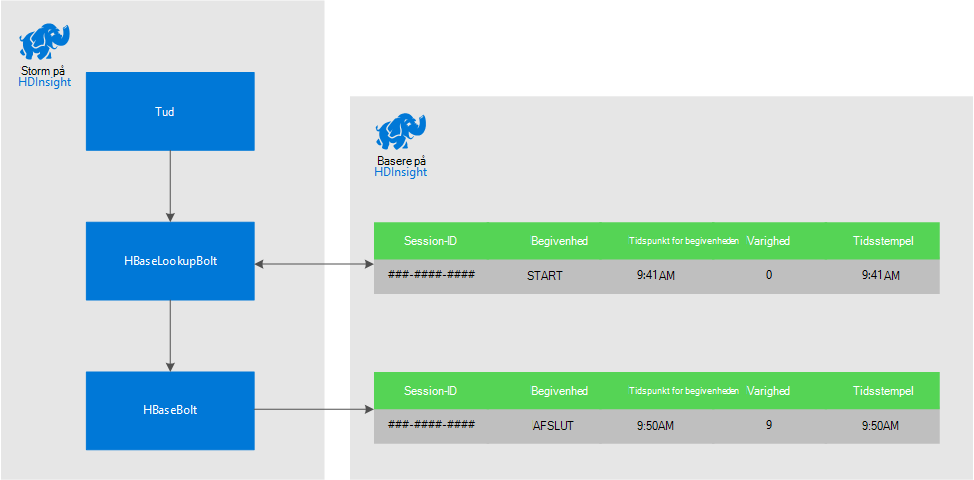
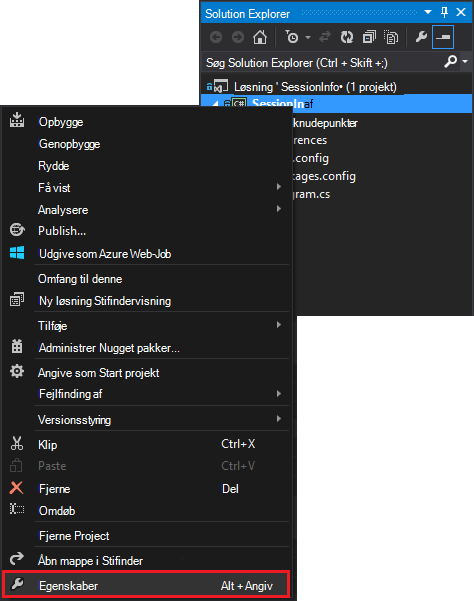
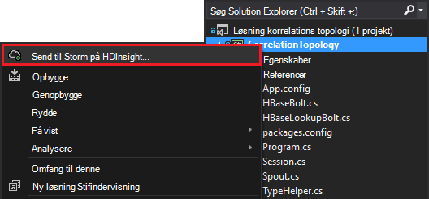

<properties
 pageTitle="Koordinere begivenheder over tid med Storm og HBase på HDInsight"
 description="Lær at koordinere hændelser, der ender på forskellige tidspunkter ved hjælp af Storm og HBase på HDInsight."
 services="hdinsight"
 documentationCenter=""
 authors="Blackmist"
 manager="jhubbard"
 editor="cgronlun"
 tags="azure-portal"/>

<tags
 ms.service="hdinsight"
 ms.devlang="dotnet"
 ms.topic="article"
 ms.tgt_pltfrm="na"
 ms.workload="big-data"
 ms.date="10/27/2016"
 ms.author="larryfr"/>

# Koordinere begivenheder over tid med Storm og HBase på HDInsight

Ved hjælp af en fast datalager med Apache Storm, kan du justere værdier, der ender på forskellige tidspunkter. Eksempelvis sammenkæde logon og log hændelser for en brugersession for at beregne, hvor længe sessionen bestået.

I dette dokument lærer du, hvordan du kan oprette en grundlæggende C# Storm topologi, der registrerer logon og log begivenheder for sessioner og beregner varigheden af sessionen. Topologien bruger HBase som et fast datalager. HBase kan du udføre batchen forespørgsler på de historiske data for at producere yderligere viden, som er blevet startet eller afsluttet i en bestemt tidsperiode hvor mange sessioner.

## Forudsætninger

- Visual Studio og HDInsight værktøjer til Visual Studio: se [komme i gang ved hjælp af værktøjerne HDInsight til Visual Studio](../HDInsight/hdinsight-hadoop-visual-studio-tools-get-started.md) oplysninger om installation.

- Apache Storm på HDInsight klynge (Windows-baseret). Storm topologien, der behandler indgående data og gemmes HBase køres.

    > [AZURE.IMPORTANT] Mens SCP.NET topologier understøttes på Linux-baserede Storm klynger oprettet efter 10-28/2016, fungerer HBase SDK til .NET-pakke, der er tilgængelige fra og med 10/28/2016 ikke korrekt på Linux.

- Apache HBase på HDInsight klynge (Linux eller Windows-baseret). Dette er datalager i dette eksempel.

## Arkitektur

Korrelere begivenheder kræver et almindelige id for begivenhed kilden. For example, et bruger-ID, session ID, eller andre typer af data, som er a) entydigt og b) inkluderet i alle data, der er sendt til Storm. I dette eksempel bruges en GUID-værdi til at repræsentere en session-ID.

I dette eksempel består af to HDInsight klynger:

-   HBase: fast datalager for historiske data

-   Storm: bruges til at indtager indgående data

Dataene der oprettes tilfældigt af Storm topologien og består af følgende elementer:

-   Session-ID: et GUID, der entydigt identificerer hver session

-   Begivenhed: en START- eller SLUTDATO begivenhed. I dette eksempel skal ligger START altid før slutningen

-   Klokkeslæt: tidspunktet for hændelsen.

Disse data er behandlet og gemt i HBase.

### Storm topologi

Når en session starter, er en **START** begivenhed modtages af topologien og logget HBase. Når der modtages en **slutningen** begivenhed, topologien henter hændelsen **START** og beregner den mellem de to hændelser. Denne **varighed** værdi gemmes derefter i HBase sammen med oplysningerne om begivenheden **slutningen** .

> [AZURE.IMPORTANT] Mens denne topologi viser det grundlæggende mønster, skal en fremstilling løsning tage design til følgende scenarier:
>
> - Hændelser, der er modtaget af rækkefølge
> - Dublerede begivenheder
> - Mistede hændelser

Eksempel topologien består af følgende komponenter:

-   Session.CS: simulerer en brugersession ved at oprette et tilfældigt session-ID, start tid, og hvor lang tid sessionen varer

-   Spout.CS: opretter 100 sessioner, udsender en START-begivenhed, venter på tilfældige timeout for hver enkelt session og derefter udsender en slutningen begivenhed. Og derefter genbruger afsluttes sessioner for at oprette nye.

-   HBaseLookupBolt.cs: bruger session-ID'ET til at finde oplysninger om sessionen fra HBase. Når en slutningen begivenhed behandles, finder tilsvarende START begivenheden og beregner varigheden af sessionen.

-   HBaseBolt.cs: Gemmer oplysninger til HBase.

-   TypeHelper.cs: Hjælper med typekonvertering når læse fra / skrivning til HBase.

### HBase skema

I HBase gemmes data i en tabel med følgende skema/indstillinger:

-   Række nøgle: sessionen-ID'ET bruges som nøgle til rækker i denne tabel

-   Kolonne familie: Efternavn er 'cf'. Kolonner, der er gemt i denne serie er:

    -   begivenhed: START- eller SLUTDATO

    -   tid: tid i millisekunder, hvor hændelsen indtraf

    -   varighed: længden mellem START- og begivenhed

-   VERSIONER: 'cf' familie er indstillet til at bevare 5 versioner af hver række

    > [AZURE.NOTE] Versioner er en logfil over tidligere værdier, der er gemt i en bestemt række nøgle. Som standard returnerer HBase kun værdien for den seneste version af en række. I dette tilfælde bruges den samme række til alle begivenheder (START, slut.) hver version af en række er identificeret med værdien tidsstempel. Dette giver en historiske visning af hændelser, der registreres for et bestemt-ID.

## Hente projektet

På eksempelprojektet kan hentes fra [https://github.com/Azure-Samples/hdinsight-storm-dotnet-event-correlation](https://github.com/Azure-Samples/hdinsight-storm-dotnet-event-correlation).

Denne overførsel indeholder følgende C# projekter:

-   CorrelationTopology: C# Storm søgetopologien, der tilfældigt udsender start- og begivenheder til brugersessioner. Hver session varer mellem 1 og 5 minutter.

-   SessionInfo: C# console-program, der oprettes en HBase tabel, og giver eksempel forespørgsler for at returnere oplysninger om lagrede sessionsdata.

## Oprette en tabel

1. Åbn **SessionInfo** projektet i Visual Studio.

2. Højreklik på **SessionInfo** projektet i **Solution Explorer**, og vælg **Egenskaber**.

    

3. Vælg **Indstillinger**, og derefter angive følgende værdier:

    -   HBaseClusterURL: URL-adressen til dit HBase klynge. For eksempel https://myhbasecluster.azurehdinsight.net

    -   HBaseClusterUserName: administrator/HTTP brugerkontoen for din klynge

    -   HBaseClusterPassword: adgangskoden til kontoen Administrator/HTTP

    -   HBaseTableName: navnet på tabellen, der skal bruges sammen med dette eksempel

    -   HBaseTableColumnFamily: Familie kolonnenavnet

    

5. Køre løsningen. Når du bliver bedt om det, Vælg den 'c' nøgle til at oprette tabellen på din HBase klynge.

## Opbygge og anvende Storm topologien

1.  Åbn **CorrelationTopology** løsningen i Visual Studio.

2.  Højreklik på **CorrelationTopology** projektet i **Solution Explorer**, og vælg Egenskaber.

3.  Vælg **Indstillinger** , og Angiv følgende oplysninger i egenskabsvinduet. Den første 5 skal være de samme værdier, der bruges af **SessionInfo** projekt:

    -   HBaseClusterURL: URL-adressen til dit HBase klynge. For eksempel https://myhbasecluster.azurehdinsight.net

    -   HBaseClusterUserName: administrator/HTTP brugerkontoen for din klynge

    -   HBaseClusterPassword: adgangskoden til kontoen Administrator/HTTP

    -   HBaseTableName: navnet på tabellen, der skal bruges sammen med dette eksempel. Dette skal indeholde den samme tabelnavn, som er anvendt i SessionInfo projektet

    -   HBaseTableColumnFamily: Familie kolonnenavnet. Dette skal indeholde det samme kolonne familienavn, som er anvendt i SessionInfo projektet

    > [AZURE.IMPORTANT] Undlad at ændre HBaseTableColumnNames, som standardindstillingerne er de navne, **SessionInfo** til at hente data.

4.  Gemme egenskaberne, og derefter oprette projektet.

5.  Højreklik på projektet i **Solution Explorer**, og vælg **Send for at Storm på HDInsight**. Hvis du bliver bedt om det, kan du angive legitimationsoplysningerne for abonnementet Azure.

    

6.  Vælg den Storm klynge, som kører denne topologi i dialogboksen **Send topologi** .

    > [AZURE.NOTE] Første gang du sender en topologi, kan det tage nogle sekunder at hente navnet på din HDInsight klynger.

7.  Når topologien er blevet overført og sendes til klyngen, åbnes og viser igangværende topologien **Storm topologi visning** . Vælg **CorrelationTopology** og bruge opdateringsknappen øverst til højre på siden for at opdatere topologioplysningerne om.

    

    Når topologien begynder at oprette data, øge værdien i kolonnen **Emitted** .

    > [AZURE.NOTE] Hvis **Storm topologi visning** ikke åbnes automatisk, kan du bruge følgende trin til at åbne den:
    >
    > 1. I **Solution Explorer**skal du udvide **Azure**, og udvid derefter **HDInsight**.
    >
    > 2. Højreklik på den Storm-klynge, topologien der kører på, og vælg derefter **Vis Storm topologier**

## Søge i dataene

Når dataene er blevet udledes, følge nedenstående trin for at forespørge på dataene.

1. Gå tilbage til **SessionInfo** projektet. Hvis ikke kører, skal du starte en ny forekomst af den.

2. Når du bliver bedt om det, kan du vælge **s** for at søge efter START begivenhed. Du bliver bedt om at angive en start- og tid til at definere et tidsinterval - returneres kun begivenheder mellem disse to gange.

    Brug følgende format, når du angiver start- og sluttidspunkter: TT og 'er' eller 'pm'. For eksempel 11:20 pm.

    Da topologien netop er startet, Brug en starttidspunktet fra før den blev installeret, og et sluttidspunkt for nu. Dette bør registrere de fleste af de START hændelser, der blev oprettet, da det i gang. Når forespørgslen køres, skal du se en liste over poster, der ligner følgende:

        Session e6992b3e-79be-4991-afcf-5cb47dd1c81c started at 6/5/2015 6:10:15 PM. Timestamp = 1433527820737

Søge efter slutningen begivenheder fungerer på samme måde som START begivenheder. Dog oprettes slutningen hændelser tilfældigt mellem 1 og 5 minutter efter hændelsen START. Så kan være du nødvendigt at prøve nogle tidsintervaller for at finde hændelserne, der slutningen. Afslut hændelser indeholder også varigheden af sessionen - forskellen mellem begivenhed starttidspunkt og sluttidspunkt for begivenheden. Her er et eksempel på dataene til slutningen hændelser:

    Session fc9fa8e6-6892-4073-93b3-a587040d892e lasted 2 minutes, and ended at 6/5/2015 6:12:15 PM

> [AZURE.NOTE] Mens de klokkeslæt-værdier, du angiver er i lokal tid, bliver den tid, der returneres fra forespørgslen UTC.

##Stoppe topologien

Når du er klar til at stoppe topologien skal du gå tilbage til **CorrelationTopology** projektet i Visual Studio. Vælg topologien i **Storm topologi visning**, og brug derefter knappen **Slet** øverst i visningen topologi.

##Slette din klynge

[AZURE.INCLUDE [delete-cluster-warning](../../includes/hdinsight-delete-cluster-warning.md)]

##Næste trin

Du kan finde flere Storm eksempler [eksempel topologier for Storm på HDInsight](hdinsight-storm-example-topology.md).
 
