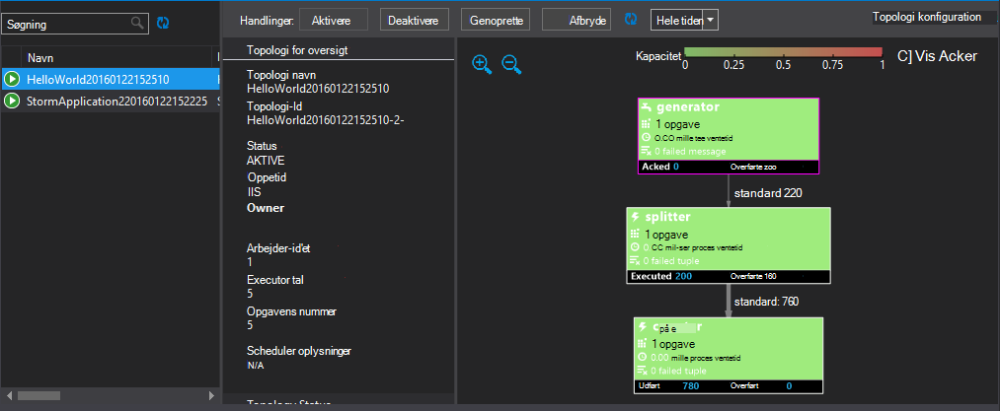

<properties
   pageTitle="Installere og administrere Apache Storm topologier på HDInsight | Microsoft Azure"
   description="Lær, hvordan du installerer, overvåge og administrere Apache Storm topologier ved hjælp af dashboardet Storm på HDInsight. Brug Hadoop tools til Visual Studio."
   services="hdinsight"
   documentationCenter=""
   authors="Blackmist"
   manager="jhubbard"
   editor="cgronlun"
    tags="azure-portal"/>

<tags
   ms.service="hdinsight"
   ms.devlang="java"
   ms.topic="article"
   ms.tgt_pltfrm="na"
   ms.workload="big-data"
   ms.date="10/11/2016"
   ms.author="larryfr"/>

#Installere og administrere Apache Storm topologier på Windows-baseret HDInsight

Dashboardet Storm kan du nemt at installere og køre Apache Storm topologier til din HDInsight klynge ved hjælp af din webbrowser. Du kan også bruge dashboard til at overvåge og administrere igangværende topologier. Hvis du bruger Visual Studio, giver HDInsight værktøjer til Visual Studio tilsvarende funktioner i Visual Studio.

Dashboardet Storm og funktionerne Storm i værktøjerne HDInsight er afhængige af Storm REST-API, som kan bruges til at oprette din egen overvågning og af administrationsløsninger.

> [AZURE.IMPORTANT] Trinnene i dette dokument kræver et Windows-baseret Storm på HDInsight klynge. Finde oplysninger om brug af en Linux-baserede klynge [Implementer og administrere Apache Storm topologier på Linux-baserede HDInsight](hdinsight-storm-deploy-monitor-topology-linux.md)

##Forudsætninger

* **Apache Storm på HDInsight** - se <a href="../hdinsight-storm-getting-started/" target="_blank">komme i gang med Apache Storm på HDInsight</a> trin til oprettelse af en klynge

* For **Storm Dashboard**: en moderne webbrowser, der understøtter HTML5

* Til **Visual Studio** - Azure SDK 2.5.1 eller nyere og HDInsight Tools til Visual Studio. Se <a href="../hdinsight-hadoop-visual-studio-tools-get-started/" target="_blank">Introduktion til brug af HDInsight Tools til Visual Studio</a> til at installere og konfigurere HDInsight værktøjerne til Visual Studio.

    En af følgende versioner af Visual Studio:

    * Visual Studio 2012 med <a href="http://www.microsoft.com/download/details.aspx?id=39305" target="_blank">opdatere 4</a>

    * Visual Studio 2013 med <a href="http://www.microsoft.com/download/details.aspx?id=44921" target="_blank">opdatere 4</a> eller <a href="http://go.microsoft.com/fwlink/?LinkId=517284" target="_blank">Visual Studio 2013 Community</a>

    * <a href="http://visualstudio.com/downloads/visual-studio-2015-ctp-vs" target="_blank">Visual Studio 2015 CTP6</a>

    > [AZURE.NOTE] HDInsight værktøjer til Visual Studio understøtter i øjeblikket kun Storm på HDInsight klynge version 3.2.

##Storm Dashboard

Dashboardet Storm er en webside, der er tilgængelige på din Storm klynge. URL-adressen er **https://&lt;clustername >.azurehdinsight.net/**, hvor **clustername** er navnet på din Storm på HDInsight klynge.

Toppen af dashboardet Storm, Vælg **Sende topologi**. Følg vejledningen på siden for at køre en topologi for eksempel eller for at overføre og køre en topologi, du har oprettet.

![siden Send topologi][storm-dashboard-submit]

###Storm brugergrænseflade

Vælg linket **Storm Brugergrænsefladen** fra dashboardet Storm. Derved vises oplysninger om klynge, ud over en hvilken som helst, der kører topologier.

![brugergrænsefladen i storm.][storm-dashboard-ui]

> [AZURE.NOTE] Med nogle versioner af Internet Explorer, kan du finde, ikke opdateres Storm Brugergrænsefladen, når du først har besøgt den. For eksempel den viser muligvis ikke de nye topologier du sendt, eller den kan vise en topologi som aktiv, når du tidligere har deaktiveret den. Microsoft er opmærksom på dette problem og arbejder på en løsning.

####Hovedsiden

Hovedsiden for Storm Brugergrænsefladen indeholder følgende oplysninger:

* **Klynge oversigt**: grundlæggende oplysninger om Storm klynge.

* **Topologi oversigt**: en liste over kører topologier. Bruge linkene i dette afsnit for at få flere oplysninger om bestemte topologier.

* **Overordnede oversigt**: oplysninger om Storm overordnede.

* **Konfiguration af nimbus**: Nimbus konfiguration for-klyngen.

####Topologi for oversigt

Vælge et link fra sektionen **topologi oversigt** viser følgende oplysninger om topologien:

* **Topologi oversigt**: grundlæggende oplysninger om topologien.

* **Topologi handlinger**: Administration af handlinger, der kan udføres for topologien.

    * **Aktivér**: CV'er behandling af en deaktiverede topologi.

    * **Deaktiver**: afbrydes en igangværende topologi.

    * **Genoprette**: justerer parallelitet for topologien. Du skal genoprette kører topologier, når du har ændret antallet af knuder i klyngen. Dette giver mulighed for topologien til at justere parallelitet som kompensation for forøget eller reduceret antallet af knuder på klyngen.

        Du kan finde flere oplysninger, kan du se <a href="http://storm.apache.org/documentation/Understanding-the-parallelism-of-a-Storm-topology.html" target="_blank">om parallelitet af en Storm topologi</a>.

    * **Slet**: ophører en Storm topologi efter den angivne timeout.

* **Topologi statistik**: statistik om topologien. Bruge linkene i kolonnen **vinduet** til at angive tidsrummet for de resterende poster på siden.

* **Spouts**: spouts bruges af topologien. Bruge linkene i dette afsnit for at få flere oplysninger om bestemte spouts.

* **Bolte**: bolte bruges af topologien. Bruge linkene i dette afsnit for at få flere oplysninger om bestemte bolte.

* **Topologi konfiguration**: konfigurationen af den valgte topologi.

####Tud og Bolt oversigt

Hvis du vælger en tud fra afsnittene **Spouts** eller **bolte,** vises følgende oplysninger om det valgte element:

* **Komponent oversigt**: grundlæggende oplysninger om tud eller bolt.

* **Tud/Bolt statistik**: statistik om tud eller bolt. Bruge linkene i kolonnen **vinduet** til at angive tidsrummet for de resterende poster på siden.

* **Input statistik** (kun bolt): oplysninger om input streams consumed ved at bolten.

* **Output statistik**: oplysninger om streams udsendes af dette spout eller bolt.

* **Bobestyreren**: oplysninger om forekomster af tud eller bolt. Vælg et **Port** element til en bestemt executor til at få vist en logfil over diagnostiske oplysninger, der er oprettet for denne forekomst.

* **Fejl**: en hvilken som helst fejloplysninger for dette spout eller bolt.

##HDInsight værktøjer til Visual Studio

Værktøjerne HDInsight kan bruges til at sende C# eller hybrid topologier til din Storm klynge. I følgende trin bruges en Northwind. Du kan finde oplysninger om at oprette dine egne topologier ved hjælp af værktøjerne HDInsight [udvikle C# topologier ved hjælp af værktøjerne HDInsight til Visual Studio](hdinsight-storm-develop-csharp-visual-studio-topology.md).

Brug følgende trin til at installere et eksempel på din Storm på HDInsight klynge, og derefter få vist og administrere topologien.

1. Hvis du ikke allerede har installeret den nyeste version af HDInsight værktøjerne til Visual Studio, kan du se <a href="../hdinsight-hadoop-visual-studio-tools-get-started/" target="_blank">Introduktion til brug af HDInsight Tools til Visual Studio</a>.

2. Åbne Visual Studio skal du vælge **filer** > **Ny** > **Project**.

3. I dialogboksen **Nyt projekt** skal du udvide **installerede** > **skabeloner**og derefter vælge **HDInsight**. Vælg **Storm eksempel**på listen over skabeloner. Skriv et navn for programmet nederst i dialogboksen.

    

1. I **Solution Explorer**, skal du højreklikke på projektet, og vælg **Send for at Storm på HDInsight**.

    > [AZURE.NOTE] Hvis du bliver bedt om det, kan du angive logonoplysninger for abonnementet Azure. Hvis du har mere end ét abonnement, log på den, der indeholder dine Storm på HDInsight klynge.

2. Vælg din Storm på HDInsight klynge fra rullelisten **Storm klynge** , og vælg derefter **Send**. Du kan overvåge om indsendelse er gået igennem ved hjælp af vinduet **Output** .

3. Når topologien er blevet indsendt, skal **Storm topologier** for-klyngen vises. Vælg topologien på listen for at få vist oplysninger om den, der kørende topologi.

    

    > [AZURE.NOTE] Du kan også få vist **Storm topologier** fra **Server Explorer** ved at udvide **Azure** > **HDInsight**, og derefter højreklikke på en Storm på HDInsight klynge og vælge **Vis Storm topologier**.

    Markér figuren for spouts eller bolte til at få vist oplysninger om disse komponenter. Der åbnes et nyt vindue for hvert enkelt markeret element.
    
    > [AZURE.NOTE] Navnet på topologien er klassenavnet for topologien (i dette tilfælde `HelloWord`,) med et tidsstempel, der er tilføjet.

4. Vælg **Afslut** stoppe topologien **Topologi** oversigtsvisning.

    > [AZURE.NOTE] Storm topologier fortsætte med at køre, indtil de er stoppet eller klyngen slettes.

##REST-API

Storm Brugergrænsefladen er bygget oven på REST-API, så du kan udføre lignende administration og overvågning funktionalitet ved hjælp af REST-API. Du kan bruge REST-API til at oprette brugerdefinerede værktøjer til at administrere og overvågning Storm topologier.

Du kan finde yderligere oplysninger finder [Storm Brugergrænsefladen REST-API](https://github.com/apache/storm/blob/0.9.3-branch/STORM-UI-REST-API.md). Følgende oplysninger er specifikke for brug af REST-API med Apache Storm på HDInsight.

###Base URI

Den grundlæggende URI for REST-API på HDInsight klynger er **https://&lt;clustername >.azurehdinsight.net/stormui/api/v1/**, hvor **clustername** er navnet på din Storm på HDInsight klynge.

###Godkendelse

Anmodninger om at REST-API skal bruge **basisgodkendelse**, så du kan bruge den HDInsight klynge administratornavn og adgangskode.

> [AZURE.NOTE] Fordi basisgodkendelse sendes ved hjælp af klar tekst, bør du **altid** Brug HTTPS til sikker kommunikation med klyngen.

###Returnere værdier

Oplysninger, der returneres fra REST-API kan kun bruges fra på klynge eller virtuelle maskiner på det samme Azure virtuelle netværk som klyngen. For eksempel vil det fuldstændige domænenavn (fulde Domænenavn) returneres for Zookeeper servere ikke være tilgængeligt via internettet.

##Næste trin

Nu hvor du har lært at installere og overvåge topologier ved hjælp af Storm Dashboard, lære, hvordan du:

* [Udvikle C# topologier ved hjælp af værktøjerne HDInsight til Visual Studio](hdinsight-storm-develop-csharp-visual-studio-topology.md)

* [Udvikle Java-baserede topologier ved hjælp af Maven](hdinsight-storm-develop-java-topology.md)

Du kan finde en liste over flere eksempel topologier, [eksempel topologier for Storm på HDInsight](hdinsight-storm-example-topology.md).

[hdinsight-dashboard]: ./media/hdinsight-storm-deploy-monitor-topology/dashboard-link.png
[storm-dashboard-submit]: ./media/hdinsight-storm-deploy-monitor-topology/submit.png
[storm-dashboard-ui]: ./media/hdinsight-storm-deploy-monitor-topology/storm-ui-summary.png
