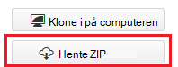

<properties
   pageTitle="Behandle begivenheder fra begivenhed hubber med Storm på HDInsight | Microsoft Azure"
   description="Lær at behandle begivenhed Hubs data med en C# Storm topologi, der er oprettet i Visual Studio ved hjælp af værktøjerne HDInsight til Visual Studio."
   services="hdinsight,notification hubs"
   documentationCenter=""
   authors="Blackmist"
   manager="jhubbard"
   editor="cgronlun"/>

<tags
   ms.service="hdinsight"
   ms.devlang="dotnet"
   ms.topic="article"
   ms.tgt_pltfrm="na"
   ms.workload="big-data"
   ms.date="10/27/2016"
   ms.author="larryfr"/>

# Håndtere hændelser fra Azure begivenhed hubber med Storm på HDInsight (C#)

Azure begivenhed Hubs gør det muligt at behandle store mængder data fra websteder, apps og enheder. Begivenhed Hubs tud gør det nemt at bruge Apache Storm på HDInsight til at analysere disse data i realtid. Du kan også skrive data til begivenhed hubber fra Storm ved hjælp af begivenhed Hubs bolt.

I dette selvstudium lærer du at bruge skabelonen Visual Studio, der installeres med HDInsight værktøjer til Visual Studio til at oprette to topologier, der arbejder med Azure begivenhed Hubs.

* **EventHubWriter**: tilfældigt genererer data og skriver det til begivenhed Hubs

* **EventHubReader**: læser data fra begivenhed Hubs og logfører dataene loggene Storm

> [AZURE.NOTE] Mens trinnene i dette dokument skal have et Windows udviklingsmiljø med Visual Studio, kan projektet kompileret sendes til en Linux eller Windows-baseret HDInsight klynge. Kun Linux-baserede klynger oprettet efter 10-28/2016 support SCP.NET topologier.
>
> Hvis du vil bruge en C#-topologi med en Linux-baserede klynge, skal du opdatere pakken Microsoft.SCP.Net.SDK NuGet bruges af dit projekt til version 0.10.0.6 eller nyere. Versionen af pakken skal også svare på overordnet version af Storm installeret på HDInsight. For eksempel Storm på HDInsight versioner 3.3 og 3.4 bruge Storm version 0.10.x, mens HDInsight 3.5 bruger Storm 1.0.x.
> 
> C# topologier på Linux-baserede klynger skal bruge .NET 4.5, og Brug sort/hvid til at køre på HDInsight klyngen. De fleste ting fungerer, men du skal kontrollere [Sort/hvide kompatibilitet](http://www.mono-project.com/docs/about-mono/compatibility/) dokumentet til potentielle inkompatibilitet.
>
> Du kan finde en Java-version af dette projekt, der også virker på en Linux-baserede eller Windows-baseret klynge, [proces begivenheder fra Azure begivenhed hubber med Storm på HDInsight (Java)](hdinsight-storm-develop-java-event-hub-topology.md).

## Forudsætninger

* En [Apache Storm på HDInsight klynge](hdinsight-apache-storm-tutorial-get-started.md)

* En [Azure begivenhed Hub](../event-hubs/event-hubs-csharp-ephcs-getstarted.md)

* [Azure .NET SDK](http://azure.microsoft.com/downloads/)

* [HDInsight værktøjer til Visual Studio](hdinsight-hadoop-visual-studio-tools-get-started.md)

## Færdigt projekt

Du kan hente en komplet version af det projekt, der er oprettet i dette selvstudium fra GitHub: [eventhub-storm-hybrid](https://github.com/Azure-Samples/hdinsight-dotnet-java-storm-eventhub). Men du stadig har brug at angive indstillinger for søgekonfiguration ved at følge trinnene i dette selvstudium.

## Begivenhed Hubs tud og bolt

Begivenhed hubberne spout og er bolt Java-komponenter, der gør det muligt at arbejde ubesværet med begivenhed Hubs fra Apache Storm. Selvom disse komponenter er skrevet i Java, HDInsight værktøjer til Visual Studio giver dig mulighed at oprette hybrid topologier, blande C# og Java komponenter.

Tud og bolt fordeles som en enkelt Java arkiv (.jar)-fil med navnet **eventhubs-storm-spout-#.#-jar-with-dependencies.jar**, hvor ## er versionen af filen.

### Hente filen .jar

Den seneste version af filen glas er inkluderet i [HDInsight Storm eksempler](https://github.com/hdinsight/hdinsight-storm-examples) projektet under mappen **bibliotek/eventhubs** . For at hente filen, skal du bruge en af følgende metoder.

> [AZURE.NOTE] Tud og bolt har sendt skal indgå i Apache Storm projektet. Kan finde flere oplysninger under [STORM 583: første indtjekning for storm begivenhed hubs](https://github.com/apache/storm/pull/336/files) i GitHub.

* **Hente en ZIP-fil**: fra webstedet [HDInsight Storm eksempler](https://github.com/hdinsight/hdinsight-storm-examples) , Vælg **Download ZIP** i højre rude for at hente en .zip-fil, der indeholder projektet.

    

    Når filen er downloadet, kan du finde arkivet, og filen bliver i mappen **bibliotek** .

* **Klon projektet**: Hvis du har [ciffer](http://git-scm.com/) installeret, kan du bruge følgende kommando til at klone lager lokalt, og derefter finde filen i mappen **bibliotek** .

        git clone https://github.com/hdinsight/hdinsight-storm-examples

## Konfigurere begivenhed Hubs

Begivenhed Hubs er datakilde i dette eksempel. Brug oplysningerne i afsnittet __oprette en begivenhed Hub__ i [Introduktion til begivenhed Hubs](../event-hubs/event-hubs-csharp-ephcs-getstarted.md) dokumentet.

3. Når begivenhed hub er blevet oprettet, få vist bladet EventHub i portalen Azure, og vælg __delt access politikker__. Brug __+ Tilføj__ posten til at tilføje følgende politikker:

  	| Navn | Tilladelser |
  	| ----- | ----- |
  	| Writer | Send |
  	| Reader | Lytte |

    

5. Vælg politikkerne, der __læser__ og __writer__ . Kopiere, og Gem den __PRIMÆRNØGLE__ værdi for begge politikker, som disse bruges senere.

## Konfigurere EventHubWriter

1. Hvis du ikke allerede har installeret den nyeste version af HDInsight værktøjerne til Visual Studio, kan du se [Introduktion til brug af HDInsight Tools til Visual Studio](hdinsight-hadoop-visual-studio-tools-get-started.md).

2. Du kan hente løsningen fra [eventhub-storm-hybrid](https://github.com/Azure-Samples/hdinsight-dotnet-java-storm-eventhub). Åbn løsningen, og tage et øjeblik på at lede i koden for __EventHubWriter__ projektet.

4. Åbn filen __App.config__ i project __EventHubWriter__ . Brug oplysningerne fra den begivenhed-Hub, du har konfigureret tidligere til Udfyld værdien for de følgende nøgler:

  	| Nøgle | Værdi |
  	| ----- | ----- |
  	| EventHubPolicyName | Writer (Hvis du har brugt et andet navn for politikken med _sende_ tilladelse, bruge den i stedet.) |
  	| EventHubPolicyKey | Nøgle til politikken writer |
  	| EventHubNamespace | Navneområdet, der indeholder din begivenhed Hub |
  	| EventHubName | Navnet på din begivenhed Hub |
  	| EventHubPartitionCount | Antallet af partitioner i din begivenhed Hub |

4. Gem og Luk **App.config** -filen.

## Konfigurere EventHubReader

1. Åbn projektet, __EventHubReader__ og tage et par momoents at lede i koden.

2. Åbn __App.config__ for __EventHubWriter__. Brug oplysningerne fra den begivenhed-Hub, du har konfigureret tidligere til Udfyld værdien for de følgende nøgler:

  	| Nøgle | Værdi |
  	| ----- | ----- |
  	| EventHubPolicyName | læser (Hvis du har brugt et andet navn for politikken med _lytte_ tilladelse, bruge den i stedet.) |
  	| EventHubPolicyKey | Nøgle til politikken reader |
  	| EventHubNamespace | Navneområdet, der indeholder din begivenhed Hub |
  	| EventHubName | Navnet på din begivenhed Hub |
  	| EventHubPartitionCount | Antallet af partitioner i din begivenhed Hub |

3. Gem og Luk **App.config** -filen.

## Installere topologier

1. Højreklik på **EventHubReader** projektet **Solution Explorer**, og vælg **Send for at Storm på HDInsight**.

    

2. Vælg din **Storm klynge**på skærmbilledet **Sende topologi** . Udvid **Yderligere konfigurationer**, vælge **Java filstier**, Vælg **...** , og vælg den mappe, der indeholder den **eventhubs-storm-spout-0.9-jar-with-dependencies.jar** fil, du har hentet tidligere. Til sidst skal du klikke på **Send**.

    

3. Når topologien er blevet indsendt, vises den **Storm topologier Viewer** . Vælg **EventHubReader** topologien i venstre rude for at få vist statistik for topologien. I øjeblikket, skal sker ingenting fordi ingen hændelser der er skrevet til begivenhed hubber endnu.

    

4. Højreklik på **EventHubWriter** projektet **Solution Explorer**, og vælg **Send for at Storm på HDInsight**.

2. Vælg din **Storm klynge**på skærmbilledet **Sende topologi** . Udvid **Yderligere konfigurationer**, vælge **Java filstier**, Vælg **...** , og vælg den mappe, der indeholder den **eventhubs-storm-spout-0.9-jar-with-dependencies.jar** fil, du gemte tidligere. Til sidst skal du klikke på **Send**.

5. Når topologien er blevet sendt, skal du opdatere listen topologi i **Storm topologier Viewer** til at kontrollere, at begge topologier kører på klyngen.

6. Vælg **EventHubReader** topologien i **Storm topologier Viewer**.

4. Dobbeltklik på komponenten __LogBolt__ i visningen graph. Siden __Komponent oversigt__ for bolten åbnes.

3. Vælg et af linkene i kolonnen __Port__ i sektionen __bobestyreren__ . Derved vises oplysninger, der er logget af komponenten. De registrerede oplysninger er som følger:

        2016-10-20 13:26:44.186 m.s.s.b.ScpNetBolt [INFO] Processing tuple: source: com.microsoft.eventhubs.spout.EventHubSpout:7, stream: default, id: {5769732396213255808=520853934697489134}, [{"deviceId":3,"deviceValue":1379915540}]
        2016-10-20 13:26:44.234 m.s.s.b.ScpNetBolt [INFO] Processing tuple: source: com.microsoft.eventhubs.spout.EventHubSpout:7, stream: default, id: {7154038361491319965=4543766486572976404}, [{"deviceId":3,"deviceValue":459399321}]
        2016-10-20 13:26:44.335 m.s.s.b.ScpNetBolt [INFO] Processing tuple: source: com.microsoft.eventhubs.spout.EventHubSpout:6, stream: default, id: {513308780877039680=-7571211415704099042}, [{"deviceId":5,"deviceValue":845561159}]
        2016-10-20 13:26:44.445 m.s.s.b.ScpNetBolt [INFO] Processing tuple: source: com.microsoft.eventhubs.spout.EventHubSpout:7, stream: default, id: {-2409895457033895206=5479027861202203517}, [{"deviceId":8,"deviceValue":2105860655}]

## Stoppe med at topologier

Vælg hver topologi i **Storm topologi Fremviser**for at stoppe topologier, og derefter på **Slet**.

## Slette din klynge

[AZURE.INCLUDE [delete-cluster-warning](../../includes/hdinsight-delete-cluster-warning.md)]

## Noter

### Checkpointing

EventHubSpout med jævne mellemrum kontrolpunkter dens tilstand til noden Zookeeper, som gemmer forskydning for den aktuelle for meddelelser, der læses fra køen. Dette giver mulighed for komponenten begynde at modtage meddelelser på den gemte forskydning i følgende situationer:

* En forekomst af komponent mislykkes, og er genstartet.

* Du Forøg eller Formindsk klyngen ved at tilføje eller fjerne noder.

* Topologien blev afbrudt, og genstartet **med det samme navn**.

Du kan også eksportere og importere permanente kontrolpunkterne til WASB (Azure opbevaring anvendes af din HDInsight klynge.) Scriptene, som du gør dette, er placeret på Storm på HDInsight klynge, på **c:\apps\dist\storm-0.9.3.2.2.1.0-2340\zkdatatool-1.0\bin**.

>[AZURE.NOTE] Versionsnummeret i stien kan være forskellige, som versionen af Storm installeret på klyngen kan blive ændret i fremtiden.

Scripts i denne mappe er:

* **stormmeta_import.cmd**: importere alle Storm metadata fra objektbeholderen til lagring af klynge standard til Zookeeper.

* **stormmeta_export.cmd**: eksportere alle Storm metadata fra Zookeeper til objektbeholderen til lagring af klynge standard.

* **stormmeta_delete.cmd**: slette alle Storm metadata fra Zookeeper.

Eksportere en import gør muligt at fastholdes kontrolpunkt data, når du har brug at slette klyngen, men vil genoptage behandling fra forskydning for den aktuelle i hubben, når du vil have en ny klynge online igen.

> [AZURE.NOTE] Da dataene bevares til objektbeholderen til lagring af standard, den nye klynge **skal** bruge den samme lagerplads konto og beholder som det forrige klynge.

## Næste trin

I dette dokument, du har lært Sådan bruges Java begivenhed Hubs Spout og Bolt fra en C#-topologi til at arbejde med data i Azure begivenhed Hub. Hvis du vil vide mere om oprettelse af C# topologier, skal du se følgende.

* [Udvikle C# topologier for Apache Storm på HDInsight ved hjælp af Visual Studio](hdinsight-storm-develop-csharp-visual-studio-topology.md)

* [SCP programming vejledning](hdinsight-storm-scp-programming-guide.md)

* [Eksempel topologier for Storm på HDInsight](hdinsight-storm-example-topology.md)
 
