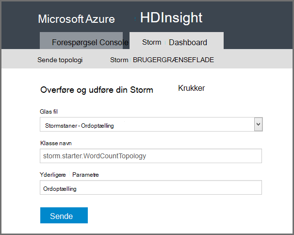

<properties
    pageTitle="Introduktion til Apache Storm på HDInsight | Microsoft Azure"
    description="Få en introduktion til Apache Storm, og Lær, hvordan du kan bruge Storm på HDInsight til at opbygge realtidsdata analytics løsninger i skyen."
    services="hdinsight"
    documentationCenter=""
    authors="Blackmist"
    manager="jhubbard"
    editor="cgronlun"
    tags="azure-portal"/>

<tags
   ms.service="hdinsight"
   ms.devlang="na"
   ms.topic="get-started-article"
   ms.tgt_pltfrm="na"
   ms.workload="big-data"
   ms.date="10/11/2016"
   ms.author="larryfr"/>

#Introduktion til Apache Storm på HDInsight: realtid analyser af Hadoop

Apache Storm på HDInsight kan du oprette fordelt, realtid analytics løsninger i Azure-miljø ved hjælp af [Apache Hadoop](http://hadoop.apache.org).

##Hvad er Apache Storm?

Apache Storm er en fordelt, fejlsikret, open source-beregning system, der gør det muligt at behandle data i realtid med Hadoop. Storm løsninger kan også give garanterede behandling af data, med muligheden for at afspille data, der ikke blev behandlet første gang korrekt.

##Hvorfor bruge Storm på HDInsight?

Apache Storm på HDInsight er en administreret klynge, der er integreret i Azure-miljø. Den indeholder følgende vigtige fordele:

* Udfører som en administreret tjeneste med en SERVICENIVEAUAFTALE 99,9% tidspunkt

* Bruge sprog efter eget valg: understøtter Storm komponenter, der er skrevet i **Java**, **C#**og **Python**

    * Understøtter en blanding af programmeringssprog: Læs data ved hjælp af Java, og derefter behandle den ved hjælp af C#
    
        > [AZURE.NOTE] C# topologier understøttes kun på Windows-baseret HDInsight klynger.

    * Brug grænsefladen **Trident** Java til at oprette Storm topologier, der understøtter "Når nøjagtigt" behandling af meddelelser, "transaktions" datastore brugerdata og et sæt almindelige stream analytics-handlinger

* Indeholder indbyggede funktioner skalere op og ned skala: skalere et HDInsight klynge uden at påvirke for at køre Storm topologier

* Integrere med andre Azure tjenesterne, herunder begivenhed-Hub, Azure virtuelt netværk, SQL-Database, Blob-lager og DocumentDB

    * Kombinere funktionerne i flere HDInsight klynger ved hjælp af Azure virtuelt netværk: oprette analytisk rørledninger, der bruger HDInsight, HBase eller Hadoop klynger

Du kan finde en liste over virksomheder, der bruger Apache Storm til deres realtid analytics-løsninger, [Firmaer ved hjælp af Apache Storm](https://storm.apache.org/documentation/Powered-By.html).

For at komme i gang ved hjælp af Storm skal du se [komme i gang med Storm på HDInsight][gettingstarted].

###Øget klargøring

Du kan klargøre en ny Storm på HDInsight klynge i minutter. Angiv klyngenavnet, størrelse, administratorkonto og kontoen lagerplads. Azure opretter klynge, herunder eksempeltopologier og et dashboard i web-ledelse.

> [AZURE.NOTE] Du kan også klargøre Storm klynger ved hjælp af [Azure CLI](../xplat-cli-install.md) eller [Azure PowerShell](../powershell-install-configure.md).

Har du en ny Storm klynge kører inden for 15 minutter til at sende anmodningen, og klar til dit første realtid analytics rørledning.

###Brugervenlig

__For Linux-baserede Storm på HDInsight klynger__, du kan oprette forbindelse til den klynge ved hjælp af SSH og bruge den `storm` kommandoen til at starte og administrere topologier. Desuden kan du bruge Ambari til at overvåge tjenesten Storm og Storm Brugergrænsefladen til at overvåge og administrere igangværende topologier.

Du kan finde flere oplysninger om at arbejde med Linux-baserede Storm klynger, kan du se [komme i gang med Apache Storm på Linux-baserede HDInsight](hdinsight-apache-storm-tutorial-get-started-linux.md).

__Til Windows-baserede Storm på HDInsight klynger__HDInsight værktøjer til Visual Studio gør det muligt at oprette C# og hybrid C# / Java topologier og sende dem til din Storm på HDInsight klynge.  

HDInsight værktøjer til Visual Studio indeholder også en grænseflade, der gør det muligt at overvåge og administrere Storm topologier på en klynge.

Du kan finde et eksempel på ved hjælp af værktøjerne HDInsight til at oprette et Storm-program, [udvikle C# Storm topologier med værktøjerne HDInsight til Visual Studio](hdinsight-storm-develop-csharp-visual-studio-topology.md).

Du kan finde flere oplysninger om de HDInsight værktøjer til Visual Studio se [komme i gang ved hjælp af værktøjerne HDInsight til Visual Studio](../HDInsight/hdinsight-hadoop-visual-studio-tools-get-started.md).

Hver Storm på HDInsight klynge indeholder også en webbaseret Storm Dashboard, hvor du kan sende, overvåge og administrere Storm topologier kører på klyngen.

Finde flere oplysninger om brug af dashboardet Storm [Implementer og administrere Apache Storm topologier på HDInsight](hdinsight-storm-deploy-monitor-topology.md).

Storm på HDInsight giver også nem integration med Azure begivenhed Hubs gennem den **Begivenhed Hub Spout**. Den seneste version af denne komponent findes på [https://github.com/hdinsight/hdinsight-storm-examples/tree/master/lib/eventhubs](https://github.com/hdinsight/hdinsight-storm-examples/tree/master/lib/eventhubs). Du kan finde flere oplysninger om brug af denne komponent, følgende dokumenter.

* [Udvikle en C#-topologi, der bruger Azure begivenhed Hubs](hdinsight-storm-develop-csharp-event-hub-topology.md)

* [Udvikle en Java topologi, der bruger Azure begivenhed Hubs](hdinsight-storm-develop-java-event-hub-topology.md)

###Pålidelighed

Apache Storm garanterer altid, at alle indgående meddelelser vil blive fuldt behandlet, selvom dataanalyse er fordelt over hundredvis af noder.

**Nimbus node** indeholder tilsvarende funktionalitet til Hadoop JobTracker og tildele opgaver til andre noder i klynge gennem **Zookeeper**. Zookeeper noder giver kører koordineret for-klyngen og lette kommunikationen mellem Nimbus og **overordnede** processen på noderne arbejder. Hvis en behandling node går ned, får besked om noden Nimbus og tildeling af opgave og tilknyttede data til en anden node.

Standardkonfigurationen for Apache Storm er at have kun én Nimbus node. Storm på HDInsight kører to Nimbus noder. Hvis den primære node mislykkes, skifte HDInsight klynge til den sekundære node, mens den primære node er gendannet.

###Skala

Selvom du kan angive antallet af knuder i din klynge under oprettelse, kan du få Forøg eller Formindsk klynge så det svarer til arbejdsbelastningen. Alle HDInsight klynger gør det muligt at ændre antallet af knuder på klynge, selv under behandling af data.

> [AZURE.NOTE] For at kunne udnytte nye noder, der tilføjes via skalering, skal du at genoprette topologier startes, før den klyngestørrelse blev øget.

###Support

Storm på HDInsight leveres med fuld enterprise-niveau 24/7 support. Storm på HDInsight har også en SERVICENIVEAUAFTALE 99,9%. Det betyder, at vi garantere, at klyngen har eksterne connectivity mindst 99,9% af tiden.

##Almindelige brug kasserne i realtid analytics

Følgende er nogle almindelige scenarier, hvor du kan bruge Apache storm om HDInsight. Finde oplysninger om reale scenarier, [hvor virksomheder anvender Storm](https://storm.apache.org/documentation/Powered-By.html).

* Internet ting (IoT)
* Registrering af svindel?
* Sociale analytics
* Uddrage, kan du transformere indlæsning
* Netværksovervågning af
* Søgning
* Mobile aftale

##Hvordan behandles data i HDInsight Storm?

Apache Storm kører **topologier** i stedet for de MapReduce job, kan du blive fortrolig med i HDInsight eller Hadoop. En Storm på HDInsight klynge indeholder to typer noder: hoved noder, der kører **Nimbus** og arbejder noder, der kører **overordnede**.

* **Nimbus**: svarer til JobTracker i Hadoop, det er ansvarlig for distribuere kode i hele klyngen, tildele opgaver til virtuelle maskiner og overvågning for fejl. HDInsight indeholder to Nimbus noder, så der er ingen ét afsnit til Storm på HDInsight

* **Overordnede**: overordnede for hver enkelt arbejder node er ansvarlig for start og Stop **arbejdsprocesser** på noden.

* **Arbejdsprocessen**: kører et undersæt af en **topologi**. En igangværende topologi distribueres på tværs af mange arbejdsprocesser i hele klyngen.

* **Topologi**: definerer en graf over beregning, der behandler **streams** af data. I modsætning til MapReduce job køres topologier, indtil du stopper dem.

* **Stream**: en ubundet samling af **tupler**. Streams er produceret af **spouts** og **bolte**, og de bruges ved **bolte**.

* **Tupel**: en navngivet liste over dynamisk indtastede værdier.

* **Spout**: forbruger data fra en datakilde og udsender en eller flere **streams**.

    > [AZURE.NOTE] I mange situationer læses data fra en kø, såsom Kafka, Azure Service Bus køer eller begivenhed hubs. Køen sikrer, at dataene er bevaret, hvis der er en afbrydelse.

* **Bolt**: forbruger **streams**, udfører behandling på **tupler**og kan udsende **streams**. Bolte er også ansvarlig for at skrive data til eksterne lager, som en kø, HDInsight, HBase, en blob eller andre datalager.

* **Apache Thrift**: en software ramme for SVG tjeneste i tværs af sprog udvikling. Gør det muligt at opbygge tjenester, der fungerer mellem C++, Java, Python, PHP, fonetisk, Erlang, Perl, Haskell, C#, kakao, JavaScript, Node.js, Smalltalk og andre sprog.

    * **Nimbus** er en Thrift-tjeneste, og en **topologi** er en definition af Thrift, så det er muligt at udvikle topologier ved hjælp af en række programmeringssprog.

Du kan finde flere oplysninger om Storm komponenter, se [Storm selvstudium] [ apachetutorial] på apache.org.

##Hvilke programmeringssprog kan jeg bruge?

Storm på HDInsight klynge yder support til C#, Java og Python.

### C & #35

HDInsight værktøjer til Visual Studio Tillad .NET udviklere til at designe og implementere en topologi i C#. Du kan også oprette hybrid topologier, der anvender Java og C# komponenter.

Du kan finde flere oplysninger [udvikle C# topologier for Apache Storm på HDInsight ved hjælp af Visual Studio](hdinsight-storm-develop-csharp-visual-studio-topology.md).

###Java

De fleste Java eksempler du støder på bliver almindelig Java eller Trident. Trident er en overordnet fremstilling, der gør det nemmere at udføre ting som joinforbindelser, sammenlægninger, gruppering og filtrering. Dog beregner Trident batches med tupler, mens en rå Java-løsning behandler en stream en tupel ad gangen.

Du kan finde flere oplysninger om Trident, [Trident selvstudium](https://storm.apache.org/documentation/Trident-tutorial.html) på apache.org.

Eksempler på Java og Trident topologier, kan du se på [listen over eksempel Storm topologier](hdinsight-storm-example-topology.md) eller storm starter eksempler på din HDInsight klynge.

Eksempler på storm starter kan findes i mappen __/usr/hdp/current/storm-client/contrib/storm-starter__ på Linux-baserede klynger og mappen **%storm_home%\contrib\storm-starter** på Windows-baserede klynger.

##Hvad er nogle almindelige udvikling mønstre?

###Garanterer behandling

Storm kan giver forskellige niveauer af garanterer behandling. For eksempel en grundlæggende Storm programmet kan garantere med mindste-det samme behandling og Trident kan garantere præcis-behandling af én gang.

Se [garantier på databehandling](https://storm.apache.org/about/guarantees-data-processing.html) på apache.org kan finde flere oplysninger.

###IBasicBolt

Anvendelse af læse en input tupel udsendelse nul eller flere tupler og derefter acking input tuplen med det samme i slutningen af metoden execute er meget almindeligt og Storm giver grænsefladen [IBasicBolt](https://storm.apache.org/apidocs/backtype/storm/topology/IBasicBolt.html) for at automatisere dette mønster.

###Joinforbindelser

Deltage i to streams data varierer mellem programmer. For eksempel kan du også forbinde hver tupel fra flere streams i en ny stream, eller du kan deltage kun batches med tupler for et bestemt vindue. Uanset hvilken mulighed, kan deltage i gøres ved hjælp af [fieldsGrouping](http://javadox.com/org.apache.storm/storm-core/0.9.1-incubating/backtype/storm/topology/InputDeclarer.html#fieldsGrouping%28java.lang.String,%20backtype.storm.tuple.Fields%29), som er en måde at definere, hvordan tupler distribueres til bolte.

I eksemplet nedenfor Java bruges fieldsGrouping til at omdirigere tupler, der stammer fra komponenter "1", "2" og "3" **MyJoiner** bolt.

    builder.setBolt("join", new MyJoiner(), parallelism) .fieldsGrouping("1", new Fields("joinfield1", "joinfield2")) .fieldsGrouping("2", new Fields("joinfield1", "joinfield2")) .fieldsGrouping("3", new Fields("joinfield1", "joinfield2"));

###Samling

Samling kan gøres på flere måder. Med en grundlæggende Storm Java topologi, kan du bruge enkel tæller til batchen X antal tupler før udsendelse dem, eller brug en intern tidsindstilling system, kaldet en "aksemærker tupel" at sende en batchen hvert X.

Du kan finde et eksempel på brug af aksemærker tupler, [analysere føler data med Storm og HBase på HDInsight](hdinsight-storm-sensor-data-analysis.md).

Hvis du bruger Trident, er det baseret på behandling batches med tupler.

###Cachelagring

I hukommelsen cachelagring bruges ofte som en metode til at øge hastigheden behandlingen, da det holder ofte anvendt aktiver i hukommelse. Fordi en topologi fordeles på tværs af flere noder og flere processer inden for hver node, bør du overveje at bruge [fieldsGrouping](http://javadox.com/org.apache.storm/storm-core/0.9.1-incubating/backtype/storm/topology/InputDeclarer.html#fieldsGrouping%28java.lang.String,%20backtype.storm.tuple.Fields%29) til at sikre, at tupler, der indeholder de felter, der bruges til opslag i cachen, altid distribueres til den samme fremgangsmåde. Derved undgår kopiere cacheposter på tværs af processer.

###Streaming øverste N

Når din topologi afhænger af beregning af værdien "øverste N", som de øverste 5 tendenser på Twitter, skal du beregne værdien øverste N parallelt og derefter flette output fra de pågældende beregninger i en global værdi. Dette kan gøres ved hjælp af [fieldsGrouping](http://javadox.com/org.apache.storm/storm-core/0.9.1-incubating/backtype/storm/topology/InputDeclarer.html#fieldsGrouping%28java.lang.String,%20backtype.storm.tuple.Fields%29) distribuere efter felt til de parallelle bolte (som partitioner dataene ved feltværdien), og derefter distribuere til en bolt, globalt bestemmer værdien, øverste N.

Du kan finde et eksempel på dette eksemplet [RollingTopWords](https://github.com/nathanmarz/storm-starter/blob/master/src/jvm/storm/starter/RollingTopWords.java) .

##Hvilken type logføring Storm brug?

Storm bruger Apache Log4j til at logge oplysninger. En stor mængde data logføres som standard, og det kan være svært at sortere oplysningerne. Du kan medtage en logføring konfigurationsfil som en del af din Storm topologi til at styre logføring funktionsmåde.

For en topologi for eksempel, der viser, hvordan du konfigurerer logføring, se [Java-baserede WordCount](hdinsight-storm-develop-java-topology.md) eksempel til Storm på HDInsight.

##Næste trin

Lær mere om realtid analytics løsninger med Apache Storm i HDInsight:

* [Introduktion til Storm på HDInsight][gettingstarted]

* [Eksempel topologier for Storm på HDInsight](hdinsight-storm-example-topology.md)

[stormtrident]: https://storm.apache.org/documentation/Trident-API-Overview.html
[samoa]: http://yahooeng.tumblr.com/post/65453012905/introducing-samoa-an-open-source-platform-for-mining
[apachetutorial]: https://storm.apache.org/documentation/Tutorial.html
[gettingstarted]: hdinsight-apache-storm-tutorial-get-started-linux.md
