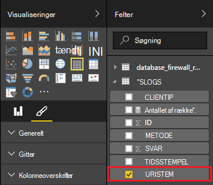

<properties
 pageTitle="Bruge Apache Storm med Power BI | Microsoft Azure"
 description="Oprette en Power BI-rapport ved hjælp af data fra en C#-topologi kører på en Apache Storm klynge i HDInsight."
 services="hdinsight"
 documentationCenter=""
 authors="Blackmist"
 manager="jhubbard"
 editor="cgronlun"
    tags="azure-portal"/>

<tags
 ms.service="hdinsight"
 ms.devlang="dotnet"
 ms.topic="article"
 ms.tgt_pltfrm="na"
 ms.workload="big-data"
 ms.date="10/27/2016"
 ms.author="larryfr"/>

# Bruge Power BI til at visualisere data fra en Apache Storm topologi

Power BI kan du få vist data visuelt som rapporter. Brug af Visual Studio-skabeloner til Storm på HDInsight, kan du nemt bruge store data fra en topologi, der kører på en Apache Storm på HDInsight klynge i SQL Azure og derefter visualisere data med Power BI.

I dette dokument lære du, hvordan du kan bruge Power BI til at oprette en rapport fra data, der genereres af en Apache Storm topologi og gemmes i Azure SQL-Database.

> [AZURE.NOTE] Mens trinnene i dette dokument skal have et Windows udviklingsmiljø med Visual Studio, kan projektet kompileret sendes til en Linux eller Windows-baseret HDInsight klynge. Kun Linux-baserede klynger oprettet efter 10-28/2016 support SCP.NET topologier.
>
> Hvis du vil bruge en C#-topologi med en Linux-baserede klynge, skal du opdatere pakken Microsoft.SCP.Net.SDK NuGet bruges af dit projekt til version 0.10.0.6 eller nyere. Versionen af pakken skal også svare på overordnet version af Storm installeret på HDInsight. For eksempel Storm på HDInsight versioner 3.3 og 3.4 bruge Storm version 0.10.x, mens HDInsight 3.5 bruger Storm 1.0.x.
> 
> C# topologier på Linux-baserede klynger skal bruge .NET 4.5, og Brug sort/hvid til at køre på HDInsight klyngen. De fleste ting fungerer, men du skal kontrollere [Sort/hvide kompatibilitet](http://www.mono-project.com/docs/about-mono/compatibility/) dokumentet til potentielle inkompatibilitet.
>
> Du kan finde en Java-version af dette projekt, der også virker på en Linux-baserede eller Windows-baseret klynge, [proces begivenheder fra Azure begivenhed hubber med Storm på HDInsight (Java)](hdinsight-storm-develop-java-event-hub-topology.md).

## Forudsætninger

- Et Azure-abonnement. Se [få Azure gratis prøveversion](https://azure.microsoft.com/documentation/videos/get-azure-free-trial-for-testing-hadoop-in-hdinsight/).

* En Azure Active Directory-bruger med [Power BI](https://powerbi.com) -adgang

* Visual Studio (én af følgende versioner)

    * Visual Studio 2012 med [opdatere 4](http://www.microsoft.com/download/details.aspx?id=39305)

    * Visual Studio 2013 med [opdatere 4](http://www.microsoft.com/download/details.aspx?id=44921) eller [Visual Studio 2013 Community](http://go.microsoft.com/fwlink/?linkid=517284&clcid=0x409)

    * [Visual Studio 2015](https://www.visualstudio.com/downloads/download-visual-studio-vs.aspx)

* HDInsight værktøjer til Visual Studio: se [komme i gang ved hjælp af værktøjerne HDInsight til Visual Studio](../HDInsight/hdinsight-hadoop-visual-studio-tools-get-started.md) for oplysninger om installationsoplysninger.

## Sådan fungerer det

I dette eksempel indeholder en C# Storm topologi, genererer Internet Information Services (IIS) logdata. Disse data skrives derefter til en SQL-Database, og derfra den bruges til at oprette rapporter i Power BI.

Følgende er en liste over de filer, der implementerer primære funktionaliteten i dette eksempel.

* **SqlAzureBolt.cs**: skriver oplysninger, der er oprettet i Storm topologien til SQL-Database.

* **IISLogsTable.sql**: feltet Transact-SQL-sætninger, der bruges til at oprette den database, som data, der er gemt i.

> [AZURE.WARNING] Før du starter topologien på din klynge HDInsight, skal du oprette tabellen i SQL-Database.

## Hent eksemplet

Hent [HDInsight C# Storm Power BI-eksempel](https://github.com/Azure-Samples/hdinsight-dotnet-storm-powerbi). For at hente den, enten forgreningsovergang/Klon det ved hjælp af [ciffer](http://git-scm.com/)eller bruge hyperlinket **Hent** til at hente en .zip arkivet.

## Oprette en database

1. Følg trinnene i [SQL-Database selvstudium](../sql-database/sql-database-get-started.md) dokumentet for at oprette en ny SQL-Database.

2. Opret forbindelse til databasen ved at følge trinnene i [oprette forbindelse til en SQL-Database med Visual Studio](../sql-database/sql-database-connect-query.md) dokumentet til at oprette forbindelse til databasen.

4. Højreklik på databasen i Object Explorer, og Opret en __Ny forespørgsel__. Indsætte indholdet af filen __IISLogsTable.sql__ inkluderet i hentede projektet i forespørgselsvinduet, og derefter bruge Ctrl + Shift + E til at udføre forespørgslen. Du modtager en meddelelse, command(s) er gennemført.

    Når dette er fuldført, vises der en ny tabel med navnet __IISLOGS__ i databasen.

## Konfigurere stikprøvernes

1. Vælg databasen SQL [Azure-portalen](https://portal.azure.com). Fra __Essentials__ del af bladet SQL-database skal du vælge __Vis database forbindelsesstrenge__. Kopiér oplysningerne om __ADO.NET (SQL-godkendelse)__ på den liste, der vises.

1. Åbn stikprøvernes i Visual Studio. Åbn **App.config** -filen fra **Solution Explorer**, og find derefter den følgende post:

        <add key="SqlAzureConnectionString" value="##TOBEFILLED##" />
    
    Erstat værdien __## TOBEFILLED ##__ med forbindelsesstrengen til databasen kopieret i det forrige trin. Erstatte __{din\_brugernavn}__ og __{din\_adgangskode}__ med det brugernavn og adgangskode til databasen.

2. Gem og Luk filerne.

## Installere stikprøvernes

1. Højreklik på **StormToSQL** projektet **Solution Explorer**, og vælg **Send for at Storm på HDInsight**. Vælg HDInsight klyngen **Storm klynge** rullemenuen i dialogboksen.

    > [AZURE.NOTE] Det kan tage et par sekunder for **Storm klynge** rullemenu til at udfylde med servernavne.
    >
    > Hvis du bliver bedt om det, kan du angive logonoplysninger for abonnementet Azure. Hvis du har mere end ét abonnement, log på den, der indeholder dine Storm på HDInsight klynge.

2. Når topologien er blevet indsendt, skal Storm topologier for-klyngen vises. Vælg et SqlAzureWriterTopology element på listen for at få vist oplysninger om den, der kørende topologi.

    

    Du kan bruge denne visning til at se oplysninger om topologien, eller dobbeltklik på poster (såsom SqlAzureBolt) for at se specifikke oplysninger for en komponent i topologien.

3. Når topologien har kørt for et par minutter, vende tilbage til vinduet SQL-forespørgsel, du brugte til at oprette databasen. Erstat eksisterende sætninger med følgende.

        select * from iislogs;
    
    Brug Ctrl + Shift + E for at udføre forespørgslen, og du skal modtage resultater, der ligner følgende.
    
        1   2016-05-27 17:57:14.797 255.255.255.255 /bar    GET 200
        2   2016-05-27 17:57:14.843 127.0.0.1   /spam/eggs  POST    500
        3   2016-05-27 17:57:14.850 123.123.123.123 /eggs   DELETE  200
        4   2016-05-27 17:57:14.853 127.0.0.1   /foo    POST    404
        5   2016-05-27 17:57:14.853 10.9.8.7    /bar    GET 200
        6   2016-05-27 17:57:14.857 192.168.1.1 /spam   DELETE  200

    Dette er data, der er skrevet fra Storm topologien.

## Oprette en rapport

1. Oprette forbindelse til [Azure SQL Database-forbindelse](https://app.powerbi.com/getdata/bigdata/azure-sql-database-with-live-connect) til Power BI.

2. Vælg __få__i __databaser__.

3. Vælg __Azure SQL-Database__, og vælg derefter __Opret forbindelse__.

4. Angiv oplysningerne til at oprette forbindelse til din Azure SQL-Database. Du kan finde dette ved at gå til [Azure-portalen](https://portal.azure.com) og vælge din SQL-database.

    > [AZURE.NOTE] Du kan også angive opdateringsintervallet og brugerdefinerede filtre ved hjælp af __Aktivere avancerede indstillinger__ fra dialogboksen Opret forbindelse.

5. Når du har forbindelse, får du vist et nyt datasæt med samme navn som den database, du har forbindelse til. Vælg dataset for at begynde at designe en rapport.

3. Udvid posten __IISLOGS__ fra __felter__. Markér afkrydsningsfeltet for __URISTEM__. Dette vil oprette en ny rapport, der viser URI stænglen (/ foo, / liggende søjle-, osv.) logget på databasen.

    

5. Herefter skal du trække __metode__ til rapporten. Rapporten opdateres, så stænglen og tilsvarende HTTP-metoden til HTTP-anmodningen.

    

4. Vælg ikonet __felter__ fra kolonnen __visualiseringer__ , og derefter vælge pil ned ud for __metode__ i sektionen __værdier__ . Vælg __antal__på den liste, der vises. Dette ændrer rapporten skal indeholde et antal hvor mange gange en bestemt URI har været åbnet.

    

6. Vælg derefter __stablet søjlediagram__ for at ændre, hvordan oplysninger, der vises.

    

7. Når du har rapporten hvordan du ønsker, at bruge __Gem__ posten i menuen til at angive et navn og gemme rapporten.

## Stoppe topologien

Topologien fortsætter med at køre, indtil du stopper den eller slette Storm på HDInsight klynge. Udfør følgende trin for at stoppe topologien.

1. Gå tilbage til topologi fremviseren i Visual Studio, og vælg topologien.

2. Vælg knappen **Afslut** for at stoppe topologien.

    

## Slette din klynge

[AZURE.INCLUDE [delete-cluster-warning](../../includes/hdinsight-delete-cluster-warning.md)]

## Næste trin

I dette dokument, du har lært hvordan du kan sende data fra en Storm topologi til SQL-Database, og klik derefter visualisere data med Power BI. Du kan finde oplysninger om, hvordan du sammen med andre Azure teknologier ved hjælp af Storm på HDInsight skal du se følgende:

* [Eksempel topologier for Storm på HDInsight](hdinsight-storm-example-topology.md)
