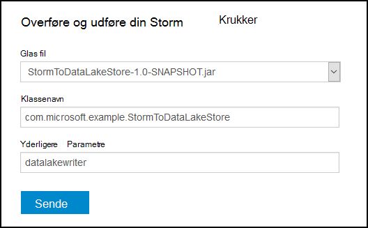

<properties
pageTitle="Brug Azure sø datalager med Apache Storm på Azure HDInsight"
description="Lær at skrive data til Azure Data sø Store fra en Apache Storm topologi på HDInsight. Dette dokument, og det tilknyttede eksempel viser, hvordan komponenten HdfsBolt kan bruges til at skrive til sø datalager."
services="hdinsight"
documentationCenter="na"
authors="Blackmist"
manager="jhubbard"
editor="cgronlun"/>

<tags
ms.service="hdinsight"
ms.devlang="na"
ms.topic="article"
ms.tgt_pltfrm="na"
ms.workload="big-data"
ms.date="09/06/2016"
ms.author="larryfr"/>

#Brug Azure sø datalager med Apache Storm med HDInsight

Azure datalager sø er en HDFS kompatible skylagringstjeneste, der giver høj overførselshastighed, tilgængelighed, holdbarhed og pålidelighed til dine data. I dette dokument lærer du hvordan du bruger en Java-baserede Storm topologi til at skrive data til Azure datalager sø ved hjælp af komponenten [HdfsBolt](http://storm.apache.org/javadoc/apidocs/org/apache/storm/hdfs/bolt/HdfsBolt.html) , som leveres som en del af Apache Storm.

> [AZURE.IMPORTANT] Eksempel topologien brugt i dette dokument er afhængig af komponenter, der følger med Storm på HDInsight klynger og kan kræve ændring til at arbejde med Azure sø datalager når bruges sammen med andre Apache Storm klynger.

##Forudsætninger

* [Java JDK 1.7](https://www.oracle.com/technetwork/java/javase/downloads/jdk7-downloads-1880260.html) eller nyere
* [Maven 3.x](https://maven.apache.org/download.cgi)
* Et Azure-abonnement
* En Storm på HDInsight klynge version 3.2. For at oprette en ny Storm på HDInsight klynge skal du følge trinnene i [bruge HDInsight med sø datalager ved hjælp af Azure](../data-lake-store/data-lake-store-hdinsight-hadoop-use-portal.md) dokumentet. Trinnene i dette dokument fører dig til at oprette en ny HDInsight klynge og Azure sø datalager.  

    > [AZURE.IMPORTANT] Når du opretter HDInsight klyngen, skal du vælge __Storm__ som klynge type og __3.2__ som versionen. Operativsystemet kan være enten Windows eller Linux.  

###Konfigurere miljøvariabler

Følgende miljøvariabler kan angives, når du installerer Java og JDK på computeren udvikling. Skal du kontrollere, at de findes, og at de indeholder de korrekte værdier for systemet.

* __JAVA_HOME__ - skal pege på den mappe, hvor Java runtime-miljø (JRE) er installeret. For eksempel i en Unix eller Linux fordeling, den skal have en værdi, der ligner `/usr/lib/jvm/java-7-oracle`. I Windows, skal den indeholde en værdi, der ligner `c:\Program Files (x86)\Java\jre1.7`.

* __Sti__ - skal indeholde følgende stier:

    * __JAVA\_HOME__ (eller tilsvarende stien)
    
    * __JAVA\_HOME\bin__ (eller tilsvarende stien)
    
    * Den mappe, hvor Maven er installeret

##Topologi implementering

Eksemplet bruges i dette dokument er skrevet i Java og bruger følgende komponenter:

* __TickSpout__: genererer de data, der bruges af andre komponenter i topologien.

* __PartialCount__: tæller hændelser, der genereres af TickSpout.

* __FinalCount__: samlinger optælle data fra PartialCount.

* __ADLStoreBolt__: skriver data til Azure Data sø Store ved hjælp af komponenten [HdfsBolt](http://storm.apache.org/javadoc/apidocs/org/apache/storm/hdfs/bolt/HdfsBolt.html) .

Det projekt, der indeholder denne topologi findes som en overførsel fra [https://github.com/Azure-Samples/hdinsight-storm-azure-data-lake-store](https://github.com/Azure-Samples/hdinsight-storm-azure-data-lake-store).

###Forstå ADLStoreBolt

ADLStoreBolt er det navn, der bruges til HdfsBolt forekomsten i topologien, der skriver til Azure Data sø. Dette er ikke en særlig version af HdfsBolt, der er oprettet af Microsoft. det dog stole på grundlæggende websted konfiguration af værdier, samt Hadoop-komponenter, der er inkluderet med Azure HDInsight til kommunikation med Data sø.

Specifikt, når du opretter en HDInsight klynge, kan du knytte den til et Azure datalager sø. Dette skriver poster i core-websted til datalager sø du har valgt, som bruges af komponenter som hadoop-klienten og hadoop-hdfs til at aktivere kommunikation med sø datalager.

> [AZURE.NOTE] Microsoft har bidraget kode til Apache Hadoop og Storm projekter, der gør det muligt for kommunikation med Azure sø datalager og Azure Blob-lager, men denne funktionalitet er måske ikke medtaget som standard i andre Hadoop og Storm salgsdistributioner.

Konfigurationen for HdfsBolt i topologien er som følger:

    // 1. Create sync and rotation policies to control when data is synched
    //    (written) to the file system and when to roll over into a new file.
    SyncPolicy syncPolicy = new CountSyncPolicy(1000);
    FileRotationPolicy rotationPolicy = new FileSizeRotationPolicy(0.5f, Units.KB);
    // 2. Set the format. In this case, comma delimited
    RecordFormat recordFormat = new DelimitedRecordFormat().withFieldDelimiter(",");
    // 3. Set the directory name. In this case, '/stormdata/'
    FileNameFormat fileNameFormat = new DefaultFileNameFormat().withPath("/stormdata/");
    // 4. Create the bolt using the previously created settings,
    //    and also tell it the base URL to your Data Lake Store.
    // NOTE! Replace 'MYDATALAKE' below with the name of your data lake store.
    HdfsBolt adlsBolt = new HdfsBolt()
        .withFsUrl("adl://MYDATALAKE.azuredatalakestore.net/")
        .withRecordFormat(recordFormat)
        .withFileNameFormat(fileNameFormat)
        .withRotationPolicy(rotationPolicy)
        .withSyncPolicy(syncPolicy);
    // 4. Give it a name and wire it up to the bolt it accepts data
    //    from. NOTE: The name used here is also used as part of the
    //    file name for the files written to Data Lake Store.
    builder.setBolt("ADLStoreBolt", adlsBolt, 1)
      .globalGrouping("finalcount");
      
Hvis du er vant til at bruge HdfsBolt, vil du bemærke, at dette er alle ret standard konfiguration med undtagelse af URL-adressen. URL-adressen indeholder stien i roden af din Azure datalager sø.

Da skrivning til sø datalager bruger HdfsBolt, og er kun en URL-adressen ændres, skal du kunne få alle eksisterende søgetopologien, der skriver til HDFS eller WASB ved hjælp af HdfsBolt og nemt ændre den for at bruge Azure sø datalager.

##Opbygge og pakke topologien

1. Hente eksempel projektet fra [https://github.com/Azure-Samples/hdinsight-storm-azure-data-lake-store](https://github.com/Azure-Samples/hdinsight-storm-azure-data-lake-store
) til dit udviklingsmiljø.

2. Åbn den `StormToDataLake\src\main\java\com\microsoft\example\StormToDataLakeStore.java` fil i en editor, og find den linje, der indeholder `.withFsUrl("adl://MYDATALAKE.azuredatalakestore.net/")`. Skift __MYDATALAKE__ til navnet på den Azure sø datalager du brugte, da oprettelse af din HDInsight-server.

3. Fra en kommando prompten, terminal eller shellsession, ændre mapper i roden af hentede projektet, og Kør følgende kommandoer for at opbygge og pakke topologien.

        mvn compile
        mvn package
    
    Når build og emballagen er fuldført, vises der en ny mappe med navnet `target`, der indeholder en fil med navnet `StormToDataLakeStore-1.0-SNAPSHOT.jar`. Dette indeholder kompileret topologien.

##Installere og køre på Linux-baserede HDInsight

Hvis du har oprettet en Linux-baserede Storm på HDInsight klynge, kan du bruge nedenstående trin til at installere og køre topologien.

1. Brug følgende kommando til at kopiere topologien til HDInsight klynge. Erstat __bruger__ med SSH brugernavnet, du brugte, da oprettelse af klyngen. Erstat __CLUSTERNAME__ med navnet på klyngen.

        scp target\StormToDataLakeStore-1.0-SNAPSHOT.jar USER@CLUSTERNAME-ssh.azurehdinsight.net:StormToDataLakeStore-1.0-SNAPSHOT.jar
    
    Når du bliver bedt om det, indtaste adgangskoden brugte, da brugeroprettelsen SSH for-klyngen. Hvis du har brugt en offentlig nøgle i stedet for en adgangskode, du skal bruge den `-i` parameter for at angive stien til den tilsvarende privat nøgle.
    
    > [AZURE.NOTE] Hvis du bruger en Windows-klient til udvikling, kan du ikke har en `scp` kommandoen. Hvis det er tilfældet, kan du bruge `pscp`, som er tilgængelig fra [http://www.chiark.greenend.org.uk/~sgtatham/putty/download.html](http://www.chiark.greenend.org.uk/~sgtatham/putty/download.html).

2. Når overførslen er fuldført, skal du bruge følgende for at oprette forbindelse til den HDInsight klynge, ved hjælp af SSH. Erstat __bruger__ med SSH brugernavnet, du brugte, da oprettelse af klyngen. Erstat __CLUSTERNAME__ med navnet på klyngen.

        ssh USER@CLUSTERNAME-ssh.azurehdinsight.net

    Når du bliver bedt om det, indtaste adgangskoden brugte, da brugeroprettelsen SSH for-klyngen. Hvis du har brugt en offentlig nøgle i stedet for en adgangskode, du skal bruge den `-i` parameter for at angive stien til den tilsvarende privat nøgle.
    
    > [AZURE.NOTE] Hvis du bruger en Windows-klient til udvikling, følge oplysninger i [oprette forbindelse til Linux-baserede HDInsight med SSH fra Windows](hdinsight-hadoop-linux-use-ssh-windows.md) oplysninger på ved hjælp af trykfarver klienten til at oprette forbindelse til klyngen.
    
3. Når forbindelse, kan du bruge følgende til at starte topologien:

        storm jar StormToDataLakeStore-1.0-SNAPSHOT.jar com.microsoft.example.StormToDataLakeStore datalakewriter
    
    Dette starter topologien med et brugervenligt navn på `datalakewriter`.

##Installere og køre på Windows-baseret HDInsight

1. Åbn en webbrowser og gå til HTTPS://CLUSTERNAME.azurehdinsight.net, hvor __CLUSTERNAME__ er navnet på din HDInsight klynge. Når du bliver bedt om det, du giver brugernavnet administrator (`admin`) og den adgangskode, du har brugt til denne konto, når klyngen blev oprettet.

2. Dashboard Storm Vælg __Gennemse__ __Jar fil__ rullelisten, og vælg derefter filen StormToDataLakeStore-1.0-SNAPSHOT.jar fra den `target` directory. Brug følgende værdier for de andre poster i formularen:

    * Klassenavn: com.microsoft.example.StormToDataLakeStore
    * Yderligere parametre: datalakewriter
    
    

3. Vælg knappen __Send__ til at overføre og starte topologien. Feltet resultat under knappen __Send__ skal vise oplysninger i stil med følgende, når topologien er startet:

        Process exit code: 0
        Currently running topologies:
        Topology_name        Status     Num_tasks  Num_workers  Uptime_secs
        -------------------------------------------------------------------
        datalakewriter       ACTIVE     68         8            10        

##Vis outputdata

Der findes flere måder at få vist dataene. I dette afsnit vi bruge Azure-portalen og `hdfs` kommando for at få vist dataene.

> [AZURE.NOTE] Du bør tillade topologier til at køre i flere minutter, før du tjekker outputdata, så dataene er blevet synkroniseret til flere filer på Azure sø datalager.

* __Fra [Azure-portalen](https://portal.azure.com)__: Vælg det Azure sø datalager, som du har brugt med HDInsight på portalen.

    > [AZURE.NOTE] Hvis du ikke Fastgør sø datalager til Azure portalen dashboard, kan du finde det ved at vælge __Gennemse__ nederst på listen til venstre, derefter __Sø datalager__, og til sidst vælge store.
    
    Vælg __Data Explorer__ikonerne øverst i sø datalager.
    
    
    
    Derefter skal du vælge mappen __stormdata__ . En liste over tekstfiler skal vises.
    
    
    
    Vælg en af filerne for at få vist indholdet.

* __Fra klyngen__: Hvis du har knyttet til den HDInsight klynge, ved hjælp af SSH (Linux klynge), eller Fjernskrivebord (Windows-klynge), kan du bruge følgende til at få vist dataene. Erstatte __DATALAKE__ med navnet på dit sø datalager

        hdfs dfs -cat adl://DATALAKE.azuredatalakestore.net/stormdata/*.txt

    Dette vil sammenkæde de tekstfiler, der er gemt i den mappe, og viser oplysninger som følger:
    
        406000000
        407000000
        408000000
        409000000
        410000000
        411000000
        412000000
        413000000
        414000000
        415000000
        
##Stoppe topologien

Storm topologier vil køre, til showet afbrydes, eller klyngen slettes. Brug følgende oplysninger til at stoppe topologier.

__For Linux-baserede HDInsight__:

Brug følgende kommando fra en SSH session til klyngen:

    storm kill datalakewriter

__Til Windows-baseret HDInsight__:

1. Vælg linket __Storm Brugergrænsefladen__ øverst på siden dashboard Storm (https://CLUSTERNAME.azurehdinsight.net).

2. Når Storm Brugergrænsefladen indlæses, skal du vælge linket __datalakewriter__ .

    

3. Vælg __Afslut__ i sektionen __Topologi handlinger__ , og vælg derefter OK i den dialogboks, der vises.

    

## Slette din klynge

[AZURE.INCLUDE [delete-cluster-warning](../../includes/hdinsight-delete-cluster-warning.md)]

##Næste trin

Nu hvor du har lært, hvordan du bruger Storm til at skrive til Azure sø datalager, kan du se andre [Storm eksempler på HDInsight](hdinsight-storm-example-topology.md).
