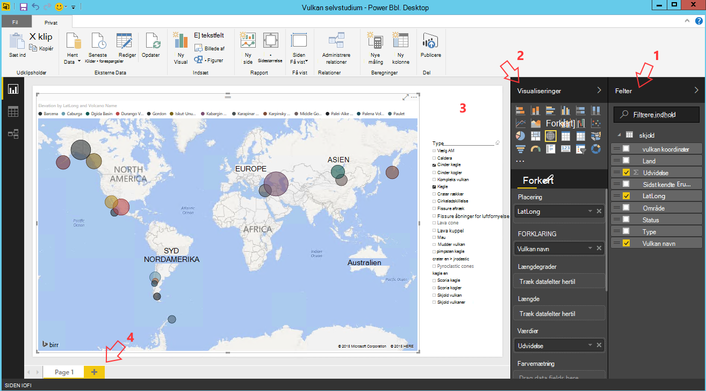

<properties
    pageTitle="Ti ting, du kan udføre på Data videnskabelige virtuelt | Microsoft Azure"
    description="Udføre forskellige undersøgelse af data og modellering opgave på Data videnskabelige virtuelt."
    services="machine-learning"
    documentationCenter=""
    authors="bradsev"
    manager="jhubbard"
    editor="cgronlun"  />

<tags
    ms.service="machine-learning"
    ms.workload="data-services"
    ms.tgt_pltfrm="na"
    ms.devlang="na"
    ms.topic="article"
    ms.date="08/29/2016"
    ms.author="gokuma;weig;bradsev" />

# <a name="ten-things-you-can-do-on-the-data-science-virtual-machine"></a>Ti ting, du kan udføre på Data videnskabelige virtuelt

Microsoft Data videnskabelige Virtual Machine (DSVM) er en effektiv data videnskabelige udviklingsmiljø, der gør det muligt at udføre forskellige data udforske og modellering opgaver. Miljøet allerede følger indbyggede og med flere populære data analytics værktøjer, som gør det nemt at komme hurtigt i gang med din analyse lokalt, skyen eller hybride installationer. DSVM arbejder tæt sammen med mange Azure tjenester og kan læse og behandle data, der allerede er gemt på Azure, i Azure SQL Data Warehouse, Azure Data sø, Azure-lager eller i DocumentDB. Det kan også udnytte andre analytics værktøjer som Azure maskine læring og Azure Data Factory.


I denne artikel fører vi dig igennem hvordan du bruger din DSVM at udføre forskellige data videnskabelige opgaver og interagere med andre Azure tjenester. Her er nogle af de ting, du kan udføre på DSVM:

1. Udforske data og udvikling af modeller på DSVM ved hjælp af Microsoft R Server, Python lokalt
2. Brug en Jupyter notesbog til at eksperimentere med dine data i en browser, der bruger Python 2, 3, skal du Python Microsoft R en klar enterprise-versionen af R, der er udviklet til skalerbarhed og ydeevne
3. Giver muligheder for modeller, der er oprettet ved hjælp af R og Python på Azure Machine Learning så klientprogrammer kan få adgang til din modellerne ved hjælp af en enkel grænseflade med webtjenester
4. Administrere din Azure ressourcer ved hjælp af Azure portal eller Powershell
5. Udvide din lagerplads og dele store datasæt / kode på tværs af hele dit team ved at oprette en Azure fillager som et kan tilsluttes drev på din DSVM
6. Dele kode med dit team, ved hjælp af Github og få adgang til din lager ved hjælp af de forudinstallerede ciffer klienter - ciffer fest ciffer grafiske brugergrænseflade.
7. Få adgang til forskellige Azure data og analytics som Azure blob-lager, Azure Data sø, Azure HDInsight (Hadoop), Azure DocumentDB Azure SQL Data Warehouse og databaser
8. Opbygge rapporter og dashboard ved hjælp af Power BI Desktop forudinstalleret på DSVM og anvende dem i skyen
9. Dynamisk skalere dit DSVM at opfylde dine projektbehov
10. Installere yderligere værktøjer på din virtuelle maskine   


>[AZURE.NOTE] Ekstra Brugsgebyrer gælder for mange af de yderligere data lager og analytics tjenester, der er vist i denne artikel. Se siden [Azure priser](https://azure.microsoft.com/pricing/) for detaljer.


**Forudsætninger**

- Du skal et Azure-abonnement. Du kan tilmelde dig en gratis prøveversion [her](https://azure.microsoft.com/free/).

- Vejledning til klargøring af en Data videnskabelige virtuel maskine på portalen Azure findes på [opretter en virtuel maskine](https://portal.azure.com/#create/microsoft-ads.standard-data-science-vmstandard-data-science-vm).

## <a name="1-explore-data-and-develop-models-using-microsoft-r-server-or-python"></a>1. udforske data og udvikle modellerne ved hjælp af Microsoft R Server eller Python

Du kan bruge sprog som R og Python til dine data analytics rigtigt på DSVM.

For R, kan du bruge en IDE kaldet "Revolution R Enterprise 8.0", som kan findes i startmenuen eller på computeren. Microsoft har offentliggjort yderligere biblioteker oven på den åbne kilde/CRAN-R for at aktivere SVG analyser og muligheden for at analysere data, der er større end den tilladte ved at gøre parallelle chunked analyse hukommelsesstørrelse. Du kan også installere en R IDE efter eget valg som [RStudio](https://www.rstudio.com/products/rstudio-desktop/).

Du kan bruge en IDE som Visual Studio Community Edition som har Python værktøjerne til Visual Studio (PTVS) lokalnummer forudinstalleret for Python. Som standard er kun en grundlæggende Python 2.7 konfigureret på PTVS (uden en hvilken som helst analytics-dokumentbibliotek som SciKit, Pandas). For at aktivere Anaconda Python 2.7 og 3.5, skal du gøre følgende:

* Oprette brugerdefinerede miljøer til hver version ved at gå til **værktøjer** -> **Python værktøjer** -> **Python miljøer** og derefter klikke på "**+ brugerdefineret**" i Visual Studio 2015 Community Edition
* Giv en beskrivelse, og Angiv miljø præfiks stier som *c:\anaconda* for Anaconda Python 2.7 eller *c:\anaconda\envs\py35* for Anaconda Python 3.5
* Klik på **Automatisk registrere** og derefter **Anvend** for at gemme miljøet.

Her er, hvordan opsætningen af brugerdefineret miljø ser ud i Visual Studio.


Se [PTVS dokumentation](https://github.com/Microsoft/PTVS/wiki/Selecting-and-Installing-Python-Interpreters#hey-i-already-have-an-interpreter-on-my-machine-but-ptvs-doesnt-seem-to-know-about-it) få mere at vide om at oprette Python miljøer.

Nu du er konfigureret til at oprette et nyt Python projekt. Gå til **filen** -> **Ny** -> **Project** -> **Python** , og vælg typen Python program, du opretter. Du kan angive Python miljø til det aktuelle projekt til den ønskede version (Anaconda 2.7 eller 3.5): Højreklik på det **Python miljø**, Vælg **Tilføj/fjern Python miljøer**, og vælg derefter det ønskede miljø skal knyttes til projektet. Du kan finde flere oplysninger om at arbejde med PTVS på produktsiden [dokumentation](https://github.com/Microsoft/PTVS/wiki) .

## <a name="2-using-a-jupyter-notebook-to-explore-and-model-your-data-with-python-or-r"></a>2. ved hjælp af en Jupyter notesbog til at udforske og modellere data med Python eller R

Jupyter notesbog er en effektiv miljø, der indeholder en browser-baseret "IDE" til undersøgelse af data og modellering. Du kan bruge Python 2, 3 Python eller R (både Open Source og Microsoft R Server) i en Jupyter notesbog.

Sådan startes Jupyter notesbog Klik på ikonet for menuen start / -ikonet på skrivebordet med titlen **Jupyter notesbog**. På DSVM kan du også gå til "https://localhost:9999 /" til at få adgang til Jupiter notesbogen. Hvis den beder dig om en adgangskode, skal du bruge instruktionerne i afsnittet ***Sådan oprettes en stærk adgangskode på Jupyter notesbog serveren*** i emnet [klargøring Microsoft Data videnskabelige Virtual Machine](machine-learning-data-science-provision-vm.md) til at oprette en stærk adgangskode for at få adgang til Jupyter notesbogen. 

Når du har åbnet notesbogen, kan du se en mappe, der indeholder et par eksempel notesbøger, der er allerede pakket i DSVM. Nu kan du:

- Klik på notesbogen for at se koden.
- udføre hver celle ved at trykke på **SKIFT + ENTER**.
- køre hele notesbogen ved at klikke på **celle** -> **køre**
- oprette en ny notesbog ved at klikke på ikonet Jupyter (venstre øverste hjørne) og derefter klikke på knappen **Ny** på højre og derefter vælge notesbog sproget (også kaldet kerner).   


>[AZURE.NOTE] Vi understøtter Python 2.7, Python 3.5 og R. R kernen understøtter programmering i både Open source R samt virksomheden SVG Microsoft R Server.   


Når du befinder dig i den notesbog, du kan udforske dine data, oprette modellen, skal du teste den model, ved hjælp af dit valg af biblioteker.


## <a name="3-build-models-using-r-or-python-and-operationalize-them-using-azure-machine-learning"></a>3. opbygge modellerne ved hjælp af R eller Python og giver dem ved hjælp af Azure Machine Learning muligheder

Når du har oprettet og valideret din model er det næste trin som regel til at udrulle til fremstilling. Dette giver mulighed for din klient programmer til at aktivere model prognoser på en realtid eller på grundlag batchen tilstand. Azure Machine Learning tilbyder en metode til giver muligheder for en model, der er indbygget i R eller Python.

Når du giver muligheder for din model i Azure Machine Learning, vises der en webtjeneste, der gør det muligt for kunder til at foretage RESTEN opkald, der overfører i inputparametre og modtage prognoser fra modellen som output.   


>[AZURE.NOTE] Hvis du ikke endnu har tilmeldt sig til AzureML, kan du få et gratis arbejdsområde eller et standard arbejdsområde ved at besøge siden [AzureML Studio](https://studio.azureml.net/) hjem og klikke på "Introduktion".   


### <a name="build-and-operationalize-python-models"></a>Opret og giver muligheder for Python modeller

Her er et stykke af kode, der er udviklet i en Python Jupyter notesbog, der opbygger en enkelt model ved hjælp af biblioteket SciKit-få mere at vide.

    #IRIS classification
    from sklearn import datasets
    from sklearn import svm
    clf = svm.SVC()
    iris = datasets.load_iris()
    X, y = iris.data, iris.target
    clf.fit(X, y)

Metoden bruges til at anvende din python modeller til Azure Machine Learning ombrydes forudsigelse af modellen i en funktion og dekorerer med attributter, der leveres af forudinstalleret Azure Machine Learning python bibliotek, som angiver dit Azure Machine Learning arbejdsområde-ID, API-nøgle og input og returnere parametre.  

    from azureml import services
    @services.publish(workspaceid, auth_token)
    @services.types(sep_l = float, sep_w = float, pet_l=float, pet_w=float)
    @services.returns(int) #0, or 1, or 2
    def predictIris(sep_l, sep_w, pet_l, pet_w):
    inputArray = [sep_l, sep_w, pet_l, pet_w]
    return clf.predict(inputArray)

En klient kan nu foretage opkald til webtjenesten. Der er nemmere indpakningsmaterialet, oprette REST-API-anmodninger. Her er et eksempel på kode til forbruge webtjenesten.

    # Consume through web service URL and keys
    from azureml import services
    @services.service(url, api_key)
    @services.types(sep_l = float, sep_w = float, pet_l=float, pet_w=float)
    @services.returns(float)
    def IrisPredictor(sep_l, sep_w, pet_l, pet_w):
    pass

    IrisPredictor(3,2,3,4)


>[AZURE.NOTE] Biblioteket Azure Machine Learning understøttes kun på Python 2.7 i øjeblikket.   


### <a name="build-and-operationalize-r-models"></a>Opret og giver muligheder for R-modeller

Du kan installere R modeller bygget på den Data videnskabelige virtuel computer eller et andet sted på Azure Machine Learning på en måde, som minder om hvordan du gør til Python. Hendes er trinnene:

- oprette en settings.json fil som nedenfor for at give dit arbejdsområde-ID og auth token.
- Skriv en slikpapir til modellens forudsige funktionen.
- ringe til ```publishWebService``` i biblioteket Azure Machine Learning til at videregive i funktionen slikpapir.  

Her er de procedure og kode kodestykker, der kan bruges til at konfigurere, oprette, udgive og forbruge en model som en webtjeneste i Azure Machine Learning.

#### <a name="setup"></a>Konfiguration

1.  Installere pakken AzureML R ved at skrive ```install.packages("AzureML")``` i Revolution R Enterprise 8.0 IDE eller din R IDE.
2.  Du kan hente RTools fra [her](https://cran.r-project.org/bin/windows/Rtools/). Du skal bruge zip-program i path (og navngivne zip.exe) til giver muligheder R pakken til AzureML.
3.  Oprette en settings.json fil under en mappe med navnet ```.azureml``` under dit eget bibliotek og Angiv parametrene fra arbejdsområdet Azure ML:

Settings.JSON filstruktur:

    {"workspace":{
    "id"                  : "ENTER YOUR AZUREML WORKSPACE ID",
    "authorization_token" : "ENTER YOUR AZUREML AUTH TOKEN"
    }}


#### <a name="build-a-model-in-r-and-publish-it-in-azure-ml"></a>Opbygge en model i R og publicere det i Azure ML

    library(AzureML)
    ws <- workspace(config="~/.azureml/settings.json")

    if(!require("lme4")) install.packages("lme4")
    library(lme4)
    set.seed(1)
    train <- sleepstudy[sample(nrow(sleepstudy), 120),]
    m <- lm(Reaction ~ Days + Subject, data = train)

    # Define a prediction function to publish based on the model:
    sleepyPredict <- function(newdata){
        predict(m, newdata=newdata)
    }

    ep <- publishWebService(ws, fun = sleepyPredict, name="sleepy lm", inputSchema = sleepstudy, data.frame=TRUE)

#### <a name="consume-the-model-deployed-in-azure-ml"></a>Bruge den model, der er implementeret i Azure ML

Hvis du vil bruge modellen fra en klientprogrammet, vi bruger biblioteket Azure Machine Learning til at søge efter den publicerede webtjeneste ved hjælp af navnet på `services` API opkald til at bestemme slutpunktet. Derefter du blot opkald på `consume` funktionen og overføre i rammen til forudsiges data.
Følgende kode bruges til at bruge modellen publicerede som en Azure Machine Learning webtjeneste.


    library(AzureML)
    library(lme4)
    ws <- workspace(config="~/.azureml/settings.json")

    s <-  services(ws, name = "sleepy lm")
    s <- tail(s, 1) # use the last published function, in case of duplicate function names

    ep <- endpoints(ws, s)

    # OK, try this out, and compare with raw data
    ans = consume(ep, sleepstudy)$ans

Du kan finde flere oplysninger om biblioteket Azure Machine Learning R [her](https://cran.r-project.org/web/packages/AzureML/AzureML.pdf).


## <a name="4-administer-your-azure-resources-using-azure-portal-or-powershell"></a>4. administrere din Azure ressourcer ved hjælp af Azure portal eller Powershell

DSVM ikke kun er muligt at opbygge din analytics-løsning lokalt på den virtuelle maskine, men også giver dig mulighed at få adgang til tjenester på Microsofts Azure skyen. Azure leverer flere Beregn, lagring, datatjenester analyser og andre tjenester, du kan administrere og få adgang til fra din DSVM.

Du kan bruge din browser og peg på [Azure portal](https://portal.azure.com)for at administrere dine Azure-abonnement og skyen ressourcer. Du kan også bruge Azure Powershell til at administrere din Azure-abonnement og ressourcer via et script.
Du kan køre Azure Powershell fra en genvej på skrivebordet eller fra startmenuen med titlen "Microsoft Azure Powershell". Dokumentationen til [Microsoft Azure Powershell](../powershell-azure-resource-manager.md) for flere oplysninger om, hvordan du kan administrere dine Azure-abonnement og ressourcer ved hjælp af Windows Powershell-scripts.


## <a name="5-extend-your-storage-space-with-a-shared-file-system"></a>5. udvide din lagerplads med et delt filsystem

Data forskere kan dele store datasæt, kode eller andre ressourcer i teamet. DSVM selve har om 70GB den tilgængelige plads. Hvis du vil udvide din lagerplads, kan du bruge tjenesten Azure fil og enten tilslutte den på DSVM eller få adgang til den via en REST-API.   


>[AZURE.NOTE] Den maksimale plads Azure fil Service del er 5TB og individuelle grænse for filstørrelse er 1TB.   


Du kan bruge Azure Powershell til at oprette en Azure fil Service del. Her er scriptet til at køre under Azure PowerShell til at oprette en Azure service-filshare.

    # Authenticate to Azure.
    Login-AzureRmAccount
    # Select your subscription
    Get-AzureRmSubscription –SubscriptionName "<your subscription name>" | Select-AzureRmSubscription
    # Create a new resource group.
    New-AzureRmResourceGroup -Name <dsvmdatarg>
    # Create a new storage account. You can reuse existing storage account if you wish.
    New-AzureRmStorageAccount -Name <mydatadisk> -ResourceGroupName <dsvmdatarg> -Location "<Azure Data Center Name For eg. South Central US>" -Type "Standard_LRS"
    # Set your current working storage account
    Set-AzureRmCurrentStorageAccount –ResourceGroupName "<dsvmdatarg>" –StorageAccountName <mydatadisk>

    # Create a Azure File Service Share
    $s = New-AzureStorageShare <<teamsharename>>
    # Create a directory under the FIle share. You can give it any name
    New-AzureStorageDirectory -Share $s -Path <directory name>
    # List the share to confirm that everything worked
    Get-AzureStorageFile -Share $s


Nu hvor du har oprettet en Azure filshare, kan du tilslutte det i en hvilken som helst virtuel maskine i Azure. Det anbefales, at VM er i samme Azure datacenter som lager konto for at undgå ventetid og data filoverførsel gebyrer. Her er kommandoer til at oprette forbindelse til drevet på den DSVM, som du kan køre på Azure Powershell.


    # Get storage key of the storage account that has the Azure file share from Azure portal. Store it securely on the VM to avoid prompted in next command.
    cmdkey /add:<<mydatadisk>>.file.core.windows.net /user:<<mydatadisk>> /pass:<storage key>

    # Mount the Azure file share as Z: drive on the VM. You can chose another drive letter if you wish
    net use z:  \\<mydatadisk>.file.core.windows.net\<<teamsharename>>


Du kan nu adgang til drevet, som du ville gøre en hvilken som helst normal drev på VM.

## <a name="6-share-code-with-your-team-using-github"></a>6. dele kode med dit team, ved hjælp af Github

Github er en kode lager, hvor du kan finde en masse eksempler på kode og kilder til forskellige værktøjer ved hjælp af forskellige teknologier, der deles af udvikler community'et. Ciffer bruges som teknologien til at registrere og gemme versioner af filerne kode. Github er også en platform hvor du kan oprette din egen lager til at gemme dit team fælles kode og dokumentation, implementere versionsstyring og også styre, hvem der har adgang til at se og bidrage kode. Besøg [Github Hjælp sider](https://help.github.com/) kan finde flere oplysninger om brug af ciffer. Du kan bruge Github som et af de måder at samarbejde med dit team, skal du bruge kode, der er udviklet af community'et og bidrage kode tilbage til community'et.

DSVM leveres allerede pakket med klientværktøjer på begge kommandolinjen som godt grafiske brugergrænseflade til at få adgang til Github lager. Værktøjet kommandolinjen til at fungere sammen med ciffer og Github kaldes ciffer fest. Visual Studio, der er installeret på DSVM har ciffer filtypenavne. Du kan finde opstart ikoner for redskaberne på startmenuen og på computeren.

Hente kode fra et Github lager, du vil bruge den ```git clone``` kommandoen. For eksempel for at hente data videnskabelige lager udgivet af Microsoft til den aktuelle mappe kan du køre følgende kommando, når du befinder dig i ```git-bash```.

    git clone https://github.com/Azure/Azure-MachineLearning-DataScience.git

I Visual Studio, kan du gøre den samme Klon handling. Skærmbilledet nedenfor viser, hvordan du kan få adgang til ciffer og Github værktøjer i Visual Studio.


Du kan finde flere oplysninger om brug af ciffer til at arbejde med dine Github lager fra flere ressourcer, der er tilgængelige på github.com. Den [cheat ark](https://training.github.com/kit/downloads/github-git-cheat-sheet.pdf) er en praktisk reference.


## <a name="7-access-various-azure-data-and-analytics-services"></a>7. få adgang til forskellige Azure data og analyse

### <a name="azure-blob"></a>Azure Blob

Azure blob er en pålidelig og økonomisk skylagring til data store og små. Lad os se på hvordan du kan flytte data til Azure Blob og access-data, der er gemt i en Azure Blob.

**Nødvendige program**

- **Oprette kontoen Azure Blob-lagerplads fra [Azure-portalen](https://portal.azure.com).**


- Bekræft, at værktøjet forudinstalleret kommandolinjen AzCopy findes i ```C:\Program Files (x86)\Microsoft SDKs\Azure\AzCopy\azcopy.exe```. Du kan tilføje den mappe, der indeholder azcopy.exe til miljøvariablen PATH for at undgå at skrive hele kommandostien, når du kører dette værktøj. For at få flere oplysninger om AzCopy værktøj i referere til [AzCopy dokumentation](../storage/storage-use-azcopy.md)

- Start værktøjet Azure Storage Explorer. Det kan hentes fra [Microsoft Azure lagerplads Explorer](http://storageexplorer.com/). 


**Flytte data fra VM til Azure Blob: AzCopy**

For at flytte data mellem din lokale filer og blob-lager, kan du bruge AzCopy i kommandolinjen eller PowerShell:

    AzCopy /Source:C:\myfolder /Dest:https://<mystorageaccount>.blob.core.windows.net/<mycontainer> /DestKey:<storage account key> /Pattern:abc.txt

Erstat **C:\myfolder** til den sti, hvor filen er gemt, **mystorageaccount** til blob storage navnet på din konto, **mycontainer** til objektbeholdernavnet på den, **lagerplads kontonøgle** til hurtigtast din blob-lager. Du kan finde din lagerplads kontolegitimationsoplysninger [Azure](https://portal.azure.com)-portalen.


Kør kommandoen AzCopy i PowerShell eller fra en kommandoprompt. Her er nogle eksempel brugen af AzCopy kommando:


    # Copy *.sql from local machine to a Azure Blob
    "C:\Program Files (x86)\Microsoft SDKs\Azure\AzCopy\azcopy" /Source:"c:\Aaqs\Data Science Scripts" /Dest:https://[ENTER STORAGE ACCOUNT].blob.core.windows.net/[ENTER CONTAINER] /DestKey:[ENTER STORAGE KEY] /S /Pattern:*.sql

    # Copy back all files from Azure Blob container to Local machine

    "C:\Program Files (x86)\Microsoft SDKs\Azure\AzCopy\azcopy" /Dest:"c:\Aaqs\Data Science Scripts\temp" /Source:https://[ENTER STORAGE ACCOUNT].blob.core.windows.net/[ENTER CONTAINER] /SourceKey:[ENTER STORAGE KEY] /S


Når du kører din AzCopy kommando til at kopiere til en Azure blob se dine filer viser op i Azure lagerplads Explorer kort.


**Flytte data fra VM til Azure Blob: Azure Storage Explorer**

Du kan også overføre data fra den lokale fil i din VM med Azure lagerplads Stifinder:

- Vælg objektbeholderen mål for at overføre data til en objektbeholder, og klik på knappen **Overfør** .
- Klik på **…** til højre for feltet **filer** skal du vælge en eller flere filer til at overføre fra filsystemet, og klik på **Overfør** for at begynde at overføre filerne.


**Læse data fra Azure Blob: AML læser modul**

Du kan bruge et **modul importdata** til at læse data fra din blob i Azure Machine Learning Studio.


**Læse data fra Azure Blob: Python ODBC**

Du kan bruge **BlobService** bibliotek til at læse data direkte fra blob i et Jupyter notesbog eller Python program.

Først skal importere nødvendige pakker:

    import pandas as pd
    from pandas import Series, DataFrame
    import numpy as np
    import matplotlib.pyplot as plt
    from time import time
    import pyodbc
    import os
    from azure.storage.blob import BlobService
    import tables
    import time
    import zipfile
    import random

Derefter Tilslut legitimationsoplysningerne Azure Blob-konto og læse data fra Blob:

    CONTAINERNAME = 'xxx'
    STORAGEACCOUNTNAME = 'xxxx'
    STORAGEACCOUNTKEY = 'xxxxxxxxxxxxxxxx'
    BLOBNAME = 'nyctaxidataset/nyctaxitrip/trip_data_1.csv'
    localfilename = 'trip_data_1.csv'
    LOCALDIRECTORY = os.getcwd()
    LOCALFILE =  os.path.join(LOCALDIRECTORY, localfilename)

    #download from blob
    t1 = time.time()
    blob_service = BlobService(account_name=STORAGEACCOUNTNAME,account_key=STORAGEACCOUNTKEY)
    blob_service.get_blob_to_path(CONTAINERNAME,BLOBNAME,LOCALFILE)
    t2 = time.time()
    print(("It takes %s seconds to download "+BLOBNAME) % (t2 - t1))

    #unzipping downloaded files if needed
    #with zipfile.ZipFile(ZIPPEDLOCALFILE, "r") as z:
    #    z.extractall(LOCALDIRECTORY)

    df1 = pd.read_csv(LOCALFILE, header=0)
    df1.columns = ['medallion','hack_license','vendor_id','rate_code','store_and_fwd_flag','pickup_datetime','dropoff_datetime','passenger_count','trip_time_in_secs','trip_distance','pickup_longitude','pickup_latitude','dropoff_longitude','dropoff_latitude']
    print 'the size of the data is: %d rows and  %d columns' % df1.shape

Data, der skal skrives i som en ramme data:


### <a name="azure-data-lake"></a>Azure Data sø

Azure sø datalagring er en hyper-skala lager for stor data analytics arbejdsmængder og kompatibel med Hadoop-distribueret fil System (HDFS). Det fungerer med både Hadoop-systemet, og Azure Data sø analyser. Vi viser, hvordan du kan flytte data til Azure sø datalager og køre analyser ved hjælp af Azure Data sø analyser.

**Nødvendige program**

- Oprette din Azure Data sø Analytics [Azure](https://portal.azure.com)-portalen.


- **Azure sø Dataværktøjer** i **Visual Studio** findes på dette [link](https://www.microsoft.com/download/details.aspx?id=49504) er allerede installeret på Visual Studio Community Edition som er den virtuelle maskine. Når du starter Visual Studio og logføring i abonnementet Azure, vil du se din Azure Data Analytics-konto og lageret i panelet til venstre i Visual Studio.


**Flytte data fra VM til Data sø: Azure Data sø Explorer**

Du kan bruge **Azure Data sø Stifinder** til at overføre data fra lokale filer i din virtuelle maskine til Data sø-lager.


Du kan også oprette en data pipeline productionize flytning af dine data til eller fra Azure Data sø ved hjælp af [Azure Data Factory(ADF)](https://azure.microsoft.com/services/data-factory/). Vi henviser til denne [artikel](https://azure.microsoft.com/blog/creating-big-data-pipelines-using-azure-data-lake-and-azure-data-factory/) for at hjælpe dig gennem trinnene til at oprette data rørledninger.

**Læse data fra Azure Blob til Data sø: U-SQL**

Hvis dine data er placeret i Azure Blob-lager, kan du læse data direkte fra Azure lagerplads blob i U-SQL-forespørgsel. Før du skriver din U-SQL-forespørgsel, Sørg for, at kontoen blob storage er sammenkædet med din Azure Data sø. Gå til **Azure-portalen**, finde dit Azure Data sø Analytics-dashboard, skal du klikke på **Tilføj datakilde**, Vælg lagerplads til **Azure-lager** og Tilslut dit kontonavn til Azure-lager og nøgle. Derefter skal du kunne refererer til dataene, der er gemt på kontoen lagerplads.


I Visual Studio, kan du læse data fra blob-lager, gøre nogle data strengmanipulation, funktionen teknisk og resulterende dataene til Azure Data sø eller Azure Blob-lager. Når du refererer til data i blob-lager, kan du bruge **wasb: / /**; Når du refererer til data i Azure Data sø, kan du bruge **swbhdfs: / /**


Du kan bruge følgende U-SQL-forespørgsler i Visual Studio:

    @a =
        EXTRACT medallion string,
                hack_license string,
                vendor_id string,
                rate_code string,
                store_and_fwd_flag string,
                pickup_datetime string,
                dropoff_datetime string,
                passenger_count int,
                trip_time_in_secs double,
                trip_distance double,
                pickup_longitude string,
                pickup_latitude string,
                dropoff_longitude string,
                dropoff_latitude string

        FROM "wasb://<Container name>@<Azure Blob Storage Account Name>.blob.core.windows.net/<Input Data File Name>"
        USING Extractors.Csv();

    @b =
        SELECT vendor_id,
        COUNT(medallion) AS cnt_medallion,
        SUM(passenger_count) AS cnt_passenger,
        AVG(trip_distance) AS avg_trip_dist,
        MIN(trip_distance) AS min_trip_dist,
        MAX(trip_distance) AS max_trip_dist,
        AVG(trip_time_in_secs) AS avg_trip_time
        FROM @a
        GROUP BY vendor_id;

    OUTPUT @b   
    TO "swebhdfs://<Azure Data Lake Storage Account Name>.azuredatalakestore.net/<Folder Name>/<Output Data File Name>"
    USING Outputters.Csv();

    OUTPUT @b   
    TO "wasb://<Container name>@<Azure Blob Storage Account Name>.blob.core.windows.net/<Output Data File Name>"
    USING Outputters.Csv();


Når forespørgslen er sendt til serveren, vises et diagram, der viser status for dit arbejde.


**Søge data i Data sø: U-SQL**

Når datasættet optagelse i Azure Data sø, kan du bruge [U-SQL sprog](../data-lake-analytics/data-lake-analytics-u-sql-get-started.md) til at forespørge og udforske data. U-SQL sprog svarer til T-SQL, men kombinerer visse funktioner fra C#, så brugerne kan skrive tilpassede moduler, brugerdefinerede funktioner og osv. Du kan bruge scriptene i ovenstående trin.

Når forespørgslen er sendt til serveren, tripdata_summary. Du kan finde CSV kort i **Azure Data sø Explorer**, du kan få vist dataene ved Højreklik på filen.


For at se oplysningerne om filen:


### <a name="hdinsight-hadoop-clusters"></a>HDInsight Hadoop klynger

Azure HDInsight er en administreret Apache Hadoop, tænding, HBase og Storm tjeneste i skyen. Du kan nemt arbejde med Azure HDInsight klynger fra data videnskabelige virtuel maskine.

**Nødvendige program**

- Oprette kontoen Azure Blob-lagerplads fra [Azure-portalen](https://portal.azure.com). Denne lagerplads konto bruges til at gemme data til HDInsight klynger.


- Tilpasse Azure HDInsight Hadoop klynger fra [Azure-portalen](machine-learning-data-science-customize-hadoop-cluster.md)

  - Du skal knytte kontoen lagerplads, der er oprettet med din HDInsight klynge, når den er oprettet. Denne lagerplads konto bruges til at få adgang til data, der kan behandles inden for klyngen.


  - Du skal aktivere **Fjernadgang** til noden hoved af klyngen, når den er oprettet. Husk på fjernadgang til legitimationsoplysninger, du angiver her (forskellige fra dem, der er angivet for klynge på oprettelsen): Du skal bruge dem nedenfor.


  - Oprette et Azure ML arbejdsområde. Din computer Learning forsøg gemmes i dette ML arbejdsområde. Vælg de fremhævede indstillinger som vist i skærmbilledet nedenfor-portalen.


  - Angiv derefter parametrene for arbejdsområdets Azure ML


  - Overføre data ved hjælp af IPython notesbog. Første import af nødvendige pakker, Tilslut legitimationsoplysninger, oprette en db i kontoen lager og derefter indlæse data til HDI klynger.


        #Import required Packages
        import pyodbc
        import time as time
        import json
        import os
        import urllib
        import urllib2
        import warnings
        import re
        import pandas as pd
        import matplotlib.pyplot as plt
        from azure.storage.blob import BlobService
        warnings.filterwarnings("ignore", category=UserWarning, module='urllib2')


        #Create the connection to Hive using ODBC
        SERVER_NAME='xxx.azurehdinsight.net'
        DATABASE_NAME='nyctaxidb'
        USERID='xxx'
        PASSWORD='xxxx'
        DB_DRIVER='Microsoft Hive ODBC Driver'
        driver = 'DRIVER={' + DB_DRIVER + '}'
        server = 'Host=' + SERVER_NAME + ';Port=443'
        database = 'Schema=' + DATABASE_NAME
        hiveserv = 'HiveServerType=2'
        auth = 'AuthMech=6'
        uid = 'UID=' + USERID
        pwd = 'PWD=' + PASSWORD
        CONNECTION_STRING = ';'.join([driver,server,database,hiveserv,auth,uid,pwd])
        connection = pyodbc.connect(CONNECTION_STRING, autocommit=True)
        cursor=connection.cursor()


        #Create Hive database and tables
        queryString = "create database if not exists nyctaxidb;"
        cursor.execute(queryString)

        queryString = """
                        create external table if not exists nyctaxidb.trip
                        (
                            medallion string,
                            hack_license string,
                            vendor_id string,
                            rate_code string,
                            store_and_fwd_flag string,
                            pickup_datetime string,
                            dropoff_datetime string,
                            passenger_count int,
                            trip_time_in_secs double,
                            trip_distance double,
                            pickup_longitude double,
                            pickup_latitude double,
                            dropoff_longitude double,
                            dropoff_latitude double)  
                        PARTITIONED BY (month int)
                        ROW FORMAT DELIMITED FIELDS TERMINATED BY ',' lines terminated by '\\n'
                        STORED AS TEXTFILE LOCATION 'wasb:///nyctaxidbdata/trip' TBLPROPERTIES('skip.header.line.count'='1');
                    """
        cursor.execute(queryString)

        queryString = """
                        create external table if not exists nyctaxidb.fare
                        (
                            medallion string,
                            hack_license string,
                            vendor_id string,
                            pickup_datetime string,
                            payment_type string,
                            fare_amount double,
                            surcharge double,
                            mta_tax double,
                            tip_amount double,
                            tolls_amount double,
                            total_amount double)
                        PARTITIONED BY (month int)
                        ROW FORMAT DELIMITED FIELDS TERMINATED BY ',' lines terminated by '\\n'
                        STORED AS TEXTFILE LOCATION 'wasb:///nyctaxidbdata/fare' TBLPROPERTIES('skip.header.line.count'='1');
                    """
        cursor.execute(queryString)


        #Upload data from blob storage to HDI cluster
        for i in range(1,13):
            queryString = "LOAD DATA INPATH 'wasb:///nyctaxitripraw2/trip_data_%d.csv' INTO TABLE nyctaxidb2.trip PARTITION (month=%d);"%(i,i)
            cursor.execute(queryString)
            queryString = "LOAD DATA INPATH 'wasb:///nyctaxifareraw2/trip_fare_%d.csv' INTO TABLE nyctaxidb2.fare PARTITION (month=%d);"%(i,i)  
            cursor.execute(queryString)


- Alternativt kan du følge denne [gennemgang](machine-learning-data-science-process-hive-walkthrough.md) for at overføre NYC Taxi data til HDI klynge. Overordnede trin omfatter:

    - AzCopy: hente zip-CSV fra offentlige blob til din lokale mappe
    - AzCopy: overføre udpakket CSVS fra lokale mappe til HDI klynge
    - Log på noden hoved af Hadoop klynge og forberede forsøgsfiskeri dataanalyse

Når dataene er indlæst til HDI klynge, kan du se dine data i Azure Storage Explorer. Og du har en database nyctaxidb, der er oprettet i HDI klynge.


**Udforske data: Hive forespørgsler i Python**

Da dataene er i Hadoop klynge, kan du bruge pakken pyodbc at oprette forbindelse til Hadoop klynger og forespørgsel database ved hjælp af Hive kan du gøre udforske og funktionen teknisk. Du kan få vist de eksisterende tabeller, vi oprettede i det nødvendige trin.

    queryString = """
        show tables in nyctaxidb2;
        """
    pd.read_sql(queryString,connection)


Lad os se på antallet poster i hver måned og hyppighed af Vippet eller ikke i tabellen forretningsrejse:

    queryString = """
        select month, count(*) from nyctaxidb.trip group by month;
        """
    results = pd.read_sql(queryString,connection)

    %matplotlib inline

    results.columns = ['month', 'trip_count']
    df = results.copy()
    df.index = df['month']
    df['trip_count'].plot(kind='bar')


    queryString = """
        SELECT tipped, COUNT(*) AS tip_freq
        FROM
        (
            SELECT if(tip_amount > 0, 1, 0) as tipped, tip_amount
            FROM nyctaxidb.fare
        )tc
        GROUP BY tipped;
        """
    results = pd.read_sql(queryString,connection)

    results.columns = ['tipped', 'trip_count']
    df = results.copy()
    df.index = df['tipped']
    df['trip_count'].plot(kind='bar')


Vi kan også beregne afstanden mellem afhentningslokationen og dropoff placering og derefter sammenligne det forretningsrejse afstanden.

    queryString = """
                    select pickup_longitude, pickup_latitude, dropoff_longitude, dropoff_latitude, trip_distance, trip_time_in_secs,
                        3959*2*2*atan((1-sqrt(1-pow(sin((dropoff_latitude-pickup_latitude)
                        *radians(180)/180/2),2)-cos(pickup_latitude*radians(180)/180)
                        *cos(dropoff_latitude*radians(180)/180)*pow(sin((dropoff_longitude-pickup_longitude)*radians(180)/180/2),2)))
                        /sqrt(pow(sin((dropoff_latitude-pickup_latitude)*radians(180)/180/2),2)
                        +cos(pickup_latitude*radians(180)/180)*cos(dropoff_latitude*radians(180)/180)*
                        pow(sin((dropoff_longitude-pickup_longitude)*radians(180)/180/2),2))) as direct_distance
                        from nyctaxidb.trip
                        where month=1
                            and pickup_longitude between -90 and -30
                            and pickup_latitude between 30 and 90
                            and dropoff_longitude between -90 and -30
                            and dropoff_latitude between 30 and 90;
                """
    results = pd.read_sql(queryString,connection)
    results.head(5)


    results.columns = ['pickup_longitude', 'pickup_latitude', 'dropoff_longitude',
                       'dropoff_latitude', 'trip_distance', 'trip_time_in_secs', 'direct_distance']
    df = results.loc[results['trip_distance']<=100] #remove outliers
    df = df.loc[df['direct_distance']<=100] #remove outliers
    plt.scatter(df['direct_distance'], df['trip_distance'])


Nu Lad os forberede et prøver fra ned (1%) sæt af data til modellering. Vi kan bruge disse data i AML læser modul.


        queryString = """
        create  table if not exists nyctaxi_downsampled_dataset_testNEW (
        medallion string,
        hack_license string,
        vendor_id string,
        rate_code string,
        store_and_fwd_flag string,
        pickup_datetime string,
        dropoff_datetime string,
        pickup_hour string,
        pickup_week string,
        weekday string,
        passenger_count int,
        trip_time_in_secs double,
        trip_distance double,
        pickup_longitude double,
        pickup_latitude double,
        dropoff_longitude double,
        dropoff_latitude double,
        direct_distance double,
        payment_type string,
        fare_amount double,
        surcharge double,
        mta_tax double,
        tip_amount double,
        tolls_amount double,
        total_amount double,
        tipped string,
        tip_class string
        )
        row format delimited fields terminated by ','
        lines terminated by '\\n'
        stored as textfile;
        """
        cursor.execute(queryString)

        --- now insert contents of the join into the above internal table

        queryString = """
        insert overwrite table nyctaxi_downsampled_dataset_testNEW
        select
        t.medallion,
        t.hack_license,
        t.vendor_id,
        t.rate_code,
        t.store_and_fwd_flag,
        t.pickup_datetime,
        t.dropoff_datetime,
        hour(t.pickup_datetime) as pickup_hour,
        weekofyear(t.pickup_datetime) as pickup_week,
        from_unixtime(unix_timestamp(t.pickup_datetime, 'yyyy-MM-dd HH:mm:ss'),'u') as weekday,
        t.passenger_count,
        t.trip_time_in_secs,
        t.trip_distance,
        t.pickup_longitude,
        t.pickup_latitude,
        t.dropoff_longitude,
        t.dropoff_latitude,
        t.direct_distance,
        f.payment_type,
        f.fare_amount,
        f.surcharge,
        f.mta_tax,
        f.tip_amount,
        f.tolls_amount,
        f.total_amount,
        if(tip_amount>0,1,0) as tipped,
        if(tip_amount=0,0,
        if(tip_amount>0 and tip_amount<=5,1,
        if(tip_amount>5 and tip_amount<=10,2,
        if(tip_amount>10 and tip_amount<=20,3,4)))) as tip_class
        from
        (
        select
        medallion,
        hack_license,
        vendor_id,
        rate_code,
        store_and_fwd_flag,
        pickup_datetime,
        dropoff_datetime,
        passenger_count,
        trip_time_in_secs,
        trip_distance,
        pickup_longitude,
        pickup_latitude,
        dropoff_longitude,
        dropoff_latitude,
        3959*2*2*atan((1-sqrt(1-pow(sin((dropoff_latitude-pickup_latitude)
        radians(180)/180/2),2)-cos(pickup_latitude*radians(180)/180)
        *cos(dropoff_latitude*radians(180)/180)*pow(sin((dropoff_longitude-pickup_longitude)*radians(180)/180/2),2)))
        /sqrt(pow(sin((dropoff_latitude-pickup_latitude)*radians(180)/180/2),2)
        +cos(pickup_latitude*radians(180)/180)*cos(dropoff_latitude*radians(180)/180)*pow(sin((dropoff_longitude-pickup_longitude)*radians(180)/180/2),2))) as direct_distance,
        rand() as sample_key

        from trip
        where pickup_latitude between 30 and 90
            and pickup_longitude between -90 and -30
            and dropoff_latitude between 30 and 90
            and dropoff_longitude between -90 and -30
        )t
        join
        (
        select
        medallion,
        hack_license,
        vendor_id,
        pickup_datetime,
        payment_type,
        fare_amount,
        surcharge,
        mta_tax,
        tip_amount,
        tolls_amount,
        total_amount
        from fare
        )f
        on t.medallion=f.medallion and t.hack_license=f.hack_license and t.pickup_datetime=f.pickup_datetime
        where t.sample_key<=0.01
        """
        cursor.execute(queryString)

Efter et stykke tid, kan du se dataene er blevet indlæst i Hadoop klynger:

    queryString = """
        select * from nyctaxi_downsampled_dataset limit 10;
        """
    cursor.execute(queryString)
    pd.read_sql(queryString,connection)


**Læse data fra HDI ved hjælp af AML: læser modul**

Du kan også bruge modulet **læser** i AML studio adgang til databasen i Hadoop klynge. Tilslut legitimationsoplysninger for din HDI klynger og Azure-lager-konto, og du vil kunne oprette machine learning modeller webdatabasen i HDI klynger.


Scored datasættet kan derefter ses:


### <a name="azure-sql-data-warehouse--databases"></a>Azure SQL Data Warehouse og databaser

Azure SQL Data Warehouse er en elastiske datalager som en tjeneste med professionel SQL Server-oplevelsen.

Du kan klargøre din Azure SQL Data Warehouse ved at følge vejledningen i denne [artikel](../sql-data-warehouse/sql-data-warehouse-get-started-provision.md). Når du Klargør din Azure SQL Data Warehouse, kan du bruge denne [gennemgang](machine-learning-data-science-process-sqldw-walkthrough.md) til afsendelse af data, udforske og modellering ved hjælp af data i SQL Data Warehouse.

#### <a name="azure-documentdb"></a>Azure DocumentDB

Azure DocumentDB er en NoSQL database i skyen. Det gør det muligt at arbejde med dokumenter, som JSON og gør det muligt at gemme og forespørge på dokumenter.

Du skal gøre følgende i produktudgivelsen trinnene for at få adgang til DocumentDB fra DSVM.

1. Installere DocumentDB Python SDK (køre ```pip install pydocumentdb``` fra kommandoprompten)
1. Oprette DocumentDB konto og dokument DB database fra [Azure-portalen](https://portal.azure.com)
1. Hente "DocumentDB overførselsværktøjet til" fra [her](http://www.microsoft.com/downloads/details.aspx?FamilyID=cda7703a-2774-4c07-adcc-ad02ddc1a44d) og pakke til en mappe efter eget valg
1. Importere JSON-data (vulkan data), der er gemt på en [offentlig blob](https://cahandson.blob.core.windows.net/samples/volcano.json) til DocumentDB med efter kommandoparametre til overførselsværktøjet (dtui.exe fra den mappe, hvor du har installeret overførselsværktøjet DocumentDB). Angiv kilden og målrette placering parametre nedefra.

    /s:JsonFile /s.Files:https://cahandson.blob.core.windows.net/samples/volcano.json /t:DocumentDBBulk /t.ConnectionString:AccountEndpoint=https://[DocDBAccountName].documents.azure.com:443/; AccountKey = [[centrale]; Database = vulkan /t.Collection:volcano1

Når du importerer data, kan du gå til Jupyter og Åbn den notesbog, med titlen *DocumentDBSample* , som indeholder python-koden for at få adgang til DocumentDB og gøre nogle grundlæggende forespørgsler. Du kan få mere at vide om DocumentDB ved at besøge service [dokumentation side](https://azure.microsoft.com/documentation/learning-paths/documentdb/)


## <a name="8-build-reports-and-dashboard-using-the-power-bi-desktop"></a>8. oprette rapporter og dashboard ved hjælp af Power BI Desktop

Lad os visualisere filen vulkan JSON vi fik vist i eksemplet DocumentDB over i Power BI til at få visuelle indblik i dataene. Detaljeret vejledning findes i [Power BI-artikel](../documentdb/documentdb-powerbi-visualize.md). Der er højt niveau trinnene nedenfor:

1. Åbn Power BI Desktop, og gør "Hent Data". Angiv URL-adresse som: https://cahandson.blob.core.windows.net/samples/volcano.json
2. Skal du se afsnittet JSON posterne importeres som en liste
3. Konvertere listen til en tabel, så PowerBI kan arbejde med det samme
4. Udvid kolonnerne ved at klikke på udvidelsesikonet (, hvor "VENSTREPIL og en højre pil"-ikonet til højre for kolonnen)
5. Bemærk, at placering er et "Post". Udvid posten, og vælg kun koordinaterne. Koordinere er en listekolonne
6. Tilføje en ny kolonne for at konvertere koordinere listekolonne til komma LatLong kolonnebredder sammenkæde de to elementer i listefeltet koordinere ved hjælp af formlen ```Text.From([coordinates]{1})&","&Text.From([coordinates]{0})```.
7. Konvertere til sidst på ```Elevation``` kolonne til Decimal, og vælg **Luk** og **Anvend**.

I stedet for ovenstående trin, kan du indsætte følgende kode, scripts ud trinnene ovenfor i Avanceret Editor i PowerBI, hvor du kan skrive datatransformationer i et forespørgselssprog.


    let
        Source = Json.Document(Web.Contents("https://cahandson.blob.core.windows.net/samples/volcano.json")),
        #"Converted to Table" = Table.FromList(Source, Splitter.SplitByNothing(), null, null, ExtraValues.Error),
        #"Expanded Column1" = Table.ExpandRecordColumn(#"Converted to Table", "Column1", {"Volcano Name", "Country", "Region", "Location", "Elevation", "Type", "Status", "Last Known Eruption", "id"}, {"Volcano Name", "Country", "Region", "Location", "Elevation", "Type", "Status", "Last Known Eruption", "id"}),
        #"Expanded Location" = Table.ExpandRecordColumn(#"Expanded Column1", "Location", {"coordinates"}, {"coordinates"}),
        #"Added Custom" = Table.AddColumn(#"Expanded Location", "LatLong", each Text.From([coordinates]{1})&","&Text.From([coordinates]{0})),
        #"Changed Type" = Table.TransformColumnTypes(#"Added Custom",{{"Elevation", type number}})
    in
        #"Changed Type"


Du har nu dataene i din datamodel til Power BI. Din Power BI desktop skal se ud, som vist nedenfor.


Du kan begynde at opbygge rapporter og visualiseringer ved hjælp af datamodellen. Du kan følge trinnene i denne [artikel Power BI](../documentdb/documentdb-powerbi-visualize.md#build-the-reports) for at oprette en rapport. Betyder bliver en rapport, der ser ud på følgende.



## <a name="9-dynamically-scale-your-dsvm-to-meet-your-project-needs"></a>9. dynamisk skalere dit DSVM at opfylde dine projektbehov

Du kan skalere op og ned DSVM til dine project behov. Hvis du ikke behøver at bruge VM i aften eller weekender, kan du blot lukke VM fra [Azure-portalen](https://portal.azure.com).

>[AZURE.NOTE]  Du vil betale Beregn gebyrer, hvis du bruger blot operativsystem knappen Luk computeren på VM.  

Hvis du vil håndtere nogle store analyse og har brug for mere CPU-og/eller hukommelse og/eller disk kapacitet, som du kan finde et stort udvalg af størrelser VM med hensyn til CPU kerner, hukommelseskapacitet og disktyper (herunder Solid state drev), der opfylder dine Beregn og budgetmæssige behov. Den komplette liste over FOS sammen med deres time beregne priser findes på siden [Azure virtuelle maskiner priser](https://azure.microsoft.com/pricing/details/virtual-machines/) .

På samme måde, hvis dit behov for VM behandling kapacitet reducerer (for eksempel: du har flyttet en større arbejdsbyrde til et Hadoop- eller en knallertmotor klynge), du kan indskrænke klynge fra [Azure-portalen](https://portal.azure.com) , og gå til indstillingerne for din VM forekomst. Her er et skærmbillede.


## <a name="10-install-additional-tools-on-your-virtual-machine"></a>10. installere yderligere værktøjer på din virtuelle maskine

Vi har pakket flere værktøjer, som vi mener vil kunne løse mange af de almindelige data analytics skal og, skal du spare tid ved at undgå at skulle installere og konfigurere din miljøer én og spare penge ved at betale kun for de ressourcer, du bruger.

Du kan udnytte andre Azure data og analytics tjenester præsenteret i denne artikel for at forbedre din analytics-miljø. Vi forstår, at i nogle tilfælde dine behov kan kræve ekstra værktøjer, herunder nogle beskyttede tredjepartsværktøjer. Du har fuld administratoradgang på den virtuelle maskine at installere nye værktøjer, du har brug for. Du kan også installere flere pakker i Python og R, ikke allerede er installeret. For Python du kan bruge enten ```conda``` eller ```pip```. Du kan bruge for R på ```install.packages()``` i R konsol eller bruge IDE-enheden, og vælg "**pakker** -> **Installere pakker**".

## <a name="summary"></a>Oversigt
Dette er blot nogle af de ting, du kan gøre på Microsoft Data videnskabelige Virtual Machine. Der er mange flere ting, du kan gøre for at gøre det et effektive analytics-miljø.
