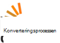

<properties
    pageTitle="Azure Media Services Community oversigt | Microsoft Azure"
    description="Communityside for denne Azure Media Services (AMS) i denne artikel beskrives forskellige måder, du kan hente opdateringer om AMS, se nye videoer og podcasts, stille spørgsmål og give feedback. "
    services="media-services"
    documentationCenter=""
    authors="juliako"
    manager="erikre"
    editor=""/>

<tags
    ms.service="media-services"
    ms.workload="media"
    ms.tgt_pltfrm="na"
    ms.devlang="dotnet"
    ms.topic="article"
    ms.date="09/26/2016"  
    ms.author="juliako"/>

# Azure Media Services Community  

Communityside for denne Azure Media Services (AMS) i denne artikel beskrives forskellige måder, du kan hente opdateringer om AMS, se nye videoer og podcasts, stille spørgsmål og give feedback.   

##Videoer og Podcasts

Afsnit|Højttaler|Dato
---|---|---
[Beskytte din medieindhold med DRM](https://azure.microsoft.com/documentation/videos/azurefridayprotectingyourmediacontentdrm/)|Mingfei Yang|02-19/2016
[Beskytte din medieindhold med AES-kryptering](https://azure.microsoft.com/documentation/videos/azure-media-services-protecting-your-media-content-with-aes-encryption/)|Mingfei Yang|2-19/2016
[Azure Media Services Developer undersøgelse](https://azure.microsoft.com/documentation/videos/build-2015-azure-media-services-developer-deep-dive/)|Mingfei Yang|04-27-2015
[Azure Media indekseringsprogram opretter automatisk afskrifter til dine medier](https://azure.microsoft.com/documentation/videos/azure-media-indexer-autoatically-creates-transcripts-for-your-media-with-adarsh-solanki/)|Adarsh Solanki|07-09-2015
[Microsoft Hyperlapse i Azure Media Services med Adarsh Solanki](https://azure.microsoft.com/documentation/videos/microsoft-hyperlapse-in-azure-media-services-with-adarsh-solanki/)|Adarsh Solanki|10-07-2015

##Give feedback og forslag

[AZURE.INCLUDE [media-services-user-voice-include](../../includes/media-services-user-voice-include.md)]

##Diskussion

###Twitter

Brug den [@MSFTAzureMedia](https://twitter.com/MSFTAzureMedia) twitter håndtag til at følge de AMS nyheder og opdateringer på Twitter. Du kan bruge den [@AzureSupport](https://twitter.com/azuresupport) twitter håndtag til at anmode om support på Twitter.  
 
### Online fora

Følgende forummerne kan bruges til at stille spørgsmål om aktuelle produkter og funktioner.

MSDN er i øjeblikket, AMS primære forum.

 

 

## Ringe til team

Azure Media Services primære mailadresse er: **mediaservices@microsoft.com**.

I følgende tabel vises mail funktion sub teams:

Funktion|Mail
---|---
Azure Media Analytics|amsanalytics@microsoft.com
Azure Media Player|ampinfo@microsoft.com 
Azure Media Explorer|amse@microsoft.com
Workflow Designer|mepd@microsoft.com
