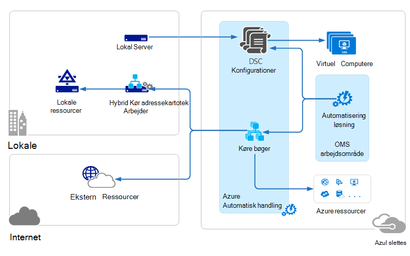

<properties 
   pageTitle="Handlinger Management pakke (OMS) arkitektur | Microsoft Azure"
   description="Microsoft Operations Management pakke (OMS) er Microsofts skybaseret IT management-løsning, der hjælper dig med at administrere og beskytte dine lokale og infrastruktur i skyen.  I denne artikel identificerer de forskellige tjenester, der er inkluderet i OMS og indeholder links til deres detaljerede indhold."
   services="operations-management-suite"
   documentationCenter=""
   authors="bwren"
   manager="jwhit"
   editor="tysonn" />
<tags 
   ms.service="operations-management-suite"
   ms.devlang="na"
   ms.topic="get-started-article"
   ms.tgt_pltfrm="na"
   ms.workload="infrastructure-services"
   ms.date="10/27/2016"
   ms.author="bwren" />

# OMS arkitektur

[Handlinger Management pakke (OMS)](https://azure.microsoft.com/documentation/services/operations-management-suite/) er en samling af skybaseret services til at administrere dine lokale og skybaserede miljøer.  I denne artikel beskrives de forskellige lokale og skyen komponenter i OMS og deres høj niveau cloud computing arkitektur.  Du kan se i dokumentationen til hver tjeneste for at få yderligere oplysninger.

## Log Analytics

Alle de data, der indsamles via [Log Analytics](https://azure.microsoft.com/documentation/services/log-analytics/) er gemt i lageret OMS som hostes i Azure.  Tilknyttede kilder generere data, der indsamles i OMS-lager.  Der findes tre typer tilknyttede kilder understøttes.

- En agent, der er installeret på en [Windows](../log-analytics/log-analytics-windows-agents.md) - eller [Linux](../log-analytics/log-analytics-linux-agents.md) computer sluttet direkte til OMS.
- Et System Center Operations Manager (SCOM) administration af gruppe [tilsluttet Log analyser](../log-analytics/log-analytics-om-agents.md) .  SCOM supportmedarbejdere fortsætte med at kommunikere med administration af servere som videresende begivenheder og ydelsesdata til Log Analytics.
- En [Azure-lager-konto](../log-analytics/log-analytics-azure-storage.md) , der indsamles [Azure diagnosticering](../cloud-services/cloud-services-dotnet-diagnostics.md) data fra en kollega rolle, web rolle eller virtuel maskine i Azure.

Datakilder definere de data, Log Analytics indsamler fra forbundne datakilder, herunder hændelseslogfiler og tællere i ydeevne.  Løsninger føje funktioner til OMS og kan nemt føjes til dit arbejdsområde fra [OMS løsningsgalleriet](../log-analytics/log-analytics-add-solutions.md).  Nogle løsninger kan kræve en direkte forbindelse til Log Analytics fra SCOM supportmedarbejdere mens andre kræver muligvis en ekstra agent skal være installeret.

Log Analytics har en webbaseret portal, som du kan bruge til at administrere OMS ressourcer, Tilføj og Konfigurer OMS løsninger, og få vist og analysere data i OMS-lager.

## Azure-automatisering

[Azure automatisering runbooks](http://azure.microsoft.com/documentation/services/automation) udføres i Azure skyen og få adgang til ressourcer, der findes i Azure i andre skytjenester, eller som er tilgængelige fra det offentlige Internet.  Du kan også angive lokale computere i dit lokale datacenter, ved hjælp af [Hybrid Runbook arbejder](../automation/automation-hybrid-runbook-worker.md) , så runbooks kan få adgang til lokale ressourcer.

[DTK konfigurationer](../automation/automation-dsc-overview.md) , der er gemt i Azure automatisering kan anvendes direkte til Azure virtuelle computere.  Andre fysiske og virtuelle maskiner kan anmode om konfigurationer fra Azure automatisering DTK hente serveren.

Azure automatisering har en OMS løsning, der viser statistik og links til Start portalen Azure for en hvilken som helst handlinger.

## Azure sikkerhedskopi

Beskyttede data i [Azure sikkerhedskopien](http://azure.microsoft.com/documentation/services/backup) er gemt i en ekstra samling, der er placeret i et bestemt geografisk område.  Dataene replikeres inden for samme region og afhængigt af typen samling, kan også replikeres til et andet område til yderligere redundans.

Azure sikkerhedskopi har tre grundlæggende scenarier.

- Windows-computer med Azure Backup agent.  Dette giver dig mulighed for at sikkerhedskopier af filer og mapper fra en hvilken som helst Windows server eller klient direkte til din Azure sikkerhedskopiering samling.  
- System Center Data Protection Manager (DPM) eller Server til Microsoft Azure sikkerhedskopiering. Dette kan du udnytte DPM eller Server til Microsoft Azure sikkerhedskopiering for at sikkerhedskopiere filer og mapper ud over arbejdsbelastninger som SQL og SharePoint til det lokale lager og derefter gentage til din Azure sikkerhedskopiering samling.
- Azure virtuelt udvidelser.  Dette giver dig mulighed at sikkerhedskopiere Azure virtuelle maskiner til din Azure sikkerhedskopiering samling.

Azure sikkerhedskopi med en OMS løsning, der viser statistik og links til Start portalen Azure for en hvilken som helst handlinger.

## Gendannelse af Azure websteder

[Gendannelse af Azure websteder](http://azure.microsoft.com/documentation/services/site-recovery) orchestrates gentagelse, failover og failback af virtuelle maskiner og fysiske servere. Replikeringsdata er udvekslet mellem Hyper-V hosts, VMware hypervisors og fysiske servere i primære og sekundære datacentre eller mellem datacenter og Azure-lager.  Gendannelse af websteder gemmer metadata i vaults, der er placeret i en bestemt geografisk Azure region. Ingen replikerede data er gemt af tjenesten gendannelse af websteder.

Azure gendannelse af websteder har tre grundlæggende gentagelse scenarier.

**Gentagelse af Hyper-V virtuelle maskiner**
- Hvis Hyper-V virtuelle maskiner administreres i VMM skyer, kan du gentage til et sekundært center eller til Azure-lager.  Azure-replikering er over en sikker Internetforbindelse.  Replikering til en sekundær datacenter er via LAN.
- Hvis Hyper-V virtuelle maskiner ikke administreres af VMM, kan du gentage til Azure lager.  Azure-replikering er over en sikker Internetforbindelse.
 
**Gentagelse af VMWare virtuelle maskiner**
- Du kan gentage VMware virtuelle maskiner, til en sekundær datacenter kører VMware eller til Azure-lager.  Azure-replikering kan opstå, via et websted til websted VPN eller Azure ExpressRoute eller via en sikker Internetforbindelse. Gentagelse til en sekundær datacenter opstår over InMage spejder datakanalen.
 
**Replikering af fysiske Windows og Linux-servere** 
- Du kan gentage fysiske servere, til en sekundær datacenter eller til Azure-lager. Azure-replikering kan opstå, via et websted til websted VPN eller Azure ExpressRoute eller via en sikker Internetforbindelse. Gentagelse til en sekundær datacenter opstår over InMage spejder datakanalen.  Azure gendannelse af websteder har en OMS løsning, der viser nogle statistik, men du skal bruge Azure portal for en hvilken som helst handlinger.

## Næste trin

- Få mere at vide om [Log analyser](http://azure.microsoft.com/documentation/services/log-analytics).
- Få mere at vide om [Azure automatisering](https://azure.microsoft.com/documentation/services/automation).
- Få mere at vide om [Azure sikkerhedskopi](http://azure.microsoft.com/documentation/services/backup).
- Få mere at vide om [gendannelse af Azure websteder](http://azure.microsoft.com/documentation/services/site-recovery).
