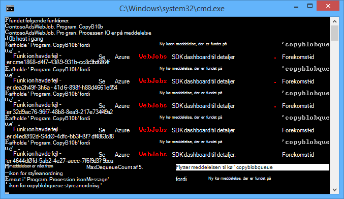
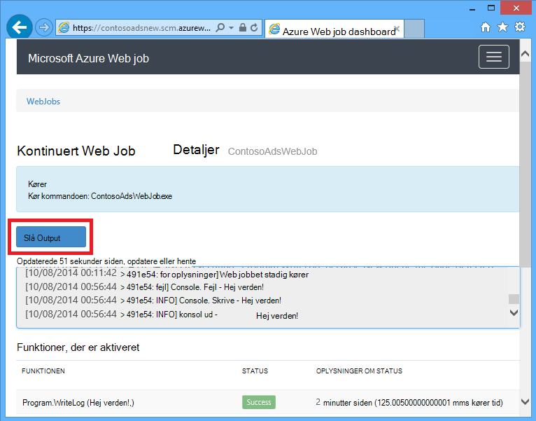
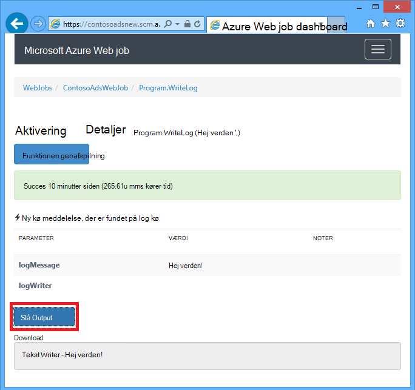
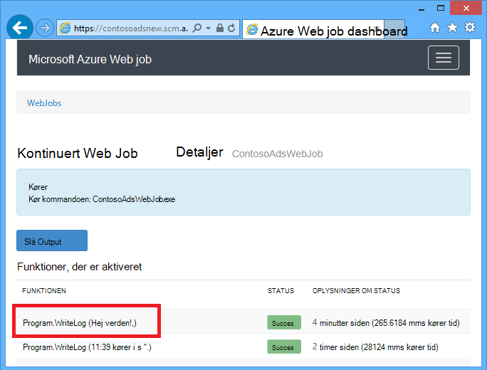
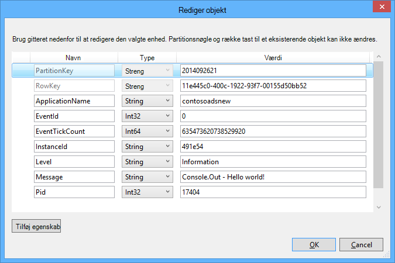
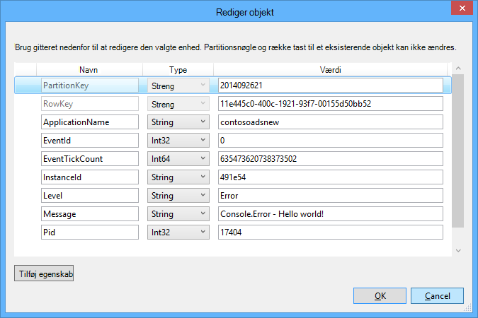

<properties
    pageTitle="Introduktion til kø lager og Visual Studio forbundne tjenester (WebJob projekter) | Microsoft Azure"
    description="Sådan Introduktion til brug af Azure kø lagerplads i et projekt, WebJob, når forbindelsen til en lagerplads konto ved hjælp af Visual Studio forbundne tjenester."
    services="storage"
    documentationCenter=""
    authors="TomArcher"
    manager="douge"
    editor=""/>

<tags
    ms.service="storage"
    ms.workload="web"
    ms.tgt_pltfrm="vs-getting-started"
    ms.devlang="na"
    ms.topic="article"
    ms.date="07/18/2016"
    ms.author="tarcher"/>

# Introduktion til Azure kø lager og Visual Studio forbundne tjenester (WebJob projekter)

[AZURE.INCLUDE [storage-try-azure-tools-queues](../../includes/storage-try-azure-tools-queues.md)]

## Oversigt

Denne artikel beskrives, hvordan Introduktion til brug af Azure kø lagerplads i et projekt i Visual Studio Azure WebJob, når du har oprettet eller refererer til en Azure-lager-konto ved hjælp af dialogboksen Visual Studio **Tilføje forbundne tjenester** . Når du tilføjer en lagerplads konto til en WebJob projekt ved hjælp af dialogboksen Visual Studio **Tilføje forbundne tjenester** , de relevante Azure-lager NuGet-pakker er installeret, de relevante .NET referencer er føjet til projektet eller strenge for lagerplads kontoen er blevet opdateret i App.config-filen.  

Denne artikel indeholder C# kodeeksempler, der viser, hvordan du bruger versionen af Azure WebJobs SDK 1.x til Azure kø lagerplads-tjenesten.

Azure kø lagerplads er en tjeneste til lagring af stort antal meddelelser, der kan åbnes fra et vilkårligt sted i verden via godkendte opkald ved hjælp af HTTP eller HTTPS. En enkelt kø besked kan bestå af op til 64 KB i størrelse, og en kø kan indeholde millioner af meddelelser, op til den samlede kapacitet grænse for en lagerplads konto. Se [Introduktion til Azure kø lager ved hjælp af .NET](storage-dotnet-how-to-use-queues.md) kan finde flere oplysninger. Du kan finde flere oplysninger om ASP.NET, [ASP.NET](http://www.asp.net).

## Hvordan du kan udløse en funktion, når der modtages en meddelelse i kø

Hvis du vil skrive en funktion, der kalder WebJobs SDK, når der modtages en meddelelse i køen, bruge attributten **QueueTrigger** . Attributkonstruktøren tager en strengparameter, der angiver navnet på den kø til afstemning. Se, hvordan du kø navnet dynamisk, skal du kontrollere, [hvordan du kan angive indstillinger for søgekonfiguration](#how-to-set-configuration-options).

### Streng kø meddelelser

I eksemplet nedenfor indeholder køen meddelelsen streng, så **QueueTrigger** anvendes på en strengparameter med navnet **logMessage** , som indeholder indholdet af meddelelsen kø. Den funktionen [skriver en log meddelelse til Dashboard](#how-to-write-logs).

        public static void ProcessQueueMessage([QueueTrigger("logqueue")] string logMessage, TextWriter logger)
        {
            logger.WriteLine(logMessage);
        }

Ud over **streng**, kan parameteren være en bytematrix, et **CloudQueueMessage** objekt eller en POCO, som du definerer.

### POCO [(almindelig gamle CLR-objekt](http://en.wikipedia.org/wiki/Plain_Old_CLR_Object)) kø meddelelser

I eksemplet nedenfor indeholder kø meddelelsen JSON for et **BlobInformation** objekt, der indeholder en **BlobName** egenskab. SDK deserializes automatisk objektet.

        public static void WriteLogPOCO([QueueTrigger("logqueue")] BlobInformation blobInfo, TextWriter logger)
        {
            logger.WriteLine("Queue message refers to blob: " + blobInfo.BlobName);
        }

SDK bruger [Newtonsoft.Json NuGet pakke](http://www.nuget.org/packages/Newtonsoft.Json) sekventielt og deserialisere meddelelser. Hvis du opretter beskeder i kø i et program, der ikke bruger WebJobs SDK, kan du skrive programkode som i følgende eksempel til at oprette en meddelelse om POCO kø, SDK kan fortolkes.

        BlobInformation blobInfo = new BlobInformation() { BlobName = "log.txt" };
        var queueMessage = new CloudQueueMessage(JsonConvert.SerializeObject(blobInfo));
        logQueue.AddMessage(queueMessage);

### Asynkron funktioner

Den følgende asynkron funktionen [skriver en logfil til Dashboard](#how-to-write-logs).

        public async static Task ProcessQueueMessageAsync([QueueTrigger("logqueue")] string logMessage, TextWriter logger)
        {
            await logger.WriteLineAsync(logMessage);
        }

Asynkron funktioner kan tage et [annulleringen token](http://www.asp.net/mvc/overview/performance/using-asynchronous-methods-in-aspnet-mvc-4#CancelToken), som vist i følgende eksempel som kopierer en blob. (Se afsnittet [BLOB](#how-to-read-and-write-blobs-and-tables-while-processing-a-queue-message) for en forklaring på pladsholderen **queueTrigger** ).

        public async static Task ProcessQueueMessageAsyncCancellationToken(
            [QueueTrigger("blobcopyqueue")] string blobName,
            [Blob("textblobs/{queueTrigger}",FileAccess.Read)] Stream blobInput,
            [Blob("textblobs/{queueTrigger}-new",FileAccess.Write)] Stream blobOutput,
            CancellationToken token)
        {
            await blobInput.CopyToAsync(blobOutput, 4096, token);
        }

## Typer af attributten QueueTrigger fungerer med

Du kan bruge **QueueTrigger** med følgende typer:

* **streng**
* Typen POCO serialiseret som JSON
* **byte]**
* **CloudQueueMessage**

## Afstemning algoritme

SDK implementerer et tilfældigt eksponentiel tilbage fra algoritme for at reducere effekten af idle-kø forespørge på lagerplads transaktionsomkostninger.  Når der findes en meddelelse, SDK venter to sekunder og derefter kontrollerer, om en anden meddelelse Når der er fundet nogen meddelelse venter om fire sekunder, før du prøver igen. Når du efterfølgende mislykkede forsøg på at får en meddelelse om kø, fortsat ventetiden øge, indtil den når den maksimale ventetid, som standard er et minut. [Den maksimale ventetiden kan konfigureres](#how-to-set-configuration-options).

## Flere forekomster

Hvis din online kører på flere forekomster, en fortløbende WebJobs kører på hver enkelt computer, og hver computer skal vente på udløsere og forsøger at køre funktioner. I visse scenarier med det kan føre til nogle funktioner, der er to gange behandling af de samme data, så funktioner skal være idempotent (skrevet så ringe dem flere gange med de samme input data ikke medføre dublerede resultater).  

## Parallel udførelse

Hvis du har flere funktioner, der lytter på forskellige køer, vil SDK kalde dem parallelt når meddelelser er modtaget samtidigt.

Den samme er sand, når der modtages flere meddelelser til en enkelt kø. Som standard i SDK får en mængde beskeder i 16 kø ad gangen og udfører den funktion, der behandler dem parallelt. [Batchstørrelsen kan konfigureres](#how-to-set-configuration-options). Når det tal, behandles lukkes til halvdelen af batchstørrelsen, SDK får en anden batchen og starter behandle disse meddelelser. Derfor er det maksimale antal samtidige meddelelser behandles i funktionen én halvanden gange batchstørrelsen. Denne begrænsning gælder separat for hver funktion, der har en **QueueTrigger** attribut. Hvis du ikke vil parallel udførelse for meddelelser, der har modtaget på én kø, kan du angive batchstørrelsen til 1.

## Få kø eller kø meddelelse metadata

Du kan få følgende meddelelsesegenskaber ved tilføjelse af parametre i metode signatur:

* **DateTimeOffset** expirationTime
* **DateTimeOffset** insertionTime
* **DateTimeOffset** nextVisibleTime
* **streng** queueTrigger (indeholder tekst i en meddelelse)
* **streng** -id
* **streng** popReceipt
* **int** dequeueCount

Hvis du vil arbejde direkte med Azure opbevaring API, kan du også tilføje en parameter for **CloudStorageAccount** .

I følgende eksempel skriver alle disse metadata til en logfil med oplysninger om programmet. I eksemplet indeholder både logMessage og queueTrigger indholdet af meddelelsen kø.

        public static void WriteLog([QueueTrigger("logqueue")] string logMessage,
            DateTimeOffset expirationTime,
            DateTimeOffset insertionTime,
            DateTimeOffset nextVisibleTime,
            string id,
            string popReceipt,
            int dequeueCount,
            string queueTrigger,
            CloudStorageAccount cloudStorageAccount,
            TextWriter logger)
        {
            logger.WriteLine(
                "logMessage={0}\n" +
            "expirationTime={1}\ninsertionTime={2}\n" +
                "nextVisibleTime={3}\n" +
                "id={4}\npopReceipt={5}\ndequeueCount={6}\n" +
                "queue endpoint={7} queueTrigger={8}",
                logMessage, expirationTime,
                insertionTime,
                nextVisibleTime, id,
                popReceipt, dequeueCount,
                cloudStorageAccount.QueueEndpoint,
                queueTrigger);
        }

Her er en stikprøve logfil, der er skrevet af eksempelkoden:

        logMessage=Hello world!
        expirationTime=10/14/2014 10:31:04 PM +00:00
        insertionTime=10/7/2014 10:31:04 PM +00:00
        nextVisibleTime=10/7/2014 10:41:23 PM +00:00
        id=262e49cd-26d3-4303-ae88-33baf8796d91
        popReceipt=AgAAAAMAAAAAAAAAfc9H0n/izwE=
        dequeueCount=1
        queue endpoint=https://contosoads.queue.core.windows.net/
        queueTrigger=Hello world!

## Lukning

En funktion, der kører i et sammenhængende WebJob kan acceptere en parameter, **CancellationToken** som gør det muligt for operativsystemet til at give funktionen besked, når WebJob er ved at blive afsluttet. Du kan bruge denne meddelelse for at sikre, at funktionen ikke afslutte uventet på en måde, der bevarer dataene i en ustabil tilstand.

I følgende eksempel viser, hvordan du søger efter forestående WebJob afslutning i en funktion.

    public static void GracefulShutdownDemo(
                [QueueTrigger("inputqueue")] string inputText,
                TextWriter logger,
                CancellationToken token)
    {
        for (int i = 0; i < 100; i++)
        {
            if (token.IsCancellationRequested)
            {
                logger.WriteLine("Function was cancelled at iteration {0}", i);
                break;
            }
            Thread.Sleep(1000);
            logger.WriteLine("Normal processing for queue message={0}", inputText);
        }
    }

**Note:** Dashboardet vises muligvis ikke korrekt, status og output af funktioner, der har lukket.

Du kan finde flere oplysninger [WebJobs lukning](http://blog.amitapple.com/post/2014/05/webjobs-graceful-shutdown/#.VCt1GXl0wpR).   

## Sådan oprettes en kø meddelelse under behandling af en kø meddelelse

Du kan skrive en funktion, der opretter en ny meddelelse i køen ved at bruge attributten **kø** . Du overfører i kø navn som en streng som **QueueTrigger**, eller du kan [angive navnet på kø dynamisk](#how-to-set-configuration-options).

### Streng kø meddelelser

Følgende eksempel på ikke-asynkron kode opretter en ny meddelelse i køen i køen med navnet "outputqueue" med det samme indhold som den kø meddelelse, der er modtaget i køen med navnet "inputqueue". (Brug af funktioner til asynkron **IAsyncCollector<T> ** som vist senere i dette afsnit.)

        public static void CreateQueueMessage(
            [QueueTrigger("inputqueue")] string queueMessage,
            [Queue("outputqueue")] out string outputQueueMessage )
        {
            outputQueueMessage = queueMessage;
        }

### POCO [(almindelig gamle CLR-objekt](http://en.wikipedia.org/wiki/Plain_Old_CLR_Object)) kø meddelelser

Hvis du vil oprette en kø meddelelse, der indeholder en POCO i stedet for en streng, du overføre typen POCO som en output-parameter til attributkonstruktør **kø** .

        public static void CreateQueueMessage(
            [QueueTrigger("inputqueue")] BlobInformation blobInfoInput,
            [Queue("outputqueue")] out BlobInformation blobInfoOutput )
        {
            blobInfoOutput = blobInfoInput;
        }

SDK serializes automatisk JSON objektet. Meddelelsen kø oprettes altid, selvom objektet er null.

### Oprette flere meddelelser eller i asynkron funktioner

For at oprette flere meddelelser, skal du gøre parametertypen for output køen **ICollector<T> ** eller **IAsyncCollector<T>**, som vist i følgende eksempel.

        public static void CreateQueueMessages(
            [QueueTrigger("inputqueue")] string queueMessage,
            [Queue("outputqueue")] ICollector<string> outputQueueMessage,
            TextWriter logger)
        {
            logger.WriteLine("Creating 2 messages in outputqueue");
            outputQueueMessage.Add(queueMessage + "1");
            outputQueueMessage.Add(queueMessage + "2");
        }

Alle de meddelelser, kø oprettes med det samme, når der kaldes metoden **Add** .

### Typer, attributten kø arbejder sammen med

Du kan bruge attributten **kø** på følgende parameter:

* **ud streng** (opretter kø meddelelse, hvis parameterværdi er ikke-null når funktionen stopper)
* **ud byte]** (fungerer som **streng**)
* **af CloudQueueMessage** (fungerer som **streng**)
* **af POCO** (en serialiserbar type, opretter en meddelelse med en null-objekt Hvis paramter er null-værdier, når funktionen stopper)
* **ICollector**
* **IAsyncCollector**
* **CloudQueue** (for at oprette meddelelser manuelt med Azure Storage API direkte)

### Brug WebJobs SDK attributter i brødteksten i en funktion

Hvis du vil udføre nogle arbejde i din funktionen inden du bruger en WebJobs SDK attribut som **kø**, **Blob**eller **tabel**, kan du bruge grænsefladen **IBinder** .

I følgende eksempel tager en input kø meddelelse og opretter en ny meddelelse med det samme indhold i en output kø. Output kø navnet er angivet af kode i brødteksten i funktionen.

        public static void CreateQueueMessage(
            [QueueTrigger("inputqueue")] string queueMessage,
            IBinder binder)
        {
            string outputQueueName = "outputqueue" + DateTime.Now.Month.ToString();
            QueueAttribute queueAttribute = new QueueAttribute(outputQueueName);
            CloudQueue outputQueue = binder.Bind<CloudQueue>(queueAttribute);
            outputQueue.AddMessage(new CloudQueueMessage(queueMessage));
        }

Grænsefladen **IBinder** kan også bruges med attributterne, **tabel** og **Blob** .

## Hvordan du kan læse og skrive BLOB og tabeller under behandling af en kø meddelelse

Attributterne **Blob** og **tabel** gør det muligt at læse og skrive BLOB og tabeller. Eksemplerne i dette afsnit gælder for BLOB. Se, [hvordan du bruger Azure blob storage med WebJobs SDK](../app-service-web/websites-dotnet-webjobs-sdk-storage-blobs-how-to.md)kodeeksempler, der viser, hvordan du kan udløse processer, når BLOB oprettes eller opdateres, og for kodeeksempler, læse og skrive tabeller, se, [hvordan du bruger Azure-tabellager med WebJobs SDK](../app-service-web/websites-dotnet-webjobs-sdk-storage-tables-how-to.md).

### En streng, der udløser blob handlinger beskeder i kø

For en kø meddelelse, der indeholder en streng, er **queueTrigger** en pladsholder, du kan bruge i attributten **Blob** **blobPath** parameter, der indeholder indholdet af meddelelsen.

I følgende eksempel bruges **Bækkens** objekter at læse og skrive BLOB. Meddelelsen kø er navnet på en blob, der er placeret i objektbeholderen textblobs. En kopi af blob med "-Ny" føjet til navnet oprettes i samme beholder.

        public static void ProcessQueueMessage(
            [QueueTrigger("blobcopyqueue")] string blobName,
            [Blob("textblobs/{queueTrigger}",FileAccess.Read)] Stream blobInput,
            [Blob("textblobs/{queueTrigger}-new",FileAccess.Write)] Stream blobOutput)
        {
            blobInput.CopyTo(blobOutput, 4096);
        }

Attributkonstruktøren **Blob** kræver en **blobPath** parameter, der angiver objektbeholder og blob navnet. Se, [hvordan du bruger Azure blob-lager med WebJobs SDK](../app-service-web/websites-dotnet-webjobs-sdk-storage-blobs-how-to.md)kan finde flere oplysninger om denne pladsholder.

Når attributten dekorerer en **Stream** -objekt, angiver en anden parametre parameter tilstanden **FileAccess** som læst, skriveadgang eller læse-og skriveadgang.

I følgende eksempel bruges et **CloudBlockBlob** objekt til at slette en blob. Meddelelsen kø er navnet på blob.

        public static void DeleteBlob(
            [QueueTrigger("deleteblobqueue")] string blobName,
            [Blob("textblobs/{queueTrigger}")] CloudBlockBlob blobToDelete)
        {
            blobToDelete.Delete();
        }

### POCO [(almindelig gamle CLR-objekt](http://en.wikipedia.org/wiki/Plain_Old_CLR_Object)) kø meddelelser

For en POCO, der er gemt som JSON i kø meddelelse, kan du bruge pladsholdere, der navn egenskaberne for objektet i attributten **kø** **blobPath** parameter. Du kan også bruge kø metadata egenskabsnavne som pladsholdere. Se [få kø eller kø meddelelse metadata](#get-queue-or-queue-message-metadata).

I følgende eksempel kopierer en blob til en ny blob med et andet filtypenavn. Kø meddelelsen er et **BlobInformation** objekt, der indeholder **BlobName** og **BlobNameWithoutExtension** egenskaber. Egenskabsnavne bruges som pladsholdere i blob stien for attributterne, **Blob** .

        public static void CopyBlobPOCO(
            [QueueTrigger("copyblobqueue")] BlobInformation blobInfo,
            [Blob("textblobs/{BlobName}", FileAccess.Read)] Stream blobInput,
            [Blob("textblobs/{BlobNameWithoutExtension}.txt", FileAccess.Write)] Stream blobOutput)
        {
            blobInput.CopyTo(blobOutput, 4096);
        }

SDK bruger [Newtonsoft.Json NuGet pakke](http://www.nuget.org/packages/Newtonsoft.Json) sekventielt og deserialisere meddelelser. Hvis du opretter beskeder i kø i et program, der ikke bruger WebJobs SDK, kan du skrive programkode som i følgende eksempel til at oprette en meddelelse om POCO kø, SDK kan fortolkes.

        BlobInformation blobInfo = new BlobInformation() { BlobName = "boot.log", BlobNameWithoutExtension = "boot" };
        var queueMessage = new CloudQueueMessage(JsonConvert.SerializeObject(blobInfo));
        logQueue.AddMessage(queueMessage);

Hvis du vil udføre nogle arbejde i din funktion, før du binder en blob til et objekt, kan du bruge egenskaben i brødteksten i funktionen, som vist i [Brug WebJobs SDK attributter i brødteksten i en funktion](#use-webjobs-sdk-attributes-in-the-body-of-a-function).

###Du kan bruge Blob attributten med typer

Attributten **Blob** kan bruges med følgende typer:

* **Værdistrøm** (Læs eller skriv, angivet ved hjælp af parameteren FileAccess parametre)
* **TextReader**
* **TextWriter**
* **streng** (Læs)
* **ud streng** (skrive, opretter en blob kun, hvis Strengparameteren er ikke-null, når funktionen returnerer)
* POCO (læsning)
* af POCO (skrive; altid opretter en blob, opretter som null-objekt, hvis POCO parameter er null, når funktionen returnerer)
* **CloudBlobStream** (Skriv)
* **ICloudBlob** (Læs eller skriv)
* **CloudBlockBlob** (Læs eller skriv)
* **CloudPageBlob** (Læs eller skriv)

##Sådan håndteres uautoriserede meddelelser

Meddelelser, hvis indhold medfører, at en funktion til at mislykkes kaldes *uautoriserede meddelelser*. Når funktionen ikke, slettes ikke kø meddelelsen, og til sidst er valgte igen, forårsager cyklussen skal gentages. SDK automatisk kan afbryde cyklussen efter et begrænset antal gentagelser, eller du kan gøre det manuelt.

### Automatisk behandling af meddelelser

SDK kalder en funktion op til 5 gange til at behandle en kø meddelelse. Hvis det femte prøve mislykkes, flyttes meddelelsen til en en kø. Du kan se, hvordan du konfigurere det maksimale antal forsøg på [at konfigurationsindstillinger](#how-to-set-configuration-options).

En køen hedder *{originalqueuename}*-en. Du kan skrive, der er brug for en funktion til at behandle meddelelser fra en køen ved logføring dem eller sende en meddelelse, der manuel opmærksomhed.

I følgende eksempel **CopyBlob** mislykkes funktionen, når meddelelsen kø indeholder navnet på en blob, der ikke findes. Når det sker, flyttes meddelelsen fra køen copyblobqueue til copyblobqueue forfalskning køen. **ProcessPoisonMessage** derefter logfører en meddelelse.

        public static void CopyBlob(
            [QueueTrigger("copyblobqueue")] string blobName,
            [Blob("textblobs/{queueTrigger}", FileAccess.Read)] Stream blobInput,
            [Blob("textblobs/{queueTrigger}-new", FileAccess.Write)] Stream blobOutput)
        {
            blobInput.CopyTo(blobOutput, 4096);
        }

        public static void ProcessPoisonMessage(
            [QueueTrigger("copyblobqueue-poison")] string blobName, TextWriter logger)
        {
            logger.WriteLine("Failed to copy blob, name=" + blobName);
        }

Følgende illustration viser console output fra disse funktioner, når en behandling af meddelelser behandles.

### Manuel behandling af meddelelser

Du kan få antallet gange en meddelelse er blevet valgte til behandling ved at tilføje en **hel** parameter med navnet **dequeueCount** til din funktion. Du kan derefter kontrollere dequeue antallet i funktionen kode og udføre din egen behandling af meddelelser for håndtering af når tallet er større end en grænseværdi, som vist i følgende eksempel.

        public static void CopyBlob(
            [QueueTrigger("copyblobqueue")] string blobName, int dequeueCount,
            [Blob("textblobs/{queueTrigger}", FileAccess.Read)] Stream blobInput,
            [Blob("textblobs/{queueTrigger}-new", FileAccess.Write)] Stream blobOutput,
            TextWriter logger)
        {
            if (dequeueCount > 3)
            {
                logger.WriteLine("Failed to copy blob, name=" + blobName);
            }
            else
            {
            blobInput.CopyTo(blobOutput, 4096);
            }
        }

## Sådan angives konfigurationsindstillinger

Du kan bruge typen **JobHostConfiguration** til at angive følgende indstillinger:

* Angive SDK forbindelse strengene i kode.
* Konfigurere **QueueTrigger** indstillinger som maksimum annullering i kø Tæl.
* Få kø navne fra konfiguration.

###Angive SDK forbindelsesstrenge i kode

Angive SDK forbindelse strengene i kode giver dig mulighed at bruge dit eget forbindelse streng navne i den åbne fil eller miljøvariabler, som vist i følgende eksempel.

        static void Main(string[] args)
        {
            var _storageConn = ConfigurationManager
                .ConnectionStrings["MyStorageConnection"].ConnectionString;

            var _dashboardConn = ConfigurationManager
                .ConnectionStrings["MyDashboardConnection"].ConnectionString;

            var _serviceBusConn = ConfigurationManager
                .ConnectionStrings["MyServiceBusConnection"].ConnectionString;

            JobHostConfiguration config = new JobHostConfiguration();
            config.StorageConnectionString = _storageConn;
            config.DashboardConnectionString = _dashboardConn;
            config.ServiceBusConnectionString = _serviceBusConn;
            JobHost host = new JobHost(config);
            host.RunAndBlock();
        }

### Konfigurere indstillinger for QueueTrigger

Du kan konfigurere følgende indstillinger, der gælder for kø meddelelsesbehandling:

- Det maksimale antal kø meddelelser, der er valgte op samtidigt skal udføres parallelt (standard er 16).
- Det maksimale antal forsøg, før en kø meddelelse er sendt til en en kø (standard er 5).
- Maksimalt Ventetid før forespørge igen, når en kø er tom (standard er 1 minut).

I følgende eksempel viser, hvordan du konfigurerer disse indstillinger:

        static void Main(string[] args)
        {
            JobHostConfiguration config = new JobHostConfiguration();
            config.Queues.BatchSize = 8;
            config.Queues.MaxDequeueCount = 4;
            config.Queues.MaxPollingInterval = TimeSpan.FromSeconds(15);
            JobHost host = new JobHost(config);
            host.RunAndBlock();
        }

### Angive værdier for WebJobs SDK parametre parametre i kode

Nogle gange du vil angive et navn i kø, et blob navn eller en objektbeholder, eller en tabel i kode i stedet for at fastlægge det navnet. Du vil muligvis angive kø navn til **QueueTrigger** i en konfiguration fil eller miljø variabel.

Du kan gøre det ved overførsel af et **NameResolver** objekt til typen **JobHostConfiguration** . Du medtage speciel pladsholdere omgivet af procenttegn (%) i WebJobs SDK attribut parametre parametre, og din **NameResolver** kode angiver de faktiske værdier, der bruges i stedet for disse pladsholdere.

Lad os antage, at du vil bruge en kø med navnet logqueuetest i testmiljøet og en navngivet logqueueprod fremstilling. I stedet for et faste kø navn vil du angive navnet på en post i samlingen **appSettings** , som kan have faktisk kø navnet. Hvis nøglen **appSettings** er logqueue, kan funktionen se ud som i følgende eksempel.

        public static void WriteLog([QueueTrigger("%logqueue%")] string logMessage)
        {
            Console.WriteLine(logMessage);
        }

Klasse **NameResolver** kan derefter få kø navnet fra **appSettings** , som vist i følgende eksempel:

        public class QueueNameResolver : INameResolver
        {
            public string Resolve(string name)
            {
                return ConfigurationManager.AppSettings[name].ToString();
            }
        }

Du kan overføre klassen **NameResolver** i til objektet **JobHost** , som vist i følgende eksempel.

        static void Main(string[] args)
        {
            JobHostConfiguration config = new JobHostConfiguration();
            config.NameResolver = new QueueNameResolver();
            JobHost host = new JobHost(config);
            host.RunAndBlock();
        }

**Note:** Kø tabel og blob navne løses, hver gang kaldes en funktion, men blob objektbeholder navne løses kun, når programmet starter. Du kan ikke ændre blob objektbeholder navn, mens jobbet kører.

## Hvordan du manuelt udløse en funktion

Hvis du vil udløse en funktion manuelt, du bruge metoden **opkald** eller **CallAsync** på objektet **JobHost** og attributten **NoAutomaticTrigger** på funktionen, som vist i følgende eksempel.

        public class Program
        {
            static void Main(string[] args)
            {
                JobHost host = new JobHost();
                host.Call(typeof(Program).GetMethod("CreateQueueMessage"), new { value = "Hello world!" });
            }

            [NoAutomaticTrigger]
            public static void CreateQueueMessage(
                TextWriter logger,
                string value,
                [Queue("outputqueue")] out string message)
            {
                message = value;
                logger.WriteLine("Creating queue message: ", message);
            }
        }

## Sådan skrives logfiler

Dashboard viser logfiler i to forskellige steder: på siden til WebJob, og på siden til en bestemt WebJob Start.

Output fra Console metoder, du ringe til en funktion eller metoden **Main()** vises på siden Dashboard for WebJob, ikke på siden for aktivering af en bestemt metode. Output fra objektet TextWriter, som du angiver en parameter i Metodesignaturen vises på siden Dashboard for aktivering af en metode.

Console output kan sammenkædes med aktivering af en bestemt metode, fordi konsollen er single-threaded, mens mange jobfunktioner kan køre ad gangen. Det er grunden SDK indeholder hver funktion aktivering med sin egen entydige log writer objekt.

Du kan skrive [logfiler for programmer sporing](web-sites-dotnet-troubleshoot-visual-studio.md#logsoverview)ved brug af **Console.Out** (der oprettes logfiler, der er markeret som oplysninger) og **Console.Error** (der oprettes logfiler, der er markeret som fejl). Et alternativ er at bruge [sporing eller TraceSource](http://blogs.msdn.com/b/mcsuksoldev/archive/2014/09/04/adding-trace-to-azure-web-sites-and-web-jobs.aspx), som indeholder detaljeret, advarsler og kritisk niveauer ud over oplysninger og fejl. Logfiler for programmer sporing vises i web app logfiler, Azure tabeller eller Azure BLOB afhængigt af hvordan du konfigurerer din Azure online. Som det er sandt om alle Console output, vises loggene seneste 100 program også på siden Dashboard for WebJob, ikke på siden til en funktion aktivering.

Console output vises i dashboardet kun, hvis programmet kører i en Azure WebJob ikke, hvis programmet kører lokalt eller i nogle andre miljø.

Du kan deaktivere logføring ved at angive forbindelsesstrengen Dashboard til null. Se, [hvordan du angive konfigurationsindstillinger](#how-to-set-configuration-options)kan finde flere oplysninger.

I følgende eksempel viser kan skrive logge på flere måder:

        public static void WriteLog(
            [QueueTrigger("logqueue")] string logMessage,
            TextWriter logger)
        {
            Console.WriteLine("Console.Write - " + logMessage);
            Console.Out.WriteLine("Console.Out - " + logMessage);
            Console.Error.WriteLine("Console.Error - " + logMessage);
            logger.WriteLine("TextWriter - " + logMessage);
        }

I dashboardet WebJobs SDK vises output fra objektet **TextWriter** , når du gå til siden for en bestemt funktion aktivering og vælge **Slå Output**:

I dashboardet WebJobs SDK output de seneste 100 linjer i Console Vis op, når du gå til siden til WebJob (ikke for funktionen aktiveringen) og vælger **Til/fra Output**.

I en sammenhængende WebJob vises programmet logfiler i/data/job/fortløbende /*{webjobname}*/job_log.txt i web app typen af filsystem.

        [09/26/2014 21:01:13 > 491e54: INFO] Console.Write - Hello world!
        [09/26/2014 21:01:13 > 491e54: ERR ] Console.Error - Hello world!
        [09/26/2014 21:01:13 > 491e54: INFO] Console.Out - Hello world!

I en Azure blob programmet logfiler ser sådan ud: 2014-09-26T21:01:13,Information,contosoadsnew,491e54,635473620738373502,0,17404,17,Console.Write - Hej verden!, 2014-09-26T21:01:13,Error,contosoadsnew,491e54,635473620738373502,0,17404,19,Console.Error - Hej verden!, 2014-09-26T21:01:13,Information,contosoadsnew,491e54,635473620738529920,0,17404,17,Console.Out - Hej verden!,

Og i en Azure-tabel loggene **Console.Out** og **Console.Error** ser sådan ud:

##Næste trin

I denne artikel har leveret kodeeksempler, der viser, hvordan du håndterer almindelige scenarier, hvor arbejde med Azure køer. Du kan finde flere oplysninger om, hvordan du bruger Azure WebJobs og WebJobs SDK [Azure WebJobs dokumentationsressourcer](http://go.microsoft.com/fwlink/?linkid=390226).
