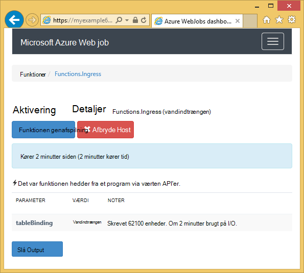
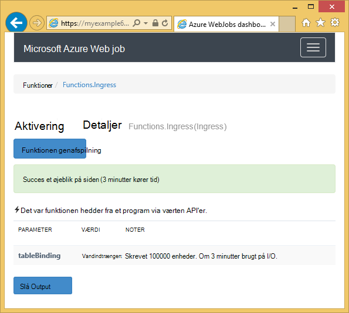

<properties
    pageTitle="Introduktion til Azure-lager og Visual Studio forbundne tjenester (WebJob projekter)"
    description="Sådan Introduktion til brug af Azure Table storage i et Azure WebJobs projekt i Visual Studio, når forbindelsen til en lagerplads konto ved hjælp af Visual Studio forbundne tjenester"
    services="storage"
    documentationCenter=""
    authors="TomArcher"
    manager="douge"
    editor=""/>

<tags
    ms.service="storage"
    ms.workload="web"
    ms.tgt_pltfrm="vs-getting-started"
    ms.devlang="na"
    ms.topic="article"
    ms.date="07/18/2016"
    ms.author="tarcher"/>

# Introduktion til Azure lagerplads (Azure WebJob projekter)

[AZURE.INCLUDE [storage-try-azure-tools-tables](../../includes/storage-try-azure-tools-tables.md)]

## Oversigt

Denne artikel indeholder C# kodeeksempler, der viser viser, hvordan du bruger versionen af Azure WebJobs SDK 1.x med tjenesten Azure table storage. Eksemplerne i brug [WebJobs SDK](../app-service-web/websites-dotnet-webjobs-sdk.md) version 1.x.

Azure-tabel-lagringstjeneste gør det muligt at gemme store mængder strukturerede data. Tjenesten er en NoSQL datastore, der accepterer godkendte opkald fra i og uden for Azure skyen. Azure tabeller er ideel til lagring af strukturerede, ikke-relationelle data.  Se [Introduktion til Azure Table storage ved hjælp af .NET](storage-dotnet-how-to-use-tables.md#create-a-table) kan finde flere oplysninger.

Nogle af kodestykker Vis attributten **tabel** , der bruges i funktioner, der kaldes manuelt det vil sige, ikke ved hjælp af udløser attributter.

## Hvordan du kan føje objekter til en tabel

Hvis du vil føje objekter til en tabel, skal du bruge attributten **tabel** med en **ICollector<T> ** eller **IAsyncCollector<T> ** parameter, hvor **T** angiver skemaet for de enheder, du vil tilføje. Attributkonstruktøren tager en strengparameter, der angiver navnet på tabellen.

Følgende eksempel-kode føjer **Person** enheder til en tabel med navnet *vandindtrængen*.

        [NoAutomaticTrigger]
        public static void IngressDemo(
            [Table("Ingress")] ICollector<Person> tableBinding)
        {
            for (int i = 0; i < 100000; i++)
            {
                tableBinding.Add(
                    new Person() {
                        PartitionKey = "Test",
                        RowKey = i.ToString(),
                        Name = "Name" }
                    );
            }
        }

Typisk den type, du bruger med **ICollector** stammer fra **TableEntity** eller implementerer **ITableEntity**, men det har ikke til. En af følgende **Person** klasser arbejde med den kode, der vises i den foregående **vandindtrængen** metode.

        public class Person : TableEntity
        {
            public string Name { get; set; }
        }

        public class Person
        {
            public string PartitionKey { get; set; }
            public string RowKey { get; set; }
            public string Name { get; set; }
        }

Hvis du vil arbejde direkte med Azure opbevaring API, kan du tilføje en **CloudStorageAccount** -parameter til Metodesignaturen.

## Overvågning i realtid

Da data vandindtrængen funktioner behandle ofte store datamængder, indeholder dashboardet WebJobs SDK overvågning realtidsdata. Sektionen **Aktivering Log** fortæller dig, hvis funktionen stadig er aktiv.

**Aktivering** oplysningssiden rapporter funktionens status (antal enheder, der er skrevet) mens den kører og giver dig mulighed for at afbryde den.

Når funktionen afsluttes, rapporterer **Aktivering** oplysningssiden antallet af rækker, der skrives.

## Hvordan du kan læse flere enheder fra en tabel

Hvis du vil læse en tabel, bruge attributten **tabel** med en **IQueryable<T> ** parameter hvor type **T** stammer fra **TableEntity** eller implementerer **ITableEntity**.

Følgende eksempel-kode læser og logger alle rækker fra tabellen **vandindtrængen** :

        public static void ReadTable(
            [Table("Ingress")] IQueryable<Person> tableBinding,
            TextWriter logger)
        {
            var query = from p in tableBinding select p;
            foreach (Person person in query)
            {
                logger.WriteLine("PK:{0}, RK:{1}, Name:{2}",
                    person.PartitionKey, person.RowKey, person.Name);
            }
        }

### Hvordan du kan læse et enkelt objekt fra en tabel

Der findes en **tabel** attribut parametre med to yderligere parametre, kan du angive den Partitionsnøgle og række nøgle, når du vil binde til en enkelt tabel-enhed.

Følgende eksempel-kode læser en tabelrække for en **Person** -enhed, der er baseret på partition nøgle og række nøgleværdier modtaget i en kø meddelelse:  

        public static void ReadTableEntity(
            [QueueTrigger("inputqueue")] Person personInQueue,
            [Table("persontable","{PartitionKey}", "{RowKey}")] Person personInTable,
            TextWriter logger)
        {
            if (personInTable == null)
            {
                logger.WriteLine("Person not found: PK:{0}, RK:{1}",
                        personInQueue.PartitionKey, personInQueue.RowKey);
            }
            else
            {
                logger.WriteLine("Person found: PK:{0}, RK:{1}, Name:{2}",
                        personInTable.PartitionKey, personInTable.RowKey, personInTable.Name);
            }
        }

Klassen **Person** i dette eksempel behøver ikke at implementere **ITableEntity**.

## Sådan bruges .NET Storage API direkte til at arbejde med en tabel

Du kan også bruge attributten **tabel** med en **CloudTable** objekt for større fleksibilitet i at arbejde med en tabel.

Følgende eksempel-kode bruges et **CloudTable** objekt til at tilføje et enkelt objekt til tabellen *vandindtrængen* .

        public static void UseStorageAPI(
            [Table("Ingress")] CloudTable tableBinding,
            TextWriter logger)
        {
            var person = new Person()
                {
                    PartitionKey = "Test",
                    RowKey = "100",
                    Name = "Name"
                };
            TableOperation insertOperation = TableOperation.Insert(person);
            tableBinding.Execute(insertOperation);
        }

Du kan finde flere oplysninger om, hvordan du kan bruge **CloudTable** -objektet, kan du se [Introduktion til Azure Table storage ved hjælp af .NET](storage-dotnet-how-to-use-tables.md).

## Relaterede emner, der er dækket af køer vejledning til artiklen

Du kan finde oplysninger om, hvordan du håndterer tabel behandling udløses ved meddelelsen kø eller for WebJobs SDK scenarier ikke specifikke for tabellen behandling, skal du se [Introduktion til Azure kø lager og Visual Studio forbundne tjenester (WebJob projekter)](vs-storage-webjobs-getting-started-queues.md).

## Næste trin

I denne artikel har leveret kodeeksempler, der viser, hvordan du håndterer almindelige scenarier, hvor arbejde med Azure tabeller. Du kan finde flere oplysninger om, hvordan du bruger Azure WebJobs og WebJobs SDK [Azure WebJobs dokumentationsressourcer](http://go.microsoft.com/fwlink/?linkid=390226).
