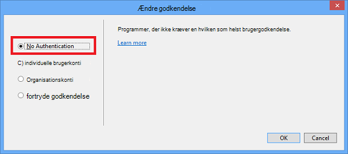

<properties
    pageTitle="Oprette billeder i tabsbeløb"
    description="Forklarer, hvordan du opretter billeder i tabsbeløb overensstemmelse med retningslinjer for Azure typer lagre."
    services=""
    solutions=""
    documentationCenter=""
    authors="kenhoff"
    manager="ilanas"
    editor="tysonn"/>

<tags
    ms.service="contributor-guide"
    ms.devlang=""
    ms.topic="article"
    ms.tgt_pltfrm=""
    ms.workload=""
    ms.date="06/25/2015"
    ms.author="kenhoff" />

# <a name="create-images-in-markdown"></a>Oprette billeder i tabsbeløb

## <a name="image-folder-creation-and-link-syntax"></a>Billede af mappen oprettelse og sammenkæde syntaks

Til en ny artikel skal du oprette en mappe på følgende placeringer:

    /articles/<service-directory>/media/<article-name>/

Eksempel:

    /articles/app-service/media/app-service-enterprise-multichannel-apps/

Når du opretter mappe og tilføjet billeder til den, kan du bruge følgende syntaks til at oprette billeder i artiklen:

```

```
Eksempel:

Se [skabelonen tabsbeløb](../markdown%20templates/markdown-template-for-new-articles.md) til et eksempel.  Billede af reference linkene på denne skabelon til tabsbeløb er designet til at være i bunden af skabelonen.

## <a name="guidelines-specific-to-azuremicrosoftcom"></a>Retningslinjer, der er specifikke for azure.microsoft.com

Skærmbilleder opfordres i øjeblikket, hvis det ikke er muligt at medtage gendannelsen trin. Skrive dit indhold, så kan fremstår indholdet uden at skærmbillederne, hvis det er nødvendigt.

Brug følgende retningslinjer, når du opretter og herunder Clipart-filerne:
- Clipart-filerne kan ikke dele på tværs af dokumenter. Kopiér den fil, du har brug for og føje den til mappen medier til din bestemt emne. Dele mellem filer som ikke bør, fordi det er nemmere at Fjern forældet indhold og billeder, bevarer repo ren.

- Filformater: bruge .png filer – de er højere kvalitet og vedligeholde deltagelsen under lokaliseringsprocessen. Andre filformater ikke bevare samt deres kvalitet. Formatet .jpg er tilladt, men ikke Foretrukne.  Ingen animerede GIF-filer.

- Bruge røde firkanter af standardbredden leveres i Paint (5 px) at henlede opmærksomheden på bestemte elementer i skærmbilleder.  

    Eksempel:

    

- Hvornår det giver mening, Velkommen til at beskære billeder, så brugergrænsefladeelementer, der vises i fuld størrelse. Sørg for, at konteksten er markeret til brugere, men.

- Undgå mellemrum på kanterne af skærmbilleder. Hvis du beskære et skærmbillede i en måde, der forlader hvid baggrund på kanterne, skal du tilføje en enkelt pixel grå kant rundt om billedet.  Hvis bruger Paint, skal du bruge lysere grå i farvepaletten standard (0xC3C3C3). Hvis ved hjælp af nogle andre grafisk app, er RGB-farve R195, G195, 195. Du kan nemt tilføje en grå kant omkring et billede i Visio – for at gøre dette, Vælg billedet, Vælg linje og sikre, at det korrekte farven er konfigureret, og derefter ændre stregtykkelsen til 1 1/2 pt.  Skærmbilleder skal have en 1 pixel hele grå kant, så ikke sløring hvide områder af skærmbilledet til websiden.

    Eksempel:

    
    
    Se [AddACOMBorder værktøjet - hvordan du kan automatisere processen med at tilføje den nødvendige 1 pixel grå kant til ACOM billeder](https://github.com/Azure/Azure-CSI-Content-Tools/tree/master/Tools/AddACOMImageBorder)til et værktøj til at hjælpe med at automatisere processen med at tilføje den nødvendige kant til billeder.

- Oversigter med mellemrum er ikke nødvendigt en grå kant.  

    Eksempel:

    

- Undgå at gøre et billede, der er for lang.  Billeder automatisk tilpasses, hvis de er for lang. Dog på ændring af størrelsen på nogle gange får sløring, så vi anbefaler, at du begrænser bredden af dine billeder til 780 px og manuelt ændre størrelsen på billeder før afsendelse, hvis det er nødvendigt.

- Vise kommandoen output i skærmbilleder.  Hvis din artikel indeholder trin, hvor brugeren arbejder i en shell, er det nyttigt at vise kommandooutput i skærmbilleder. I dette tilfælde sikrer begrænse din shell bredde til om 72 tegn Generelt, at dit billede, forbliver i den 780 px bredde aftale. Ændre størrelsen på vinduet før tage et skærmbillede af output, så kun de relevante kommando og output vises (du kan også med en tom linje på hver side).

- Tage hele skærmbilleder af windows, når det er muligt. Når du tager et skærmbillede af et browservindue, ændre størrelsen på browservinduet og 780 px bred eller mindre, og hold højden på browservinduet som kort som muligt således, at dit program passer ind i vinduet.

    Eksempel:

    

- Vær forsigtig med hvilke oplysninger vises i skærmbilleder.  Vis ikke interne firmaoplysninger eller personlige oplysninger.

- I begrebsgrafik eller diagrammer, skal du bruge officielle ikonerne i skyen og Enterprise symbol og ikon sættet. En offentlig gruppe er tilgængelig på http://aka.ms/CnESymbols.

- Erstat personlige eller private oplysninger i skærmbilleder med pladsholdertekst, der er omsluttet af kantede parenteser vinkel. Dette omfatter brugernavne, abonnement id'er og andre relaterede oplysninger. Personnavne kan erstattes med en [godkendt fiktive navn](https://aka.ms/ficticiousnames)(kun medarbejder link). Brug ikke farveblyant eller markør tip i Paint til at skjule eller sløring personlige eller private oplysninger.

  Følgende billede er blevet opdateret korrekt, hvis du vil erstatte den faktiske **abonnement-ID** med pladsholder oplysninger:

  

### <a name="contributors-guide-links"></a>Bidragydere vejledning Links

- [Oversigt over artikel](./../README.md)
- [Indeks over vejledning artikler](./contributor-guide-index.md)
