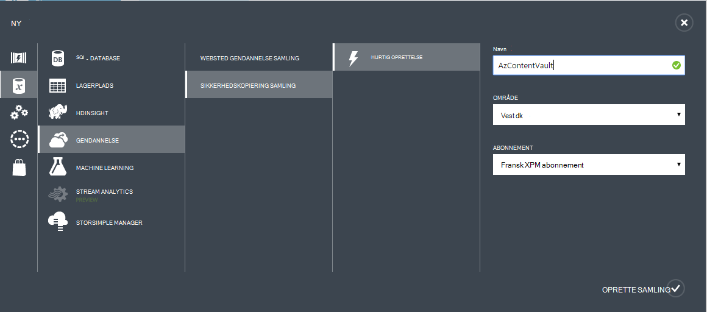
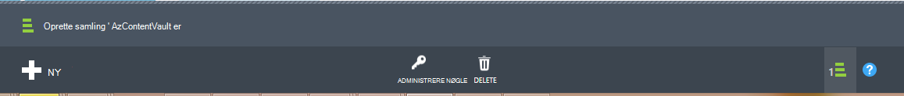

## Oprette en sikkerhedskopi samling
Hvis du vil sikkerhedskopiere filer og data fra Windows Server eller Data Protection Manager (DPM) til Azure, eller når sikkerhedskopierer IaaS FOS til Azure, skal du oprette en sikkerhedskopi samling af legitimationsoplysninger i det geografiske område, hvor du vil gemme dataene.

Følgende trin fører dig gennem oprettelse af den samling af legitimationsoplysninger bruges til at gemme sikkerhedskopier.

1. Log på [administrationsportalen til](https://manage.windowsazure.com/)
2. Klik på **Ny** > **Data Services** > **Gendannelse Services** > **Sikkerhedskopi samling** , og vælg **Hurtig oprettelse**.

    

3. Angiv et fuldt navn til at identificere den ekstra samling af legitimationsoplysninger for parameteren **Name** . Dette skal være entydige for hvert abonnement.

4. Vælg det geografiske område for den ekstra samling af legitimationsoplysninger for parameteren **område** . Valget bestemmer den geografiske område, som din sikkerhedskopidata sendes. Ved at vælge en geografiske område tæt på din placering, kan du reducere netværksventetid, når du sikkerhedskopierer til Azure.

5. Klik på **Opret samling** at fuldføre arbejdsprocessen. Det kan tage et øjeblik, før den ekstra samling af legitimationsoplysninger skal oprettes. Hvis du vil kontrollere status, kan du overvåge meddelelserne nederst på portalen.

    

6. Når den ekstra samling af legitimationsoplysninger er blevet oprettet, får du en meddelelse om samling af legitimationsoplysninger er blevet oprettet. Samling af legitimationsoplysninger findes også i ressourcer for gendannelsestjenester som **aktiv**.

    

### Azure sikkerhedskopi - indstillinger for lagring af redundans

>[AZURE.IMPORTANT] Det bedste tidspunkt at identificere dit datalager redundans er lige efter oprettelse af samling, og før alle computere er registreret på samling af legitimationsoplysninger. Når et element er registreret til samling af legitimationsoplysninger, redundans datalager er låst og kan ikke ændres.

Virksomhedens behov skal bestemme lagerplads redundans Azure sikkerhedskopi back end-lager. Hvis du bruger Azure som en primær ekstra lagerplads slutpunkt (fx du sikkerhedskopierer til Azure fra en Windows Server), bør du overveje at vælge (standard) geografisk overflødige datalager. Dette kan ses under **Konfigurer** mulighed for din sikkerhedskopi samling.

#### Geografisk overflødige lagerplads (GRS)
GRS vedligeholder seks kopier af dine data. Med GRS, dine data replikeres tre gange i det primære område og replikeres også tre gange i en sekundær region hundredvis i sømil væk fra det primære region, giver det højeste niveau af holdbarhed. I tilfælde af en mislykket på det primære region, ved at gemme data i GRS, sikrer Azure sikkerhedskopi, at dine data er robust i to separate områder.

#### Lokalt overflødige lagerplads (LRS)
Lokalt overflødige lagerplads (LRS) fører tre kopier af dine data. LRS replikeres tre gange i en enkelt funktion i et enkelt område. LRS beskytter dine data fra mislykkede forsøg på normal hardware, men ikke fra fejl i en hel Azure facilitet.

Hvis du bruger Azure som et slutpunkt tertiære sikkerhedskopieringen (fx du bruger SCDPM skal have en lokal sikkerhedskopi kopiere lokalt og bruger Azure til din langtidsaftale opbevaring skal), bør du overveje at vælge lokalt overflødige lagerplads **Konfigurer** mulighed for din sikkerhedskopi samling. Dette viser omkostningerne ved lagring af data i Azure, samtidig med at et lavere niveau for holdbarhed til dine data, der kan være acceptable for tertiære kopier.

