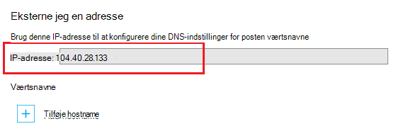

Domain Name System (DNS) bruges til at finde ressourcer på internettet. For eksempel, når du angiver en webadresse til app i din browser, eller klik på et link på en webside, bruger den DNS til at oversætte domænet til en IP-adresse. IP-adressen er slags som en adresse, men det er ikke meget human fulde. For eksempel er meget nemmere at huske et DNS-navn som **contoso.com** , end det er at huske en IP-adresse som 192.168.1.88 eller 2001:0:4137:1f67:24a2:3888:9cce:fea3.

DNS-systemet er baseret på *poster*. Poster knytte et bestemt *navn*, som **contoso.com**, til en IP-adresse eller et andet DNS-navn. Når et program, som en webbrowser, søger efter et navn i DNS, finder posten, og bruger den den peger på adresse. Hvis den peger på værdien er en IP-adresse, bruge browseren den pågældende værdi. Hvis den peger på et andet DNS-navn, har programmet til at gøre opløsning igen. I sidste ende afsluttes alle navneoversættelse i en IP-adresse.

Når du opretter en WebApp i App-tjeneste, tildeles automatisk et DNS-navn til online. Dette navn tager form af ** &lt;yourwebappname&gt;. azurewebsites.net**. Der findes også en virtuel IP-adresse til brug ved oprettelse af DNS-poster, så du kan enten oprette poster, der peger på den **. azurewebsites.net**, eller du kan pege på IP-adressen.

> [AZURE.NOTE] IP-adressen for din online ændres, hvis du sletter og genskabe din online eller ændre tilstanden App Service plan til **gratis** , når den er indstillet til **grundlæggende**, **delt**eller **Standard**.

Der findes også flere typer poster, hver med deres egne funktioner og begrænsninger, men til Onlines vi kun interesserer to, *A* and *CNAME* -poster.

###Adressepost (A record)

En A-post knytter et domæne, som **contoso.com** eller **www.contoso.com**, *eller et jokertegn domæne* såsom ** \*. contoso.com**, til en IP-adresse. Hvis det er en WebApp i App-tjeneste adresse enten den virtuelle IP-adresse til tjenesten eller en bestemt IP-, du har købt til din online.

De vigtigste fordele ved en A-post over en CNAME-post er:

* Du kan knytte et roddomæne som **contoso.com** til en IP-adresse; mange udbyder Tillad kun denne ved hjælp af en poster

* Du kan have én post, der bruger et jokertegn, såsom ** \*. contoso.com**, som skal håndtere anmodninger om flere underdomæner som **mail.contoso.com**, **blogs.contoso.com**eller **www.contso.com**.

> [AZURE.NOTE] Da en A-post er knyttet til en statisk IP-adresse, ikke kan der automatisk fortolkes ændringer til IP-adresse for din online. En IP-adresse til brug sammen med en poster leveres, når du konfigurerer brugerdefinerede domænenavnsindstillinger til din online Denne værdi kan dog ændre, hvis du sletter og genskabe din online eller ændre tilstanden App Service plan bagest til **gratis**.

###Aliaspost (CNAME)

En CNAME-post knytter et *bestemt* DNS-navn, som **mail.contoso.com** eller **www.contoso.com**, til et andet (canonical) domænenavn. I forbindelse med App-tjenesten Web Apps, vedtaget domænenavnet er den ** &lt;yourwebappname >. azurewebsites.net** domænenavn for din online. Når oprettet, CNAME opretter et alias for den ** &lt;yourwebappname >. azurewebsites.net** domænenavn. CNAME-posten oversætter til IP-adressen på dit ** &lt;yourwebappname >. azurewebsites.net** domænenavn automatisk, så hvis IP-adressen på online ændres, ikke behøver du foretage dig noget.

> [AZURE.NOTE] Nogle domæneregistratorer kun muligt at tilknytte underdomæner, når du bruger en CNAME-post, som **www.contoso.com**og ikke rod navne, som **contoso.com**. Se dokumentationen til fra din domæneregistrator, <a href="http://en.wikipedia.org/wiki/CNAME_record">Wikipedia posten på CNAME-post</a>eller <a href="http://tools.ietf.org/html/rfc1035">IETF domænenavne - implementering og specifikation af</a> dokumentet kan finde flere oplysninger om CNAME-poster.

###Web app DNS-specifikke oplysninger

Brug af en A-post med Web Apps, skal du først oprette en af følgende TXT-poster:

* **For roddomænet** - A DNS TXT-post på **@** til ** &lt;yourwebappname&gt;. azurewebsites.net**.

* **For en bestemt underdomæne** - A DNS-navn på ** &lt;underdomæne >** til ** &lt;yourwebappname&gt;. azurewebsites.net**. For eksempel **blogge** Hvis posten er **blogs.contoso.com**.

* **For jokertegn sub-dodmains** - A DNS TXT-post for *** til ** &lt;yourwebappname&gt;. azurewebsites.net**.

Denne TXT-post, der bruges til at bekræfte, at du ejer det domæne, du forsøger at bruge. Dette er ud over at oprette en A-post, der peger på den virtuelle IP-adresse for din online.

Du kan finde IP-adressen og **. azurewebsites.net** navne for din online ved at benytte følgende fremgangsmåde:

1. I din browser skal du åbne [Azure-portalen](https://portal.azure.com).

2. Klik på navnet på din online i bladet **Web Apps** , og vælg derefter **brugerdefineret domæner** fra bunden af siden.

    

3. I bladet **brugerdefinerede domæner** vises virtuel IP-adresse. Gem disse oplysninger, som den der skal bruges, når du opretter DNS-poster

    

    > [AZURE.NOTE] Du kan ikke bruge brugerdefinerede domænenavne med en **gratis** WebApp, og du skal opgradere App-serviceaftale til **delt**, **grundlæggende**, **Standard**eller **Premium** niveau. Yderligere oplysninger om App-serviceaftale priser lag, herunder hvordan du kan ændre det priser niveau i din online, skal du se, [hvordan du skalere webapps](../articles/web-sites-scale.md).
