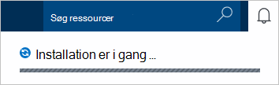
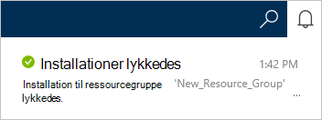
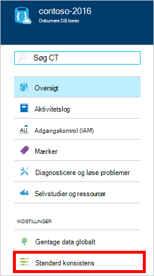
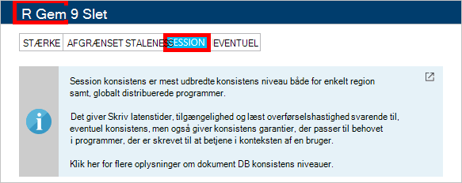

1.  Log på [Azure-portalen](https://portal.azure.com/).
2.  I Jumpbar, klik på **Ny**, skal du klikke på **Data + lagerplads**og derefter klikke på **DocumentDB (NoSQL)**.

      

3. Angiv den ønskede konfiguration for kontoen DocumentDB i bladet **ny konto** .

    

    - Angiv et navn til at identificere DocumentDB kontoen i boksen **ID** .  Når **ID** er blevet godkendt, vises en grøn markering i **feltet** . **Id-** værdien bliver værtsnavn inden for URI. **ID** , kan indeholde kun små bogstaver, tal og '-' tegn, og skal være mellem 3 og 50 tegn. Bemærk denne *documents.azure.com* føjes til navnet på du vælger, bliver resultatet af som DocumentDB konto første eller sidste ark.

    - Vælg **DocumentDB**i feltet **NoSQL API** .  

    - Vælg det Azure abonnement, du vil bruge til kontoen DocumentDB **abonnement**. Hvis dit firma har kun ét abonnement, er denne konto som standard markeret.

    - Vælg i **Ressourcegruppe**, eller Opret en ressourcegruppe til kontoen DocumentDB.  Som standard oprettes en ny ressourcegruppe. Få mere at vide under [Brug af Azure portalen for at administrere dine Azure ressourcer](../articles/azure-portal/resource-group-portal.md).

    - Bruge **placering** til at angive den geografiske placering, hvor til at hoste din DocumentDB-konto. 

4.  Klik på **Opret**, når de nye indstillinger i DocumentDB konto er konfigureret. For at kontrollere status for installationen, se beskeder hubben.  

      

    

5.  Når kontoen DocumentDB er oprettet, er du klar til brug med standardindstillingerne. Standard konsistens DocumentDB konto er angivet til **Session**.  Du kan justere standard konsistens ved at klikke på **Standard konsistens** i menuen ressource. Hvis du vil vide mere om konsistens niveauer, som DocumentDB skal du se [konsistens niveauer i DocumentDB](../articles/documentdb/documentdb-consistency-levels.md).

      

      

[How to: Create a DocumentDB account]: #Howto
[Next steps]: #NextSteps
[documentdb-manage]:../articles/documentdb/documentdb-manage.md
