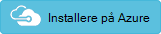

I denne artikel beskrives nogle af de metoder til at køre en Windows virtuel maskine (VM) på Azure, betaler opmærksomheden på skalerbarhed, tilgængelighed, administration og sikkerhed. 

> [AZURE.NOTE] Azure har to forskellige installation modeller: [Azure ressourcestyring] [ resource-manager-overview] og klassisk. I denne artikel bruges Ressourcestyring, som Microsoft anbefaler til nye installationer.

Vi anbefaler ikke ved hjælp af en enkelt VM til fremstilling arbejdsbelastninger, fordi der ikke er nogen op på oprettelsestidspunkt serviceniveauaftale (SLA) for enkelt FOS på Azure. For at få SERVICENIVEAUAFTALEN, skal du installere flere FOS i en [tilgængelighed angive][availability-set]. Yderligere oplysninger, du [kører flere Windows FOS på Azure][multi-vm]. 

## <a name="architecture-diagram"></a>Arkitektur diagram

Klargøring af en VM i Azure omfatter mere dynamiske dele end bare selve VM. Der findes Beregn, netværk og lagerplads elementer.

> Et Visio-dokument, der indeholder dette arkitektur diagram kan hentes på [Microsoft download center][visio-download]. I dette diagram er på "Beregn - enkelt VM side.

![[0]][0]


- **Ressourcegruppe.** En [_ressourcegruppe_] [ resource-manager-overview] er en objektbeholder, der indeholder relaterede ressourcer. Oprette en ressourcegruppe for at holde ressourcerne for denne VM.

- **VM**. Du kan klargøre en VM fra en liste over publicerede billeder eller fra en virtuel harddisk (Virtuelle)-fil, du overfører til Azure blob-lager.

- **OS disk.** OS disken er en virtuel harddisk, der er gemt på [Azure-lager][azure-storage]. Det betyder, at det fortsætter, selvom værtsmaskinen går ned.

- **Midlertidige disk.** VM er oprettet med en midlertidig disk (den `D:` drev på Windows). Disken er gemt på et fysisk drev på værtsmaskinen. Det er _ikke_ gemt i Azure lagerplads, men kan forsvinde under genstarter og andre VM livscyklus begivenheder. Brug denne disk kun til midlertidige data, som siden eller Udskift filer.

- **Datadisce.** En [datadisk] [ data-disk] er en fast virtuel harddisk bruges til programmet data. Datadisce er gemt i Azure-lager, som OS disken.

- **Virtuelt netværk (VNet) og undernet.** Hver VM i Azure skal være installeret i en VNet, der er yderligere inddelt i undernet.

- **Offentlige IP-adresse.** En offentlig IP-adresse er nødvendig for at kommunikere med VM&mdash;for eksempel via Fjernskrivebord (RDP).

- **Netværkskort (NIC)**. NIC aktiverer VM til at kommunikere med det virtuelle netværk.

- **Sikkerhedsgruppe netværk (NSG)**. [NSG] [ nsg] bruges til at tillade/nægte netværkstrafik til undernettet. Du kan knytte en NSG med en enkelt NIC eller med et undernet. Hvis du knytte den til et undernet, gælder NSG reglerne for alle FOS i pågældende undernet.
 
- **Diagnosticering.** Logføring af diagnostik er afgørende for at administrere og fejlfinding VM.

## <a name="recommendations"></a>Anbefalinger

Azure byder på mange forskellige ressourcer og ressourcetyper, så denne referencearkitektur kan være klargjort mange forskellige måder. Vi har angivet en Azure ressourcestyring skabelon for at installere den referencearkitektur, der følger disse anbefalinger. Hvis du vælger at oprette din egen referencearkitektur skal du følge disse anbefalinger, medmindre du har særlige krav, en anbefaling der ikke passer.

### <a name="vm-recommendations"></a>VM anbefalinger

Vi anbefaler DS - og GS-serien, fordi disse maskine størrelser understøtter [Premium lagerplads][premium-storage]. Vælg en af disse maskine størrelser, medmindre du har en særlig arbejdsbyrde som databehandling med høj ydeevne. Yderligere oplysninger finder du [virtuelt størrelser][virtual-machine-sizes]. Når du flytter en eksisterende arbejdsbyrde til Azure, kan du starte med den VM størrelse, der bedst svarer til dine lokale-servere. Derefter måling ydeevnen for den faktiske arbejdsbyrde i forhold CPU, hukommelse og diskplads input/output-handlinger sekundet (IOP'ER), og tilpasse størrelsen, hvis det er nødvendigt. Også, hvis du har brug for flere netværkskort, være opmærksom på NIC grænsen for hver størrelse.  

Når du klargør VM og andre ressourcer, skal du angive en placering. Generelt, Vælg en placering, der er tættest på din interne brugere eller kunder. Ikke alle VM størrelser kan dog tilgængelige i alle placeringer. Yderligere oplysninger finder du [Services efter område][services-by-region]. Du kan få vist de VM tilgængelige størrelser på en bestemt placering, skal du køre følgende kommando for Azure kommandolinjen (CLI):

```
    azure vm sizes --location <location>
```

Finde oplysninger om at vælge en publiceret VM billede, [Naviger og vælge Azure virtuelt billeder][select-vm-image].

### <a name="disk-and-storage-recommendations"></a>Disken og lager anbefalinger

Bedste disk I/O ydeevne, anbefaler vi [Premium lagerplads][premium-storage], som lagrer data på massiv tilstand SSD'er (). Omkostninger er baseret på størrelsen af den klargjorte disk. IOP'ER og overførselshastighed, som også er afhængige af diskstørrelse, så når du klargør en disk, skal du overveje alle tre faktorer (kapacitet, IOP'ER og overførselshastighed). 

Én lagerplads konto kan understøtte 1-20 FOS.

Tilføje en eller flere datadisce. Når du opretter en ny virtuel harddisk, er formateret. Log på VM til at formatere disken.

Hvis du har et stort antal datadisce skal være opmærksom på de samlede i/o-grænser for lagerplads kontoen. Få mere at vide i [Virtuelt Disk begrænsninger][vm-disk-limits].

Oprette en separat lagerplads konto for at holde diagnosticeringslogfiler bedste ydeevne. En standardkonto lokalt overflødige lagerplads (LRS) er tilstrækkelige til diagnosticeringslogfiler.

Når det er muligt, kan du installere programmer på en datadisk, ikke OS disken. Dog kan visse ældre programmer skal installere komponenter på C:-drevet. Det er tilfældet, kan du [ændre størrelsen på disken OS] [ resize-os-disk] ved hjælp af PowerShell.

### <a name="network-recommendations"></a>Netværk anbefalinger

Den offentlige IP-adresse kan være dynamisk eller statisk. Standard er dynamisk.

- Reservere en [statiske IP-adresse] [ static-ip] Hvis du har brug for en fast IP-adresse, der ikke kan ændre &mdash; for eksempel, hvis du vil oprette en A-post i DNS, eller har brug for IP-adresse for at være whitelisted.

- Du kan også oprette et fuldstændige domænenavn (fulde Domænenavn) til IP-adressen. Derefter kan du registrere en [CNAME-post] [ cname-record] i DNS, der peger på det fulde Domænenavn. Få mere at vide under [oprette et fuldt domænenavn i portalen Azure][fqdn].

Alle NSGs indeholder et regelsæt for [standard][nsg-default-rules], herunder en regel, der blokerer al indgående internettrafik. Standardreglerne kan ikke slettes, men andre regler kan tilsidesætte dem. Hvis du vil aktivere internettrafik, oprette regler, der tillader indgående trafik til bestemte porte &mdash; eksempelvis port 80 for HTTP.  

For at aktivere RDP skal du tilføje en NSG regel, der tillader indgående trafik til TCP-port 3389.

## <a name="scalability-considerations"></a>Overvejelser i forbindelse med skalerbarhed

Du kan tilpasse en VM op eller ned ved at [ændre størrelsen VM][vm-resize]. 

Hvis du vil skalere vandret ud, skal du sætte to eller flere FOS i en tilgængelighed, angive bag en belastningsjustering. Yderligere oplysninger finder du [kører flere Windows FOS på Azure][multi-vm].

## <a name="availability-considerations"></a>Overvejelser i forbindelse med tilgængelighed

Som nævnt ovenfor, er der ingen SERVICENIVEAUAFTALE for en enkelt VM. For at få SERVICENIVEAUAFTALEN, skal du installere flere FOS til et sæt tilgængelighed.

Din VM kan være påvirket af [planlagt vedligeholdelse] [ planned-maintenance] eller [ikke-planlagt vedligeholdelse][manage-vm-availability]. Du kan bruge [VM genstart logge] [ reboot-logs] til at afgøre, om en VM genstart skyldes planlagt vedligeholdelse.

Virtuelle harddiske understøttes af [Azure-lager][azure-storage], som replikeres for holdbarhed og tilgængelighed.

For at beskytte mod utilsigtet tab af data under normale handlinger (for eksempel på grund af brugerfejl), skal du også implementere punkt-in-time sikkerhedskopier, ved hjælp af [blob snapshots] [ blob-snapshot] eller et andet værktøj.

## <a name="manageability-considerations"></a>Overvejelser i forbindelse med administration

**Ressourcegrupper.** Placere tæt forbundet ressourcer, der deler de samme livscyklus i samme [ressourcegruppe][resource-manager-overview]. Grupper kan du installere og overvåge ressourcer som en gruppe og opløfte fakturering omkostninger ved ressourcegruppe. Du kan også slette ressourcer som et sæt, hvilket er særdeles nyttigt for test installationer. Giv ressourcer et meningsfuldt navn. Det gør det nemmere at finde en bestemt ressource og forstå sin rolle. Se [anbefalede navngivningskonventioner for Azure ressourcer][naming conventions].

**VM diagnosticering.** Aktivér overvågning og diagnosticering, herunder grundlæggende tilstand målepunkter, diagnosticering infrastruktur logfiler og [Start diagnosticering][boot-diagnostics]. Start diagnosticering kan hjælpe dig med at diagnosticere en startfejl, hvis din VM bliver i en ikke kan startes fra. Du kan finde flere oplysninger, se [aktivere overvågning og diagnosticering][enable-monitoring]. Bruge [Azure logindsamling] [ log-collector] udvidelse til at samle Azure-platformen logfiler og overføre dem til Azure-lager.   

Følgende kommando for CLI aktiverer diagnosticering:

```
    azure vm enable-diag <resource-group> <vm-name>
```

**Stoppe en VM.** Azure skelner mellem "Stoppet" og "Deallocated" tilstand. Du betaler når VM status er "stoppet". Du betaler ikke, når VM deallokeres.

Brug følgende kommando for CLI at deallokere en VM:

```
    azure vm deallocate <resource-group> <vm-name>
```

Knappen **Stop** på portalen Azure deallocates også VM. Men hvis du lukker gennem Operativsystemet er logget på, hvor VM er stoppet, men _ikke_ deallokeres, så du skal stadig betale.

**Slette en VM.** Hvis du sletter en VM, slettes ikke de virtuelle harddiske. Det betyder, at du er sikkert at slette VM uden at miste data. Men du skal stadig betale for lagerplads. Hvis du vil slette den virtuelle harddisk, skal du slette filen fra [blob-lager][blob-storage].

For at undgå utilsigtede sletningen skal du bruge en [ressource Lås] [ resource-lock] låse de hele ressourcen gruppe eller låse individuelle ressourcer, som VM. 

## <a name="security-considerations"></a>Overvejelser om sikkerheden

Bruge [Azure Sikkerhedscenter] [ security-center] til at få en central visning af tilstanden sikkerhed for ressourcerne Azure. Sikkerhedscenter overvåger potentielle sikkerhedsproblemer, som system opdaterer, Antimalwareprogram, og giver et omfattende billede af sikkerhed tilstanden for din installation. 

- Security Center er konfigureret i Azure-abonnement. Aktivere sikkerhed dataindsamling, som beskrevet i [Bruge Sikkerhedscenter].

- Når dataindsamling er aktiveret, scanner Sikkerhedscenter automatisk en hvilken som helst FOS oprettes under dette abonnement.

**Administration af programrettelse.** Hvis det er aktiveret, kontrollerer Sikkerhedscenter om sikkerhedsopdateringer og vigtige opdateringer mangler. Brug [Indstillinger for Gruppepolitik] [ group-policy] på VM til at aktivere automatiske opdateringer.

**Antimalwareprogram.** Hvis det er aktiveret, kontrollerer Sikkerhedscenter om Antimalwareprogram software er installeret. Du kan også bruge Sikkerhedscenter til at installere Antimalwareprogram software fra i portalen Azure.

Brug [Rollebaseret adgangskontrol] [ rbac] (RBAC) til at styre adgangen til Azure ressourcer, som du installerer. RBAC kan du tildele roller tilladelse til medlemmer af teamet DevOps. For eksempel kan rollen Læser få vist Azure ressourcer, men ikke oprette, administrere eller slette dem. Nogle roller er specifikke for bestemt Azure ressourcetyper. For eksempel kan rollen virtuelt bidragyder genstarte eller deallokere en VM, nulstille adgangskoden, oprette en ny VM og osv.. Andre [indbyggede RBAC roller] [ rbac-roles] , der kan være nyttige til denne referencearkitektur omfatter [DevTest øvelser bruger] [ rbac-devtest] og [Netværk bidragyder][rbac-network]. En bruger kan tildeles til flere roller, og du kan oprette brugerdefinerede roller for endnu mere detaljerede tilladelser.

> [AZURE.NOTE] RBAC begrænser ikke de handlinger, som en bruger, der er logget på en VM kan udføre. Disse tilladelser, bestemmes af kontotypen på gæst OS.   

Hvis du vil nulstille den lokale administratoradgangskode, skal du køre den `vm reset-access` Azure CLI kommandoen.

```
    azure vm reset-access -u <user> -p <new-password> <resource-group> <vm-name>
```

Bruge [overvågningslogge] [ audit-logs] at se klargøring af handlinger og andre VM begivenheder.

Overvej [Azure Disk kryptering] [ disk-encryption] Hvis du vil kryptere diskene OS og data. 

## <a name="solution-deployment"></a>Løsningsinstallation

En [installation] [ github-folder] for en reference arkitektur, der viser disse bedste fremgangsmåder, er tilgængelig. Denne referencearkitektur omfatter et virtuelt netværk (VNet), netværk sikkerhedsgruppe (NSG) og en enkelt virtuel maskine (VM).

Der er flere måder til at installere denne referencearkitektur. Den nemmeste måde er at benytte følgende fremgangsmåde: 

1. Højreklik på knappen nedenfor, og vælg enten "Åbn link på en ny fane" eller "Åbn hyperlink i nyt vindue".  
[](https://portal.azure.com/#create/Microsoft.Template/uri/https%3A%2F%2Fraw.githubusercontent.com%2Fmspnp%2Freference-architectures%2Fmaster%2Fguidance-compute-single-vm%2Fazuredeploy.json)

2. Når linket er åbnet i portalen Azure, skal du angive værdier for nogle af indstillingerne: 
    - **Ressourcegruppe** navnet allerede er defineret i parameterfilen, så vælge **Opret ny** og angive `ra-single-vm-rg` i tekstfeltet.
    - Vælg området på rullelisten **placering** .
    - Ikke redigere **Skabelon rod Uri** eller tekstfelterne **Parameter rod Uri** .
    - Vælg den **Os Type** på rullelisten, **windows**.
    - Gennemse vilkår og betingelser og derefter klikke på afkrydsningsfeltet **jeg accepterer du vilkår og betingelser, der er anført ovenfor** .
    - Klik på knappen **Køb** .

3. Vente på at fuldføre installationen.

4. Parameter filerne indeholde en faste administratorens brugernavn og adgangskode, og det anbefales, at du straks ændrer begge. Klik på den VM med navnet `ra-single-vm0 `i portalen Azure. Klik derefter på **Nulstil adgangskode** i bladet **Support + fejlfinding** . Vælg **Nulstil adgangskode** i feltet **tilstand** rullemenuen og derefter vælge et nyt **brugernavn** og en **adgangskode**. Klik på knappen **Opdater** kan du bevare den nye brugernavn og adgangskode.

Finde oplysninger om andre måder at installere denne referencearkitektur, se filen med vigtige oplysninger i [vejledning-single-vm][github-folder]] Github mappe. 

## <a name="customize-the-deployment"></a>Tilpasse installationen

Hvis du vil ændre installationen, så de passer til dine behov, skal du følge vejledningen i [vigtige oplysninger om][github-folder]. 

## <a name="next-steps"></a>Næste trin

For at [SERVICENIVEAUAFTALE for virtuelle maskiner] [ vm-sla] for at anvende, skal du installere to eller flere forekomster i et sæt tilgængelighed. Yderligere oplysninger, du [kører flere FOS på Azure][multi-vm].

<!-- links -->

[audit-logs]: https://azure.microsoft.com/en-us/blog/analyze-azure-audit-logs-in-powerbi-more/
[availability-set]: ../articles/virtual-machines/virtual-machines-windows-create-availability-set.md
[azure-cli]: ../articles/virtual-machines-command-line-tools.md
[azure-storage]: ../articles/storage/storage-introduction.md
[blob-snapshot]: ../articles/storage/storage-blob-snapshots.md
[blob-storage]: ../articles/storage/storage-introduction.md
[boot-diagnostics]: https://azure.microsoft.com/en-us/blog/boot-diagnostics-for-virtual-machines-v2/
[cname-record]: https://en.wikipedia.org/wiki/CNAME_record
[data-disk]: ../articles/virtual-machines/virtual-machines-windows-about-disks-vhds.md
[disk-encryption]: ../articles/security/azure-security-disk-encryption.md
[enable-monitoring]: ../articles/monitoring-and-diagnostics/insights-how-to-use-diagnostics.md
[fqdn]: ../articles/virtual-machines/virtual-machines-windows-portal-create-fqdn.md
[github-folder]: http://github.com/mspnp/reference-architectures/tree/master/guidance-compute-single-vm
[group-policy]: https://technet.microsoft.com/en-us/library/dn595129.aspx
[log-collector]: https://azure.microsoft.com/en-us/blog/simplifying-virtual-machine-troubleshooting-using-azure-log-collector/
[manage-vm-availability]: ../articles/virtual-machines/virtual-machines-windows-manage-availability.md
[multi-vm]: ../articles/guidance/guidance-compute-multi-vm.md
[naming conventions]: ../articles/guidance/guidance-naming-conventions.md
[nsg]: ../articles/virtual-network/virtual-networks-nsg.md
[nsg-default-rules]: ../articles/virtual-network/virtual-networks-nsg.md#default-rules
[planned-maintenance]: ../articles/virtual-machines/virtual-machines-windows-planned-maintenance.md
[premium-storage]: ../articles/storage/storage-premium-storage.md
[rbac]: ../articles/active-directory/role-based-access-control-what-is.md
[rbac-roles]: ../articles/active-directory/role-based-access-built-in-roles.md
[rbac-devtest]: ../articles/active-directory/role-based-access-built-in-roles.md#devtest-lab-user
[rbac-network]: ../articles/active-directory/role-based-access-built-in-roles.md#network-contributor
[reboot-logs]: https://azure.microsoft.com/en-us/blog/viewing-vm-reboot-logs/
[resize-os-disk]: ../articles/virtual-machines/virtual-machines-windows-expand-os-disk.md
[Resize-VHD]: https://technet.microsoft.com/en-us/library/hh848535.aspx
[Resize virtual machines]: https://azure.microsoft.com/en-us/blog/resize-virtual-machines/
[resource-lock]: ../articles/resource-group-lock-resources.md
[resource-manager-overview]: ../articles/azure-resource-manager/resource-group-overview.md
[security-center]: https://azure.microsoft.com/en-us/services/security-center/
[select-vm-image]: ../articles/virtual-machines/virtual-machines-windows-cli-ps-findimage.md
[services-by-region]: https://azure.microsoft.com/en-us/regions/#services
[static-ip]: ../articles/virtual-network/virtual-networks-reserved-public-ip.md
[storage-price]: https://azure.microsoft.com/pricing/details/storage/
[Bruge Sikkerhedscenter]: ../articles/security-center/security-center-get-started.md#use-security-center
[virtual-machine-sizes]: ../articles/virtual-machines/virtual-machines-windows-sizes.md
[visio-download]: http://download.microsoft.com/download/1/5/6/1569703C-0A82-4A9C-8334-F13D0DF2F472/RAs.vsdx
[vm-disk-limits]: ../articles/azure-subscription-service-limits.md#virtual-machine-disk-limits
[vm-resize]: ../articles/virtual-machines/virtual-machines-linux-change-vm-size.md
[vm-sla]: https://azure.microsoft.com/en-us/support/legal/sla/virtual-machines/v1_0/
[0]: ./media/guidance-blueprints/compute-single-vm.png "Enkelt Windows VM arkitektur i Azure"
[readme]: https://github.com/mspnp/reference-architectures/blob/master/guidance-compute-single-vm
[blocks]: https://github.com/mspnp/template-building-blocks
